# Technical Specification

# 1. Introduction

## 1.1 Executive Summary

### 1.1.1 Project Overview

**EduMyles** is a multi-tenant, modular school management platform purpose-built for East Africa, developed by **Mylesoft Technologies**. The platform is designed as a cloud-native SaaS solution that provides comprehensive school administration capabilities — from student information management and academic assessment to fee collection and multi-channel communications — delivered through a modern, real-time web and mobile experience.

The platform adopts a Kenya-first approach, with support for six East African countries (Kenya, Uganda, Tanzania, Rwanda, Ethiopia, and Ghana) and seven curriculum frameworks, including Kenya's Competency-Based Curriculum (CBC) and the legacy 8-4-4 system. EduMyles is currently at version **0.1.0**, with foundational infrastructure complete and core business modules under active development.

| Attribute | Detail |
|-----------|--------|
| **Product Name** | EduMyles |
| **Owner** | Mylesoft Technologies |
| **Version** | 0.1.0 |
| **License** | Proprietary (© Mylesoft Technologies) |
| **Repository** | `gh repo clone Mylesoft-Technologies/edumyles` |

### 1.1.2 Core Business Problem

East Africa's education sector faces a critical digitization gap. In Africa, only 28% of schools use school management software, compared to over 70% adoption in developed economies. The Middle East & Africa market is steadily expanding, with schools increasingly adopting digital management solutions to modernize operations, though the region faces infrastructural challenges as adoption is accelerating with smart education initiatives.

Kenya's ongoing transition from the 8-4-4 system to the Competency-Based Curriculum (CBC) has intensified the need for digital school management tools. The CBC came with new requirements for assessment, record-keeping and reporting, which placed a huge burden on teachers and schools. The CBC requires that teachers regularly perform formative assessments and keep records of these assessments. The idea is that the records would be used to offer each learner a personalized learning pathway in line with their competencies. These assessments are typically recorded with pen and paper, a process that is extremely burdensome and time consuming. This inevitably takes teachers away from their main mandate, which is to support learners. School administrators also find it difficult to follow assessment progress when records are kept on paper.

EduMyles addresses these challenges by providing a unified platform that:

- **Digitizes school administration** across 11 functional domains, replacing fragmented paper-based and siloed systems
- **Supports multiple curricula** natively, including Kenya's new CBC (KE-CBC) and legacy 8-4-4 (KE-8-4-4), as well as Uganda's UNEB, Tanzania's NECTA, Rwanda's REB, Ethiopia's MOE, and Ghana's WAEC frameworks (as defined in `shared/src/constants/index.ts`)
- **Integrates region-dominant payment methods** including M-Pesa and Airtel Money alongside international gateways, reflecting the reality that for nearly two decades, M-PESA has quietly reshaped life in Kenya — from paying school fees and utility bills to supporting small businesses
- **Operates on low-bandwidth networks** with PWA capabilities and offline-first features targeting 3G connectivity

### 1.1.3 Key Stakeholders and Users

EduMyles serves a diverse stakeholder ecosystem spanning platform operators, school staff, students, families, and external partners. The system defines **13 distinct user roles** organized into a hierarchical permission model (sourced from `shared/src/types/index.ts` and `shared/src/constants/index.ts`):

| Stakeholder Group | Roles | Permission Level |
|-------------------|-------|-----------------|
| **Platform Operations** (Mylesoft) | Platform Admin | 100 |
| **School Leadership** | School Admin, Principal | 80–90 |
| **Administrative Staff** | Finance Officer, HR Officer, Librarian, Transport Officer, Receptionist | 30–60 |
| **Academic Staff** | Teacher | 40 |
| **External Stakeholders** | Partner, Parent, Alumni | 15–25 |
| **Learners** | Student | 10 |

These roles map to **8 dedicated UI panels**, each tailored to its user group's workflows and accessed via role-based routing (as specified in `docs/IMPLEMENTATION_PLAN.md`):

| Panel | Route Prefix | Primary Purpose |
|-------|-------------|-----------------|
| Master Admin | `/platform` | Full platform control, tenant provisioning |
| Super Admin | `/platform` | Platform support and administration |
| School Admin | `/admin` | School-wide settings, module management |
| Teacher | `/portal/teacher` | Classes, grades, attendance, assignments |
| Student | `/portal/student` | Grades, timetable, assignments, wallet |
| Parent | `/portal/parent` | Child monitoring, fee payments |
| Alumni | `/portal/alumni` | Transcript access, alumni network |
| Partner | `/portal/partner` | Sponsorship dashboards, reports |

### 1.1.4 Expected Business Impact and Value Proposition

EduMyles targets a rapidly growing market segment. Middle East & Africa accounted for USD 1.98 Billion in 2025, representing 11% of the global market. Growth in this region is driven by government-backed digital learning projects, rising smartphone penetration, and demand for financial transparency in schools.

The platform's value proposition centers on four pillars:

| Value Pillar | Description |
|-------------|-------------|
| **Regional Specialization** | Purpose-built for East African schools with native support for local curricula (7 codes), currencies (6), and payment methods (M-Pesa, Airtel Money) |
| **Modular Scalability** | Tiered subscription model (Starter → Enterprise) allowing schools to adopt incrementally, from 4 core modules to all 11 |
| **Multi-Tenant Efficiency** | Single codebase serving 50–500 schools and up to 300,000 students via subdomain-based tenant isolation |
| **Real-Time Experience** | Convex serverless backend delivering live data synchronization, targeting PWA compliance and 3G-optimized performance |

The tiered subscription model (defined in `shared/src/constants/index.ts`) enables progressive adoption:

| Tier | Modules Included | Count |
|------|-----------------|-------|
| **Starter** | SIS, Admissions, Finance, Communications | 4 |
| **Standard** | + Timetable, Academics | 6 |
| **Pro** | + HR, Library, Transport | 9 |
| **Enterprise** | + eWallet, eCommerce | 11 |

---

## 1.2 System Overview

### 1.2.1 Project Context

#### Business Context and Market Positioning

EduMyles enters a global school management software market that is experiencing significant growth. The global School Management Software market size is estimated at USD 17,980.49 million in 2025 and is expected to reach USD 62,111.45 million by 2034 at a 14.77% CAGR. Within this landscape, the African sub-region presents a unique opportunity characterized by low existing adoption but rapidly accelerating demand.

The platform differentiates itself from global incumbents (PowerSchool, Ellucian, Oracle) through deep regional integration:

- **Local curriculum alignment** — Native support for Kenya's CBC and 8-4-4, plus five additional East African curriculum frameworks, as enumerated in the `CURRICULUM_CODES` constant (`shared/src/constants/index.ts`)
- **Mobile money-first payments** — M-Pesa (via Daraja STK Push, C2B, and B2C), Airtel Money, alongside Stripe for international card payments, as defined in the `PaymentMethod` union type (`shared/src/types/index.ts`)
- **Low-bandwidth optimization** — Designed for 3G networks prevalent in rural East African communities, with planned offline capabilities for Attendance and Gradebook modules (full sync) and SIS, HR, and Timetable (read-only cache)
- **Multi-currency support** — KES, UGX, TZS, RWF, ETB, and GHS (6 currencies) mapped to 6 target countries

#### Current System Landscape

EduMyles is a greenfield platform (not a migration or replacement of an existing Mylesoft product). It addresses the fragmented landscape where East African schools typically rely on a patchwork of paper-based processes, spreadsheets, and disconnected point solutions for administration. Kenya's CBC transition has created "new requirements for assessment, record-keeping and reporting" that existing tools do not adequately address, creating a clear market entry point.

#### Integration with Enterprise Landscape

The platform integrates with a curated set of external services, each selected for its regional relevance and technical capabilities:

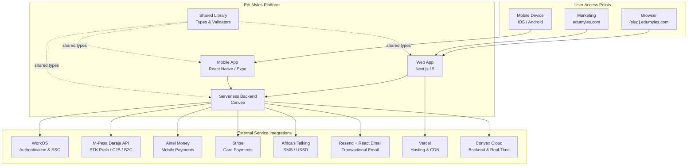

### 1.2.2 High-Level Description

#### Primary System Capabilities

EduMyles delivers its functionality through **11 domain modules**, each encapsulating a distinct school management capability. These modules are defined in the `MODULE_DEFINITIONS` constant (`shared/src/constants/index.ts`) and gated through the subscription tier system:

| Module | Capability | Tier Required |
|--------|-----------|---------------|
| **Student Information (SIS)** | Student profiles, class assignments, stream management | Starter |
| **Admissions** | Applications, enrollment workflows, waitlist management | Starter |
| **Finance & Fees** | Fee structures, invoicing, receipts, payment reconciliation | Starter |
| **Communications** | SMS, email, and in-app messaging across stakeholders | Starter |
| **Timetable** | Scheduling, substitutions, room bookings | Standard |
| **Academics** | Gradebook, assessments, report card generation | Standard |
| **HR & Payroll** | Staff records, attendance tracking, payroll processing | Pro |
| **Library** | Book catalog, borrowing workflows, fine management | Pro |
| **Transport** | Route management, vehicle tracking, student assignment | Pro |
| **eWallet** | Digital wallet for students and parents | Enterprise |
| **School Shop (eCommerce)** | Uniforms, books, and supplies storefront | Enterprise |

#### Major System Components

The platform is organized as a **Turborepo monorepo** with five npm workspaces (configured in `package.json`), supported by infrastructure and documentation directories:

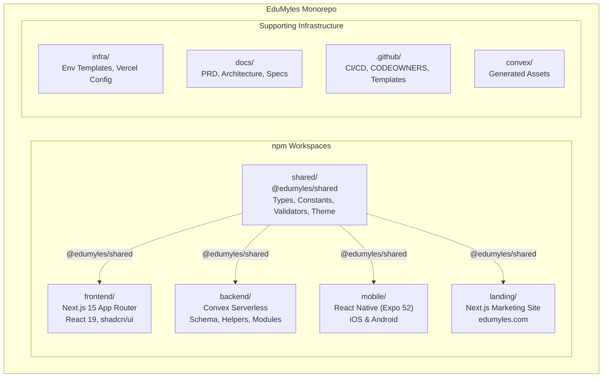

| Workspace | Technology Stack | Responsibility |
|-----------|-----------------|---------------|
| `frontend/` | Next.js 15 (App Router), React 19, shadcn/ui, Tailwind CSS | Tenant-scoped school portal (`{slug}.edumyles.com`) |
| `backend/` | Convex (serverless DB + compute), Zod validation | 27-table schema, real-time queries, mutations, tenant isolation |
| `mobile/` | React Native 0.76.5, Expo 52 | Native iOS & Android application |
| `shared/` | TypeScript, Zod | Cross-workspace types, constants, validators, theme tokens |
| `landing/` | Next.js 15, React 19, Tailwind CSS 3.4 | Marketing site at `edumyles.com` root domain |

#### Core Technical Approach

EduMyles employs a **serverless-first, real-time architecture** built on the following technical foundations:

- **Convex as Backend-as-a-Service:** The backend leverages Convex for serverless database operations, real-time subscriptions, and compute. The schema (`backend/convex/schema.ts`) defines 27 tables with tenant-scoped indexes, ensuring every query enforces tenant isolation via the `requireTenantContext(ctx)` helper.

- **Multi-Tenant Isolation:** Every database table includes `tenantId` as the first field and first index component. Cross-tenant data access is architecturally prevented. Each school operates under its own subdomain (`{slug}.edumyles.com`), with tenant context resolved through Next.js middleware and linked to WorkOS sessions.

- **Role-Based Access Control (RBAC):** A 13-role permission hierarchy (defined in `shared/src/constants/index.ts`) with permission levels ranging from 10 (Student) to 100 (Platform Admin) governs access across all 30+ system permissions.

- **Module Marketplace Architecture:** Modules are dynamically installed per tenant based on subscription tier, managed through a `moduleRegistry` and `installedModules` table in the backend schema, with runtime module guards in frontend hooks (`useModules`).

- **Shared Type System:** The `@edumyles/shared` package provides a single source of truth for TypeScript types, Zod validators, constants, and design tokens consumed by all workspaces.

### 1.2.3 Success Criteria

#### Measurable Objectives

| Objective | Target | Measurement |
|-----------|--------|-------------|
| School Onboarding | 50–500 active tenants | Tenant provisioning and activation count |
| Student Capacity | Up to 300,000 students | Enrolled student records across tenants |
| Network Performance | 3G-optimized page loads | Core Web Vitals under constrained bandwidth |
| Platform Availability | PWA-compliant | Lighthouse PWA audit score |
| Offline Capability | Attendance & Gradebook sync | Offline-first data persistence and reconciliation |

#### Critical Success Factors

1. **Tenant Isolation Integrity** — Zero cross-tenant data leakage, enforced at the database query layer through `requireTenantContext(ctx)` on every Convex operation, with planned CI validation of tenant isolation patterns.

2. **Payment Gateway Reliability** — Successful integration with M-Pesa (Daraja STK Push/C2B/B2C), Airtel Money, and Stripe with proper webhook handling, payment reconciliation, and support for six payment methods (M-Pesa, Airtel Money, Stripe, Bank Transfer, Cash, Cheque) as defined in the `PaymentMethod` type.

3. **Curriculum Compliance** — Accurate implementation of assessment, grading, and report card generation aligned with seven distinct curriculum frameworks across six countries.

4. **Low-Bandwidth Resilience** — Functional experience on 3G networks prevalent in rural East African schools, with progressive enhancement and offline capability for critical modules.

5. **Security & Compliance** — Comprehensive audit logging with 7-year retention, admin impersonation tracking, HTTP security headers (X-Frame-Options: DENY, X-Content-Type-Options: nosniff, strict CSP), and secret scanning in CI (TruffleHog).

#### Key Performance Indicators (KPIs)

| KPI Category | Indicator | Target |
|-------------|-----------|--------|
| **Adoption** | Active tenants per quarter | Steady growth toward 500 schools |
| **Engagement** | Daily active users per tenant | >60% of registered staff users |
| **Reliability** | Uptime (Convex + Vercel) | 99.9% availability |
| **Performance** | Time to First Byte (TTFB) | <800ms on 3G networks |
| **Security** | Audit log coverage | 100% of mutation operations |
| **Revenue** | Tier upgrade rate | Starter → Standard/Pro progression |

---

## 1.3 Scope

### 1.3.1 In-Scope

#### Core Features and Functionalities

The following capabilities are within the defined scope of the EduMyles platform, organized by domain:

**Must-Have Capabilities:**

| Domain | Capabilities |
|--------|-------------|
| **Multi-Tenancy** | Tenant provisioning, subdomain routing, isolation enforcement, tenant lifecycle (active, suspended, trial, churned) |
| **Authentication & Authorization** | WorkOS magic links, SSO, 13-role RBAC, session management (30-day cookies), admin impersonation |
| **Module Marketplace** | Dynamic module installation per tenant, tier-based gating, module registry and request system |
| **Student Information** | Student profiles, class and stream management, enrollment tracking |
| **Admissions** | Application workflows, enrollment processing, waitlist management |
| **Finance & Fees** | Fee structures, invoice generation, receipt issuance, multi-method payment processing, reconciliation |
| **Academics** | Gradebook, formative/summative assessments, report card generation (CBC-aligned) |
| **Communications** | SMS (Africa's Talking), email (Resend), in-app notifications and announcements |
| **HR & Payroll** | Staff records, attendance, payroll processing |
| **Timetable** | Schedule creation, substitution management, room booking |
| **Library** | Book catalog, borrowing workflows, fine tracking |
| **Transport** | Route planning, vehicle management, student-route assignment |
| **eWallet** | Digital wallet for in-school transactions |
| **eCommerce** | School shop for uniforms, books, and supplies |

**Primary User Workflows:**

1. **Platform Administration** — Tenant provisioning, tier management, platform-wide analytics, impersonation for support
2. **School Setup** — Module marketplace browsing, module installation, school-wide configuration, user management
3. **Student Lifecycle** — Admissions → enrollment → class assignment → academic tracking → graduation/alumni
4. **Fee Management** — Fee structure definition → invoice generation → payment collection (M-Pesa/Stripe/etc.) → reconciliation → receipt
5. **Academic Cycle** — Term/year setup → timetable creation → attendance → assessment → grading → report cards
6. **Parent Engagement** — Child monitoring, fee payment, teacher communication, progress reports

**Essential Integrations:**

| Integration | Provider | Purpose |
|------------|----------|---------|
| Authentication | WorkOS | Magic links, SSO, Organizations, Directory Sync |
| Mobile Payments | M-Pesa (Daraja API) | STK Push, C2B, B2C payment flows |
| Mobile Payments | Airtel Money | Mobile money payments |
| Card Payments | Stripe | Payment Intents, Checkout, webhooks |
| SMS/USSD | Africa's Talking | Bulk SMS, notifications, USSD interactions |
| Email | Resend + React Email | Transactional and notification emails |
| Hosting/CDN | Vercel | Subdomain routing, edge middleware, CDN |
| Backend/Database | Convex Cloud | Serverless compute, real-time subscriptions, storage |

#### Implementation Boundaries

**System Boundaries:**

- **Deployment Model:** Cloud-only SaaS (Convex + Vercel); no on-premises or self-hosted option
- **Architecture:** Serverless-first with real-time data synchronization
- **Access Model:** Web-first (`{slug}.edumyles.com`) with planned native mobile (React Native/Expo)

**User Groups Covered:**

All 13 defined roles are within scope, organized into platform-level (Platform Admin), school-level (School Admin, Principal, Finance Officer, HR Officer, Librarian, Transport Officer, Receptionist, Teacher), and external (Parent, Student, Alumni, Partner) groups.

**Geographic and Market Coverage:**

| Country | Code | Currency | Curriculum Codes |
|---------|------|----------|-----------------|
| Kenya | KE | KES | KE-CBC, KE-8-4-4 |
| Uganda | UG | UGX | UG-UNEB |
| Tanzania | TZ | TZS | TZ-NECTA |
| Rwanda | RW | RWF | RW-REB |
| Ethiopia | ET | ETB | ET-MOE |
| Ghana | GH | GHS | GH-WAEC |

**Data Domains Included:**

All data domains managed by the 27-table Convex schema are in scope, including: tenants, users, sessions, platform administration (platformAdmins, platformSessions, platformAuditLogs, impersonations), module management (moduleRegistry, installedModules, moduleRequests), billing (subscriptions, platformInvoices, invoices, payments, paymentCallbacks, feeStructures), academic records (academicYears, classes, enrollments, students, guardians, attendanceRecords, grades, assignments, submissions, reportCards), and communications (notifications, announcements).

### 1.3.2 Out-of-Scope

#### Excluded Features and Capabilities

Based on the project progress analysis (`docs/PROJECT_PROGRESS_ANALYSIS.md`), the platform is at approximately **25–30% overall completion**, with Phases 0–1 (foundation) complete and Phases 2–8 pending. The following items are explicitly out of scope for the current release or are deferred to future phases:

| Category | Excluded Item | Phase |
|----------|--------------|-------|
| **Backend Logic** | All 11 module business logic implementations (currently `.gitkeep` placeholders only) | Phase 2 |
| **Payment Flows** | M-Pesa STK Push handlers, Stripe webhook processors, Airtel Money integration code, invoice/receipt PDF generation, payment reconciliation engine | Phase 3 |
| **Communication Flows** | Africa's Talking SMS integration code, Resend email integration code, notification template engine | Phase 4 |
| **Specialist UIs** | Timetable builder, library management, transport management, eCommerce shop interfaces | Phase 5 |
| **Admin Dashboards** | Master/Super admin dashboard UI, billing/tier management UI, module marketplace UI | Phase 6 |
| **Mobile Application** | All mobile app screens (Expo configured but app is empty), offline sync engine, PWA configuration | Phase 7 |
| **Testing & Quality** | Testing framework (no Vitest/Jest installed), unit tests, integration tests, E2E tests, API documentation | Phase 8 |

#### Future Phase Considerations

The 13-phase implementation roadmap (defined in `docs/IMPLEMENTATION_PLAN.md`) outlines the planned progression:

1. Shared Foundation (UI components, hooks, utilities) — **Complete**
2. Module Marketplace (Convex schema, guards, admin UI) — **Planned**
3. Master/Super Admin Dashboards — **Planned**
4. School Admin Portal (SIS, admissions, HR, billing, audits) — **Planned**
5–7. Teacher, Parent, and Student Portals — **Planned**
8–9. Alumni and Partner Portals — **Planned**
10. Backend Module Implementations (all 11 domains) — **Planned**
11. Payment Webhooks and Communication Actions — **Planned**
12. Remaining Admin Pages — **Planned**
13. Comprehensive Testing Suite — **Planned**

#### Known Risks and Limitations

| Risk | Impact | Status |
|------|--------|--------|
| No test framework installed | Tenant isolation, payment flows, and auth remain untested | Unmitigated |
| No functional frontend UI | Only landing page and shell layouts exist beyond scaffolding | In Progress |
| Empty backend modules | All 11 business logic directories contain only `.gitkeep` files | Unstarted |
| No payment webhook handlers | Critical for M-Pesa and Stripe integration reliability | Unstarted |
| Empty mobile app | Expo is configured but no screens are implemented | Unstarted |
| CI pipeline fragility | Test jobs are configured in GitHub Actions but no test files exist | Known Issue |

#### Unsupported Use Cases

The following use cases are not addressed by the current platform design:

- **On-premises deployment** — EduMyles is exclusively a cloud SaaS platform
- **Non-school educational institutions** — Universities, vocational training centers, and corporate training are not targeted
- **Countries outside the six-country scope** — Only Kenya, Uganda, Tanzania, Rwanda, Ethiopia, and Ghana are supported
- **Curricula beyond the seven defined codes** — Custom or non-standard curriculum frameworks are not natively supported
- **Languages beyond English** — While the platform serves multilingual regions, internationalization (i18n) is not implemented in the current codebase
- **Advanced analytics / AI** — Predictive analytics, AI-driven insights, and machine learning features are not in scope

---

## 1.4 Document Conventions

### 1.4.1 Terminology

| Term | Definition |
|------|-----------|
| **Tenant** | A single school instance within the multi-tenant platform, identified by a unique slug and `tenantId` |
| **Module** | A discrete functional domain (e.g., SIS, Finance) that can be installed per tenant based on subscription tier |
| **Panel** | A role-specific UI experience (e.g., Teacher Panel, Parent Panel) with dedicated routing and layout |
| **Tier** | A subscription level (Starter, Standard, Pro, Enterprise) that determines available modules |
| **Workspace** | An npm workspace within the Turborepo monorepo (frontend, backend, mobile, shared, landing) |

### 1.4.2 Technology Reference

| Layer | Technology | Version |
|-------|-----------|---------|
| Runtime | Node.js | ≥ 20.0.0 |
| Language | TypeScript | ^5.4.0 |
| Frontend Framework | Next.js | 15 (App Router) |
| UI Library | React | 19 (frontend), 18.3.1 (mobile) |
| Backend | Convex | ^1.32.0 |
| Mobile | React Native / Expo | 0.76.5 / 52.0.49 |
| Validation | Zod | ^3.22.4 |
| Build System | Turborepo | ^2.0.0 |

### 1.4.3 Governance

The project follows a team-based code ownership model (`.github/CODEOWNERS`) with four engineering teams:

| Team | Responsibility |
|------|---------------|
| `@mylesoft-technologies/core-engineers` | Security-critical paths (auth, platform, middleware, finance, eWallet) |
| `@mylesoft-technologies/frontend` | Frontend workspace, UI components |
| `@mylesoft-technologies/backend` | Backend workspace, Convex schema and logic |
| `@mylesoft-technologies/devops` | CI/CD workflows, infrastructure configuration |

Security-critical paths require core-engineers approval, while shared packages (`shared/`) require both frontend and backend team review, ensuring cross-workspace consistency.

---

#### References

#### Repository Files Examined

- `README.md` — Project overview, tech stack, architecture principles, repository structure, getting started guide
- `package.json` — Monorepo configuration, npm workspaces, engine requirements, dependency versions, build scripts
- `turbo.json` — Turborepo build pipeline task definitions, caching strategy, dependency chains
- `vercel.json` — Deployment configuration, HTTP security headers, subdomain routing rules
- `shared/src/types/index.ts` — Domain model types (Tenant, User, Module, Student, Payment, Academic), role and module union types
- `shared/src/constants/index.ts` — User role hierarchy, module definitions, tier-module matrix, curriculum codes, supported countries, pagination defaults
- `docs/README.md` — Documentation index, document catalog, reading order
- `docs/PROJECT_PROGRESS_ANALYSIS.md` — Project status assessment, phase completion scorecard, identified risks
- `docs/IMPLEMENTATION_PLAN.md` — 13-phase implementation roadmap, panel definitions, marketplace architecture
- `.github/CODEOWNERS` — Team structure, code ownership assignments, security-critical path restrictions

#### Repository Folders Explored

- `backend/` — Package manifest, Convex schema (27 tables), tenant isolation helpers
- `backend/convex/` — Complete Convex data model with collections and indexes
- `shared/` — @edumyles/shared package structure (types, constants, validators, theme)
- `shared/src/` — Four sub-modules: types, constants, validators, theme
- `shared/src/theme/` — Design tokens (colors, typography, spacing, layout constants)
- `frontend/` — Next.js 15 App Router workspace (middleware, components, hooks)
- `frontend/src/` — Hooks (useAuth, useTenant, usePermissions, useModules), components (AppShell, Sidebar, DataTable)
- `landing/` — Marketing site workspace (Next.js, Tailwind CSS 3.4)
- `mobile/` — Expo/React Native workspace (placeholder state)
- `infra/` — Environment templates, Vercel deployment configuration
- `docs/` — Project documentation (PRD, architecture, specifications)
- `docs/guides/` — Agent Action Plan, Agent Build Prompt
- `.github/` — CODEOWNERS, PR/issue templates, 5 CI/CD workflow definitions

#### External Sources Consulted

- Fortune Business Insights — School Management System Market report (https://www.fortunebusinessinsights.com/school-management-system-market-105994)
- 360 Research Reports — School Management Software Market 2034 (https://www.360researchreports.com/market-reports/school-management-software-market-203846)
- Global Growth Insights — School Management Software Market Growth & Trends 2034 (https://www.globalgrowthinsights.com/market-reports/school-management-software-market-120213)
- Global Partnership for Education — CBC app in Kenya (https://www.globalpartnership.org/blog/transforming-learning-assessment-cbc-app-kenya)
- Safaricom — M-PESA platform (https://www.safaricom.co.ke/m-pesa)
- TechMoran — M-PESA in East Africa (https://techmoran.com/2025/12/31/how-ai-messaging-could-transform-m-pesa-into-africas-super-app-in-2026/)

# 2. Product Requirements

## 2.1 FEATURE CATALOG

### 2.1.1 Feature Overview

EduMyles is decomposed into **18 discrete features** organized across four functional layers: Platform Infrastructure, Domain Modules (tiered), Cross-Cutting Capabilities, and External Integrations. Each feature corresponds to an identifiable construct in the codebase — a module definition in `shared/src/constants/index.ts`, a schema domain in `backend/convex/schema.ts`, a route group in `frontend/src/lib/routes.ts`, or a permission set in `frontend/src/lib/permissions.ts`.

| Feature ID | Feature Name | Category | Priority | Status |
|-----------|-------------|----------|----------|--------|
| F-001 | Multi-Tenant Architecture | Platform Infrastructure | Critical | In Development |
| F-002 | Authentication & Identity | Platform Infrastructure | Critical | In Development |
| F-003 | Role-Based Access Control | Platform Infrastructure | Critical | In Development |
| F-004 | Module Marketplace | Platform Infrastructure | High | Approved |
| F-005 | Audit & Compliance | Platform Infrastructure | High | In Development |
| F-006 | Student Information System | Starter Tier Module | Critical | Approved |
| F-007 | Admissions Management | Starter Tier Module | High | Approved |
| F-008 | Finance & Fee Management | Starter Tier Module | Critical | Approved |
| F-009 | Communications & Messaging | Starter Tier Module | Medium | Approved |
| F-010 | Timetable Management | Standard Tier Module | Medium | Approved |
| F-011 | Academics & Assessment | Standard Tier Module | High | Approved |
| F-012 | HR & Payroll | Pro Tier Module | Medium | Approved |
| F-013 | Library Management | Pro Tier Module | Low | Proposed |
| F-014 | Transport Management | Pro Tier Module | Low | Proposed |
| F-015 | eWallet | Enterprise Tier Module | Low | Proposed |
| F-016 | School Shop (eCommerce) | Enterprise Tier Module | Low | Proposed |
| F-017 | Payment Gateway Integration | Cross-Cutting | Critical | Approved |
| F-018 | Multi-Panel User Interface | Cross-Cutting | High | In Development |

**Status Definitions:**

| Status | Meaning |
|--------|---------|
| In Development | Schema, helpers, or hooks are implemented; UI or logic partially complete |
| Approved | Schema or type definitions exist; backend module logic not yet started |
| Proposed | Module defined in constants only; no schema tables or implementation |

---

### 2.1.2 Platform Infrastructure Features

#### F-001: Multi-Tenant Architecture

| Attribute | Detail |
|-----------|--------|
| **Feature ID** | F-001 |
| **Feature Name** | Multi-Tenant Architecture |
| **Category** | Platform Infrastructure |
| **Priority** | Critical |
| **Status** | In Development |

**Description**

The Multi-Tenant Architecture is the foundational capability upon which the entire EduMyles platform operates. It enables a single codebase deployment to serve 50–500 independent school tenants, each identified by a unique slug and isolated at the data layer. Every database table in `backend/convex/schema.ts` includes `tenantId` as the first field with a `by_tenant` index, and cross-tenant data access is architecturally prevented by the `requireTenantContext(ctx)` helper invoked on every Convex operation.

**Business Value:** Enables the SaaS delivery model that allows Mylesoft Technologies to serve hundreds of schools from a single platform instance, reducing per-tenant infrastructure costs and enabling rapid onboarding. The tiered subscription model (Starter → Enterprise) drives progressive revenue growth.

**User Benefits:** Schools access their dedicated instance via `{slug}.edumyles.com` subdomains, with complete data privacy from other institutions. Tenant lifecycle states (active, suspended, trial, churned) as defined in `shared/src/types/index.ts` allow flexible account management.

**Technical Context:** The `tenants` table stores slug, name, subscription tier, active modules array, billing information, country, and currency. Subdomain routing is handled by Vercel middleware configuration in `vercel.json`. Platform-level billing is tracked in the `subscriptions` and `platformInvoices` tables. The tenant schema supports six countries (Kenya, Uganda, Tanzania, Rwanda, Ethiopia, Ghana) with corresponding currencies (KES, UGX, TZS, RWF, ETB, GHS) as enumerated in `shared/src/constants/index.ts`.

| Dependency Type | Dependency |
|----------------|------------|
| System Dependencies | Convex Cloud (database, serverless compute), Vercel (subdomain routing, CDN) |
| External Dependencies | DNS configuration for wildcard subdomains |
| Integration Requirements | WorkOS Organizations for tenant-SSO mapping |

---

#### F-002: Authentication & Identity Management

| Attribute | Detail |
|-----------|--------|
| **Feature ID** | F-002 |
| **Feature Name** | Authentication & Identity Management |
| **Category** | Platform Infrastructure |
| **Priority** | Critical |
| **Status** | In Development |

**Description**

Authentication and Identity Management provides secure user authentication through WorkOS, supporting magic link (passwordless) authentication and SSO. The feature manages two distinct authentication domains: platform-level authentication for Mylesoft staff (tracked in the `platformAdmins` and `platformSessions` tables) and tenant-level authentication for school users (tracked in the `users` and `sessions` tables).

**Business Value:** Passwordless authentication via magic links lowers the barrier to entry for East African schools where password management is a common challenge. SSO support via WorkOS enables enterprise school chains to integrate with their existing identity providers.

**User Benefits:** Users authenticate without remembering passwords. Sessions persist for 30 days via cookie-based tokens, minimizing re-authentication friction on shared devices common in school environments.

**Technical Context:** The `useAuth` hook in `frontend/src/hooks/` exposes authentication state to the frontend. The `platformAdmins` table distinguishes `master_admin` and `super_admin` roles with `workosUserId` linkage. The `sessions` table stores token, userId, role, permissions array, and expiry timestamp. WorkOS provides Directory Sync for automated user provisioning.

| Dependency Type | Dependency |
|----------------|------------|
| Prerequisite Features | F-001 (Multi-Tenant Architecture) |
| External Dependencies | WorkOS API (magic links, SSO, Organizations, Directory Sync) |
| System Dependencies | Convex (session storage), Next.js middleware (session validation) |

---

#### F-003: Role-Based Access Control (RBAC)

| Attribute | Detail |
|-----------|--------|
| **Feature ID** | F-003 |
| **Feature Name** | Role-Based Access Control |
| **Category** | Platform Infrastructure |
| **Priority** | Critical |
| **Status** | In Development |

**Description**

RBAC enforces a 13-role hierarchical permission model across the platform, governing access to all system features through 22 distinct permissions. The role hierarchy is defined in `shared/src/constants/index.ts` with permission levels ranging from 10 (Student) to 100 (Platform Admin). The client-side permissions matrix in `frontend/src/lib/permissions.ts` mirrors backend enforcement to enable UI-level access control.

**Business Value:** Granular role-based access ensures schools can delegate responsibilities across staff while maintaining data security. The hierarchical model supports both small schools (few roles) and large institutions (full role utilization).

**User Benefits:** Each role sees only relevant functionality and data. The `usePermissions` hook enables the frontend to conditionally render UI elements based on the authenticated user's permission set.

**Technical Context:** The 22 permissions span seven domains: students (read/write/delete), finance (read/write/approve), staff (read/write), grades (read/write), attendance (read/write), payroll (read/write/approve), library (read/write), transport (read/write), reports (read), settings (read/write), users (manage), and platform (admin). The admin impersonation feature (tracked in the `impersonations` table) allows platform administrators to assume any user's role for support purposes, with mandatory audit logging of reason, start time, and end time.

| Dependency Type | Dependency |
|----------------|------------|
| Prerequisite Features | F-002 (Authentication) |
| System Dependencies | Frontend hooks (`usePermissions`), Convex mutation guards |
| Shared Components | `shared/src/constants/index.ts` (role definitions), `frontend/src/lib/permissions.ts` (permissions matrix) |

The complete role-permission mapping is as follows:

| Role | Permission Level | Key Permissions |
|------|-----------------|----------------|
| `super_admin` | 95 | Platform support and administration permissions |
| `school_admin` | 90 | `users:manage`, `settings:write`, `students:read/write`, `staff:read/write`, `finance:read`, `reports:read` |
| `principal` | 80 | `students:read/write`, `staff:read`, `grades:read`, `attendance:read`, `finance:read`, `reports:read` |
| `finance_officer` | 60 | `finance:read/write/approve`, `students:read`, `reports:read` |

| Role | Permission Level | Key Permissions |
|------|-----------------|----------------|
| `hr_officer` | 60 | `staff:read/write`, `payroll:read/write/approve`, `reports:read` |
| `librarian` | 50 | `library:read/write`, `students:read` |
| `transport_officer` | 50 | `transport:read/write`, `students:read` |
| `teacher` | 40 | `students:read`, `grades:read/write`, `attendance:read/write` |

| Role | Permission Level | Key Permissions |
|------|-----------------|----------------|
| `receptionist` | 30 | `students:read`, `attendance:read` |
| `parent` | 20 | `students:read`, `grades:read`, `attendance:read`, `finance:read` |
| `student` | 10 | `grades:read`, `attendance:read` |

---

#### F-004: Module Marketplace

| Attribute | Detail |
|-----------|--------|
| **Feature ID** | F-004 |
| **Feature Name** | Module Marketplace |
| **Category** | Platform Infrastructure |
| **Priority** | High |
| **Status** | Approved |

**Description**

The Module Marketplace manages the dynamic installation and lifecycle of domain modules per tenant. It enables the tiered subscription model that is EduMyles's core differentiator — schools adopt only the modules they need, scaling from 4 (Starter) to 11 (Enterprise) functional domains. Three schema tables support this feature: `moduleRegistry` (catalog of available modules with tier, category, status, and version), `installedModules` (tenant-specific installations with activation status), and `moduleRequests` (approval workflow for module additions).

**Business Value:** The modular architecture enables a land-and-expand revenue strategy. Schools onboard with the Starter tier and upgrade as needs grow, creating predictable upsell pathways from 4 to 11 modules.

**User Benefits:** Admin navigation items in `frontend/src/lib/routes.ts` are tagged with a `module` property (e.g., `module: "sis"`, `module: "finance"`), enabling dynamic visibility. The `useModules` hook determines which modules are active for the current tenant, ensuring users only see applicable functionality.

**Technical Context:** Module definitions in `shared/src/constants/index.ts` establish the tier-module matrix: Starter (sis, admissions, finance, communications), Standard adds (timetable, academics), Pro adds (hr, library, transport), and Enterprise adds (ewallet, ecommerce). Each module in the registry carries a status enum of `active`, `beta`, or `deprecated`.

| Dependency Type | Dependency |
|----------------|------------|
| Prerequisite Features | F-003 (RBAC for permission checks) |
| System Dependencies | Convex (`moduleRegistry`, `installedModules`, `moduleRequests` tables) |
| Integration Requirements | Subscription tier validation from `tenants` table |

---

#### F-005: Audit & Compliance

| Attribute | Detail |
|-----------|--------|
| **Feature ID** | F-005 |
| **Feature Name** | Audit & Compliance |
| **Category** | Platform Infrastructure |
| **Priority** | High |
| **Status** | In Development |

**Description**

Audit & Compliance provides comprehensive tracking of all system mutations at both the platform and tenant levels. The platform audit infrastructure includes two tables: `platformAuditLogs` for cross-tenant operations (recording actorId, action, entityType, metadata, and timestamp) and `auditLogs` for tenant-scoped operations (recording actorId, action, entityType, and critically, before/after state snapshots). The `impersonations` table tracks platform admin impersonation sessions with mandatory reason, start, and end timestamps.

**Business Value:** Supports regulatory compliance for East African education authorities and ensures financial accountability — particularly critical for fee management where parents and school boards require transparency. The 7-year retention policy aligns with standard audit retention requirements.

**User Benefits:** School administrators and platform operators can trace every data change to a specific actor and timestamp. The before/after state capture enables data recovery and dispute resolution.

**Technical Context:** Audit logging targets 100% coverage of all Convex mutation operations. HTTP security headers configured in `vercel.json` (X-Frame-Options: DENY, X-Content-Type-Options: nosniff, X-XSS-Protection: 1, Referrer-Policy: strict-origin-when-cross-origin, Permissions-Policy restrictions) complement the audit trail with transport-level security. Secret scanning via TruffleHog is integrated into the CI pipeline.

| Dependency Type | Dependency |
|----------------|------------|
| Prerequisite Features | F-001 (tenant scoping), F-002 (actor identification) |
| System Dependencies | Convex (storage), GitHub Actions (TruffleHog secret scanning) |
| Compliance Target | 7-year audit log retention policy |

---

### 2.1.3 Starter Tier Domain Modules

#### F-006: Student Information System (SIS)

| Attribute | Detail |
|-----------|--------|
| **Feature ID** | F-006 |
| **Feature Name** | Student Information System |
| **Category** | Starter Tier Module |
| **Priority** | Critical |
| **Status** | Approved |

**Description**

The Student Information System is the central data hub of the EduMyles platform, managing student profiles, class structures, guardian relationships, and enrollment records. It is the most heavily referenced module — five other features (Admissions, Finance, Timetable, Academics, and Communications) depend on SIS entity data.

**Business Value:** Digitizes the foundational student records that every school maintains, replacing paper-based registries. Supports multiple curricula per student (field `curriculum` in the `students` table accepts seven curriculum codes from `KE-CBC` to `GH-WAEC`), enabling schools transitioning between systems (e.g., Kenya's 8-4-4 to CBC) to manage both simultaneously.

**User Benefits:** Centralized student profiles accessible to all authorized roles (school admins, teachers, parents) with role-appropriate detail levels. Guardian-student linking enables the Parent Portal to function.

**Technical Context:** The SIS domain spans four schema tables in `backend/convex/schema.ts`: `students` (admissionNo, personal info, curriculum, classId, guardianIds, status), `guardians` (contact info, relationship, linked studentIds), `classes` (name, grade, stream, curriculum, classTeacherId, capacity), and `enrollments` (studentId, classId, academicYearId, status). Validation is enforced via the `createStudentSchema` in `shared/src/validators/index.ts` (firstName/lastName 1–50 chars, dateOfBirth in YYYY-MM-DD format, gender enum of 3 values, admissionNumber 1–20 chars).

| Dependency Type | Dependency |
|----------------|------------|
| Prerequisite Features | F-004 (Module Marketplace for installation) |
| System Dependencies | Convex (`students`, `guardians`, `classes`, `enrollments` tables) |
| Shared Components | `createStudentSchema` validator, `Student` and `Guardian` types |

---

#### F-007: Admissions Management

| Attribute | Detail |
|-----------|--------|
| **Feature ID** | F-007 |
| **Feature Name** | Admissions Management |
| **Category** | Starter Tier Module |
| **Priority** | High |
| **Status** | Approved |

**Description**

Admissions Management handles the complete student intake workflow, from initial application through enrollment. The `admissionApplications` table defines a 7-stage status workflow: `draft` → `submitted` → `under_review` → `accepted` → `rejected` → `waitlisted` → `enrolled`. Each application stores student information, guardian information, requested grade, document references, and a unique applicationId.

**Business Value:** Replaces manual paper-based admission processes. The structured workflow with clear status transitions enables schools to track application volumes, manage waitlists, and maintain admission records for regulatory reporting.

**User Benefits:** Parents can submit applications and track status. School administrators manage the review pipeline with clear visibility into each stage.

**Technical Context:** The `admissionApplications` table includes tenant-scoped indexes (`by_tenant`, `by_tenant_status`) for efficient querying. The terminal state `enrolled` triggers creation of a student record in the SIS, establishing the lifecycle connection between Admissions and SIS.

| Dependency Type | Dependency |
|----------------|------------|
| Prerequisite Features | F-006 (SIS — creates student record upon enrollment) |
| System Dependencies | Convex (`admissionApplications` table) |

---

#### F-008: Finance & Fee Management

| Attribute | Detail |
|-----------|--------|
| **Feature ID** | F-008 |
| **Feature Name** | Finance & Fee Management |
| **Category** | Starter Tier Module |
| **Priority** | Critical |
| **Status** | Approved |

**Description**

Finance & Fee Management provides the complete fee lifecycle: structure definition, invoice generation, payment recording, and reconciliation. This feature is the platform's primary revenue-generating workflow for schools, and its East African market relevance is amplified by native support for mobile money payment methods (M-Pesa, Airtel Money) alongside traditional channels.

**Business Value:** Fee collection is the most critical operational workflow for school sustainability. Automated invoicing and M-Pesa reconciliation directly address the pain point identified in the market — schools in Nairobi, Eldoret, and Kisumu spend KSh 50,000+ monthly on disconnected tools that still required Excel spreadsheets. EduMyles consolidates this into a single system.

**User Benefits:** Finance officers define fee structures per grade and term with optional line items. Parents receive invoices and can pay via M-Pesa, Airtel Money, Stripe, bank transfer, cash, or cheque. All monetary values are stored in the smallest currency unit (cents/pesa) to avoid floating-point precision issues.

**Technical Context:** The finance domain spans five schema tables: `feeStructures` (name, grade, term, line items array with label/amountCents/isOptional, totalCents), `invoices` (invoiceRef, studentId, totalCents/paidCents/balanceCents, status with 7 states, dueDate), `payments` (invoiceId, studentId, amountCents, method enum of 6 types, status with 5 states, reference), `paymentCallbacks` (provider enum of mpesa/airtel_money/stripe, raw payload, processed flag), and `subscriptions`/`platformInvoices` for platform-level billing. The `createPaymentSchema` validator in `shared/src/validators/index.ts` enforces positive amounts, 3-letter currency codes, and method enum validation.

| Dependency Type | Dependency |
|----------------|------------|
| Prerequisite Features | F-006 (SIS — student billing targets) |
| External Dependencies | F-017 (Payment Gateway Integration for M-Pesa, Airtel, Stripe) |
| Shared Components | `createPaymentSchema` validator, `Payment` and `Invoice` types |

---

#### F-009: Communications & Messaging

| Attribute | Detail |
|-----------|--------|
| **Feature ID** | F-009 |
| **Feature Name** | Communications & Messaging |
| **Category** | Starter Tier Module |
| **Priority** | Medium |
| **Status** | Approved |

**Description**

Communications & Messaging provides multi-channel notification and announcement capabilities spanning SMS (via Africa's Talking), email (via Resend + React Email), in-app notifications, and push notifications. The feature serves both targeted notifications (to individual users) and broadcast announcements (to audience segments).

**Business Value:** Enhances parent-teacher partnerships with transparent communication, a critical differentiator in the East African school management market where SMS-based parent engagement is a standard expectation.

**User Benefits:** Parents receive timely updates on fees, grades, and events. Teachers can send class-specific messages. Administrators publish school-wide announcements with scheduled delivery.

**Technical Context:** Two schema tables support this feature: `notifications` (userId, type, title, content, channel enum of 4 types, status) and `announcements` (title, body, audience targeting, channels array, status as draft/scheduled/sent). Both tables are tenant-scoped. Integration with Africa's Talking (Bulk SMS, USSD) and Resend (transactional email) is planned but not yet implemented.

| Dependency Type | Dependency |
|----------------|------------|
| Prerequisite Features | F-004 (Module Marketplace) |
| External Dependencies | Africa's Talking API (SMS/USSD), Resend + React Email (transactional email) |
| System Dependencies | Convex (`notifications`, `announcements` tables) |

---

### 2.1.4 Standard Tier Domain Modules

#### F-010: Timetable Management

| Attribute | Detail |
|-----------|--------|
| **Feature ID** | F-010 |
| **Feature Name** | Timetable Management |
| **Category** | Standard Tier Module |
| **Priority** | Medium |
| **Status** | Approved |

**Description**

Timetable Management enables schools to create and manage weekly class schedules, including period allocation, teacher assignments, and room bookings. The `timetableSlots` table records individual scheduling units with class, day (Monday–Friday), period number, subject, teacher, room, and time boundaries.

**Business Value:** Minimizes the tedious task of class scheduling, exam timetable preparations, and teacher allocations, automating a process that typically consumes significant administrative time at the start of each term.

**User Benefits:** Teachers view their weekly teaching schedule. Students access their class timetable. Administrators manage substitutions and room conflicts.

**Technical Context:** The `timetableSlots` table in `backend/convex/schema.ts` stores classId, day enum (Mon–Fri), period, subjectId, teacherId, room string, and start/end times. Offline read-only caching is planned for this module to support teacher access in low-connectivity environments.

| Dependency Type | Dependency |
|----------------|------------|
| Prerequisite Features | F-006 (SIS — class and teacher data) |
| System Dependencies | Convex (`timetableSlots` table) |

---

#### F-011: Academics & Assessment

| Attribute | Detail |
|-----------|--------|
| **Feature ID** | F-011 |
| **Feature Name** | Academics & Assessment |
| **Category** | Standard Tier Module |
| **Priority** | High |
| **Status** | Approved |

**Description**

Academics & Assessment is the largest functional module, encompassing academic year management, grade recording, assignment workflows, report card generation, and attendance tracking. It is the feature most directly aligned with Kenya's CBC transition — the CBC requires continuous formative assessment and detailed record-keeping that paper-based systems cannot efficiently support. The CBC assessment framework generates significant administrative work. Automated grading and report card generation removes most of that burden from teachers.

**Business Value:** Directly addresses the core market problem described in the Executive Summary (Section 1.1.2): Kenya's CBC requires teachers to regularly perform formative assessments and keep records, a process that is "extremely burdensome and time consuming" on paper. This module is the platform's primary value driver for teacher adoption.

**User Benefits:** Teachers record grades (with curriculum-specific assessment types), manage assignments with due dates and attachments, take attendance, and generate report cards. Students view their grades, submit assignments, and access report cards. Parents monitor academic progress.

**Technical Context:** The academics domain spans six schema tables: `academicYears` (name, dates, isCurrent flag, nested terms array), `grades` (studentId, classId, subjectId, score/maxScore, curriculum code, assessmentType), `assignments` (classId, subjectId, title, dueDate, maxMarks, attachments), `submissions` (assignmentId, studentId, marks, status, feedback), `reportCards` (studentId, classId, term, grades array, attendance summary, teacher/principal remarks, status), and `attendanceRecords` (studentId, classId, date, status as present/absent/late/excused). The `grades` table includes a `curriculum` field supporting all seven curriculum codes, enabling schools to grade students under different frameworks simultaneously.

| Dependency Type | Dependency |
|----------------|------------|
| Prerequisite Features | F-006 (SIS — student, class, and enrollment data) |
| System Dependencies | Convex (6 tables), offline full-sync planned for Attendance and Gradebook |
| Cross-Feature Data | Report cards aggregate grades + attendance data |

---

### 2.1.5 Pro Tier Domain Modules

#### F-012: HR & Payroll

| Attribute | Detail |
|-----------|--------|
| **Feature ID** | F-012 |
| **Feature Name** | HR & Payroll |
| **Category** | Pro Tier Module |
| **Priority** | Medium |
| **Status** | Approved |

**Description**

HR & Payroll manages staff records, employment lifecycle, departmental organization, and salary processing. The `staff` table in `backend/convex/schema.ts` stores staffRef, personal information, department, salaryCents (stored in smallest currency unit), employmentType, and status. The module supports the `hr_officer` role (permission level 60) with dedicated payroll permissions (read/write/approve).

**Business Value:** Centralizes staff administration alongside student data, enabling schools to manage their entire operational workforce within a single platform.

**User Benefits:** HR officers manage staff records and payroll. Staff members access their employment details. Payroll approval workflows ensure financial controls.

**Technical Context:** The `staff` table includes tenant-scoped indexing. Salary values are stored as `salaryCents` to maintain consistency with the platform's monetary storage convention. Offline read-only caching is planned for HR data.

| Dependency Type | Dependency |
|----------------|------------|
| Prerequisite Features | F-004 (Module Marketplace) |
| System Dependencies | Convex (`staff` table) |
| Permission Dependencies | `payroll:read`, `payroll:write`, `payroll:approve`, `staff:read`, `staff:write` |

---

#### F-013: Library Management

| Attribute | Detail |
|-----------|--------|
| **Feature ID** | F-013 |
| **Feature Name** | Library Management |
| **Category** | Pro Tier Module |
| **Priority** | Low |
| **Status** | Proposed |

**Description**

Library Management is defined in the `MODULE_DEFINITIONS` constant as providing book catalog management, borrowing workflows, and fine tracking. The module is assigned to the `librarian` role (permission level 50) with `library:read` and `library:write` permissions. It is gated to the Pro subscription tier.

**Business Value:** Extends the platform's value proposition for larger schools that maintain physical libraries, digitizing a traditionally manual card-based system.

**Technical Context:** No dedicated schema tables have been defined for library entities (books, borrowings, fines). The module is at the earliest design stage. The admin panel route in `frontend/src/lib/routes.ts` includes a Library nav item tagged with `module: "library"`.

| Dependency Type | Dependency |
|----------------|------------|
| Prerequisite Features | F-004 (Module Marketplace), F-006 (SIS — student records for borrower tracking) |
| Status Note | Schema design pending; module definition only |

---

#### F-014: Transport Management

| Attribute | Detail |
|-----------|--------|
| **Feature ID** | F-014 |
| **Feature Name** | Transport Management |
| **Category** | Pro Tier Module |
| **Priority** | Low |
| **Status** | Proposed |

**Description**

Transport Management is defined in the `MODULE_DEFINITIONS` constant for route planning, vehicle management, and student-route assignment. The module is assigned to the `transport_officer` role (permission level 50) with `transport:read` and `transport:write` permissions.

**Business Value:** Addresses the logistical complexity of school transport operations, particularly relevant for private schools in East Africa that operate bus fleets.

**Technical Context:** No dedicated schema tables have been defined for transport entities (routes, vehicles, assignments). The admin panel route includes a Transport nav item tagged with `module: "transport"`.

| Dependency Type | Dependency |
|----------------|------------|
| Prerequisite Features | F-004 (Module Marketplace), F-006 (SIS — student assignment) |
| Status Note | Schema design pending; module definition only |

---

### 2.1.6 Enterprise Tier Domain Modules

#### F-015: eWallet

| Attribute | Detail |
|-----------|--------|
| **Feature ID** | F-015 |
| **Feature Name** | eWallet |
| **Category** | Enterprise Tier Module |
| **Priority** | Low |
| **Status** | Proposed |

**Description**

The eWallet module provides a digital wallet for students and parents to facilitate in-school cashless transactions. It is defined in `MODULE_DEFINITIONS` and gated to the Enterprise subscription tier. The Student Portal route in `frontend/src/lib/routes.ts` includes a "Wallet" navigation item, confirming the planned user-facing interface.

**Business Value:** Enables schools to operate cashless environments, reducing handling of physical currency and improving transaction tracking for school shops and services.

**Technical Context:** No dedicated schema tables exist. The eWallet integrates with Payment Gateway Integration (F-017) for wallet top-up operations via mobile money or card payments.

| Dependency Type | Dependency |
|----------------|------------|
| Prerequisite Features | F-004 (Module Marketplace), F-017 (Payment Gateways for wallet funding) |
| Status Note | Schema design pending; module and route definitions only |

---

#### F-016: School Shop (eCommerce)

| Attribute | Detail |
|-----------|--------|
| **Feature ID** | F-016 |
| **Feature Name** | School Shop (eCommerce) |
| **Category** | Enterprise Tier Module |
| **Priority** | Low |
| **Status** | Proposed |

**Description**

The School Shop provides an online storefront for school supplies, uniforms, books, and other merchandise. It is defined in `MODULE_DEFINITIONS` as the `ecommerce` module and gated to the Enterprise tier.

**Business Value:** Creates an additional revenue channel for schools and convenience for parents who can purchase school supplies through the same platform they use for fee payments.

**Technical Context:** No dedicated schema tables exist. The eCommerce module is expected to leverage the payment infrastructure shared with Finance (F-008) and eWallet (F-015).

| Dependency Type | Dependency |
|----------------|------------|
| Prerequisite Features | F-004 (Module Marketplace), F-017 (Payment Gateways) |
| Status Note | Schema design pending; module definition only |

---

### 2.1.7 Cross-Cutting Features

#### F-017: Payment Gateway Integration

| Attribute | Detail |
|-----------|--------|
| **Feature ID** | F-017 |
| **Feature Name** | Payment Gateway Integration |
| **Category** | Cross-Cutting |
| **Priority** | Critical |
| **Status** | Approved |

**Description**

Payment Gateway Integration provides the external payment processing infrastructure that serves multiple modules (Finance, eWallet, eCommerce, and platform billing). It supports six payment methods defined in the `PaymentMethod` union type in `shared/src/types/index.ts`: `mpesa`, `airtel_money`, `stripe`, `bank_transfer`, `cash`, and `cheque`. For digital methods, three webhook callback providers are defined in the `paymentCallbacks` table: `mpesa`, `airtel_money`, and `stripe`.

**Business Value:** M-Pesa integration is foundational for the East African market. Mobile money is the dominant payment method in Kenya, Uganda, and Tanzania. Without reliable M-Pesa STK Push and C2B handling, the platform cannot achieve meaningful adoption.

**User Benefits:** Parents pay school fees directly from their mobile money accounts via STK Push prompts. The payment callback system automatically reconciles payments, eliminating manual bank statement matching.

**Technical Context:** The M-Pesa integration targets the Daraja API supporting three flow types: STK Push (customer-initiated), C2B (business-initiated), and B2C (disbursement). Airtel Money provides equivalent mobile money coverage for non-Safaricom networks. Stripe enables international card payments for diaspora parents and enterprise subscriptions. The `paymentCallbacks` table stores raw provider payloads with a `processed` boolean flag for idempotent webhook handling. No webhook handler implementations exist yet — all 11 backend module directories contain only `.gitkeep` placeholder files.

| Dependency Type | Dependency |
|----------------|------------|
| Consuming Features | F-008 (Finance), F-015 (eWallet), F-016 (eCommerce) |
| External Dependencies | M-Pesa Daraja API, Airtel Money API, Stripe (Payment Intents, Checkout, Webhooks) |
| System Dependencies | Convex (`payments`, `paymentCallbacks` tables) |

---

#### F-018: Multi-Panel User Interface

| Attribute | Detail |
|-----------|--------|
| **Feature ID** | F-018 |
| **Feature Name** | Multi-Panel User Interface |
| **Category** | Cross-Cutting |
| **Priority** | High |
| **Status** | In Development |

**Description**

The Multi-Panel UI delivers seven dedicated portal experiences, each tailored to a specific stakeholder group with role-appropriate navigation, layouts, and data visibility. Panel definitions are specified in `frontend/src/lib/routes.ts` with route prefixes, allowed roles, and navigation items. Layout components (AppShell, Sidebar, Header, ImpersonationBanner, MobileNav) are implemented in the frontend workspace, and seven shell dashboard pages exist.

**Business Value:** Role-specific panels reduce cognitive overload and training requirements. Teachers see only teaching-related tools; parents see only child-monitoring features.

**User Benefits:** Each panel is optimized for its user group's primary workflows:

| Panel | Route Prefix | Nav Items |
|-------|-------------|-----------|
| Platform Admin | `/platform` | Dashboard, Tenants, Users, Marketplace, Billing, Audit, Settings |
| School Admin | `/admin` | Dashboard + 11 module links + Marketplace, Settings, Audit |
| Teacher | `/portal/teacher` | Dashboard, Classes, Gradebook, Attendance, Assignments, Timetable |
| Student | `/portal/student` | Dashboard, Grades, Timetable, Assignments, Attendance, Wallet, Report Cards |

| Panel | Route Prefix | Nav Items |
|-------|-------------|-----------|
| Parent | `/portal/parent` | Dashboard, Children, Fees, Messages, Announcements |
| Alumni | `/portal/alumni` | Dashboard, Transcripts, Directory, Events |
| Partner | `/portal/partner` | Dashboard, Students, Reports, Payments, Messages |

**Technical Context:** Admin navigation items are dynamically filtered using the `module` property tag, which maps to installed modules via the `useModules` hook. The frontend employs 20 shadcn/ui components and six custom hooks (`useAuth`, `useTenant`, `usePermissions`, `useModules`, `useNotifications`, `usePagination`) to manage cross-cutting UI concerns.

| Dependency Type | Dependency |
|----------------|------------|
| Prerequisite Features | F-003 (RBAC for role-based routing), F-004 (Module Marketplace for nav filtering) |
| System Dependencies | Next.js 15 App Router, shadcn/ui + Radix UI, Tailwind CSS |
| Shared Components | AppShell, Sidebar, Header, ImpersonationBanner, MobileNav |

---

## 2.2 FUNCTIONAL REQUIREMENTS

### 2.2.1 Platform Infrastructure Requirements

#### F-001: Multi-Tenant Architecture Requirements

| Req ID | Description | Priority | Complexity |
|--------|------------|----------|------------|
| F-001-RQ-001 | Provision new tenants with unique slug, country, currency, and subscription tier | Must-Have | Medium |
| F-001-RQ-002 | Resolve tenant context from subdomain via `{slug}.edumyles.com` routing | Must-Have | Medium |
| F-001-RQ-003 | Enforce tenant data isolation on every database query via `requireTenantContext(ctx)` | Must-Have | High |
| F-001-RQ-004 | Support tenant lifecycle states: active, suspended, trial, churned | Must-Have | Low |
| F-001-RQ-005 | Manage subscription billing cycles with platform invoices | Should-Have | Medium |

**Acceptance Criteria:**

| Req ID | Acceptance Criteria |
|--------|-------------------|
| F-001-RQ-001 | Tenant created with valid slug (3–63 chars, lowercase alphanumeric + hyphens per `slugSchema`), country (one of KE/UG/TZ/RW/ET/GH), and currency mapping |
| F-001-RQ-002 | HTTP request to `{slug}.edumyles.com` resolves to correct tenant context; unknown slugs return error |
| F-001-RQ-003 | No Convex query or mutation executes without `tenantId` parameter; cross-tenant queries return zero results |
| F-001-RQ-004 | Tenant status transitions are audited; suspended tenants cannot access portal functions |
| F-001-RQ-005 | Subscription records track tier, studentCount, billingCycle, amountCents, and nextBillingDate |

**Data Validation (from `shared/src/validators/index.ts`):**

| Field | Rule |
|-------|------|
| `slug` | 3–63 chars, regex: lowercase alphanumeric + hyphens, no leading/trailing hyphens |
| `name` | 2–100 characters |
| `country` | Enum: KE, UG, TZ, RW, ET, GH |
| `currency` | Enum: KES, UGX, TZS, RWF, ETB, GHS |
| `tier` | Enum: starter, standard, pro, enterprise (default: starter) |

---

#### F-002: Authentication Requirements

| Req ID | Description | Priority | Complexity |
|--------|------------|----------|------------|
| F-002-RQ-001 | Authenticate users via WorkOS magic links (passwordless email) | Must-Have | Medium |
| F-002-RQ-002 | Support SSO authentication via WorkOS Organizations | Should-Have | High |
| F-002-RQ-003 | Maintain sessions with token-based cookies (30-day expiry) | Must-Have | Low |
| F-002-RQ-004 | Separate platform admin authentication from tenant user authentication | Must-Have | Medium |

**Acceptance Criteria:**

| Req ID | Acceptance Criteria |
|--------|-------------------|
| F-002-RQ-001 | User enters email, receives magic link, clicks link, and is authenticated with valid session token |
| F-002-RQ-002 | Schools with configured SSO can authenticate via their identity provider through WorkOS |
| F-002-RQ-003 | Session tokens stored in `sessions`/`platformSessions` tables with expiry timestamp; expired sessions rejected |
| F-002-RQ-004 | Platform admins authenticate against `platformAdmins` table (master_admin/super_admin); school users against `users` table |

---

#### F-003: RBAC Requirements

| Req ID | Description | Priority | Complexity |
|--------|------------|----------|------------|
| F-003-RQ-001 | Enforce 13-role hierarchical permission model across all system operations | Must-Have | High |
| F-003-RQ-002 | Gate UI elements based on 22 permissions via client-side permission checks | Must-Have | Medium |
| F-003-RQ-003 | Enable admin impersonation with mandatory reason and full audit trail | Should-Have | Medium |

**Acceptance Criteria:**

| Req ID | Acceptance Criteria |
|--------|-------------------|
| F-003-RQ-001 | Users can only perform actions matching their assigned permissions; unauthorized actions return 403 |
| F-003-RQ-002 | Navigation items, buttons, and data views are conditionally rendered based on `usePermissions` hook output |
| F-003-RQ-003 | Impersonation records include masterAdminId, targetUserId, tenantId, reason, startedAt, endedAt; visible in audit log |

---

#### F-004: Module Marketplace Requirements

| Req ID | Description | Priority | Complexity |
|--------|------------|----------|------------|
| F-004-RQ-001 | Maintain a registry of all available modules with tier, category, and status | Must-Have | Low |
| F-004-RQ-002 | Gate module availability by subscription tier (Starter: 4, Standard: 6, Pro: 9, Enterprise: 11) | Must-Have | Medium |
| F-004-RQ-003 | Process module installation requests with approval workflow | Should-Have | Medium |
| F-004-RQ-004 | Dynamically filter UI navigation based on installed modules per tenant | Must-Have | Medium |

**Acceptance Criteria:**

| Req ID | Acceptance Criteria |
|--------|-------------------|
| F-004-RQ-001 | `moduleRegistry` table contains all 11 module definitions with correct tier mapping |
| F-004-RQ-002 | Tenant on Starter tier cannot install `timetable` module; upgrading to Standard enables it |
| F-004-RQ-003 | Module requests transition through pending → approved/rejected states |
| F-004-RQ-004 | Admin panel shows only navigation items for modules with status `active` in `installedModules` |

---

#### F-005: Audit & Compliance Requirements

| Req ID | Description | Priority | Complexity |
|--------|------------|----------|------------|
| F-005-RQ-001 | Log 100% of Convex mutation operations with actor, action, entity, and timestamp | Must-Have | High |
| F-005-RQ-002 | Capture before/after state snapshots for all data modifications | Must-Have | High |
| F-005-RQ-003 | Retain audit logs for 7 years per compliance policy | Must-Have | Low |

**Acceptance Criteria:**

| Req ID | Acceptance Criteria |
|--------|-------------------|
| F-005-RQ-001 | Every create, update, and delete mutation generates an `auditLogs` entry with correct actorId and entityType |
| F-005-RQ-002 | Audit log entries include `beforeState` and `afterState` fields capturing the changed data |
| F-005-RQ-003 | No automated purge deletes audit records younger than 7 years |

---

### 2.2.2 Starter Tier Module Requirements

#### F-006: Student Information System Requirements

| Req ID | Description | Priority | Complexity |
|--------|------------|----------|------------|
| F-006-RQ-001 | Create and manage student profiles with admission number, personal info, and curriculum code | Must-Have | Medium |
| F-006-RQ-002 | Organize students into classes with grade, stream, capacity, and assigned class teacher | Must-Have | Medium |
| F-006-RQ-003 | Link guardians to students with relationship type and contact information | Must-Have | Low |
| F-006-RQ-004 | Track student enrollment per academic year and class with status transitions | Must-Have | Medium |

**Acceptance Criteria:**

| Req ID | Acceptance Criteria |
|--------|-------------------|
| F-006-RQ-001 | Student record created with valid firstName/lastName (1–50 chars), dateOfBirth (YYYY-MM-DD), gender, classId, and admissionNumber (1–20 chars) |
| F-006-RQ-002 | Classes defined with name, grade, stream, curriculum, capacity; classTeacherId links to valid staff/user |
| F-006-RQ-003 | Guardian records store contact info and linked studentIds; parent portal accesses data through this linkage |
| F-006-RQ-004 | Enrollment records associate studentId + classId + academicYearId with status tracking |

---

#### F-007: Admissions Requirements

| Req ID | Description | Priority | Complexity |
|--------|------------|----------|------------|
| F-007-RQ-001 | Accept admission applications with student info, guardian info, grade, and supporting documents | Must-Have | Medium |
| F-007-RQ-002 | Process applications through 7-stage workflow (draft → submitted → under_review → accepted/rejected/waitlisted → enrolled) | Must-Have | High |

**Acceptance Criteria:**

| Req ID | Acceptance Criteria |
|--------|-------------------|
| F-007-RQ-001 | Application record includes unique applicationId, complete studentInfo and guardianInfo objects, requested grade, and document array |
| F-007-RQ-002 | Status transitions enforce valid progression; `enrolled` status triggers student record creation in SIS |

---

#### F-008: Finance & Fee Management Requirements

| Req ID | Description | Priority | Complexity |
|--------|------------|----------|------------|
| F-008-RQ-001 | Define fee structures per grade and term with itemized line items (label, amount, optional flag) | Must-Have | Medium |
| F-008-RQ-002 | Generate invoices with reference number, student linkage, and balance tracking | Must-Have | High |
| F-008-RQ-003 | Record payments against invoices with method, amount, reference, and status | Must-Have | High |
| F-008-RQ-004 | Process payment callback webhooks from M-Pesa, Airtel Money, and Stripe | Must-Have | High |

**Acceptance Criteria:**

| Req ID | Acceptance Criteria |
|--------|-------------------|
| F-008-RQ-001 | Fee structure stores line items array; each item has label, amountCents (positive integer), and isOptional boolean; totalCents calculated |
| F-008-RQ-002 | Invoice tracks totalCents, paidCents, balanceCents; status transitions across 7 states; dueDate enforced |
| F-008-RQ-003 | Payment validated via `createPaymentSchema`: positive amount, valid 3-letter currency, method in (mpesa, airtel_money, stripe, bank_transfer, cash, cheque) |
| F-008-RQ-004 | Webhook payloads stored in `paymentCallbacks` with processed flag; idempotent handling prevents duplicate processing |

**Financial Data Rules:**

| Rule | Description |
|------|------------|
| Monetary Precision | All amounts stored as integers in smallest currency unit (cents/pesa) |
| Invoice Integrity | `balanceCents = totalCents - paidCents`; invariant maintained across all payment operations |
| Payment Validation | Amount must be positive; currency must be 3-letter ISO code; description 1–200 characters |

---

### 2.2.3 Standard and Extended Tier Requirements

#### F-010: Timetable Requirements

| Req ID | Description | Priority | Complexity |
|--------|------------|----------|------------|
| F-010-RQ-001 | Create timetable slots with class, day, period, subject, teacher, and room assignments | Must-Have | Medium |
| F-010-RQ-002 | Enforce Monday–Friday day range with period-based scheduling and start/end times | Must-Have | Low |

**Acceptance Criteria:**

| Req ID | Acceptance Criteria |
|--------|-------------------|
| F-010-RQ-001 | Slot created with valid classId, day (Mon-Fri), period number, subjectId, teacherId, room string, and startTime/endTime |
| F-010-RQ-002 | No duplicate slots for same class + day + period combination within a tenant |

---

#### F-011: Academics & Assessment Requirements

| Req ID | Description | Priority | Complexity |
|--------|------------|----------|------------|
| F-011-RQ-001 | Manage academic years with terms, date ranges, and current-year designation | Must-Have | Medium |
| F-011-RQ-002 | Record grades with student, class, subject, score/maxScore, curriculum code, and assessment type | Must-Have | High |
| F-011-RQ-003 | Manage assignment lifecycle: creation, distribution, submission with marks and feedback | Must-Have | High |
| F-011-RQ-004 | Generate report cards aggregating grades, attendance summary, and teacher/principal remarks | Must-Have | High |
| F-011-RQ-005 | Track daily attendance per student per class with status (present, absent, late, excused) | Must-Have | Medium |

**Acceptance Criteria:**

| Req ID | Acceptance Criteria |
|--------|-------------------|
| F-011-RQ-001 | Academic year record stores name, start/end dates, isCurrent boolean, and nested terms array |
| F-011-RQ-002 | Grade records include curriculum field accepting all 7 codes (KE-CBC, KE-8-4-4, UG-UNEB, TZ-NECTA, RW-REB, ET-MOE, GH-WAEC) |
| F-011-RQ-003 | Submission tracks assignmentId + studentId with marks, status, and teacher feedback |
| F-011-RQ-004 | Report card aggregates per-subject grades and attendance (present/absent/late/excused counts) with remarks and status (draft/published) |
| F-011-RQ-005 | One attendance record per student per class per date; status is one of 4 enum values |

---

#### F-012: HR & Payroll Requirements

| Req ID | Description | Priority | Complexity |
|--------|------------|----------|------------|
| F-012-RQ-001 | Maintain staff records with personal info, department, salary, employment type, and status | Must-Have | Medium |
| F-012-RQ-002 | Support payroll approval workflow via `payroll:approve` permission | Should-Have | Medium |

**Acceptance Criteria:**

| Req ID | Acceptance Criteria |
|--------|-------------------|
| F-012-RQ-001 | Staff record includes staffRef, department, salaryCents (smallest currency unit), employmentType enum, and status |
| F-012-RQ-002 | Only users with `payroll:approve` permission (hr_officer, school_admin, principal) can approve payroll runs |

---

#### F-013 through F-016: Proposed Module Requirements

| Req ID | Module | Description | Priority |
|--------|--------|------------|----------|
| F-013-RQ-001 | Library | Manage book catalog with title, author, ISBN, and availability status | Could-Have |
| F-013-RQ-002 | Library | Track borrowing workflows with checkout, return, and fine calculation | Could-Have |
| F-014-RQ-001 | Transport | Define routes with stops, vehicle assignment, and student allocation | Could-Have |
| F-014-RQ-002 | Transport | Track vehicle information and driver records | Could-Have |
| F-015-RQ-001 | eWallet | Manage digital wallet balances for students and parents | Could-Have |
| F-016-RQ-001 | eCommerce | Manage product catalog for school supplies and uniforms | Could-Have |

> **Note:** These requirements are derived from module definitions in `shared/src/constants/index.ts` and route labels in `frontend/src/lib/routes.ts`. No schema tables or validation rules exist for these modules. Detailed requirements will be specified when schema design begins.

---

### 2.2.4 Cross-Cutting Feature Requirements

#### F-017: Payment Gateway Integration Requirements

| Req ID | Description | Priority | Complexity |
|--------|------------|----------|------------|
| F-017-RQ-001 | Integrate M-Pesa Daraja API for STK Push, C2B, and B2C payment flows | Must-Have | High |
| F-017-RQ-002 | Integrate Airtel Money for mobile payments on non-Safaricom networks | Must-Have | High |
| F-017-RQ-003 | Integrate Stripe for card payments via Payment Intents and Checkout | Must-Have | High |
| F-017-RQ-004 | Process and store webhook callbacks with idempotent handling | Must-Have | High |

**Acceptance Criteria:**

| Req ID | Acceptance Criteria |
|--------|-------------------|
| F-017-RQ-001 | M-Pesa STK Push initiates payment prompt on user's phone; C2B processes business payments; B2C supports disbursements |
| F-017-RQ-002 | Airtel Money payments processed with callback confirmation and reconciliation |
| F-017-RQ-003 | Stripe Payment Intents created for card transactions; webhooks update payment status automatically |
| F-017-RQ-004 | Callbacks stored in `paymentCallbacks` table with provider, raw payload, and processed flag; duplicate callbacks do not create duplicate payments |

---

#### F-018: Multi-Panel UI Requirements

| Req ID | Description | Priority | Complexity |
|--------|------------|----------|------------|
| F-018-RQ-001 | Route authenticated users to their role-appropriate panel (7 panels) | Must-Have | Medium |
| F-018-RQ-002 | Dynamically filter admin navigation based on installed modules | Must-Have | Medium |
| F-018-RQ-003 | Provide responsive layout with desktop sidebar and mobile navigation | Must-Have | Medium |

**Acceptance Criteria:**

| Req ID | Acceptance Criteria |
|--------|-------------------|
| F-018-RQ-001 | Teacher routed to `/portal/teacher`; parent to `/portal/parent`; admin to `/admin`; platform admin to `/platform` |
| F-018-RQ-002 | Admin panel hides nav items for modules not in `installedModules` for current tenant |
| F-018-RQ-003 | AppShell renders sidebar on desktop viewports; MobileNav provides hamburger menu on mobile |

---

### 2.2.5 Validation Rules Summary

All input validation is centralized in `shared/src/validators/index.ts` using Zod schemas, ensuring consistent enforcement across frontend forms and backend mutations.

#### Primitive Validators

| Schema | Validation Rule |
|--------|----------------|
| `tenantIdSchema` | Non-empty string (required on every operation) |
| `phoneSchema` | Regex: `^\+?[1-9]\d{6,14}$` (international phone format) |
| `dateSchema` | Regex: `^\d{4}-\d{2}-\d{2}$` (ISO 8601 date) |
| `slugSchema` | 3–63 chars, lowercase alphanumeric + hyphens, no leading/trailing hyphens |

#### Composite Validators

| Schema | Key Rules |
|--------|-----------|
| `createTenantSchema` | name (2–100), slug (3–63), country (6 enum), currency (6 enum), tier (4 enum, default: starter), admin email/firstName/lastName |
| `createUserSchema` | tenantId (required), email (valid format), firstName (1–50), lastName (1–50), phone (optional, international format), role (10 school-level enum) |
| `createStudentSchema` | tenantId, firstName/lastName (1–50), dateOfBirth (YYYY-MM-DD), gender (3 enum), classId, streamId (optional), admissionNumber (1–20) |
| `createPaymentSchema` | tenantId, studentId, amount (positive number), currency (3-letter), method (6 enum), description (1–200), phone (optional) |
| `paginationSchema` | page (int, min 1, default 1), pageSize (int, 1–100, default 25), search (optional), sortBy (optional), sortOrder (optional) |

#### Security Validation Rules

| Rule | Enforcement |
|------|-------------|
| Tenant Isolation | `tenantId` required on every database operation; `requireTenantContext(ctx)` helper |
| Permission Check | RBAC permissions validated before mutation execution |
| Session Validity | Token and expiry verified on every authenticated request |
| HTTP Headers | X-Frame-Options: DENY, X-Content-Type-Options: nosniff, X-XSS-Protection: 1 (configured in `vercel.json`) |

---

## 2.3 FEATURE RELATIONSHIPS

### 2.3.1 Feature Dependency Map

The following diagram illustrates the hierarchical dependency structure across all 18 features, derived from schema foreign key relationships, implementation plan dependencies (`docs/IMPLEMENTATION_PLAN.md`), and route/module references in `frontend/src/lib/routes.ts`.

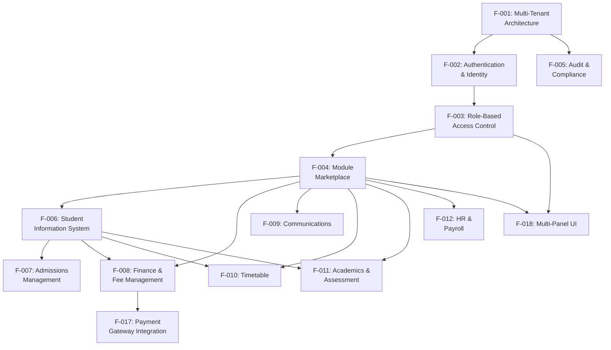

**Key Dependency Chains:**

| Chain | Path | Rationale |
|-------|------|-----------|
| Foundation → Auth → RBAC | F-001 → F-002 → F-003 | Tenant context required for auth; auth required for role assignment |
| RBAC → Marketplace → Modules | F-003 → F-004 → F-006/F-008/... | Permission checks gate marketplace; marketplace gates module access |
| SIS → Downstream Modules | F-006 → F-007, F-008, F-010, F-011 | Student and class entities are referenced by admissions, invoices, timetable slots, and grades |
| Finance → Payment Gateways | F-008 → F-017 | Invoice payments require external gateway processing |

---

### 2.3.2 Integration Points

External service integrations are mapped to the features that consume them:

| Integration Provider | Consuming Features | Data Flow |
|---------------------|-------------------|-----------|
| WorkOS | F-002 (Authentication) | Inbound: Magic link callbacks, SSO tokens, Directory Sync events |
| M-Pesa (Daraja API) | F-017 → F-008 | Outbound: STK Push requests; Inbound: C2B/B2C callbacks |
| Airtel Money | F-017 → F-008 | Outbound: Payment requests; Inbound: Payment confirmation callbacks |
| Stripe | F-017 → F-008 | Outbound: Payment Intents; Inbound: Webhook events |
| Africa's Talking | F-009 (Communications) | Outbound: Bulk SMS, USSD sessions |
| Resend + React Email | F-009 (Communications) | Outbound: Transactional and notification emails |
| Convex Cloud | All features | Bidirectional: Real-time queries, mutations, subscriptions |
| Vercel | F-001 (Multi-Tenant), F-018 (UI) | Outbound: Subdomain routing, edge middleware, CDN delivery |

---

### 2.3.3 Shared Components

The following components are consumed by multiple features, creating shared dependencies:

| Component | Location | Consuming Features |
|-----------|----------|-------------------|
| `requireTenantContext(ctx)` | `backend/convex/` helpers | F-001, and all tenant-scoped features (F-005 through F-018) |
| `useAuth` hook | `frontend/src/hooks/` | F-002, F-018 (all panels) |
| `useTenant` hook | `frontend/src/hooks/` | F-001, F-018 (tenant context resolution) |
| `usePermissions` hook | `frontend/src/hooks/` | F-003, F-018 (UI permission gating) |
| `useModules` hook | `frontend/src/hooks/` | F-004, F-018 (module-gated navigation) |
| `usePagination` hook | `frontend/src/hooks/` | F-006, F-008, F-011, F-012 (list views) |
| `useNotifications` hook | `frontend/src/hooks/` | F-009, F-018 (notification badge/popover) |
| Zod validators | `shared/src/validators/` | F-001, F-002, F-006, F-008 (input validation) |
| AppShell + Sidebar | `frontend/src/components/` | F-018 (all 7 panel layouts) |

---

### 2.3.4 Common Services

Services shared across multiple features at the backend layer:

| Service | Description | Consuming Features |
|---------|------------|-------------------|
| Tenant Isolation | `tenantId` enforcement on all database operations | All features (F-001 as provider, F-005 through F-018 as consumers) |
| Audit Logging | Mutation-level change tracking | All features generating data changes |
| Session Management | Token-based auth state | F-002 (provider), all authenticated features (consumers) |
| Pagination | Consistent list/table pagination (default 25, max 100) | All list-rendering features |
| Monetary Formatting | Cents-based integer storage for all financial values | F-008, F-012, F-015, F-016, F-017 |

---

## 2.4 IMPLEMENTATION CONSIDERATIONS

### 2.4.1 Technical Constraints

| Constraint | Impact | Affected Features |
|-----------|--------|-------------------|
| Convex serverless runtime | All backend logic must execute as Convex queries/mutations/actions; no traditional server processes | All backend features |
| TypeScript-only codebase | All workspaces use TypeScript ^5.4.0; no JavaScript files permitted | All features |
| Node.js ≥20.0.0 | Runtime version floor; limits dependency compatibility | All workspaces |
| Monorepo workspace structure | Shared package (`@edumyles/shared`) must be the single source of truth for types, constants, and validators | All features |
| No test framework installed | Zero tests exist; Vitest/Jest not configured; CI test jobs cannot execute | All features (risk) |
| Empty backend modules | All 11 module directories contain only `.gitkeep` files; all business logic remains to be implemented | F-006 through F-017 |
| Empty mobile app | Expo workspace configured but contains no screens or navigation | F-018 (mobile) |

---

### 2.4.2 Performance Requirements

| Requirement | Target | Measurement |
|------------|--------|-------------|
| Time to First Byte | < 800ms on 3G networks | Server response timing under bandwidth-constrained conditions |
| Platform Availability | 99.9% uptime | Convex + Vercel combined availability |
| PWA Compliance | Lighthouse PWA audit pass | Progressive Web App criteria |
| Page Load Optimization | 3G-optimized asset delivery | Core Web Vitals (LCP, FID, CLS) |
| Pagination Performance | Default 25, max 100 items per page | Query execution time for paginated data sets |
| Session Persistence | 30-day cookie-based sessions | Minimal re-authentication on shared devices |

**Offline Capability Targets:**

| Module | Offline Mode | Sync Strategy |
|--------|-------------|---------------|
| Attendance (F-011) | Full read/write | Bidirectional sync on reconnection |
| Gradebook (F-011) | Full read/write | Bidirectional sync on reconnection |
| SIS (F-006) | Read-only cache | Pull-based refresh |
| HR (F-012) | Read-only cache | Pull-based refresh |
| Timetable (F-010) | Read-only cache | Pull-based refresh |

---

### 2.4.3 Scalability Considerations

| Dimension | Target | Design Approach |
|-----------|--------|----------------|
| Tenant Count | 50–500 active tenants | Convex Cloud horizontal scaling; tenant-scoped indexes on every table |
| Student Volume | Up to 300,000 students | Compound indexes (e.g., `by_tenant_student`, `by_tenant_status`) for query performance |
| Concurrent Users | Multiple roles per tenant active simultaneously | Convex real-time subscription model; serverless auto-scaling |
| Module Growth | 11 modules expandable | `moduleRegistry` table supports versioned module entries with `active/beta/deprecated` status lifecycle |
| Geographic Expansion | 6 countries, 7 curricula | Country/currency/curriculum codes defined as extensible enums in shared constants |

**Database Index Strategy (from `backend/convex/schema.ts`):**

Every table includes at minimum a `by_tenant` index. High-query tables add compound indexes:

| Table | Index Pattern |
|-------|--------------|
| `students` | `by_tenant`, `by_tenant_student`, `by_tenant_status` |
| `invoices` | `by_tenant`, `by_tenant_status` |
| `grades` | `by_tenant`, `by_tenant_student` |
| `attendanceRecords` | `by_tenant`, `by_tenant_student` |

---

### 2.4.4 Security Implications

| Security Domain | Implementation | Feature Reference |
|----------------|---------------|-------------------|
| Tenant Data Isolation | `tenantId` as first field and first index component in every table; `requireTenantContext(ctx)` enforced on every operation | F-001 |
| Authentication Security | WorkOS-managed authentication; no password storage in EduMyles database | F-002 |
| Authorization Enforcement | 13-role hierarchy with 22 granular permissions checked at both UI and backend layers | F-003 |
| Audit Trail Integrity | Before/after state capture on all mutations; 7-year retention; tamper-resistant logging | F-005 |
| Impersonation Controls | Tracked with reason, timestamps, and actor identification; visible in audit trail | F-003, F-005 |
| Transport Security | HTTP security headers (X-Frame-Options: DENY, nosniff, strict-origin referrer); Permissions-Policy restrictions | F-001 |
| Secret Management | TruffleHog secret scanning in CI pipeline; ~180 environment variables managed via templates | F-005 |
| Payment Security | Webhook callbacks stored with raw payloads; processed flag for idempotent handling; Stripe PCI compliance via hosted checkout | F-017 |
| Financial Data Integrity | Integer-based monetary storage prevents floating-point precision errors | F-008, F-012 |

---

### 2.4.5 Maintenance Requirements

| Requirement | Description | Affected Features |
|-------------|------------|-------------------|
| Shared Type Consistency | Any change to types, constants, or validators in `@edumyles/shared` must be reviewed by both frontend and backend teams (per `.github/CODEOWNERS`) | All features |
| Security-Critical Path Reviews | Auth, platform admin, middleware, finance, and eWallet code changes require `@mylesoft-technologies/core-engineers` approval | F-002, F-003, F-008, F-015 |
| CI/CD Pipeline | 5 GitHub Actions workflows manage lint, type-check, build, test (pending), and deploy stages | All features |
| Schema Migration | Convex schema changes in `backend/convex/schema.ts` affect all downstream features; backward compatibility must be maintained | All features |
| Module Versioning | `moduleRegistry` supports version tracking for module upgrades | F-004 |
| Date/Time Formatting | Platform-wide conventions: DD/MM/YYYY for dates, HH:mm for times, Unix timestamps for storage | All features with date fields |
| Monetary Convention | All amounts in smallest currency unit (cents/pesa); no floating-point currency values | F-008, F-012, F-015, F-016, F-017 |

---

## 2.5 TRACEABILITY MATRIX

The following matrix maps each feature to its implementation phase (from `docs/IMPLEMENTATION_PLAN.md`), current completion status, schema evidence, and requirement count.

| Feature ID | Feature | Phase | Completion | Schema Tables |
|-----------|---------|-------|------------|---------------|
| F-001 | Multi-Tenant Architecture | Phase 0–1 | ~80% | `tenants`, `subscriptions`, `platformInvoices` |
| F-002 | Authentication | Phase 0–1 | ~70% | `platformAdmins`, `platformSessions`, `users`, `sessions` |
| F-003 | RBAC | Phase 0–1 | ~75% | `impersonations`, permissions matrix |
| F-004 | Module Marketplace | Phase 2 | 0% | `moduleRegistry`, `installedModules`, `moduleRequests` |
| F-005 | Audit & Compliance | Phase 0–1 | ~60% | `platformAuditLogs`, `auditLogs` |

| Feature ID | Feature | Phase | Completion | Schema Tables |
|-----------|---------|-------|------------|---------------|
| F-006 | SIS | Phase 4 | 0% | `students`, `guardians`, `classes`, `enrollments` |
| F-007 | Admissions | Phase 4 | 0% | `admissionApplications` |
| F-008 | Finance & Fees | Phase 4 | 0% | `feeStructures`, `invoices`, `payments`, `paymentCallbacks` |
| F-009 | Communications | Phase 11 | 0% | `notifications`, `announcements` |
| F-010 | Timetable | Phase 10 | 0% | `timetableSlots` |

| Feature ID | Feature | Phase | Completion | Schema Tables |
|-----------|---------|-------|------------|---------------|
| F-011 | Academics | Phase 10 | 0% | `grades`, `assignments`, `submissions`, `reportCards`, `attendanceRecords`, `academicYears` |
| F-012 | HR & Payroll | Phase 10 | 0% | `staff` |
| F-013 | Library | Phase 10 | 0% | None (proposed) |
| F-014 | Transport | Phase 10 | 0% | None (proposed) |
| F-015 | eWallet | Phase 10 | 0% | None (proposed) |

| Feature ID | Feature | Phase | Completion | Schema Tables |
|-----------|---------|-------|------------|---------------|
| F-016 | eCommerce | Phase 10 | 0% | None (proposed) |
| F-017 | Payment Gateways | Phase 11 | 0% | `paymentCallbacks` |
| F-018 | Multi-Panel UI | Phase 3–9 | ~30% | Routes, hooks, layout components |

**Requirements Count Summary:**

| Category | Feature Count | Requirement Count | Must-Have | Should-Have | Could-Have |
|----------|--------------|-------------------|-----------|-------------|------------|
| Platform Infrastructure | 5 | 19 | 15 | 3 | 0 |
| Starter Tier Modules | 4 | 14 | 13 | 0 | 0 |
| Standard/Extended Tier | 5 | 13 | 9 | 1 | 6 |
| Cross-Cutting | 2 | 7 | 7 | 0 | 0 |
| **Total** | **18** | **53** | **44** | **4** | **6** |

**Phase-to-Feature Mapping (from `docs/IMPLEMENTATION_PLAN.md`):**

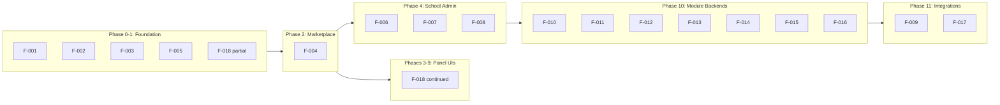

---

## 2.6 REFERENCES

#### Repository Files Examined

- `shared/src/constants/index.ts` — Module definitions (11 modules), tier-module matrix, 13-role hierarchy with permission levels, 7 curriculum codes, 6 supported countries, pagination defaults (25/100), date format conventions
- `shared/src/types/index.ts` — Domain model TypeScript types: Tenant, User, Student, Payment, Academic, Module, PaymentMethod union, TenantStatus union, role enums
- `shared/src/validators/index.ts` — Zod validation schemas: createTenantSchema, createUserSchema, createStudentSchema, createPaymentSchema, paginationSchema, and primitive validators (slug, phone, date, tenantId)
- `backend/convex/schema.ts` — Complete 27-table Convex database schema with all field definitions, validators, and tenant-scoped indexes
- `frontend/src/lib/permissions.ts` — Client-side RBAC mirror mapping 22 permissions across 14 roles
- `frontend/src/lib/routes.ts` — Role-based navigation definitions for 7 panel types with module gating tags
- `docs/IMPLEMENTATION_PLAN.md` — 13-phase implementation roadmap with function/page specifications and dependency graph
- `docs/PROJECT_PROGRESS_ANALYSIS.md` — Progress scorecard (~25–30% complete), risk assessment, and recommended next steps
- `vercel.json` — HTTP security headers configuration and subdomain routing rules
- `.github/CODEOWNERS` — Team-based code ownership and security-critical path restrictions

#### Repository Folders Explored

- `backend/convex/` — Convex data model, tenant isolation helpers
- `shared/src/` — Cross-workspace shared package (constants, types, validators, theme)
- `frontend/src/` — Frontend hooks, components, route definitions, permission matrix
- `docs/` — Implementation plan, progress analysis, architecture guides

#### External Sources Consulted

- Kenya CBC school management software market landscape (market validation for EduMyles feature priorities)
- Kenya Ministry of Education CBC implementation guidance

#### Cross-Referenced Technical Specification Sections

- Section 1.1 — Executive Summary: Business context, stakeholder roles, subscription tiers
- Section 1.2 — System Overview: Architecture, 11 modules, success criteria, KPIs
- Section 1.3 — Scope: In-scope capabilities, exclusions, known risks
- Section 1.4 — Document Conventions: Terminology, technology reference, governance model

# 3. Technology Stack

EduMyles employs a **serverless-first, TypeScript-only** technology stack purpose-built for delivering a real-time, multi-tenant school management platform across East Africa. Every technology choice reflects the platform's core constraints: low-bandwidth 3G network optimization, real-time data synchronization, tenant data isolation, and a mobile-money-first payment architecture.

This section documents the actual technology selections as observed in the codebase — not hypothetical defaults. All version numbers, dependencies, and configurations are sourced directly from `package.json` files, configuration manifests, and workflow definitions across the monorepo.

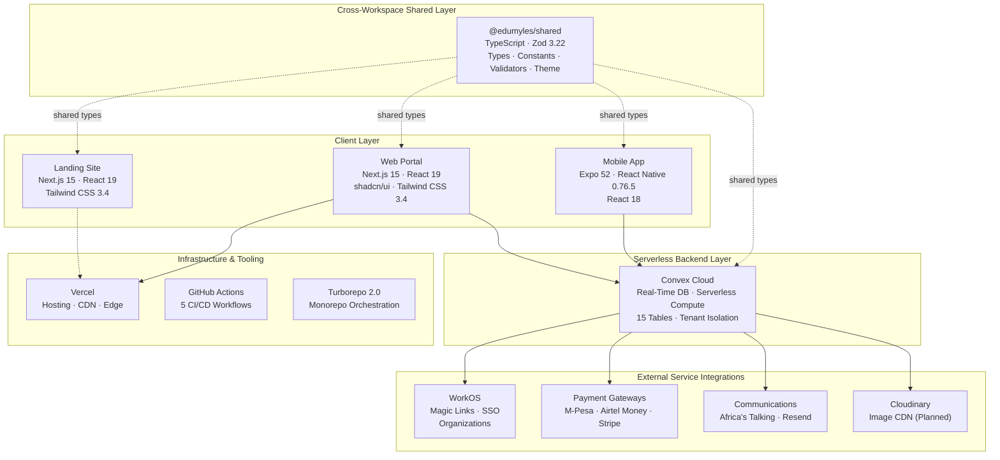

---

## 3.1 PROGRAMMING LANGUAGES

### 3.1.1 TypeScript — Sole Programming Language

EduMyles is a **TypeScript-only** codebase. TypeScript serves as the single programming language across all five monorepo workspaces — frontend, backend, mobile, shared, and landing — with no JavaScript, Python, Go, Swift, Kotlin, or any other language present. This architectural decision, documented in the root `tsconfig.json` and enforced through strict compiler settings, ensures end-to-end type safety from the shared validation layer through the Convex backend to every client surface.

| Attribute | Detail | Source |
|-----------|--------|--------|
| **Language** | TypeScript | `package.json` (root) |
| **Version** | ^5.4.0 | `package.json` devDependencies |
| **Runtime** | Node.js ≥ 20.0.0 | `package.json` engines field |
| **Package Manager** | npm 10.8.2 | `package.json` packageManager field |
| **Target** | ES2022 | `tsconfig.json` compilerOptions |
| **Module System** | NodeNext | `tsconfig.json` compilerOptions |

### 3.1.2 Language Selection Rationale

TypeScript was selected as the exclusive language for EduMyles based on the following strategic criteria:

1. **End-to-End Type Safety** — Convex, the backend platform, operates entirely in TypeScript, enabling the schema defined in `backend/convex/schema.ts` to provide type-safe queries and mutations that propagate to React components. This eliminates a traditional API boundary mismatch between frontend and backend languages.

2. **Shared Type System** — The `@edumyles/shared` package (`shared/src/index.ts`) exports TypeScript types, Zod validators, constants, and theme tokens that are consumed by all four other workspaces, establishing a single source of truth for domain models such as `Tenant`, `User`, `Student`, `Payment`, and `Module` types.

3. **Cross-Platform Consistency** — Both the web frontend (Next.js 15) and mobile app (React Native / Expo 52) share the same language, enabling code reuse of validators and type definitions through the shared workspace.

4. **Developer Tooling** — TypeScript ^5.4.0 with strict mode and seven additional strict flags (detailed below) catches errors at compile time, reducing runtime failures in a multi-tenant environment where bugs can affect hundreds of schools.

### 3.1.3 Compiler Configuration

The root `tsconfig.json` enforces a rigorous compilation standard across all workspaces:

| Compiler Flag | Value | Purpose |
|--------------|-------|---------|
| `target` | ES2022 | Modern JavaScript output |
| `module` | NodeNext | Native Node.js ESM resolution |
| `moduleResolution` | NodeNext | Package.json exports support |
| `strict` | true | Enables all base strict checks |
| `noImplicitAny` | true | Prevents untyped variables |
| `noImplicitOverride` | true | Requires explicit override keyword |
| `noImplicitReturns` | true | Ensures all code paths return |
| `noFallthroughCasesInSwitch` | true | Prevents switch fallthrough |
| `noUncheckedIndexedAccess` | true | Adds undefined to indexed types |
| `exactOptionalPropertyTypes` | true | Strict optional property handling |
| `forceConsistentCasingInFileNames` | true | Cross-platform filename safety |

Individual workspaces extend or specialize this configuration:

| Workspace | Module Strategy | Special Settings |
|-----------|----------------|-----------------|
| `backend/` | ESNext / Bundler | `noEmit: true` (Convex handles deployment) |
| `mobile/` | Extends `expo/tsconfig.base` | Path aliases to `@edumyles/shared` |
| `shared/` | NodeNext | `composite: true`, `outDir: ./dist` |
| `frontend/` | Inherits root | Additional Next.js-specific paths |

---

## 3.2 FRAMEWORKS & LIBRARIES

### 3.2.1 Web Portal — Frontend Workspace

The primary application interface is built in the `frontend/` workspace using the Next.js App Router paradigm with React Server Components (RSC) support enabled.

#### Core Framework Stack

| Component | Package | Version | Justification |
|-----------|---------|---------|--------------|
| **Web Framework** | `next` | ^15.0.0 | App Router, SSR/SSG, middleware for subdomain routing, Server Actions |
| **UI Library** | `react` | ^19.0.0 | Server Components, concurrent rendering, `use` hook |
| **React DOM** | `react-dom` | ^19.0.0 | Browser-side rendering and hydration |
| **CSS Framework** | `tailwindcss` | ^3.4.19 | Utility-first CSS, 3G-optimized minimal bundle size |
| **Component Library** | shadcn/ui | via `components.json` | RSC-compatible, accessible headless primitives |
| **Backend Client** | `convex` | ^1.32.0 | Real-time data subscriptions and mutations |
| **Query Integration** | `@convex-dev/react-query` | ^0.1.0 | React Query adapter for Convex |
| **Auth SDK** | `@workos-inc/authkit-nextjs` | ^0.13.2 | WorkOS authentication for Next.js App Router |
| **Validation** | `zod` | ^3.22.4 | Runtime schema validation across all layers |

**Next.js 15** was selected for its native support for React Server Components, which is critical for the multi-panel architecture defined in `frontend/src/lib/routes.ts`. Next.js 15 delivers React 19 support, including the React Compiler (Experimental), and hydration error improvements. Server Actions Security provides unguessable endpoints and removal of unused actions, which aligns with the platform's security posture for multi-tenant operations. The App Router's file-system routing maps naturally to the seven role-specific panels (`/platform`, `/admin`, `/portal/teacher`, etc.) documented in §2.1.7 (F-018).

#### Radix UI Primitives

The frontend relies on **14 Radix UI packages** as the headless primitive layer for shadcn/ui components:

| Package | Version | UI Element |
|---------|---------|-----------|
| `@radix-ui/react-avatar` | ^1.1.11 | User avatars |
| `@radix-ui/react-checkbox` | ^1.3.3 | Form checkboxes |
| `@radix-ui/react-dialog` | ^1.1.15 | Modal dialogs |
| `@radix-ui/react-dropdown-menu` | ^2.1.16 | Action menus |
| `@radix-ui/react-label` | ^2.1.8 | Form labels |
| `@radix-ui/react-popover` | ^1.1.15 | Popover panels |
| `@radix-ui/react-scroll-area` | ^1.2.10 | Scrollable containers |
| `@radix-ui/react-select` | ^2.2.6 | Select dropdowns |
| `@radix-ui/react-separator` | ^1.1.8 | Visual dividers |
| `@radix-ui/react-slot` | ^1.2.4 | Component composition |
| `@radix-ui/react-switch` | ^1.2.6 | Toggle switches |
| `@radix-ui/react-tabs` | ^1.1.13 | Tab navigation |
| `@radix-ui/react-toast` | ^1.2.15 | Toast notifications |
| `@radix-ui/react-tooltip` | ^1.2.8 | Tooltips |

#### CSS and Styling Utilities

| Package | Version | Purpose |
|---------|---------|---------|
| `class-variance-authority` | ^0.7.1 | Variant-based component styling |
| `clsx` | ^2.1.1 | Conditional className composition |
| `tailwind-merge` | ^3.5.0 | Tailwind class deduplication |
| `tailwindcss-animate` | ^1.0.7 | Animation utilities |
| `lucide-react` | ^0.575.0 | Icon library (tree-shakeable SVGs) |
| `postcss` | ^8.5.6 | CSS processing pipeline |
| `autoprefixer` | ^10.4.27 | Vendor prefix automation |

#### Frontend Configuration

The **shadcn/ui** configuration in `frontend/components.json` enables RSC support with TSX components, the `default` visual style, `slate` base color, and CSS variables enabled. This configuration ensures all 20 shadcn/ui components deployed in the frontend support React Server Components natively.

The **Tailwind CSS** configuration in `frontend/tailwind.config.ts` defines a custom design system tailored to the EduMyles brand:

- **Color palette**: Zoho-inspired tokens — forest, crimson, amber, charcoal, cream, zoho.blue
- **Typography**: Poppins font family with custom font sizes (hero, section, body-lg, body-md)
- **Layout**: `maxWidth.page: 1300px` for content containment

The **Next.js** configuration in `frontend/next.config.ts` establishes:

- Server actions bound to `localhost:3000`
- Remote image patterns for Convex Cloud and Cloudinary CDN
- `NEXT_PUBLIC_ROOT_DOMAIN` defaulting to `edumyles.com` for subdomain routing

### 3.2.2 Landing Site — Marketing Workspace

The `landing/` workspace provides the marketing site at `edumyles.com`, built with a deliberately minimal dependency footprint:

| Package | Version | Purpose |
|---------|---------|---------|
| `next` | ^15.0.0 | Static marketing pages |
| `react` | ^19.0.0 | UI rendering |
| `react-dom` | ^19.0.0 | DOM rendering |
| `tailwindcss` | ^3.4.0 (dev) | CSS framework |

The landing site operates on port 3001 (versus port 3000 for the main portal) and carries no Convex, Radix UI, or authentication dependencies — it is a standalone content delivery workspace.

### 3.2.3 Backend — Convex Serverless Workspace

The `backend/` workspace hosts all server-side logic as Convex serverless functions. Convex is a modern backend-as-a-service designed for app developers. It provides a reactive document-relational database, seamless real-time synchronization between frontend and backend, and a unified environment to write backend logic entirely in TypeScript.

| Package | Version | Purpose |
|---------|---------|---------|
| `convex` | ^1.14.0 | Serverless DB + compute runtime |
| `zod` | ^3.22.4 | Runtime validation for mutations |
| `@edumyles/shared` | * (workspace) | Shared types, constants, validators |

**Convex Selection Rationale:**

Convex is the open source, reactive database where queries are TypeScript code running right in the database. Just like React components react to state changes, Convex queries react to database changes. Convex provides a database, a place to write your server functions, and client libraries. It makes it easy to build and scale dynamic live-updating apps.

This is particularly critical for EduMyles because:

- **Real-time synchronization** — Attendance, grades, and fee payments update live across all connected clients without manual polling or WebSocket management
- **TypeScript-native** — Schema definitions in `backend/convex/schema.ts` are pure TypeScript, enabling end-to-end type safety from database to UI
- **Zero infrastructure management** — Convex is a serverless backend platform designed to simplify state management and real-time application development. Unlike traditional database-as-a-service providers, Convex focuses on delivering an end-to-end backend with automatic reactivity.
- **ACID compliance** — The database is ACID-compliant and uses serializable isolation and optimistic concurrency control. Convex provides the strictest possible transactional guarantees, and you never see inconsistent data.

All backend logic executes as Convex queries (read-only), mutations (transactional read/write), or actions (external API calls). No traditional server processes, containers, or API gateways are required.

### 3.2.4 Mobile Application — Expo / React Native Workspace

The `mobile/` workspace targets iOS and Android through a single cross-platform codebase:

| Package | Version | Purpose |
|---------|---------|---------|
| `expo` | ~52.0.0 | React Native framework and toolchain |
| `expo-router` | ~4.0.0 | File-based routing for Expo |
| `react` | ^18.3.1 | UI rendering |
| `react-native` | 0.76.5 | Cross-platform native rendering |
| `convex` | ^1.14.0 | Backend client |
| `zod` | ^3.22.4 | Validation |
| `@edumyles/shared` | * (workspace) | Shared package |
| `@babel/core` | ^7.24.0 (dev) | Babel transpilation |

**React Version Divergence**: The mobile workspace uses React ^18.3.1 while the web frontend uses React ^19.0.0. This discrepancy reflects the Expo 52 SDK's React Native 0.76.5 dependency, which has not yet adopted React 19 at the pinned version.

The mobile TypeScript configuration extends `expo/tsconfig.base` with strict mode enabled and path aliases pointing to the shared package. Note that the mobile workspace is currently a placeholder — Expo is configured but contains no screens, navigation, or business logic (per §2.4.1 Technical Constraints).

### 3.2.5 Shared Package — @edumyles/shared

The `shared/` workspace acts as the **single source of truth** for cross-workspace types and validation:

| Package | Version | Purpose |
|---------|---------|---------|
| `zod` | ^3.22.4 | Runtime type validation and schema definition |

The package exports four module categories from `shared/src/index.ts`:

| Export Category | Contents | Consumers |
|----------------|----------|-----------|
| **Types** | `Tenant`, `User`, `Student`, `Payment`, `Module`, role unions, status enums | All 4 workspaces |
| **Constants** | 11 module definitions, 13-role hierarchy, 7 curriculum codes, 6 country configs | All 4 workspaces |
| **Validators** | `createTenantSchema`, `createStudentSchema`, `createPaymentSchema`, `paginationSchema` | Backend + Frontend |
| **Theme** | Design tokens (colors, typography, spacing, layout constants) | Frontend + Mobile |

The package uses TypeScript `composite: true` with `outDir: ./dist` and NodeNext module resolution for clean workspace import boundaries.

### 3.2.6 Workspace Dependency Map

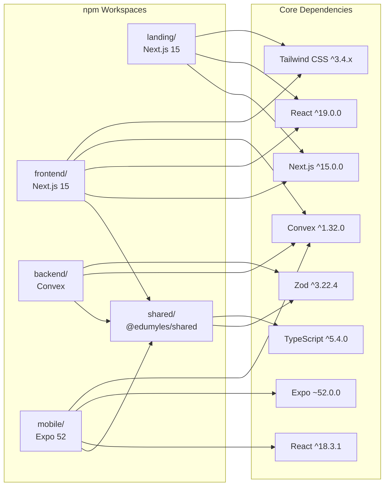

---

## 3.3 OPEN SOURCE DEPENDENCIES

### 3.3.1 Package Registry and Management

All dependencies are sourced from the **npm public registry** with the following management strategy:

| Attribute | Value | Source |
|-----------|-------|--------|
| **Registry** | npm (default) | `package-lock.json` |
| **Lockfile Version** | 3 | `package-lock.json` |
| **Package Manager** | npm 10.8.2 (pinned) | `package.json` packageManager field |
| **Workspace Protocol** | `*` (latest workspace version) | All internal cross-references |
| **Security Audit** | `npm audit --audit-level=high` | `.github/workflows/ci.yml` |

The monorepo uses npm workspaces (not Yarn or pnpm) with a single root `package-lock.json` that pins all transitive dependency versions for reproducible builds.

### 3.3.2 Core Framework Dependencies

These packages form the backbone of the platform and are used across multiple workspaces:

| Package | Version(s) | Workspaces | License |
|---------|-----------|------------|---------|
| `next` | ^15.0.0 | frontend, landing | MIT |
| `react` | ^19.0.0 / ^18.3.1 | frontend, landing / mobile | MIT |
| `react-dom` | ^19.0.0 | frontend, landing | MIT |
| `react-native` | 0.76.5 | mobile | MIT |
| `convex` | ^1.32.0 / ^1.14.0 | root, frontend / backend, mobile | Apache-2.0 |
| `zod` | ^3.22.4 | shared, frontend, backend, mobile | MIT |
| `typescript` | ^5.4.0 | root (devDep, all workspaces) | Apache-2.0 |

### 3.3.3 UI Component Dependencies

The UI layer is built on shadcn/ui primitives backed by 14 Radix UI headless component packages (listed in §3.2.1), combined with utility packages for styling:

| Category | Package Count | Key Packages |
|----------|--------------|--------------|
| Radix UI Primitives | 14 | `@radix-ui/react-dialog`, `@radix-ui/react-select`, `@radix-ui/react-tabs`, etc. |
| Styling Utilities | 4 | `class-variance-authority`, `clsx`, `tailwind-merge`, `tailwindcss-animate` |
| Icons | 1 | `lucide-react` ^0.575.0 |
| CSS Processing | 3 | `tailwindcss`, `postcss`, `autoprefixer` |

### 3.3.4 Authentication Dependencies

| Package | Version | Scope | Purpose |
|---------|---------|-------|---------|
| `@workos-inc/node` | ^8.7.0 | Root | WorkOS server-side SDK for API interactions |
| `@workos-inc/authkit-nextjs` | ^0.13.2 | Frontend | Next.js App Router authentication integration |

The AuthKit library for Next.js provides convenient helpers for authentication and session management using WorkOS & AuthKit with Next.js. This library is intended for use with the Next.js App Router.

### 3.3.5 Build and Development Dependencies

| Package | Version | Purpose |
|---------|---------|---------|
| `turbo` | ^2.0.0 | Monorepo task orchestration |
| `eslint` | ^9.0.0 | JavaScript/TypeScript linting |
| `eslint-config-next` | ^15.0.0 | Next.js-specific ESLint rules |
| `prettier` | ^3.2.5 | Code formatting |
| `@types/node` | ^20.11.0 | Node.js type definitions |
| `@types/react` | ^19.0.0 | React type definitions |
| `@types/react-dom` | ^19.0.0 | React DOM type definitions |
| `@babel/core` | ^7.24.0 | Babel transpilation (mobile only) |

---

## 3.4 THIRD-PARTY SERVICES

### 3.4.1 Authentication — WorkOS

EduMyles delegates all identity management to **WorkOS**, a platform providing enterprise-grade authentication via its AuthKit SDK. WorkOS was selected over alternatives (Auth0, Clerk) for its native Next.js App Router support, organization-based multi-tenancy, and enterprise SSO capabilities that align with the school-chain use case.

WorkOS's authkit-nextjs library is designed specifically for Next.js App Router with native support for Server Components integration, Edge runtime compatibility, automatic session management, and TypeScript-first SDK. The SDK handles the complexity of App Router authentication so you can focus on building features.

#### Authentication Configuration

| Environment Variable | Purpose | Source |
|---------------------|---------|--------|
| `WORKOS_API_KEY` | Server-side API key | `infra/env-templates/.env.example` |
| `NEXT_PUBLIC_WORKOS_CLIENT_ID` | Client-side client ID | `infra/env-templates/.env.example` |
| `WORKOS_REDIRECT_URI` | Auth callback URL (`https://{slug}.edumyles.com/auth/callback`) | `infra/env-templates/.env.example` |
| `WORKOS_COOKIE_PASSWORD` | Session cookie encryption (minimum 32 characters) | `infra/env-templates/.env.example` |

#### Authentication Features

| Feature | Implementation | Reference |
|---------|---------------|-----------|
| **Magic Links** | Passwordless email authentication | F-002 |
| **SSO** | Enterprise Single Sign-On for school chains | F-002 |
| **Organizations** | WorkOS Organizations map to EduMyles tenants | F-001 / `organizations` table |
| **Directory Sync** | Automated user provisioning from identity providers | F-002 |
| **Session Management** | 30-day cookie-based sessions via `wos-session` cookie | `sessions` table |
| **Impersonation** | Platform admin user impersonation with audit trail | F-003 / `impersonationSessions` table |

WorkOS manages **two authentication domains**: platform-level authentication (tracked in `platformAdmins` and `platformSessions` tables) for Mylesoft staff, and tenant-level authentication (tracked in `users` and `sessions` tables) for school users.

### 3.4.2 Payment Gateways

EduMyles integrates three payment gateways reflecting its mobile-money-first strategy for the East African market. Payment methods are defined as a union type in `shared/src/types/index.ts`: `mpesa`, `airtel_money`, `stripe`, `bank_transfer`, `cash`, and `cheque`.

#### M-Pesa — Daraja API (Safaricom Kenya)

The primary payment gateway, reflecting M-Pesa's dominance in the Kenyan market where most school fee payments occur.

| Environment Variable | Purpose | Source |
|---------------------|---------|--------|
| `MPESA_CONSUMER_KEY` | Daraja app consumer key | `.env.example` |
| `MPESA_CONSUMER_SECRET` | Daraja app consumer secret | `.env.example` |
| `MPESA_SHORTCODE` | STK Push shortcode (default: 174379) | `.env.example` |
| `MPESA_PASSKEY` | Lipa na M-Pesa passkey | `.env.example` |
| `MPESA_CALLBACK_URL` | Webhook callback (`https://api.edumyles.com/webhooks/mpesa`) | `.env.example` |
| `MPESA_ENVIRONMENT` | `sandbox` / `production` | `.env.example` |

**Supported Flow Types**: STK Push (customer-initiated), C2B (business-initiated collection), B2C (disbursement)

#### Airtel Money

Provides mobile money coverage for non-Safaricom networks across East Africa.

| Environment Variable | Purpose | Source |
|---------------------|---------|--------|
| `AIRTEL_CLIENT_ID` | OAuth client ID | `.env.example` |
| `AIRTEL_CLIENT_SECRET` | OAuth client secret | `.env.example` |
| `AIRTEL_CALLBACK_URL` | Webhook callback (`https://api.edumyles.com/webhooks/airtel`) | `.env.example` |
| `AIRTEL_ENVIRONMENT` | `staging` / `production` | `.env.example` |

#### Stripe (International Card Payments)

Enables international card payments for diaspora parents and enterprise subscriptions, with PCI compliance via hosted checkout.

| Environment Variable | Purpose | Source |
|---------------------|---------|--------|
| `NEXT_PUBLIC_STRIPE_PUBLISHABLE_KEY` | Client-safe publishable key | `.env.example` |
| `STRIPE_SECRET_KEY` | Server-side secret key | `.env.example` |
| `STRIPE_WEBHOOK_SECRET` | Webhook signature verification | `.env.example` |

**Supported Capabilities**: Payment Intents, Checkout Sessions, Webhook Events

### 3.4.3 Communication Services

#### Africa's Talking — SMS Gateway

| Environment Variable | Purpose | Source |
|---------------------|---------|--------|
| `AT_USERNAME` | API username (`sandbox` for testing) | `.env.example` |
| `AT_API_KEY` | API key | `.env.example` |
| `AT_SENDER_ID` | Sender ID (default: `EduMyles`) | `.env.example` |

**Capabilities**: Bulk SMS, USSD sessions — critical for parent engagement in regions where SMS remains the primary digital communication channel.

#### Resend — Transactional Email

| Environment Variable | Purpose | Source |
|---------------------|---------|--------|
| `RESEND_API_KEY` | API key | `.env.example` |
| `RESEND_FROM_EMAIL` | Sender address (`noreply@edumyles.com`) | `.env.example` |
| `RESEND_FROM_NAME` | Sender display name (`EduMyles`) | `.env.example` |

Used in combination with **React Email** for template-based transactional and notification emails (enrollment confirmations, payment receipts, grade reports).

### 3.4.4 Hosting & Infrastructure

#### Vercel — Web Hosting and CDN

Vercel provides the hosting infrastructure for the Next.js web applications, with subdomain routing enabling the multi-tenant architecture.

| Environment Variable | Purpose | Source |
|---------------------|---------|--------|
| `VERCEL_PROJECT_ID` | Project identifier | `.env.example` |
| `VERCEL_TEAM_ID` | Team/organization identifier | `.env.example` |
| `VERCEL_TOKEN` | Deploy authorization token | `.env.example` |
| `NEXT_PUBLIC_ROOT_DOMAIN` | Root domain (`edumyles.com`) | `frontend/next.config.ts` |

**Platform Features Utilized**:

| Feature | Purpose |
|---------|---------|
| CDN | Global asset delivery, 3G-optimized |
| Edge Functions | Subdomain routing middleware for `{slug}.edumyles.com` |
| Preview Deployments | PR-based staging environments |
| ISR | Incremental Static Regeneration for marketing pages |
| Security Headers | Global HTTP security headers via `vercel.json` |

**Security Headers** configured in `vercel.json`:

| Header | Value | Purpose |
|--------|-------|---------|
| `X-Content-Type-Options` | `nosniff` | Prevents MIME-type sniffing |
| `X-Frame-Options` | `DENY` | Prevents clickjacking |
| `X-XSS-Protection` | `1; mode=block` | Enables XSS filtering |
| `Referrer-Policy` | `strict-origin-when-cross-origin` | Controls referrer information |
| `Permissions-Policy` | `camera=(), microphone=(), geolocation=()` | Restricts browser API access |

#### Convex Cloud — Backend-as-a-Service

| Environment Variable | Purpose | Source |
|---------------------|---------|--------|
| `NEXT_PUBLIC_CONVEX_URL` | Deployment URL | `.env.example` |
| `CONVEX_DEPLOY_KEY` | CI/CD deployment key | `.env.example` |
| `CONVEX_ADMIN_KEY` | Server-only admin key | `.env.example` |

**Project Identifier**: `warmhearted-hummingbird-522` (from `convex/convex.json`)

Convex Cloud provides serverless compute, the real-time document-relational database, automatic scaling, and real-time subscriptions as a unified service — eliminating the need for separate database hosting, API gateways, or WebSocket servers.

### 3.4.5 Image CDN — Cloudinary (Planned)

The `frontend/next.config.ts` whitelists remote image patterns for `**.cloudinary.com`, and the environment template includes optional Cloudinary variables. This service is planned for media and document upload capabilities but is not yet actively integrated.

### 3.4.6 Planned Observability Services

The following services are configured in the environment template but remain commented/optional as of version 0.1.0:

| Service | Purpose | Status |
|---------|---------|--------|
| **Sentry** | Error monitoring and crash reporting | Planned |
| **PostHog** | Product analytics and user behavior tracking | Planned |

### 3.4.7 Third-Party Service Integration Map

```mermaid
flowchart LR
    subgraph Platform["EduMyles Platform"]
        FE["Web App<br/>Next.js 15"]
        BE["Convex Backend"]
        MB["Mobile App<br/>Expo 52"]
    end

    subgraph Authentication["Authentication"]
        WO["WorkOS<br/>Magic Links · SSO<br/>Organizations · Directory Sync"]
    end

    subgraph Payments["Payment Gateways"]
        MP["M-Pesa<br/>Daraja API<br/>STK Push · C2B · B2C"]
        AM["Airtel Money<br/>Mobile Payments"]
        ST["Stripe<br/>Card Payments<br/>Checkout · Webhooks"]
    end

    subgraph Communications["Communications"]
        AT["Africa's Talking<br/>Bulk SMS · USSD"]
        RS["Resend<br/>Transactional Email"]
    end

    subgraph Hosting["Hosting & CDN"]
        VL["Vercel<br/>CDN · Edge · Subdomains"]
        CL["Cloudinary<br/>Image CDN (Planned)"]
    end

    FE -->|"AuthKit SDK"| WO
    BE -->|"Server SDK"| WO
    BE -->|"STK Push / Webhooks"| MP
    BE -->|"OAuth / Webhooks"| AM
    BE -->|"Payment Intents / Webhooks"| ST
    BE -->|"SMS API"| AT
    BE -->|"Email API"| RS
    FE -->|"Deploy"| VL
    FE -->|"Remote Images"| CL
    MB -->|"Real-time Sync"| BE
end
```

---

## 3.5 DATABASES & STORAGE

### 3.5.1 Primary Database — Convex

EduMyles uses **Convex** as its sole database, with no separate relational database, document store, or search engine. Convex operates as a document-relational database — "Document" means you put JSON-like nested objects into your database. "Relational" means you have tables with relations, like tasks assigned to a user using IDs to reference documents in other tables.

#### Schema Overview

The database schema defined in `backend/convex/schema.ts` contains **15 tables** (in the current codebase scope per the section-specific details), each enforcing tenant isolation:

| Table | Domain | Key Fields | Primary Indexes |
|-------|--------|-----------|----------------|
| `tenants` | Platform | slug, name, tier, activeModules, country, currency | `by_tenantId`, `by_subdomain`, `by_status` |
| `users` | Identity | tenantId, workosUserId, email, role, permissions | `by_tenant`, `by_workos_user`, `by_tenant_email`, `by_tenant_role` |
| `sessions` | Auth | token, userId, role, permissions, expiresAt | `by_token`, `by_userId` |
| `organizations` | Auth | workosOrgId, subdomain, tenantId | `by_workos_org`, `by_subdomain`, `by_tenant` |
| `impersonationSessions` | Security | adminId, targetUserId, reason, startedAt, endedAt | `by_admin`, `by_target` |
| `auditLogs` | Compliance | tenantId, actorId, action, entityType, before/after | `by_tenant`, `by_user` |
| `moduleRegistry` | Marketplace | moduleId, tier, category, status, version | `by_module_id`, `by_status` |
| `installedModules` | Marketplace | tenantId, moduleId, status | `by_tenant`, `by_tenant_module`, `by_tenant_status` |
| `moduleRequests` | Marketplace | tenantId, moduleId, status | `by_tenant`, `by_tenant_status`, `by_module` |
| `students` | SIS | tenantId, admissionNo, classId, curriculum, status | `by_tenant`, `by_tenant_status`, `by_tenant_class`, `by_admission` |
| `classes` | SIS | tenantId, name, grade, stream, classTeacherId | `by_tenant`, `by_tenant_teacher` |
| `alumni` | Alumni | tenantId, userId, graduationYear | `by_tenant`, `by_tenant_year`, `by_user` |
| `partners` | Partners | tenantId, userId, type | `by_tenant`, `by_user`, `by_tenant_type` |
| `sponsorships` | Finance | tenantId, partnerId, studentId, status | `by_tenant`, `by_partner`, `by_student`, `by_tenant_status` |
| `notifications` | Comms | userId, type, title, channel, status | `by_user`, `by_user_unread`, `by_tenant` |

The full production schema documented in §1.2.2 and §1.3.1 encompasses **27 tables** including additional tables for academic years, grades, assignments, submissions, report cards, attendance records, fee structures, invoices, payments, payment callbacks, staff, timetable slots, subscriptions, platform invoices, admission applications, guardians, enrollments, announcements, platform admins, platform sessions, and platform audit logs.

### 3.5.2 Data Persistence Strategies

#### Tenant Isolation Pattern

Every table includes `tenantId` as the **first field and first index component**. The `requireTenantContext(ctx)` helper function, defined in `backend/convex/helpers/tenantGuard.ts`, is invoked on every Convex operation to enforce this boundary. Cross-tenant data access is architecturally prevented.

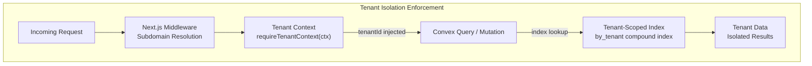

#### Data Format Conventions

| Convention | Format | Rationale |
|-----------|--------|-----------|
| **Monetary values** | Integer (smallest currency unit: cents/pesa) | Avoids floating-point precision errors across KES, UGX, TZS, RWF, ETB, GHS |
| **Dates (storage)** | Unix timestamps (numbers) | Timezone-agnostic, efficient indexing |
| **Dates (display)** | DD/MM/YYYY | East African convention |
| **Times (display)** | HH:mm | 24-hour format |
| **Sessions** | 30-day expiry with cookie tokens | Minimizes re-authentication on shared school devices |

#### Database Index Strategy

Every table includes at minimum a `by_tenant` index. High-query tables add compound indexes for performance:

| Table | Compound Index Pattern | Query Optimization Target |
|-------|----------------------|--------------------------|
| `students` | `by_tenant_status`, `by_tenant_class` | Class roster and enrollment queries |
| `users` | `by_tenant_email`, `by_tenant_role` | Login resolution and role filtering |
| `auditLogs` | `by_tenant` (tenantId + createdAt) | Chronological audit trail per tenant |
| `installedModules` | `by_tenant_module`, `by_tenant_status` | Module activation checks |

### 3.5.3 Caching and Offline Storage

#### Built-In Caching

Convex provides automatic caching and real-time subscriptions as native platform features. When a query function's dependent data changes, Convex automatically re-evaluates the query and pushes updated results to all subscribed clients. No external caching layer (Redis, Memcached, or similar) is required or present in the architecture.

#### Planned Offline Storage

As documented in §2.4.2, offline capability is planned for critical modules to support 3G-constrained environments:

| Module | Offline Mode | Sync Strategy |
|--------|-------------|---------------|
| **Attendance** (F-011) | Full read/write | Bidirectional sync on reconnection |
| **Gradebook** (F-011) | Full read/write | Bidirectional sync on reconnection |
| **SIS** (F-006) | Read-only cache | Pull-based refresh |
| **HR** (F-012) | Read-only cache | Pull-based refresh |
| **Timetable** (F-010) | Read-only cache | Pull-based refresh |

This offline capability targets the mobile workspace (Expo 52) and is not yet implemented as of version 0.1.0.

---

## 3.6 DEVELOPMENT & DEPLOYMENT

### 3.6.1 Monorepo Architecture — Turborepo

The monorepo is orchestrated by **Turborepo ^2.0.0**, managing five npm workspaces with a defined task dependency graph configured in `turbo.json`:

| Task | Caching | Dependencies | Persistent |
|------|---------|-------------|------------|
| `build` | ✅ Cached | Depends on `^build` (topological) | No |
| `dev` | ❌ Not cached | — | Yes |
| `lint` | ✅ Cached | — | No |
| `lint:fix` | ❌ Not cached | — | No |
| `type-check` | ✅ Cached | — | No |
| `test` | ✅ Cached | — | No |
| `clean` | ❌ Not cached | — | No |

Build caching enables Turborepo to skip unchanged workspace builds across CI runs, reducing pipeline execution time. Coverage artifacts from test runs are retained for reporting.

### 3.6.2 Build System

Each workspace has a tailored build strategy reflecting its deployment target:

| Workspace | Build Command | Output | Deployment Target |
|-----------|--------------|--------|-------------------|
| `frontend/` | `next build` | `.next/` | Vercel |
| `landing/` | `next build` | `.next/` | Vercel |
| `backend/` | `tsc --noEmit` (type-check only) | None | Convex Cloud (handles own bundling) |
| `mobile/` | `tsc --noEmit` (type-check only) | None | Expo (handles own bundling) |
| `shared/` | `tsc --build` | `dist/` | Consumed by other workspaces |

The backend and mobile workspaces perform type-checking only (`noEmit: true`), as their respective platforms (Convex and Expo) handle compilation and bundling independently.

### 3.6.3 CI/CD — GitHub Actions

Five GitHub Actions workflows automate the development lifecycle from code quality to production deployment:

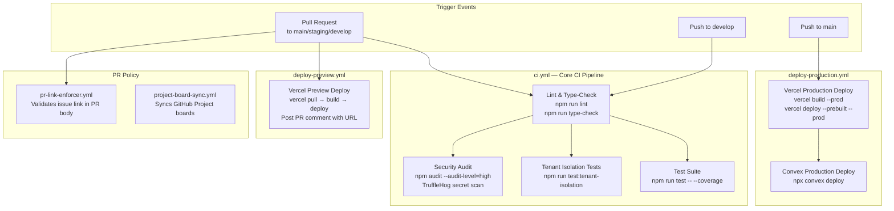

#### Workflow Details

**1. ci.yml — Core CI Pipeline**

| Attribute | Value |
|-----------|-------|
| **Trigger** | PRs to main/staging/develop, pushes to develop |
| **Runner** | `ubuntu-latest`, Node.js 20 |
| **Concurrency** | Cancel-in-progress per branch |
| **Artifact Retention** | 7 days for coverage reports |

Jobs execute in dependency order: `lint-and-type-check` → `test` + `tenant-isolation` + `security-audit` (parallel).

**2. deploy-preview.yml — Preview Deployments**

Triggered on PRs to main/staging. Installs Vercel CLI, executes `vercel pull → vercel build → vercel deploy` (preview mode), and posts the preview URL as a PR comment using `actions/github-script@v7`.

**3. deploy-production.yml — Production Deployment**

Triggered on push to main within the `production` environment. Deploys both **Vercel** (web hosting) and **Convex** (backend) in sequence:
1. `vercel pull → vercel build --prod → vercel deploy --prebuilt --prod`
2. `npx convex deploy --cmd 'npm run build'` using `CONVEX_DEPLOY_KEY`

**4. pr-link-enforcer.yml — PR Policy**

Validates that every PR body contains an issue link (Closes/Fixes/Resolves/Refs #N). Runs with read-only permissions.

**5. project-board-sync.yml — Project Board Automation**

Syncs GitHub project boards (IDs 5 and 3) on a 30-minute cron schedule plus issue/PR lifecycle triggers. Maps sprint/track labels to project fields.

#### GitHub Actions Versions

| Action | Pinned Version |
|--------|---------------|
| `actions/checkout` | @v4 |
| `actions/setup-node` | @v4 |
| `actions/upload-artifact` | @v4 |
| `actions/github-script` | @v7 |
| `trufflesecurity/trufflehog` | @main |

### 3.6.4 Code Quality Tools

| Tool | Version | Configuration | Source |
|------|---------|--------------|--------|
| **ESLint** | ^9.0.0 | `eslint-config-next` ^15.0.0 | `frontend/package.json` |
| **Prettier** | ^3.2.5 | Semi, double quotes, tabWidth 2, trailing commas ES5, printWidth 100 | `package.json` root |
| **TypeScript** | ^5.4.0 | Strict mode + 7 additional flags (see §3.1.3) | `tsconfig.json` |

### 3.6.5 Security Tooling

| Tool | Integration Point | Purpose |
|------|-------------------|---------|
| **TruffleHog** (@main) | CI pipeline (ci.yml) | Diff-based secret scanning to prevent credential leaks |
| **npm audit** (--audit-level=high) | CI pipeline (ci.yml) | Dependency vulnerability scanning |
| **HTTP Security Headers** | `vercel.json` | Transport-level protection (X-Frame-Options, CSP, etc.) |
| **WorkOS Cookie Encryption** | Runtime | Session cookies encrypted with minimum 32-character password |
| **Stripe Hosted Checkout** | Runtime | PCI compliance delegated to Stripe |
| **Webhook Signature Verification** | Runtime (planned) | `STRIPE_WEBHOOK_SECRET` for idempotent callback processing |

### 3.6.6 Team Ownership Model

Code ownership is enforced via `.github/CODEOWNERS` with four engineering teams:

| Team | Owned Paths | Approval Scope |
|------|-------------|----------------|
| `@mylesoft-technologies/core-engineers` | Auth, platform, middleware, finance, eWallet | Security-critical paths |
| `@mylesoft-technologies/frontend` | `frontend/`, UI components | Frontend workspace |
| `@mylesoft-technologies/backend` | `backend/`, Convex schema and logic | Backend workspace |
| `@mylesoft-technologies/devops` | `.github/workflows/`, `infra/` | CI/CD and infrastructure |

The `shared/` package requires co-review from both frontend and backend teams, ensuring cross-workspace type consistency.

---

## 3.7 ENVIRONMENT VARIABLE SUMMARY

The platform manages approximately **30+ environment variables** across nine service clusters, templated in `infra/env-templates/.env.example`:

| Cluster | Variable Count | Key Variables |
|---------|---------------|--------------|
| **Application** | 5 | `NODE_ENV`, `LOG_LEVEL`, `APP_URL`, `LANDING_URL`, `PLATFORM_ADMIN_SECRET` |
| **Convex** | 3 | `NEXT_PUBLIC_CONVEX_URL`, `CONVEX_DEPLOY_KEY`, `CONVEX_ADMIN_KEY` |
| **WorkOS** | 4 | `WORKOS_API_KEY`, `NEXT_PUBLIC_WORKOS_CLIENT_ID`, `WORKOS_REDIRECT_URI`, `WORKOS_COOKIE_PASSWORD` |
| **Vercel** | 4 | `VERCEL_PROJECT_ID`, `VERCEL_TEAM_ID`, `VERCEL_TOKEN`, `NEXT_PUBLIC_ROOT_DOMAIN` |
| **M-Pesa** | 6 | `MPESA_CONSUMER_KEY`, `MPESA_CONSUMER_SECRET`, `MPESA_SHORTCODE`, `MPESA_PASSKEY`, `MPESA_CALLBACK_URL`, `MPESA_ENVIRONMENT` |
| **Airtel Money** | 4 | `AIRTEL_CLIENT_ID`, `AIRTEL_CLIENT_SECRET`, `AIRTEL_CALLBACK_URL`, `AIRTEL_ENVIRONMENT` |
| **Stripe** | 3 | `NEXT_PUBLIC_STRIPE_PUBLISHABLE_KEY`, `STRIPE_SECRET_KEY`, `STRIPE_WEBHOOK_SECRET` |
| **Africa's Talking** | 3 | `AT_USERNAME`, `AT_API_KEY`, `AT_SENDER_ID` |
| **Resend** | 3 | `RESEND_API_KEY`, `RESEND_FROM_EMAIL`, `RESEND_FROM_NAME` |

---

#### References

#### Repository Files Examined

- `package.json` — Root monorepo configuration: workspaces, engines, dependencies, packageManager
- `tsconfig.json` — Root TypeScript compiler configuration: strict mode, module resolution, strict flags
- `turbo.json` — Turborepo task definitions: build pipeline, caching strategy, dependency chains
- `vercel.json` — Vercel deployment configuration: security headers, subdomain routing
- `frontend/package.json` — Web portal dependencies: Next.js 15, React 19, Radix UI, Convex, WorkOS
- `frontend/next.config.ts` — Next.js configuration: remote image patterns, server actions, domain settings
- `frontend/tailwind.config.ts` — Tailwind CSS theme: custom color palette, typography, layout constraints
- `frontend/components.json` — shadcn/ui configuration: RSC mode, style, base color
- `frontend/postcss.config.js` — PostCSS pipeline: tailwindcss + autoprefixer plugins
- `backend/package.json` — Backend dependencies: Convex ^1.14.0, Zod, shared package
- `backend/tsconfig.json` — Backend TypeScript config: ESNext module, Bundler resolution, noEmit
- `mobile/package.json` — Mobile dependencies: Expo ~52.0.0, React Native 0.76.5, React 18
- `mobile/tsconfig.json` — Mobile TypeScript config: expo/tsconfig.base extension, path aliases
- `shared/package.json` — Shared package: Zod dependency, exports map, entry point
- `landing/package.json` — Landing site dependencies: Next.js 15, React 19, Tailwind CSS
- `infra/env-templates/.env.example` — Complete environment variable template (~30+ variables, 9 service clusters)
- `backend/convex/schema.ts` — Convex database schema: 15 tables with tenant-scoped indexes
- `convex/convex.json` — Convex project configuration: project ID `warmhearted-hummingbird-522`
- `.github/workflows/ci.yml` — CI pipeline: lint, type-check, test, tenant-isolation, security audit
- `.github/workflows/deploy-production.yml` — Production deployment: Vercel + Convex
- `.github/workflows/deploy-preview.yml` — Preview deployment: Vercel preview + PR comment
- `.github/workflows/pr-link-enforcer.yml` — PR policy enforcement
- `.github/workflows/project-board-sync.yml` — Project board automation
- `.github/CODEOWNERS` — Team-based code ownership and security-critical path restrictions

#### Repository Folders Explored

- `frontend/` — Next.js workspace: 7 config files + `src/app/`, `src/hooks/`, `src/lib/`, `src/components/`
- `backend/` — Convex workspace: `convex/`, `helpers/`, module directories
- `backend/convex/helpers/` — Utility modules: `tenantGuard`, `authorize`, `auditLog`, `moduleGuard`, `idGenerator`
- `shared/` — Shared package: `src/types/`, `src/constants/`, `src/validators/`, `src/theme/`
- `mobile/` — Expo workspace: package.json, tsconfig.json (placeholder state)
- `landing/` — Marketing site workspace
- `infra/` — Environment templates, Vercel configuration
- `.github/workflows/` — 5 GitHub Actions workflow files

#### Cross-Referenced Technical Specification Sections

- §1.1 Executive Summary — Project overview, version 0.1.0, market context, subscription tiers
- §1.2 System Overview — Architecture, 11 domain modules, success criteria, KPIs
- §1.3 Scope — In-scope capabilities, exclusions, 13-phase roadmap, known risks
- §1.4 Document Conventions — Technology reference table, governance model, team structure
- §2.1 Feature Catalog — 18 features across 4 functional layers, feature dependencies
- §2.3 Feature Relationships — Integration points, shared components, common services
- §2.4 Implementation Considerations — Technical constraints, performance targets, security implications

#### External Sources Consulted

- Convex Developer Hub — Platform overview and documentation (https://docs.convex.dev/understanding/)
- WorkOS AuthKit Next.js documentation (https://workos.com/docs/authkit/nextjs)
- WorkOS AuthKit Next.js SDK repository (https://github.com/workos/authkit-nextjs)
- Next.js 15 release blog (https://nextjs.org/blog/next-15)

# 4. Process Flowchart

This section provides comprehensive visual and narrative documentation of all process flows within the EduMyles school management platform. Each flowchart, sequence diagram, and state transition diagram is grounded in the implemented codebase artifacts — route handlers, middleware logic, schema definitions, and validation rules — and references the corresponding functional requirements from Section 2.2.

---

## 4.1 HIGH-LEVEL SYSTEM WORKFLOW

### 4.1.1 Platform-Wide Process Overview

The following diagram illustrates the end-to-end journey a user takes through the EduMyles platform, from initial access through authentication, role-based routing, and into domain-specific operations. This flow spans the Next.js frontend (`frontend/`), Convex serverless backend (`backend/`), and external service integrations.

```mermaid
flowchart TD
    Entry([User Accesses<br/>slug.edumyles.com]) --> MWCheck{Middleware<br/>Session Valid?}

    MWCheck -->|No Session| LoginPage[Display Login Form<br/>LoginForm.tsx]
    MWCheck -->|Valid Session| InjectTenant[Inject x-tenant-slug<br/>Header]

    LoginPage --> EmailSubmit[User Enters Email<br/>POST /auth/login/api]
    EmailSubmit --> WorkOSRedirect[Redirect to WorkOS<br/>Magic Link Flow]
    WorkOSRedirect --> MagicLinkEmail[User Receives<br/>Magic Link Email]
    MagicLinkEmail --> ClickLink[User Clicks<br/>Magic Link]
    ClickLink --> CallbackRoute[/auth/callback?code=...]
    CallbackRoute --> TokenExchange[Exchange Code for<br/>User Profile via WorkOS]
    TokenExchange --> TenantResolve[Resolve Tenant Context<br/>3-Step Fallback]
    TenantResolve --> SessionCreate[Create Session<br/>64-char Token, 30-Day Expiry]
    SessionCreate --> SetCookies[Set httpOnly Cookies<br/>edumyles_session + edumyles_role]
    SetCookies --> InjectTenant

    InjectTenant --> RoleRoute{Role-Based<br/>Dashboard Redirect}

    RoleRoute -->|master_admin<br/>super_admin| PlatformOps[Platform Admin Panel<br/>/platform]
    RoleRoute -->|school_admin<br/>principal<br/>bursar| AdminOps[School Admin Panel<br/>/admin]
    RoleRoute -->|teacher| TeacherOps[Teacher Portal<br/>/portal/teacher]
    RoleRoute -->|parent| ParentOps[Parent Portal<br/>/portal/parent]
    RoleRoute -->|student| StudentOps[Student Portal<br/>/portal/student]
    RoleRoute -->|alumni| AlumniOps[Alumni Portal<br/>/portal/alumni]
    RoleRoute -->|partner| PartnerOps[Partner Portal<br/>/portal/partner]

    PlatformOps --> PlatMgmt[Tenant Provisioning<br/>Module Registry<br/>Billing & Audit]
    AdminOps --> ModGate{Module<br/>Installed?}
    ModGate -->|Yes| DomainOps[Domain Module<br/>Operations]
    ModGate -->|No| ReqModule[Request Module<br/>Installation]

    DomainOps --> SISBlock[SIS: Students<br/>Classes, Guardians]
    DomainOps --> AdmBlock[Admissions:<br/>7-Stage Pipeline]
    DomainOps --> FinBlock[Finance: Fees<br/>Invoices, Payments]
    DomainOps --> AcadBlock[Academics: Grades<br/>Assignments, Reports]
    DomainOps --> CommBlock[Communications:<br/>Notifications, SMS]

    FinBlock --> PayGW[Payment Gateways]
    PayGW --> ExtMPesa[M-Pesa Daraja API]
    PayGW --> ExtAirtel[Airtel Money API]
    PayGW --> ExtStripe[Stripe API]
```

This workflow demonstrates how the platform orchestrates user access through four distinct layers: edge middleware for session validation and tenant resolution (`frontend/middleware.ts`), WorkOS-delegated authentication (`frontend/src/app/auth/`), role-based panel routing (`frontend/src/lib/routes.ts`), and module-gated domain operations (`frontend/src/hooks/useModules.ts`). The architecture ensures that every request passes through tenant isolation enforcement (F-001-RQ-003) before reaching any domain logic.

### 4.1.2 System Actors and Interaction Boundaries

The platform serves seven distinct actor groups, each operating within defined system boundaries. The following table maps actors to their panels, route prefixes, and the key process flows they initiate.

| Actor | Panel | Route Prefix | Primary Workflows | Key Permissions |
|-------|-------|-------------|-------------------|----------------|
| **Platform Admin** | Platform | `/platform` | Tenant provisioning, module registry, billing, audit review | All 22 permissions (level 100) |
| **School Admin** | Admin | `/admin` | Student management, fee structures, staff management, module requests | `users:manage`, `settings:write`, `finance:read` |
| **Principal** | Admin | `/admin` | Academic oversight, staff review, report card approval | `students:read/write`, `grades:read`, `reports:read` |
| **Bursar / Finance Officer** | Admin | `/admin` | Invoice generation, payment recording, reconciliation | `finance:read/write/approve` |
| **Teacher** | Teacher Portal | `/portal/teacher` | Grade recording, attendance, assignment management | `grades:read/write`, `attendance:read/write` |
| **Parent** | Parent Portal | `/portal/parent` | Fee payment, grade monitoring, message receipt | `students:read`, `grades:read`, `finance:read` |
| **Student** | Student Portal | `/portal/student` | Assignment submission, grade viewing, timetable access | `grades:read`, `attendance:read` |

These actor-panel mappings are defined in `frontend/src/lib/routes.ts` and enforced through the `usePermissions` hook (`frontend/src/hooks/usePermissions.ts`), which implements 22 permissions across 14 role configurations. The `getRoleDashboard` function in `frontend/src/app/auth/callback/route.ts` maps each role to its designated route prefix upon authentication.

### 4.1.3 Feature Dependency Processing Chain

Processing flows follow the hierarchical dependency structure documented in Section 2.3. The foundational chain must be established before any domain operations can execute.

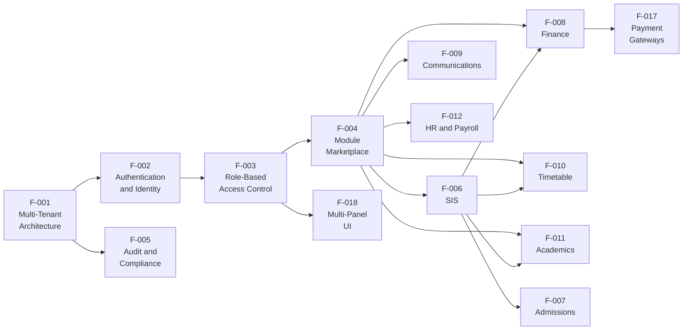

Every domain module operation traverses this dependency chain at runtime. For example, a payment recording flow (F-008) requires: tenant isolation (F-001), authenticated session (F-002), `finance:write` permission check (F-003), finance module installation verification (F-004), student entity reference resolution (F-006), and payment gateway dispatch (F-017). Each step in this chain represents an authorization checkpoint or data dependency that the `requireTenantContext` pipeline and `useModules` hook enforce.

---

## 4.2 AUTHENTICATION AND SESSION MANAGEMENT

### 4.2.1 Magic Link Authentication Flow

The authentication flow implements passwordless email-based login via WorkOS AuthKit, as specified in F-002-RQ-001. The complete flow spans four route handlers and the external WorkOS service.

```mermaid
flowchart TD
    Start([User Visits<br/>Login Page]) --> RenderForm[Render LoginForm<br/>Email Input Field]
    RenderForm --> EnterEmail[User Enters Email<br/>Placeholder: you at school.ac.ke]
    EnterEmail --> SubmitForm[Form POST to<br/>/auth/login/api]

    subgraph ServerURLGen["Server: URL Generation (login/api/route.ts)"]
        SubmitForm --> ValidatePayload{Email Payload<br/>Present?}
        ValidatePayload -->|No| Return400[Return 400<br/>Missing Email]
        ValidatePayload -->|Yes| ReadEnv[Read WORKOS_API_KEY<br/>NEXT_PUBLIC_WORKOS_CLIENT_ID]
        ReadEnv --> BuildURL[Build WorkOS Authorize URL<br/>provider=authkit<br/>response_type=code<br/>login_hint=email]
        BuildURL --> ReturnURL[Return JSON<br/>authUrl]
    end

    ReturnURL --> ClientRedirect[Client Redirects<br/>to WorkOS]

    subgraph WorkOSFlow["External: WorkOS Service"]
        ClientRedirect --> WorkOSSend[WorkOS Sends<br/>Magic Link Email]
        WorkOSSend --> UserClick[User Clicks<br/>Magic Link]
        UserClick --> WorkOSRedirect[WorkOS Redirects to<br/>/auth/callback?code=xxx]
    end

    subgraph CallbackHandler["Server: Callback Processing (callback/route.ts)"]
        WorkOSRedirect --> CheckCode{Authorization<br/>Code Present?}
        CheckCode -->|No| ErrMissing[Redirect with<br/>error=missing_code]
        CheckCode -->|Yes| CheckConfig{WorkOS Config<br/>Valid?}
        CheckConfig -->|No| ErrConfig[Redirect with<br/>error=config_error]
        CheckConfig -->|Yes| ExchangeCode[POST to WorkOS<br/>/sso/token<br/>grant_type=authorization_code]
        ExchangeCode --> TokenOK{Exchange<br/>Successful?}
        TokenOK -->|No| ErrToken[Redirect with<br/>error=token_exchange_failed]
        TokenOK -->|Yes| ProfileOK{Profile<br/>Exists?}
        ProfileOK -->|No| ErrProfile[Redirect with<br/>error=no_profile]
        ProfileOK -->|Yes| ResolveTenant[Begin Tenant<br/>Resolution]
    end

    subgraph TenantResolveFlow["Tenant Resolution (3-Step Fallback)"]
        ResolveTenant --> HasOrgId{Has<br/>organization_id?}
        HasOrgId -->|Yes| LookupOrg[Query organizations<br/>by Subdomain]
        HasOrgId -->|No| LookupEmail[Query by Email<br/>Domain Prefix]
        LookupOrg --> TenantFound{Tenant<br/>Found?}
        LookupEmail --> TenantFound
        TenantFound -->|Yes| UseExisting[Use Existing<br/>Tenant ID]
        TenantFound -->|No| GenTemp[Generate Temporary<br/>TENANT-random6digits]
        UseExisting --> ResolveRole[Resolve User Role]
        GenTemp --> ResolveRole
    end

    subgraph SessionSetup["Session Creation"]
        ResolveRole --> LookupUser[Query users by<br/>workosUserId]
        LookupUser --> HasUser{Existing<br/>User?}
        HasUser -->|Yes| UseRole[Use Existing Role]
        HasUser -->|No| DefaultRole[Default to<br/>school_admin]
        UseRole --> GenToken[Generate 64-char<br/>Random Token]
        DefaultRole --> GenToken
        GenToken --> StoreSession[Store in sessions table<br/>30-Day Expiry]
        StoreSession --> WriteCookies[Set Cookies:<br/>edumyles_session httpOnly<br/>edumyles_role non-httpOnly]
        WriteCookies --> DashRedirect[Redirect to<br/>Role Dashboard]
    end

    DashRedirect --> Done([Authenticated<br/>Session Active])
```

**Timing Constraints:**
- Session token expiry: 30 days from creation (configurable via `expiresAt` field in `sessions` table)
- Cookie attributes: `httpOnly` (session token), `secure` (production only), `sameSite=lax`, `maxAge=30 days`
- The `edumyles_role` cookie is intentionally non-httpOnly to allow middleware access for role-based routing decisions

**Validation Rules at Each Step:**
- Email payload validation occurs at the `/auth/login/api` route handler
- WorkOS environment variable validation (`WORKOS_API_KEY`, `NEXT_PUBLIC_WORKOS_CLIENT_ID`) occurs at callback entry
- Token exchange validates the HTTP response status from WorkOS `/sso/token` endpoint
- Profile existence is verified before tenant resolution begins

### 4.2.2 Route Protection Middleware Flow

The Next.js middleware (`frontend/middleware.ts`) intercepts every navigation request to enforce session validation and tenant context injection, implementing the access control requirements of F-002-RQ-003 and F-018-RQ-001.

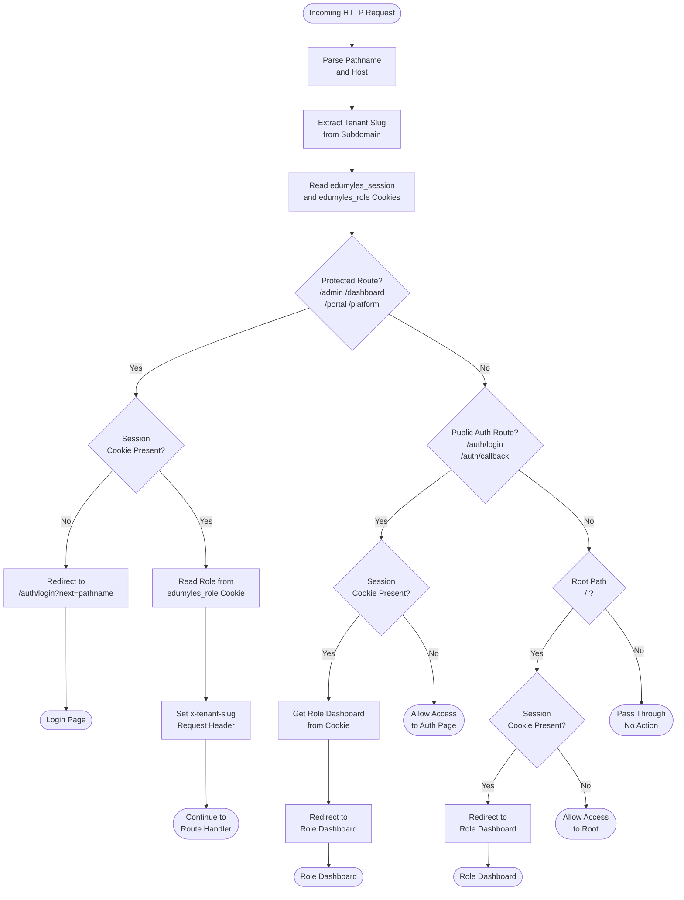

**Subdomain Resolution Logic:**
The middleware extracts the tenant slug from the request `Host` header by splitting on `.` and filtering out `www` and `app` prefixes. For example, `hillcrest.edumyles.com` resolves to slug `hillcrest`. This slug is injected as the `x-tenant-slug` header for downstream consumption by server components and API routes.

**Matched Routes:**
The middleware matcher configuration covers all application routes: `/`, `/admin/*`, `/dashboard/*`, `/portal/*`, `/platform/*`, and `/auth/*`. Static assets and API routes outside these patterns bypass middleware processing entirely.

### 4.2.3 Tenant Context Authorization Pipeline

Every Convex backend operation passes through the `requireTenantContext` pipeline (`backend/helpers/requireTenantContext.ts`), which implements a sequential validation cascade. This is the backend enforcement mechanism for F-001-RQ-003 (tenant data isolation) and F-003-RQ-001 (role-based access enforcement).

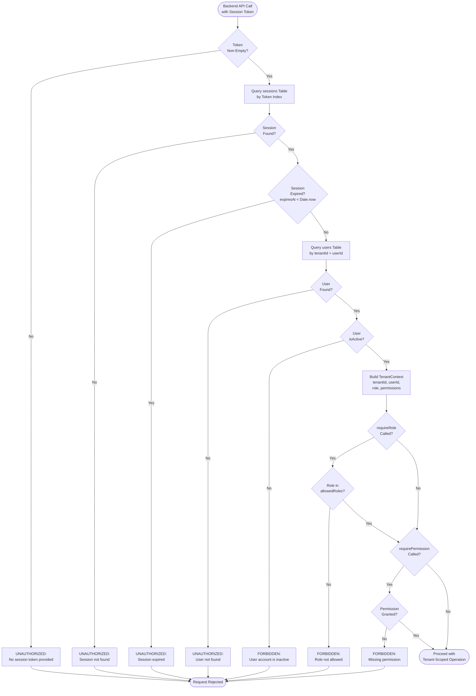

**Authorization Checkpoint Details:**

| Step | Validation | Error Code | Error Message |
|------|-----------|-----------|--------------|
| 1 | Token presence | `UNAUTHORIZED` | No session token provided |
| 2 | Session lookup | `UNAUTHORIZED` | Session not found |
| 3 | Expiry check | `UNAUTHORIZED` | Session expired |
| 4 | User lookup | `UNAUTHORIZED` | User not found |
| 5 | Active status | `FORBIDDEN` | User account is inactive |
| 6 | Role guard | `FORBIDDEN` | Role not allowed |
| 7 | Permission guard | `FORBIDDEN` | Missing permission |

The returned `TenantContext` object (`{ tenantId, userId, role, permissions }`) is then used by all downstream Convex queries and mutations to scope database operations to the authenticated tenant. This ensures zero cross-tenant data access at the query layer, as every database index begins with `tenantId`.

### 4.2.4 Logout and Session Termination Flow

The logout flow (`frontend/src/app/auth/logout/route.ts`) provides clean session termination with server-side session invalidation.

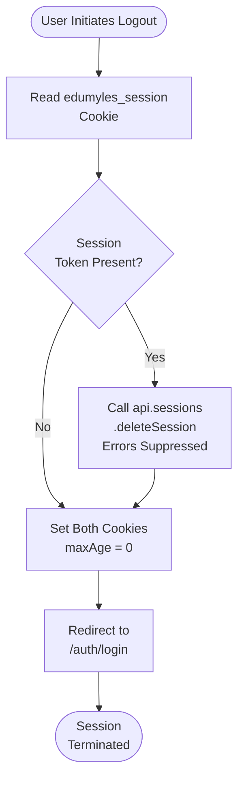

The logout handler suppresses errors from the `deleteSession` call to ensure cookie cleanup always completes, even if the backend session record is already expired or deleted. Both `edumyles_session` and `edumyles_role` cookies are cleared by setting `maxAge=0`.

---

## 4.3 TENANT AND MODULE MANAGEMENT

### 4.3.1 Tenant Provisioning and Lifecycle Flow

Platform administrators provision new school tenants through a validated creation workflow that establishes the foundational data structures. This flow implements F-001-RQ-001 (tenant provisioning) and F-001-RQ-004 (lifecycle state management).

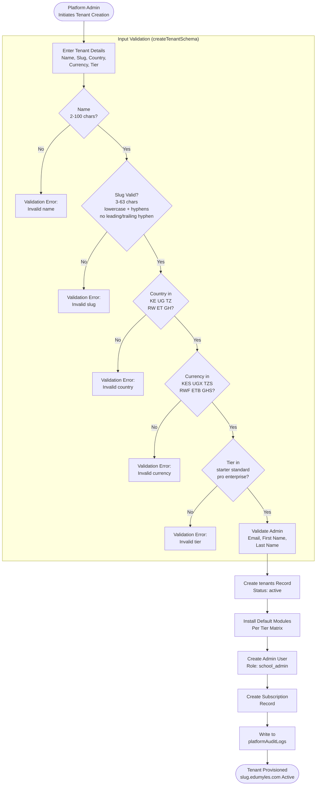

**Tier-Module Matrix (from `shared/src/constants/index.ts`):**

| Tier | Default Modules (Auto-Installed) | Module Count |
|------|--------------------------------|-------------|
| Starter | sis, admissions, finance, communications | 4 |
| Standard | + timetable, academics | 6 |
| Pro | + hr, library, transport | 9 |
| Enterprise | + ewallet, ecommerce | 11 |

### 4.3.2 Module Marketplace Installation Flow

The module marketplace manages dynamic feature activation per tenant through a three-table workflow: `moduleRegistry` (catalog), `moduleRequests` (approval queue), and `installedModules` (active installations). This implements F-004-RQ-002 and F-004-RQ-003.

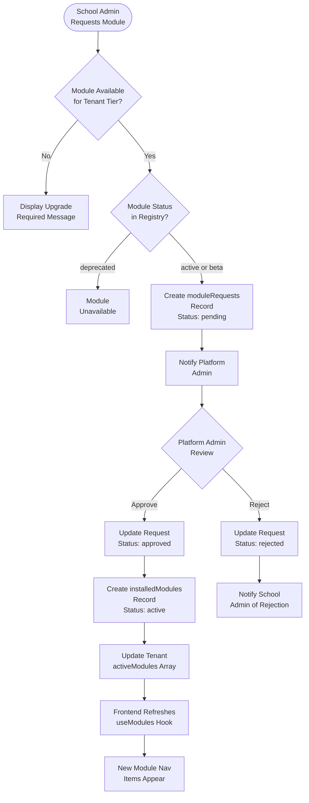

**Client-Side Module Gating (`useModules` hook in `frontend/src/hooks/useModules.ts`):**
The `useModules` hook exposes two key predicates that control UI visibility:
- `isInstalled(moduleId)` — Checks if the module exists in the tenant's `installedModules` array
- `isAvailableForTier(moduleId)` — Validates against the `TIER_MODULES` constant matrix

Admin navigation items in `frontend/src/lib/routes.ts` are tagged with a `module` property (e.g., `module: "sis"`, `module: "finance"`), and items for uninstalled modules are dynamically filtered from the sidebar.

### 4.3.3 Subscription Tier Gating Decision Flow

The following decision flow illustrates how the platform determines module accessibility at the intersection of subscription tier, module registry status, and tenant installation state.

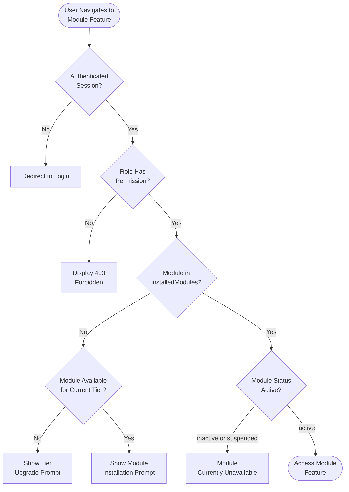

---

## 4.4 CORE DOMAIN PROCESS FLOWS

### 4.4.1 Admissions Pipeline (7-Stage Workflow)

The admissions workflow implements a structured 7-stage pipeline as defined in the `admissionApplications` table (`backend/convex/schema.ts`), fulfilling F-007-RQ-002. The terminal state `enrolled` triggers creation of a student record in the SIS module, establishing the lifecycle connection between Admissions (F-007) and Student Information (F-006).

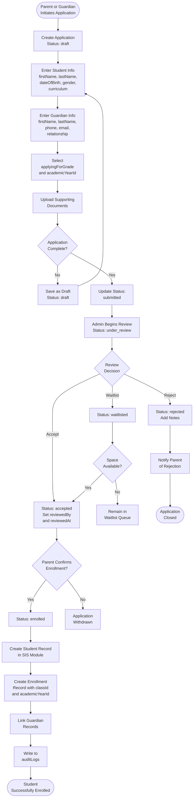

**Application Data Structure:**
Each application record in the `admissionApplications` table stores: `applicationId` (unique), `studentInfo` (firstName, lastName, dateOfBirth, gender, curriculum), `guardianInfo` (firstName, lastName, phone, email, relationship), `applyingForGrade`, `academicYearId`, `documents` array, `notes`, `reviewedBy`, and `reviewedAt`. All records are tenant-scoped with `by_tenant` and `by_tenant_status` indexes.

**Regulatory Compliance:** Every status transition is captured in the `auditLogs` table with before/after state snapshots, supporting the 7-year retention policy (F-005-RQ-003). The `reviewedBy` and `reviewedAt` fields provide accountability for admissions decisions.

### 4.4.2 Finance and Fee Management Lifecycle

The finance workflow spans the complete fee lifecycle from structure definition through payment reconciliation, implementing F-008-RQ-001 through F-008-RQ-004. This is the platform's most complex business process, touching five schema tables and three external payment gateways.

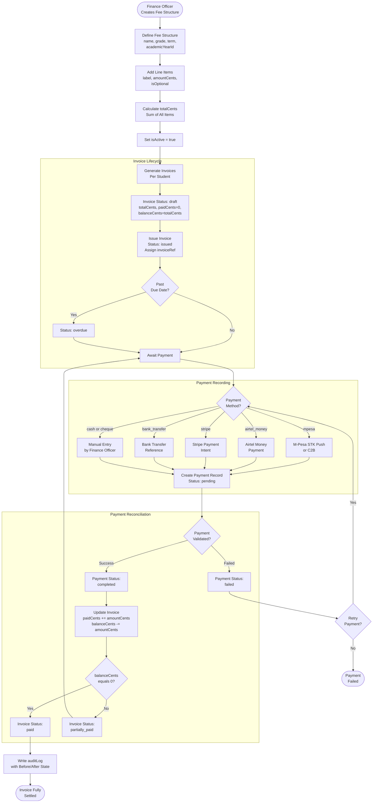

**Financial Integrity Rules (enforced at every step):**

| Rule | Implementation | Reference |
|------|---------------|-----------|
| Integer-only storage | All amounts in smallest currency unit (cents/pesa) | `shared/src/types/index.ts` |
| Balance invariant | `balanceCents = totalCents - paidCents` | `backend/convex/schema.ts` |
| Positive amount | `createPaymentSchema` enforces `amount > 0` | `shared/src/validators/index.ts` |
| Currency validation | 3-letter ISO code required | `shared/src/validators/index.ts` |
| Method validation | One of 6 enum values: mpesa, airtel_money, stripe, bank_transfer, cash, cheque | `shared/src/types/index.ts` |
| Idempotent webhooks | `paymentCallbacks.processed` flag prevents duplicate processing | `backend/convex/schema.ts` |

### 4.4.3 Academics and Assessment Workflow

The academics domain encompasses grade recording, assignment management, attendance tracking, and report card generation across six schema tables. This implements F-011-RQ-001 through F-011-RQ-005.

```mermaid
flowchart TD
    subgraph AcademicSetup["Academic Year Setup"]
        SetupStart([Admin Creates<br/>Academic Year]) --> DefineYear[Define Academic Year<br/>name, startDate, endDate]
        DefineYear --> AddTerms[Add Terms Array<br/>name, type, startDate,<br/>endDate, isCurrent]
        AddTerms --> SetCurrent[Set isCurrent = true<br/>for Active Year]
    end

    subgraph AssignmentFlow["Assignment Lifecycle"]
        TeacherCreate([Teacher Creates<br/>Assignment]) --> DefineAssignment[Set classId, subjectId,<br/>title, dueDate, maxMarks]
        DefineAssignment --> AttachFiles[Add Attachments]
        AttachFiles --> PublishAssignment[Publish to<br/>Student Portal]
        PublishAssignment --> StudentSubmits[Student Creates<br/>Submission]
        StudentSubmits --> CheckLate{Past<br/>Due Date?}
        CheckLate -->|Yes| MarkLate[Status: late]
        CheckLate -->|No| MarkSubmitted[Status: submitted]
        MarkLate --> TeacherGrades[Teacher Grades<br/>Submission]
        MarkSubmitted --> TeacherGrades
        TeacherGrades --> RecordMarks[Record marks,<br/>feedback, gradedBy,<br/>gradedAt]
        RecordMarks --> SetGraded[Status: graded]
    end

    subgraph GradeRecording["Grade Recording"]
        RecordGrade([Teacher Records<br/>Grade]) --> EnterScore[Enter score, maxScore,<br/>curriculum code,<br/>assessmentType]
        EnterScore --> ValidateCurriculum{Curriculum in<br/>7 Supported Codes?}
        ValidateCurriculum -->|Yes| SaveGrade[Save to grades Table<br/>with studentId, classId,<br/>subjectId, term]
        ValidateCurriculum -->|No| CurrError[Validation Error]
    end

    subgraph AttendanceFlow["Attendance Tracking"]
        TakeAttendance([Teacher Takes<br/>Attendance]) --> SelectClass[Select Class<br/>and Date]
        SelectClass --> MarkStudents[Mark Each Student<br/>present / absent /<br/>late / excused]
        MarkStudents --> AddNotes[Add Optional Notes]
        AddNotes --> SaveAttendance[Save to<br/>attendanceRecords<br/>with recordedBy]
    end

    subgraph ReportGeneration["Report Card Generation"]
        GenerateReport([Admin Initiates<br/>Report Cards]) --> AggregateGrades[Aggregate Grades<br/>per Student per Subject]
        AggregateGrades --> AggregateAttendance[Calculate Attendance<br/>present, absent,<br/>late counts]
        AggregateAttendance --> DraftReport[Create reportCard<br/>Status: draft]
        DraftReport --> TeacherRemarks[Teacher Adds<br/>Remarks]
        TeacherRemarks --> PrincipalRemarks[Principal Adds<br/>Remarks]
        PrincipalRemarks --> PublishReport{Approve for<br/>Publication?}
        PublishReport -->|Yes| SetPublished[Status: published<br/>Visible to Parents]
        PublishReport -->|No| ReviseReport[Return to Draft<br/>for Revisions]
        ReviseReport --> TeacherRemarks
    end
```

**Supported Curriculum Codes (from `shared/src/constants/index.ts`):**
The `grades` table includes a `curriculum` field supporting all seven curriculum frameworks: `KE-CBC` (Kenya CBC), `KE-8-4-4` (Kenya 8-4-4), `UG-UNEB` (Uganda), `TZ-NECTA` (Tanzania), `RW-REB` (Rwanda), `ET-MOE` (Ethiopia), and `GH-WAEC` (Ghana). This enables schools transitioning between systems (e.g., Kenya's 8-4-4 to CBC) to manage both simultaneously.

**Offline Capability (Planned):** Attendance and Gradebook modules are designated for full offline read/write with bidirectional sync on reconnection, targeting the mobile workspace (Expo 52) for 3G-constrained environments as documented in Section 2.4.2.

### 4.4.4 Communication and Notification Delivery Flow

The communication system provides multi-channel notification delivery through four channels (in_app, sms, email, push) and supports both targeted notifications and broadcast announcements. This implements F-009.

```mermaid
flowchart TD
    Trigger([System Event or<br/>Admin Action]) --> EventType{Event<br/>Type?}

    EventType -->|Targeted| CreateNotif[Create Notification<br/>userId, type, title,<br/>content]
    EventType -->|Broadcast| CreateAnnounce[Create Announcement<br/>title, body, audience]

    CreateNotif --> SelectChannel{Delivery<br/>Channel?}
    SelectChannel -->|in_app| InApp[Store in notifications<br/>Status: sent]
    SelectChannel -->|sms| SMSQueue[Queue SMS via<br/>Africas Talking API]
    SelectChannel -->|email| EmailQueue[Queue Email via<br/>Resend API]
    SelectChannel -->|push| PushQueue[Queue Push<br/>Notification]

    SMSQueue --> SMSResult{SMS<br/>Delivered?}
    SMSResult -->|Yes| SMSSent[Status: sent]
    SMSResult -->|No| SMSFailed[Status: failed]

    EmailQueue --> EmailResult{Email<br/>Delivered?}
    EmailResult -->|Yes| EmailSent[Status: sent]
    EmailResult -->|No| EmailFailed[Status: failed]

    InApp --> UserReads[User Reads<br/>Notification]
    UserReads --> MarkRead[Status: read<br/>via markAsRead]

    CreateAnnounce --> SetSchedule{Scheduled<br/>Delivery?}
    SetSchedule -->|Yes| ScheduleAnnounce[Status: scheduled<br/>Set scheduledFor Time]
    SetSchedule -->|No| SendImmediate[Status: sent<br/>Deliver to Audience]
    ScheduleAnnounce --> WaitTime[Wait Until<br/>scheduledFor Time]
    WaitTime --> SendImmediate
    SendImmediate --> MultiChannel[Deliver Across<br/>Selected Channels Array]
```

**Client-Side Notification Handling:**
The `useNotifications` hook (`frontend/src/hooks/useNotifications.ts`) queries notifications with a limit of 20 and exposes `markAsRead` and `markAllAsRead` mutation handlers. The notification badge in the UI AppShell reflects the unread count in real-time through Convex subscriptions.

---

## 4.5 INTEGRATION WORKFLOWS

### 4.5.1 Payment Gateway Integration Sequences

EduMyles integrates three payment gateways, each with distinct interaction patterns. All three converge on the `paymentCallbacks` table for unified callback processing. These sequences implement F-017-RQ-001 through F-017-RQ-004.

#### M-Pesa Daraja API — STK Push Flow

```mermaid
sequenceDiagram
    participant Parent as Parent
    participant FE as Frontend<br/>Next.js
    participant BE as Backend<br/>Convex
    participant MP as M-Pesa<br/>Daraja API
    participant Phone as Parent Phone

    Parent->>FE: Initiate Fee Payment<br/>(amount, invoiceRef)
    FE->>BE: Create Payment Record<br/>(status: pending, method: mpesa)
    BE->>BE: Validate createPaymentSchema<br/>(positive amount, KES currency)
    BE->>MP: STK Push Request<br/>(shortcode, passkey, phone, amount)
    MP->>Phone: Display M-Pesa PIN Prompt
    Phone->>MP: Parent Enters PIN
    MP-->>BE: Callback to MPESA_CALLBACK_URL<br/>(success or failure payload)
    BE->>BE: Store in paymentCallbacks<br/>(provider: mpesa, processed: false)
    BE->>BE: Process Callback<br/>(update payment status)
    BE->>BE: Set processed = true<br/>(idempotent guard)
    BE->>BE: Update Invoice<br/>(paidCents, balanceCents)
    BE-->>FE: Real-time Subscription Update
    FE-->>Parent: Display Payment Confirmation
```

#### Airtel Money — OAuth Payment Flow

```mermaid
sequenceDiagram
    participant Parent as Parent
    participant BE as Backend<br/>Convex
    participant AM as Airtel Money<br/>API

    Parent->>BE: Initiate Airtel Payment<br/>(amount, phone)
    BE->>AM: OAuth Token Request<br/>(client_id, client_secret)
    AM-->>BE: Access Token
    BE->>AM: Payment Request<br/>(token, amount, phone)
    AM-->>BE: Payment Initiated<br/>(transaction ref)
    Note over AM,Parent: Parent confirms on phone
    AM->>BE: Webhook Callback<br/>to AIRTEL_CALLBACK_URL
    BE->>BE: Store in paymentCallbacks<br/>(provider: airtel_money)
    BE->>BE: Process and Reconcile
```

#### Stripe — Payment Intents Flow

```mermaid
sequenceDiagram
    participant Parent as Parent
    participant FE as Frontend<br/>Next.js
    participant BE as Backend<br/>Convex
    participant ST as Stripe API

    Parent->>FE: Select Card Payment
    FE->>BE: Request Checkout Session
    BE->>ST: Create Payment Intent<br/>(amount, currency)
    ST-->>BE: Client Secret
    BE-->>FE: Checkout Session URL
    FE->>Parent: Redirect to Stripe<br/>Hosted Checkout
    Parent->>ST: Enter Card Details<br/>(PCI-compliant)
    ST->>BE: Webhook Event<br/>(verified with STRIPE_WEBHOOK_SECRET)
    BE->>BE: Store in paymentCallbacks<br/>(provider: stripe)
    BE->>BE: Update Payment and Invoice
    BE-->>FE: Real-time Update
    FE-->>Parent: Payment Confirmed
```

### 4.5.2 Webhook Callback Processing Flow

All payment provider callbacks converge on a unified processing pipeline that ensures idempotent handling, preventing duplicate payment records from redundant webhook deliveries. This implements F-017-RQ-004.

```mermaid
flowchart TD
    WebhookIn([Incoming Webhook<br/>from Provider]) --> IdentifyProvider{Provider<br/>Type?}

    IdentifyProvider -->|mpesa| MPesaParse[Parse M-Pesa<br/>Callback Payload]
    IdentifyProvider -->|airtel_money| AirtelParse[Parse Airtel<br/>Callback Payload]
    IdentifyProvider -->|stripe| StripeVerify[Verify Stripe<br/>Webhook Signature]

    MPesaParse --> StoreCallback[Store in paymentCallbacks<br/>provider, payload,<br/>processed=false]
    AirtelParse --> StoreCallback
    StripeVerify --> SigValid{Signature<br/>Valid?}
    SigValid -->|No| RejectWebhook[Reject Webhook<br/>Store Error]
    SigValid -->|Yes| StoreCallback

    StoreCallback --> CheckDuplicate{Already<br/>Processed?<br/>processed=true}
    CheckDuplicate -->|Yes| SkipDuplicate[Skip Processing<br/>Return 200 OK]
    CheckDuplicate -->|No| ExtractPayment[Extract Payment<br/>Details from Payload]

    ExtractPayment --> LookupInvoice[Lookup Invoice by<br/>Reference]
    LookupInvoice --> InvoiceFound{Invoice<br/>Found?}
    InvoiceFound -->|No| LogError[Store Error in<br/>paymentCallbacks.error]
    InvoiceFound -->|Yes| UpdatePayment[Update Payment Record<br/>Status: completed]
    UpdatePayment --> UpdateInvoice[Recalculate Invoice<br/>paidCents and balanceCents]
    UpdateInvoice --> SetProcessed[Set processed = true]
    SetProcessed --> WriteAudit[Write Audit Log<br/>with Before/After State]
    WriteAudit --> ReturnOK([Return 200 OK<br/>to Provider])

    SkipDuplicate --> ReturnOKDup([Return 200 OK])
    LogError --> ReturnErr([Return Error<br/>for Retry])
```

**Idempotency Guarantee:**
The `processed` boolean flag on each `paymentCallbacks` record serves as the idempotency key. Before processing any callback payload, the system checks whether a record with matching provider and transaction reference already has `processed=true`. This prevents duplicate payment records even when providers retry webhook delivery (as is common with M-Pesa Daraja API). Raw payloads are preserved in all cases for debugging and manual reconciliation.

### 4.5.3 WorkOS Authentication Integration Sequence

The following sequence diagram details the interaction between the EduMyles frontend, backend, and WorkOS during the magic link authentication flow.

```mermaid
sequenceDiagram
    participant User as User Browser
    participant FE as Frontend<br/>Next.js
    participant API as Auth Route<br/>Handlers
    participant WO as WorkOS<br/>API
    participant DB as Convex<br/>Database

    User->>FE: Navigate to /auth/login
    FE->>User: Render LoginForm

    User->>API: POST /auth/login/api<br/>(email payload)
    API->>API: Validate email presence
    API->>API: Build WorkOS authorize URL<br/>(client_id, redirect_uri, provider=authkit)
    API-->>User: Return JSON authUrl

    User->>WO: Redirect to authorize URL
    WO->>User: Send Magic Link Email
    User->>WO: Click Magic Link
    WO-->>User: Redirect to /auth/callback?code=xxx

    User->>API: GET /auth/callback?code=xxx
    API->>WO: POST /sso/token<br/>(grant_type=authorization_code, code)
    WO-->>API: User Profile + Token

    API->>DB: Query organizations<br/>(by subdomain or email domain)
    DB-->>API: Tenant ID (or generate temp)

    API->>DB: Query users<br/>(by workosUserId)
    DB-->>API: User record and role

    API->>DB: Create session<br/>(64-char token, 30-day expiry)
    DB-->>API: Session stored

    API->>User: Set cookies + Redirect<br/>to role dashboard
```

---

## 4.6 STATE TRANSITION DIAGRAMS

This section documents all entity state machines as defined in the schema (`backend/convex/schema.ts`) and type system (`shared/src/types/index.ts`). Every transition generates an audit log entry with before/after state snapshots.

### 4.6.1 Platform Entity States

#### Tenant Lifecycle States

```mermaid
stateDiagram-v2
    [*] --> active : Tenant Provisioned
    active --> suspended : Admin Suspends
    active --> churned : Non-Renewal
    suspended --> active : Admin Reactivates
    suspended --> churned : Extended Inactivity
    trial --> active : Subscription Confirmed
    trial --> churned : Trial Expired
    [*] --> trial : Trial Signup
    churned --> [*] : Data Archived
```

#### Subscription Billing States

```mermaid
stateDiagram-v2
    [*] --> active : Subscription Created
    active --> past_due : Payment Failed
    active --> cancelled : Admin Cancels
    past_due --> active : Payment Recovered
    past_due --> cancelled : Grace Period Expired
    cancelled --> [*] : Subscription Terminated
```

#### Platform Invoice States

```mermaid
stateDiagram-v2
    [*] --> draft : Invoice Created
    draft --> sent : Invoice Issued
    sent --> paid : Payment Received
    sent --> overdue : Past Due Date
    overdue --> paid : Late Payment
    draft --> void : Invoice Cancelled
    sent --> void : Invoice Cancelled
    paid --> [*] : Settled
    void --> [*] : Closed
```

### 4.6.2 Student Lifecycle States

#### Student Status Transitions

```mermaid
stateDiagram-v2
    [*] --> active : Enrolled via Admissions
    active --> graduated : Completed Final Grade
    active --> transferred : Transfer to Other School
    active --> suspended : Disciplinary Action
    active --> expelled : Permanent Removal
    suspended --> active : Suspension Lifted
    graduated --> [*] : Record Archived
    transferred --> [*] : Record Archived
    expelled --> [*] : Record Archived
```

#### Enrollment Status Transitions

```mermaid
stateDiagram-v2
    [*] --> active : Student Enrolled in Class
    active --> transferred : Class Transfer
    active --> completed : Term/Year Completed
    active --> withdrawn : Student Withdrawn
    transferred --> active : Enrolled in New Class
    completed --> [*] : Enrollment Closed
    withdrawn --> [*] : Enrollment Closed
```

#### Admission Application Pipeline States

```mermaid
stateDiagram-v2
    [*] --> draft : Application Started
    draft --> submitted : Parent Submits
    submitted --> under_review : Admin Opens Review
    under_review --> accepted : Application Approved
    under_review --> rejected : Application Denied
    under_review --> waitlisted : Added to Waitlist
    waitlisted --> accepted : Space Available
    accepted --> enrolled : Enrollment Confirmed
    enrolled --> [*] : Student Record Created in SIS
    rejected --> [*] : Application Closed
```

### 4.6.3 Financial Entity States

#### Invoice Status Transitions

```mermaid
stateDiagram-v2
    [*] --> draft : Invoice Generated
    draft --> issued : Invoice Sent to Parent
    issued --> partially_paid : Partial Payment Received
    issued --> paid : Full Payment Received
    issued --> overdue : Past Due Date
    partially_paid --> paid : Remaining Balance Paid
    partially_paid --> overdue : Past Due Date
    overdue --> partially_paid : Late Partial Payment
    overdue --> paid : Late Full Payment
    draft --> waived : Fee Waived
    draft --> void : Invoice Cancelled
    issued --> void : Invoice Cancelled
    paid --> [*] : Settled
    waived --> [*] : Closed
    void --> [*] : Closed
```

#### Payment Status Transitions

```mermaid
stateDiagram-v2
    [*] --> pending : Payment Initiated
    pending --> completed : Callback Success
    pending --> failed : Callback Failure
    completed --> refunded : Refund Processed
    pending --> cancelled : User Cancels
    failed --> [*] : Closed
    refunded --> [*] : Closed
    cancelled --> [*] : Closed
    completed --> [*] : Settled
```

### 4.6.4 Academic and Operational Entity States

#### Assignment Submission States

```mermaid
stateDiagram-v2
    [*] --> submitted : Student Submits On Time
    [*] --> late : Student Submits After Due Date
    [*] --> missing : Due Date Passed, No Submission
    submitted --> graded : Teacher Grades
    late --> graded : Teacher Grades
    graded --> [*] : Assessment Complete
    missing --> [*] : Zero Recorded
```

#### Report Card States

```mermaid
stateDiagram-v2
    [*] --> draft : Report Generated
    draft --> published : Admin Approves
    published --> draft : Revisions Required
    published --> [*] : Visible to Parents
```

#### Staff Employment States

```mermaid
stateDiagram-v2
    [*] --> active : Staff Hired
    active --> on_leave : Leave Approved
    active --> terminated : Contract Ended
    active --> resigned : Staff Resigns
    on_leave --> active : Return from Leave
    terminated --> [*] : Record Archived
    resigned --> [*] : Record Archived
```

#### Module Lifecycle States

```mermaid
stateDiagram-v2
    state "Module Registry" as Registry {
        [*] --> reg_active : Module Published
        reg_active --> beta : Beta Testing
        beta --> reg_active : Promoted to Active
        reg_active --> deprecated : End of Life
        beta --> deprecated : Beta Cancelled
    }

    state "Installed Module" as Installed {
        [*] --> inst_active : Module Installed
        inst_active --> inactive : Admin Deactivates
        inst_active --> inst_suspended : Platform Suspends
        inactive --> inst_active : Admin Reactivates
        inst_suspended --> inst_active : Platform Restores
    }

    state "Module Request" as Request {
        [*] --> req_pending : Request Submitted
        req_pending --> approved : Platform Approves
        req_pending --> rejected : Platform Denies
    }
```

#### Notification and Announcement States

```mermaid
stateDiagram-v2
    state "Notification" as Notif {
        [*] --> notif_pending : Notification Created
        notif_pending --> sent : Delivery Successful
        notif_pending --> notif_failed : Delivery Failed
        sent --> read : User Opens
    }

    state "Announcement" as Announce {
        [*] --> ann_draft : Announcement Created
        ann_draft --> scheduled : Publish Scheduled
        ann_draft --> ann_sent : Published Immediately
        scheduled --> ann_sent : Scheduled Time Reached
    }
```

---

## 4.7 ERROR HANDLING AND RECOVERY FLOWS

### 4.7.1 Authentication Error Handling Flow

The authentication callback handler (`frontend/src/app/auth/callback/route.ts`) implements a comprehensive error cascade with distinct error codes for each failure mode. Every error redirects the user to the login page with a query parameter indicating the specific failure.

```mermaid
flowchart TD
    CallbackEntry([Callback Request<br/>/auth/callback]) --> E1{Code<br/>Parameter<br/>Present?}

    E1 -->|No| Err1[Redirect to<br/>?error=missing_code]
    E1 -->|Yes| E2{WorkOS<br/>Config<br/>Valid?}

    E2 -->|No| Err2[Redirect to<br/>?error=config_error]
    E2 -->|Yes| E3{Token<br/>Exchange<br/>Successful?}

    E3 -->|No| Err3[Redirect to<br/>?error=token_exchange_failed]
    E3 -->|Yes| E4{User<br/>Profile<br/>Exists?}

    E4 -->|No| Err4[Redirect to<br/>?error=no_profile]
    E4 -->|Yes| E5{Tenant and<br/>Session Created<br/>Successfully?}

    E5 -->|No| Err5[Redirect to<br/>?error=callback_failed]
    E5 -->|Yes| Success([Redirect to<br/>Role Dashboard])

    Err1 --> LoginPage([Login Page<br/>with Error Display])
    Err2 --> LoginPage
    Err3 --> LoginPage
    Err4 --> LoginPage
    Err5 --> LoginPage
```

**Error Classification:**

| Error Code | Cause | Recovery Action |
|------------|-------|-----------------|
| `missing_code` | No authorization code in callback URL | User must restart login flow |
| `config_error` | Missing `WORKOS_API_KEY` or `NEXT_PUBLIC_WORKOS_CLIENT_ID` | DevOps must verify environment variables |
| `token_exchange_failed` | WorkOS `/sso/token` endpoint returned non-OK response | Retry login; check WorkOS service status |
| `no_profile` | Token exchange succeeded but no user profile returned | Contact WorkOS support; verify account configuration |
| `callback_failed` | Catch-all for unexpected exceptions in callback processing | Check server logs; retry login |

### 4.7.2 Backend Authorization Error Cascade

The `requireTenantContext` pipeline produces a deterministic sequence of error checks that enables precise diagnosis of authorization failures. Each error is thrown with a specific HTTP-equivalent status code.

```mermaid
flowchart LR
    subgraph ErrorCascade["Authorization Error Cascade"]
        Step1[Token<br/>Validation] -->|Pass| Step2[Session<br/>Lookup]
        Step2 -->|Pass| Step3[Expiry<br/>Check]
        Step3 -->|Pass| Step4[User<br/>Lookup]
        Step4 -->|Pass| Step5[Active<br/>Status]
        Step5 -->|Pass| Step6[Role<br/>Guard]
        Step6 -->|Pass| Step7[Permission<br/>Guard]
    end

    Step1 -->|Fail| E1[401: No session<br/>token provided]
    Step2 -->|Fail| E2[401: Session<br/>not found]
    Step3 -->|Fail| E3[401: Session<br/>expired]
    Step4 -->|Fail| E4[401: User<br/>not found]
    Step5 -->|Fail| E5[403: User account<br/>is inactive]
    Step6 -->|Fail| E6[403: Role<br/>not allowed]
    Step7 -->|Fail| E7[403: Missing<br/>permission]
    Step7 -->|Pass| OK([Operation<br/>Authorized])
```

The transition from `UNAUTHORIZED` (401) to `FORBIDDEN` (403) errors occurs at Step 5, marking the boundary between identity verification (Steps 1–4) and authorization enforcement (Steps 5–7). Client-side hooks (`useAuth`, `usePermissions`) mirror this cascade to provide pre-emptive UI-level access control, reducing unnecessary backend round-trips.

### 4.7.3 Payment Processing Error Recovery

Payment processing involves external gateway interactions where failures are expected and must be handled gracefully. The following flow documents the error handling and recovery procedures for payment webhook processing.

```mermaid
flowchart TD
    WebhookFail([Webhook Processing<br/>Failure]) --> ClassifyError{Error<br/>Type?}

    ClassifyError -->|Signature<br/>Invalid| SigFail[Log to paymentCallbacks<br/>error field]
    ClassifyError -->|Invoice Not<br/>Found| InvFail[Store Raw Payload<br/>for Manual Review]
    ClassifyError -->|Network<br/>Timeout| NetFail[Provider Will Retry<br/>Webhook Delivery]
    ClassifyError -->|Duplicate<br/>Callback| DupSkip[Skip Processing<br/>processed=true exists]

    SigFail --> ManualReview[Manual Review<br/>by Finance Team]
    InvFail --> ManualReview
    NetFail --> WaitRetry[Wait for Provider<br/>Retry Attempt]
    WaitRetry --> Reprocess[Reprocess on<br/>Next Delivery]

    DupSkip --> ReturnOK[Return 200 OK<br/>to Prevent Retries]

    ManualReview --> ReconcileManual{Manual<br/>Reconciliation<br/>Possible?}
    ReconcileManual -->|Yes| ProcessManual[Process Payment<br/>Manually]
    ReconcileManual -->|No| EscalateSupport[Escalate to<br/>Platform Support]

    ProcessManual --> UpdateRecords[Update Payment<br/>and Invoice Records]
    UpdateRecords --> AuditRecovery[Write Audit Log<br/>Manual Recovery Entry]
```

**Key Recovery Mechanisms:**

| Failure Mode | System Response | Recovery Path |
|-------------|----------------|---------------|
| Webhook signature invalid (Stripe) | Reject and log error | Manual review of raw payload |
| Duplicate webhook delivery | Skip via `processed` flag | Automatic; no action needed |
| Invoice reference not found | Store error in callback record | Manual matching by finance officer |
| Provider network timeout | Provider retries (configurable) | Automatic retry by gateway provider |
| Payment status: `failed` | Record failure; preserve payload | User can retry payment via different method |

---

## 4.8 CI/CD AND DEPLOYMENT WORKFLOW

### 4.8.1 Continuous Integration Pipeline

The CI pipeline (`.github/workflows/ci.yml`) automates code quality enforcement across the monorepo on every pull request and push to the develop branch. The pipeline uses a dependency-ordered job graph with parallel execution where possible.

```mermaid
flowchart TD
    Trigger([Pull Request to<br/>main/staging/develop<br/>OR Push to develop]) --> Setup[Checkout Code<br/>Setup Node.js 20<br/>npm ci]

    Setup --> LintJob[Lint and Type-Check Job]

    subgraph QualityGate["Code Quality Gate"]
        LintJob --> RunLint[npm run lint]
        RunLint --> RunTypeCheck[npm run type-check]
    end

    RunTypeCheck --> ParallelJobs[Parallel Job Execution]

    ParallelJobs --> TestJob[Test Suite Job]
    ParallelJobs --> TenantJob[Tenant Isolation Job]
    ParallelJobs --> SecurityJob[Security Audit Job]

    subgraph TestExecution["Test Execution"]
        TestJob --> RunTests[npm run test<br/>--coverage]
        RunTests --> UploadCoverage[Upload Coverage<br/>Artifacts<br/>7-Day Retention]
    end

    subgraph TenantTests["Tenant Isolation Verification"]
        TenantJob --> RunTenantTests[npm run<br/>test:tenant-isolation]
    end

    subgraph SecurityChecks["Security Scanning"]
        SecurityJob --> NpmAudit[npm audit<br/>--audit-level=high]
        NpmAudit --> TruffleHog[TruffleHog<br/>Secret Scanning]
    end
```

**Pipeline Timing and SLA:**
- Concurrency: Cancel-in-progress per branch to conserve runner minutes
- Coverage artifacts: Retained for 7 days
- Security audit: Blocks merge on high-severity vulnerabilities
- Secret scanning: Diff-based scan prevents credential leaks in new code

### 4.8.2 Preview and Production Deployment Flow

Deployment follows two distinct paths depending on the trigger event: preview deployments for pull requests and production deployments for merges to main.

```mermaid
flowchart TD
    subgraph PreviewPath["Preview Deployment (deploy-preview.yml)"]
        PROpen([PR Opened to<br/>main/staging]) --> PreviewSetup[Install Vercel CLI]
        PreviewSetup --> PreviewPull[vercel pull<br/>Preview Config]
        PreviewPull --> PreviewBuild[vercel build]
        PreviewBuild --> PreviewDeploy[vercel deploy]
        PreviewDeploy --> PostComment[Post Preview URL<br/>as PR Comment<br/>via github-script]
    end

    subgraph ProductionPath["Production Deployment (deploy-production.yml)"]
        MainPush([Push to main]) --> ProdSetup[Install Vercel CLI]
        ProdSetup --> ProdPull[vercel pull<br/>Production Config]
        ProdPull --> ProdBuild[vercel build --prod]
        ProdBuild --> ProdDeploy[vercel deploy<br/>--prebuilt --prod]
        ProdDeploy --> ConvexDeploy[npx convex deploy<br/>--cmd npm run build]
        ConvexDeploy --> ProdLive([Production Live<br/>Vercel + Convex])
    end

    subgraph PolicyChecks["PR Policy Enforcement"]
        PRPolicy([PR Created]) --> LinkCheck[pr-link-enforcer.yml<br/>Validate Issue Link<br/>in PR Body]
        PRPolicy --> BoardSync[project-board-sync.yml<br/>Sync GitHub Project<br/>Boards]
    end
```

**Production Deployment Sequence:**
Production deployments execute within the `production` GitHub environment and follow a strict order: Vercel web hosting deploys first (frontend), followed by Convex backend deployment. This ordering ensures the frontend never references Convex functions that do not yet exist in production. The Convex deploy uses `CONVEX_DEPLOY_KEY` for authentication and runs `npm run build` as a pre-deploy command to ensure the shared package is compiled.

**Security Headers Applied Post-Deployment:**
As configured in `vercel.json`, all deployed routes receive the following headers:
- `X-Content-Type-Options: nosniff` — Prevents MIME-type sniffing
- `X-Frame-Options: DENY` — Prevents clickjacking
- `X-XSS-Protection: 1; mode=block` — Enables XSS filtering
- `Referrer-Policy: strict-origin-when-cross-origin` — Controls referrer information
- `Permissions-Policy: camera=(), microphone=(), geolocation=()` — Restricts browser API access

---

## 4.9 AUDIT AND COMPLIANCE PROCESSING FLOW

### 4.9.1 Audit Log Generation Flow

Every mutation operation in the Convex backend generates an audit trail entry, implementing F-005-RQ-001 and F-005-RQ-002. The audit system operates at two levels: tenant-scoped (`auditLogs`) and platform-level (`platformAuditLogs`).

```mermaid
flowchart TD
    Mutation([Any Convex Mutation<br/>Create / Update / Delete]) --> CaptureState[Capture Before State<br/>Current Entity Snapshot]

    CaptureState --> ExecuteMutation[Execute Mutation<br/>Apply Changes]
    ExecuteMutation --> CaptureAfter[Capture After State<br/>Updated Entity Snapshot]

    CaptureAfter --> DetermineScope{Tenant-Scoped<br/>or Platform<br/>Operation?}

    DetermineScope -->|Tenant-Scoped| WriteTenantLog[Write to auditLogs<br/>tenantId, actorId,<br/>actorEmail, action,<br/>entityType, entityId,<br/>before, after, timestamp]
    DetermineScope -->|Platform-Level| WritePlatformLog[Write to platformAuditLogs<br/>actorId, actorEmail,<br/>action, tenantId,<br/>entityType, entityId,<br/>metadata, timestamp]

    WriteTenantLog --> RetentionPolicy[7-Year Retention<br/>Policy Applied]
    WritePlatformLog --> RetentionPolicy

    RetentionPolicy --> Complete([Audit Record<br/>Persisted])
```

### 4.9.2 Impersonation Tracking Flow

Platform admin impersonation sessions (`impersonations` table) provide a complete audit trail when administrators access tenant-level functionality for support purposes, implementing F-003-RQ-003.

```mermaid
flowchart TD
    AdminStart([Platform Admin<br/>Initiates Impersonation]) --> ProvideReason[Provide Mandatory<br/>Reason for Access]
    ProvideReason --> CreateRecord[Create impersonation Record<br/>masterAdminId, targetUserId,<br/>tenantId, reason, startedAt]
    CreateRecord --> AssumeRole[Assume Target User<br/>Role and Context]
    AssumeRole --> PerformActions[Perform Support<br/>Actions]
    PerformActions --> AllActionsAudited[All Actions Written<br/>to auditLogs with<br/>Impersonation Context]
    AllActionsAudited --> EndSession[End Impersonation<br/>Set endedAt Timestamp]
    EndSession --> RestoreAdmin([Restore Platform<br/>Admin Context])
```

---

## 4.10 REFERENCES

#### Source Files Examined

- `frontend/src/app/auth/login/LoginForm.tsx` — Login form UI state management and email submission
- `frontend/src/app/auth/login/api/route.ts` — WorkOS authorization URL generation route handler
- `frontend/src/app/auth/callback/route.ts` — Complete auth callback processing with tenant resolution, session creation, and error handling
- `frontend/src/app/auth/logout/route.ts` — Logout flow with session deletion and cookie cleanup
- `frontend/middleware.ts` — Route protection middleware with session validation, role-based redirects, and tenant slug extraction
- `backend/helpers/requireTenantContext.ts` — Backend authorization pipeline with 7-step validation cascade
- `backend/convex/schema.ts` — 27-table database schema defining all entity state machines, indexes, and relationships
- `frontend/src/lib/routes.ts` — Seven panel navigation definitions with module-tagged route items
- `frontend/src/hooks/useAuth.ts` — Client-side authentication state management hook
- `frontend/src/hooks/usePermissions.ts` — RBAC hook with 22 permissions across 14 role configurations
- `frontend/src/hooks/useModules.ts` — Module installation and tier gating hook
- `frontend/src/hooks/useNotifications.ts` — Notification query and mutation hook
- `shared/src/validators/index.ts` — Centralized Zod validation schemas for all input validation
- `shared/src/constants/index.ts` — Role definitions, module definitions, tier-module matrix, curriculum codes, and country enums
- `shared/src/types/index.ts` — Domain type definitions including all state enums and union types
- `vercel.json` — Security headers and deployment configuration
- `.github/workflows/ci.yml` — Core CI pipeline with lint, test, tenant isolation, and security jobs
- `.github/workflows/deploy-preview.yml` — Preview deployment workflow for pull requests
- `.github/workflows/deploy-production.yml` — Production deployment workflow for Vercel and Convex

#### Technical Specification Sections Referenced

- Section 1.2 System Overview — Architectural context and integration landscape
- Section 2.1 Feature Catalog — Feature definitions and dependency declarations
- Section 2.2 Functional Requirements — Requirement specifications and acceptance criteria
- Section 2.3 Feature Relationships — Feature dependency map and integration points
- Section 2.4 Implementation Considerations — Performance targets, security constraints, and offline capabilities
- Section 3.4 Third-Party Services — Payment gateway, authentication, and communication service configurations
- Section 3.5 Databases & Storage — Schema overview, tenant isolation pattern, and data format conventions
- Section 3.6 Development & Deployment — CI/CD pipeline, build system, and deployment workflows

# 5. System Architecture

## 5.1 HIGH-LEVEL ARCHITECTURE

### 5.1.1 System Overview

EduMyles employs a **serverless-first, real-time, multi-tenant SaaS architecture** organized as a **Turborepo monorepo** comprising five npm workspaces and supporting infrastructure directories. The architecture is purpose-built for the East African school management market, where low-bandwidth connectivity, mobile-money-first payment ecosystems, and multi-currency requirements dictate infrastructure choices.

#### Architectural Style and Rationale

The platform adopts a **Backend-as-a-Service (BaaS)** pattern with Convex as the sole backend runtime. This eliminates traditional server processes, containers, API gateways, and WebSocket servers in favor of a unified serverless compute and document-relational database layer. The rationale for this approach is threefold:

- **Operational Simplicity**: Convex provides serverless compute, an ACID-compliant database, automatic real-time subscriptions, and automatic scaling as a single managed service, reducing infrastructure complexity for a lean engineering team.
- **Real-Time by Default**: School operations such as attendance recording, grade posting, and fee payment confirmation demand live updates across connected clients. Convex automatically re-evaluates query functions and pushes updated results to all subscribed clients when underlying data changes — without manual polling or WebSocket management.
- **TypeScript End-to-End**: A single language (TypeScript ^5.4.0) across all five workspaces ensures compile-time type safety from the database schema (`convex/schema.ts`) through serverless functions, shared validators, and frontend components. The `@edumyles/shared` package serves as the single source of truth for types, constants, validators, and theme tokens.

#### Key Architectural Principles

| Principle | Enforcement Mechanism |
|-----------|----------------------|
| **Tenant Isolation** | Every database table includes `tenantId` as the first field and first index component; `requireTenantContext(ctx)` enforced on every Convex operation (`convex/helpers/tenantGuard.ts`) |
| **Module-Gated Features** | 11 domain modules gated through a tiered subscription system (Starter → Enterprise); runtime enforcement via `requireModule()` in backend and `useModules()` hook in frontend |
| **Role-Based Access** | 14 roles and 22 permissions defined in `convex/helpers/authorize.ts`; enforced server-side by `requirePermission()` / `requireRole()` and client-side by `usePermissions` hook |
| **Shared Type System** | `@edumyles/shared` package consumed by all workspaces via npm workspace protocol; Zod validators ensure runtime safety at all integration boundaries |

#### System Boundaries

The platform operates within clearly defined boundaries:

- **Deployment Model**: Cloud-only SaaS deployed on Vercel (frontend hosting and CDN) and Convex Cloud (backend compute and database). No on-premises or self-hosted option exists.
- **Access Model**: Web-first via tenant-scoped subdomains (`{slug}.edumyles.com`) with a planned native mobile application (React Native / Expo 52, currently a placeholder).
- **Geographic Scope**: Six East African countries (Kenya, Uganda, Tanzania, Rwanda, Ethiopia, Ghana) with six currencies (KES, UGX, TZS, RWF, ETB, GHS) and seven curriculum frameworks.
- **Capacity Targets**: 50–500 active tenants, up to 300,000 students, with 99.9% platform availability and TTFB under 800ms on 3G networks.

### 5.1.2 Core Components

The monorepo contains five npm workspaces (configured in `package.json` root), supported by infrastructure and documentation directories. Each workspace has a distinct responsibility, deployment target, and dependency profile.

| Component | Primary Responsibility | Key Dependencies |
|-----------|----------------------|-----------------|
| **frontend/** | Tenant-scoped school portal (`{slug}.edumyles.com`) with 8 role-based panels; Next.js 15 App Router, React 19, shadcn/ui, Tailwind CSS | `@edumyles/shared`, Convex ^1.32.0, `@workos-inc/authkit-nextjs` ^0.13.2 |
| **convex/** | Serverless functions (queries, mutations, actions), database schema, tenant isolation, authorization, audit logging | Backend helpers (authorize, auditLog, tenantGuard, moduleGuard, idGenerator) |
| **backend/** | Convex schema definition, helper utilities, and tenant isolation enforcement modules | `@edumyles/shared`, Convex ^1.14.0, Zod ^3.22.4 |
| **shared/** | Cross-workspace types, constants, validators, and design tokens; single source of truth for domain models | Zod ^3.22.4 (leaf package — no internal dependencies) |
| **mobile/** | Native iOS & Android app (placeholder at v0.1.0); Expo ~52.0.0, React Native 0.76.5 | `@edumyles/shared`, Convex ^1.14.0 |
| **landing/** | Marketing site at `edumyles.com` root domain; Next.js 15, React 19, Tailwind CSS | None (standalone — no internal dependencies) |
| **infra/** | Environment templates and deployment configuration | Vercel CLI, all service credentials |

```mermaid
flowchart TD
    subgraph Monorepo["EduMyles Monorepo (Turborepo ^2.0.0)"]
        subgraph Workspaces["npm Workspaces"]
            FE["frontend/<br/>Next.js 15 App Router<br/>React 19, shadcn/ui"]
            BE["backend/<br/>Convex Serverless<br/>Schema, Helpers"]
            CVX["convex/<br/>Functions, Platform Ops"]
            SH["shared/<br/>@edumyles/shared<br/>Types, Constants, Validators"]
            MB["mobile/<br/>Expo 52 / React Native<br/>(Placeholder)"]
            LD["landing/<br/>Next.js Marketing Site"]
        end

        subgraph Support["Supporting Infrastructure"]
            INF["infra/<br/>Env Templates"]
            GH[".github/<br/>CI/CD Workflows"]
        end
    end

    SH -.->|"workspace: *"| FE
    SH -.->|"workspace: *"| BE
    SH -.->|"workspace: *"| CVX
    SH -.->|"workspace: *"| MB

    FE -->|"real-time subscriptions"| CVX
    MB -->|"real-time subscriptions"| CVX
    BE -->|"schema + helpers"| CVX
```

### 5.1.3 Data Flow Description

#### Primary Request Flow

Every user interaction traverses four architectural layers before reaching domain logic. This layered approach ensures that tenant isolation, session validation, and authorization are enforced uniformly.

**Layer 1 — Edge Middleware** (`frontend/middleware.ts`): Intercepts all incoming HTTP requests at the Vercel edge. Extracts the tenant slug from the subdomain (e.g., `hillcrest.edumyles.com` → `hillcrest`), validates the `edumyles_session` cookie, reads the `edumyles_role` cookie for routing, and injects the `x-tenant-slug` header for downstream consumption. Protected routes (`/admin`, `/dashboard`, `/portal`, `/platform`) redirect unauthenticated users to `/auth/login`. Public auth routes redirect authenticated users to their role-specific dashboard.

**Layer 2 — Convex Client**: Frontend components interact with the backend through Convex's React client (singleton instantiated in `frontend/src/lib/convex.ts`). `useQuery` hooks establish real-time subscriptions that automatically update when server data changes. `useMutation` hooks dispatch transactional write operations.

**Layer 3 — Backend Authorization Pipeline**: Every Convex function invokes `requireTenantContext()` from `convex/helpers/tenantGuard.ts`, which executes a 7-step sequential validation cascade: token validation → session lookup → expiry check → user lookup → active status verification → role guard → permission guard. This pipeline returns a `TenantContext` object (`{ tenantId, userId, role, permissions }`) that scopes all subsequent database operations.

**Layer 4 — Tenant-Scoped Database Access**: All queries use compound indexes beginning with `tenantId` (e.g., `by_tenant`, `by_tenant_status`, `by_tenant_module`). Results are inherently isolated to the authenticated tenant. Changes to any queried data trigger automatic re-evaluation and push updates to all subscribed clients.

#### Tenant Context Resolution Chain

When a user accesses a tenant-scoped resource, the system resolves context through the following data chain as implemented in `convex/tenants.ts`:

1. **Session Token** → `sessions.by_token` index → retrieves `tenantId`, `userId`, `role`, `permissions`
2. **Tenant Metadata** → `tenants.by_tenantId` index → retrieves tenant name, plan, status, country, currency
3. **Organization Metadata** → `organizations.by_tenant` index → retrieves WorkOS organization mapping
4. **Active Modules** → `installedModules.by_tenant_status` index → retrieves list of installed and active modules

This chain executes within the `getTenantContext` query function, which composes the complete context object consumed by frontend hooks (`useTenant`, `useModules`, `usePermissions`).

```mermaid
sequenceDiagram
    participant Browser as User Browser
    participant Edge as Vercel Edge<br/>Middleware
    participant FE as Next.js<br/>Frontend
    participant CX as Convex<br/>Backend
    participant DB as Convex<br/>Database

    Browser->>Edge: GET {slug}.edumyles.com/admin
    Edge->>Edge: Extract slug from subdomain
    Edge->>Edge: Validate edumyles_session cookie
    Edge->>FE: Forward with x-tenant-slug header

    FE->>CX: useQuery(api.tenants.getTenantContext)
    CX->>DB: sessions.by_token lookup
    DB-->>CX: Session record (tenantId, userId)
    CX->>DB: tenants.by_tenantId lookup
    DB-->>CX: Tenant metadata
    CX->>DB: organizations.by_tenant lookup
    DB-->>CX: Organization metadata
    CX->>DB: installedModules.by_tenant_status lookup
    DB-->>CX: Active module list
    CX-->>FE: Complete TenantContext

    Note over CX,FE: Convex maintains subscription —<br/>auto-pushes updates on data change

    FE-->>Browser: Render role-specific dashboard
```

### 5.1.4 External Integration Points

EduMyles integrates with eight external services, each selected for regional relevance and technical capabilities. All integrations are configured through environment variables defined in `infra/env-templates/.env.example`.

| System | Integration Type | Data Exchange Pattern |
|--------|-----------------|---------------------|
| **WorkOS** | Authentication & SSO | Redirect-based OAuth + Magic Links; token exchange via `/sso/token`; organization-based multi-tenancy; HTTPS/JSON via AuthKit SDK |
| **M-Pesa (Daraja API)** | Mobile Money Payments | STK Push (customer-initiated), C2B (business collection), B2C (disbursement); webhook callbacks to `MPESA_CALLBACK_URL`; HTTPS/JSON REST |
| **Airtel Money** | Mobile Money Payments | OAuth token request → payment API call → webhook callback to `AIRTEL_CALLBACK_URL`; HTTPS/JSON REST |
| **Stripe** | Card Payments | Payment Intents, Checkout Sessions; webhook events verified via `STRIPE_WEBHOOK_SECRET`; PCI compliance via hosted checkout; HTTPS/JSON via Stripe SDK |
| **Africa's Talking** | SMS & USSD Gateway | Bulk SMS API, USSD session management; sender ID: `EduMyles`; HTTPS/JSON REST |
| **Resend** | Transactional Email | React Email templates for enrollment confirmations, payment receipts, grade reports; HTTPS/JSON REST |
| **Vercel** | Hosting & CDN | Edge Functions for subdomain routing, preview deployments, ISR for marketing pages, global CDN; Vercel CLI/API |
| **Convex Cloud** | Backend-as-a-Service | Real-time WebSocket subscriptions, serverless function execution, ACID-compliant database operations; Project ID: `warmhearted-hummingbird-522` |

---

## 5.2 COMPONENT DETAILS

### 5.2.1 Frontend Application — Next.js 15 App Router

#### Purpose and Responsibilities

The `frontend/` workspace serves as the primary user interface for all 13 user roles across 8 distinct panels. It implements subdomain-based multi-tenant routing, session management, role-based navigation, module-gated feature visibility, and real-time data display via Convex subscriptions.

#### Technology Stack

| Technology | Version | Role |
|-----------|---------|------|
| Next.js | ^15.0.0 | App Router, SSR/SSG, Edge Middleware, Server Actions |
| React | ^19.0.0 | Server Components, concurrent rendering |
| shadcn/ui | via `components.json` | 20 accessible UI components built on 14 Radix UI primitives |
| Tailwind CSS | ^3.4.19 | Utility-first CSS optimized for 3G bundle size |
| Convex Client | ^1.32.0 | Real-time data subscriptions and mutations |
| WorkOS AuthKit | ^0.13.2 | Authentication SDK for Next.js App Router |

#### Key Architectural Elements

**Edge Middleware** (`frontend/middleware.ts`): The middleware intercepts every request matching the patterns `/`, `/admin/*`, `/dashboard/*`, `/portal/*`, `/platform/*`, and `/auth/*`. It performs three critical functions: (1) subdomain resolution by extracting the tenant slug from the `Host` header, (2) session validation by reading the `edumyles_session` httpOnly cookie, and (3) role-based routing by reading the `edumyles_role` non-httpOnly cookie. The `getRoleDashboard()` function maps 13 roles to 7 route prefixes, ensuring users are directed to their appropriate panel after authentication.

**Custom Hooks** (6 hooks in `frontend/src/hooks/`):

| Hook | Responsibility |
|------|---------------|
| `useAuth` | Cookie parsing, session detection, Convex user query, logout dispatch |
| `useTenant` | Fetches tenant context via `api.tenants.getTenantContext`, normalizes metadata |
| `useModules` | Exposes `isInstalled()` and `isAvailableForTier()` predicates against the `TIER_MODULES` matrix |
| `useNotifications` | Module-gated notification queries with `markAsRead`/`markAllAsRead` mutations |
| `usePagination` | Centralized pagination state management |
| `usePermissions` | Client-side RBAC with `hasPermission`, `hasAnyPermission`, `hasAllPermissions`, `hasRole` predicates |

**Component Architecture**: The frontend is organized into four component categories:
- **Layout Components** (`components/layout/`): AppShell, Sidebar, MobileNav, Header, ImpersonationBanner — structural components that compose the multi-panel shell
- **Provider Components** (`components/providers/`): ConvexProvider wrapper that initializes the Convex React client
- **Shared Components** (`components/shared/`): ConfirmDialog, DataTable, EmptyState, LoadingSkeleton, PageHeader, SearchInput, StatCard — reusable building blocks
- **UI Primitives** (`components/ui/`): 20 shadcn/ui components using 14 Radix UI packages for accessible headless interactions

**App Route Structure**: The file-system routing maps directly to the multi-panel architecture:
- `/auth` — WorkOS login, callback, and logout flows
- `/admin` — School admin dashboard (stats, quick actions, activity feed)
- `/platform` — Master/super admin panel (tenant grids, modal forms, status management)
- `/portal/teacher`, `/portal/student`, `/portal/parent`, `/portal/alumni`, `/portal/partner` — Role-specific portals

**Lib Utilities** (`frontend/src/lib/`): Six utility modules provide cross-cutting capabilities:
- `auth.ts` — Cookie helpers (`getSessionFromCookie`, `redirectToLogin`, `getServerSession`)
- `convex.ts` — Singleton `ConvexReactClient` instantiation
- `formatters.ts` — East African date/time formatting (DD/MM/YYYY, HH:mm 24-hour), multi-currency formatting (6 currencies), phone number formatting
- `permissions.ts` — Backend-mirrored RBAC constants for client-side access control
- `routes.ts` — Navigation metadata per role with lucide-react icons and module tags for sidebar filtering
- `utils.ts` — `cn()` helper composing clsx + tailwind-merge for conditional class application

### 5.2.2 Convex Serverless Backend

#### Purpose and Responsibilities

The backend comprises two tightly coupled workspaces: `backend/` (schema definition and helper utilities) and `convex/` (serverless functions and platform admin operations). Together they provide the database schema, tenant isolation enforcement, authorization pipeline, audit logging, module gating, and all server-side business logic.

#### Serverless Function Types

Convex organizes server-side logic into three function categories:
- **Queries** (read-only): Automatically cached and subscribe-able. When dependent data changes, Convex re-evaluates the query and pushes updated results to all connected clients.
- **Mutations** (transactional read/write): Execute within ACID transactions with serializable isolation and optimistic concurrency control.
- **Actions** (external API calls): Execute outside the transaction boundary for interaction with external services (WorkOS, payment gateways, SMS/email providers).

#### Implemented Functions

| Module | Functions | Description |
|--------|----------|-------------|
| `tenants.ts` | `getTenantByTenantId`, `getTenantContext` | Session → tenant → org → modules resolution chain |
| `sessions.ts` | `createSession`, `getSession`, `deleteSession` | Single-use, revocable session token management |
| `users.ts` | `upsertUser`, `getUserByWorkosId`, `getCurrentUser`, `listTenantUsers` | Tenant-scoped user CRUD with WorkOS identity linkage |
| `organizations.ts` | `upsertOrganization`, `getOrgBySubdomain` | WorkOS organization-to-tenant mapping |
| `notifications.ts` | `getNotifications`, `getUnreadCount`, `markAsRead`, `markAllAsRead`, `createNotification` | Notification feed management |

#### Helper Utilities

Five helper modules in `convex/helpers/` provide cross-cutting backend capabilities:

- **tenantGuard.ts** — `requireTenantContext()`: The central authorization pipeline. Loads user identity → looks up session by token → verifies non-expiration → validates `TENANT-` prefix → returns `{ tenantId, userId, role, email }`. Every Convex operation must invoke this function.
- **authorize.ts** — Defines 14 role types, 22 permission types, and the complete `ROLE_PERMISSIONS` mapping. Exports `requirePermission()`, `requireRole()`, and `getPermissions()` functions for granular access control.
- **auditLog.ts** — `logAction()` for normalized audit record insertion with before/after state snapshots. `logImpersonation()` provides a specialized wrapper for impersonation events.
- **moduleGuard.ts** — `requireModule()` queries the `installedModules.by_tenant_module` index and throws `MODULE_NOT_INSTALLED` or `MODULE_INACTIVE` errors. `getInstalledModule()` provides an informational (non-throwing) query variant.
- **idGenerator.ts** — `generateTenantId()` / `generateUserId()` for creating prefixed identifiers, plus `validateTenantId()` / `validateUserId()` for format verification and `parseTenantId()` for prefix extraction.

#### Platform Admin Operations

The `convex/platform/` directory contains privileged operations restricted to `master_admin` and `super_admin` roles:

- **Tenant Management** (`platform/tenants/`): `createTenant`, `suspendTenant`, `activateTenant` (mutations); `listAllTenants`, `getTenantById`, `getPlatformStats` (queries). All mutations write audit logs.
- **Impersonation** (`platform/impersonation/`): `startImpersonation`, `endImpersonation` — require `master_admin` role, mandatory reason, full audit trail. All actions performed during impersonation are tagged with impersonation context.

```mermaid
flowchart TD
    subgraph ConvexBackend["Convex Backend Architecture"]
        subgraph Functions["Serverless Functions"]
            Q["Queries<br/>(read-only, subscribable)"]
            M["Mutations<br/>(ACID transactions)"]
            A["Actions<br/>(external API calls)"]
        end

        subgraph Helpers["Helper Utilities (convex/helpers/)"]
            TG["tenantGuard.ts<br/>requireTenantContext()"]
            AU["authorize.ts<br/>14 Roles, 22 Permissions"]
            AL["auditLog.ts<br/>logAction(), logImpersonation()"]
            MG["moduleGuard.ts<br/>requireModule()"]
            IG["idGenerator.ts<br/>generateTenantId()"]
        end

        subgraph Platform["Platform Operations (convex/platform/)"]
            TM["Tenant Management<br/>create / suspend / activate"]
            IM["Impersonation<br/>start / end with audit trail"]
        end

        DB[("Convex Database<br/>15 Tables, Tenant-Scoped Indexes")]
    end

    Q --> TG
    M --> TG
    TG --> AU
    M --> AL
    M --> MG
    TM --> AL
    IM --> AL
    Q --> DB
    M --> DB
    A -->|"external APIs"| ExtSvc["External Services<br/>WorkOS, M-Pesa, Stripe, etc."]
```

### 5.2.3 Database Architecture

#### Schema Overview

The Convex schema defined in `convex/schema.ts` contains **15 tables** in the current codebase (27 planned for full production), each enforcing tenant isolation through compound indexes. The schema is organized across five functional domains.

**Platform & Authentication Domain:**

| Table | Key Fields | Primary Indexes |
|-------|-----------|----------------|
| `tenants` | slug, name, tier, country, currency, status | `by_tenantId`, `by_subdomain`, `by_status` |
| `users` | tenantId, workosUserId, email, role, permissions | `by_tenant`, `by_workos_user`, `by_tenant_email`, `by_tenant_role` |
| `sessions` | token, userId, role, permissions, expiresAt | `by_token`, `by_userId` |
| `organizations` | workosOrgId, subdomain, tenantId | `by_workos_org`, `by_subdomain`, `by_tenant` |
| `impersonationSessions` | adminId, targetUserId, reason, timestamps | `by_admin`, `by_target` |
| `auditLogs` | tenantId, actorId, action, entityType, before/after | `by_tenant` (tenantId + createdAt), `by_user` |

**Module Marketplace Domain:**

| Table | Key Fields | Primary Indexes |
|-------|-----------|----------------|
| `moduleRegistry` | moduleId, tier, category, status, version | `by_module_id`, `by_status` |
| `installedModules` | tenantId, moduleId, status, installedAt | `by_tenant`, `by_tenant_module`, `by_tenant_status` |
| `moduleRequests` | tenantId, moduleId, status, reviewedBy | `by_tenant`, `by_tenant_status`, `by_module` |

**Domain Data:**

| Table | Key Fields | Primary Indexes |
|-------|-----------|----------------|
| `students` | tenantId, admissionNo, classId, curriculum, status | `by_tenant`, `by_tenant_status`, `by_tenant_class`, `by_admission` |
| `classes` | tenantId, name, grade, stream, classTeacherId | `by_tenant`, `by_tenant_teacher` |
| `alumni` | tenantId, userId, graduationYear | `by_tenant`, `by_tenant_year`, `by_user` |
| `partners` | tenantId, userId, type | `by_tenant`, `by_user`, `by_tenant_type` |
| `sponsorships` | tenantId, partnerId, studentId, status | `by_tenant`, `by_partner`, `by_student`, `by_tenant_status` |
| `notifications` | userId, type, title, channel, status | `by_user` (userId + createdAt), `by_user_unread`, `by_tenant` |

#### Data Format Conventions

| Convention | Format | Rationale |
|-----------|--------|-----------|
| Monetary values | Integer (smallest currency unit: cents/pesa) | Avoids floating-point precision errors across KES, UGX, TZS, RWF, ETB, GHS |
| Dates (storage) | Unix timestamps (numbers) | Timezone-agnostic, efficient indexing in Convex |
| Dates (display) | DD/MM/YYYY | East African regional convention |
| Times (display) | HH:mm (24-hour format) | Unambiguous time representation |
| Session tokens | 64-character random strings | High-entropy, 30-day expiry with cookie persistence |

#### Index Strategy

Every table includes at minimum a `by_tenant` index. High-query tables add compound indexes that prepend `tenantId` to optimize frequent access patterns. For example, `students.by_tenant_class` enables efficient class roster lookups, while `auditLogs.by_tenant` combines `tenantId` with `createdAt` for chronological audit trail queries.

### 5.2.4 Shared Package — @edumyles/shared

#### Purpose and Responsibilities

The `shared/` workspace acts as the single source of truth for cross-workspace types and validation, ensuring domain model consistency from database schema through serverless functions to every client surface. It is the only leaf package in the dependency graph — no internal workspace depends on it, but all other workspaces consume it.

#### Export Categories

Four module categories are exported from `shared/src/index.ts`:

| Category | Contents | Consumers |
|----------|---------|-----------|
| **Types** (`types/index.ts`) | `Tenant`, `User`, `Student`, `Payment`, `Module`, `UserRole`, `TenantTier`, `AcademicYear`, `AcademicTerm`, `PaginatedResult<T>`, `ApiResponse<T>` | All 4 active workspaces |
| **Constants** (`constants/index.ts`) | `USER_ROLES` (13 roles with labels & permission levels), `MODULES` (11 modules), `TIER_MODULES` (4 tiers), `CURRICULUM_CODES` (7 curricula), `SUPPORTED_COUNTRIES` (6 countries), pagination defaults, date/time formats | All 4 active workspaces |
| **Validators** (`validators/index.ts`) | `createTenantSchema`, `createUserSchema`, `createStudentSchema`, `createPaymentSchema`, `paginationSchema`, plus primitive schemas (tenantId, phone, date, slug) | Backend + Frontend |
| **Theme** (`theme/index.ts`) | Color scales (forest, crimson, amber, charcoal, cream, blue), typography (Poppins + JetBrains Mono fallbacks), spacing tokens, radii, shadows, breakpoints, layout constants, semantic tokens | Frontend + Mobile |

The package uses TypeScript `composite: true` with `outDir: ./dist` and NodeNext module resolution. It depends only on Zod ^3.22.4 for runtime schema validation.

### 5.2.5 Mobile Application — Expo 52

The `mobile/` workspace targets iOS and Android through a cross-platform React Native codebase powered by Expo ~52.0.0. It uses React ^18.3.1 and React Native 0.76.5 due to the Expo 52 SDK's compatibility constraints (the web frontend uses React ^19.0.0). The workspace shares types via `@edumyles/shared` and connects to the same Convex backend for real-time data synchronization.

As of v0.1.0, the mobile workspace is a **configured placeholder** — Expo is initialized with proper TypeScript configuration and path aliases, but no screens, navigation, or business logic have been implemented. Planned offline capabilities include full read/write bidirectional sync for Attendance and Gradebook modules, and read-only caching with pull-based refresh for SIS, HR, and Timetable modules.

### 5.2.6 Landing Site and Infrastructure

**Landing Site** (`landing/`): A standalone Next.js 15 marketing site deployed at `edumyles.com` (port 3001 in development). It carries no Convex, Radix UI, or authentication dependencies — a deliberately minimal footprint for content delivery. It shares no internal workspace dependencies and is deployed independently to Vercel.

**Infrastructure** (`infra/`): Contains environment templates (`infra/env-templates/.env.example`) defining 30+ environment variables across 9 service clusters (WorkOS, M-Pesa, Airtel, Stripe, Africa's Talking, Resend, Vercel, Convex, Cloudinary). The `vercel.json` configuration specifies the build command (`cd landing && npm run build`) and applies five HTTP security headers to all deployed routes.

### 5.2.7 Component Interaction Diagram

The following diagram illustrates how the major components interact at runtime, showing the flow from user access through authentication, tenant resolution, and module-gated domain operations.

```mermaid
flowchart TD
    subgraph UserAccess["User Access Points"]
        WEB["Browser<br/>{slug}.edumyles.com"]
        MOB["Mobile Device<br/>iOS / Android"]
        MKT["Marketing<br/>edumyles.com"]
    end

    subgraph EdgeLayer["Edge Layer"]
        MW["Next.js Middleware<br/>Subdomain Resolution<br/>Session Validation<br/>Role-Based Routing"]
    end

    subgraph FrontendLayer["Frontend Layer"]
        RC["React Components<br/>Role-Specific Panels"]
        HK["Custom Hooks<br/>useAuth, useTenant<br/>useModules, usePermissions"]
        CXC["Convex React Client<br/>useQuery / useMutation"]
    end

    subgraph BackendLayer["Convex Backend Layer"]
        TGD["Tenant Guard<br/>requireTenantContext()"]
        AUTH["Authorization<br/>requireRole() / requirePermission()"]
        MODG["Module Guard<br/>requireModule()"]
        AUDIT["Audit Logger<br/>logAction()"]
        FNS["Domain Functions<br/>Queries, Mutations, Actions"]
    end

    subgraph DataLayer["Data Layer"]
        CDB[("Convex Database<br/>15 Tables<br/>Tenant-Scoped Indexes")]
    end

    subgraph ExternalLayer["External Services"]
        WOS["WorkOS<br/>Auth & SSO"]
        PAY["Payment Gateways<br/>M-Pesa, Airtel, Stripe"]
        COMM["Communications<br/>Africa's Talking, Resend"]
    end

    WEB --> MW
    MOB --> CXC
    MKT --> LD["Landing Site<br/>(standalone)"]

    MW --> RC
    RC --> HK
    HK --> CXC
    CXC -->|"real-time subscriptions"| TGD
    TGD --> AUTH
    AUTH --> MODG
    MODG --> FNS
    FNS --> AUDIT
    FNS --> CDB
    FNS --> WOS
    FNS --> PAY
    FNS --> COMM
    CDB -.->|"auto-push updates"| CXC
```

### 5.2.8 Key Flow — Module-Gated Feature Access

The following sequence diagram illustrates a typical module-gated operation, such as a finance officer recording a payment. The flow demonstrates how all four architectural layers (edge, frontend, backend authorization, database) collaborate to enforce tenant isolation, role authorization, and module gating.

```mermaid
sequenceDiagram
    participant User as Finance Officer
    participant MW as Edge Middleware
    participant FE as Frontend<br/>(useModules + usePermissions)
    participant CX as Convex Backend
    participant DB as Convex Database

    User->>MW: Navigate to /admin/finance
    MW->>MW: Validate session cookie
    MW->>FE: Forward with x-tenant-slug

    FE->>FE: useModules.isInstalled("finance")
    Note over FE: If not installed, show<br/>module installation prompt

    FE->>FE: usePermissions.hasPermission("finance:write")
    Note over FE: If denied, show<br/>403 forbidden

    User->>FE: Submit payment form
    FE->>CX: useMutation(api.payments.recordPayment)

    CX->>CX: requireTenantContext(ctx)
    Note over CX: 7-step authorization cascade
    CX->>CX: requireModule("finance")
    CX->>CX: requirePermission("finance:write")
    CX->>DB: Insert payment record<br/>(tenantId-scoped)
    CX->>DB: Update invoice balances
    CX->>DB: Write audit log entry

    DB-->>FE: Real-time subscription update
    FE-->>User: Display confirmation
```

---

## 5.3 TECHNICAL DECISIONS

### 5.3.1 Architecture Style Decisions

The following table documents the key architectural decisions made for EduMyles, along with the rationale and trade-offs for each choice.

| Decision | Choice Made | Rationale |
|----------|------------|-----------|
| **Backend Platform** | Convex (serverless BaaS) | Real-time subscriptions natively; TypeScript-native schema; ACID compliance with serializable isolation; zero infrastructure management; eliminates need for separate DB, API gateway, and WebSocket server |
| **Database** | Convex (sole database) | Document-relational model with automatic caching and real-time push; no separate relational DB, document store, or search engine required |
| **Authentication** | WorkOS AuthKit | Native Next.js App Router support; organization-based multi-tenancy maps to EduMyles tenants; enterprise SSO for school chains; Magic Links for passwordless flow |
| **Frontend Framework** | Next.js 15 (App Router) | React Server Components for performance; file-system routing maps naturally to 7 role-specific panels; Edge Middleware for subdomain routing; Server Actions for secure mutations |
| **CSS Framework** | Tailwind CSS ^3.4 | Utility-first with minimal bundle size; critical for 3G-optimized delivery in rural East African schools |
| **Language** | TypeScript only (^5.4.0) | End-to-end type safety from DB schema to UI; shared type system across all workspaces; compile-time error detection reduces runtime failures in multi-tenant environments |
| **Monorepo Orchestration** | Turborepo ^2.0.0 | Task dependency graph with build caching; deterministic pipeline orchestration; supports workspace-specific build strategies |

### 5.3.2 Communication Pattern Choices

EduMyles eliminates several traditional communication layers by leveraging Convex's built-in capabilities:

**Real-Time Data Synchronization**: Rather than implementing WebSocket servers, polling mechanisms, or server-sent events, the platform relies on Convex's automatic query re-evaluation. When a mutation modifies data, all clients subscribed to queries that reference that data receive updated results automatically. This pattern is critical for collaborative school operations where multiple staff members may simultaneously view or modify student records, attendance, or financial data.

**Client-Server Communication**: Frontend-to-backend communication uses the Convex client SDK exclusively — no REST APIs, GraphQL endpoints, or custom HTTP routes are defined for data operations. The Convex client maintains a persistent WebSocket connection for query subscriptions and dispatches mutations over the same channel. Authentication routes (`/auth/login/api`, `/auth/callback`, `/auth/logout`) are the only traditional HTTP route handlers.

**External Service Communication**: Interactions with external services (WorkOS, payment gateways, Africa's Talking, Resend) are encapsulated in Convex action functions that execute outside the transaction boundary. Inbound webhook callbacks from payment providers converge on a unified processing pipeline with idempotency guards (`processed` boolean flag on `paymentCallbacks` records).

### 5.3.3 Data Storage Rationale

| Decision | Choice | Trade-off |
|----------|--------|-----------|
| **Single Database** | Convex as sole data store | Simplicity and real-time capabilities vs. limited query flexibility compared to SQL; no full-text search engine |
| **No External Cache** | No Redis/Memcached | Convex native caching and subscriptions eliminate the need; reduces infrastructure complexity vs. less control over cache eviction strategies |
| **Integer Currency Storage** | Smallest currency unit (cents/pesa) as integers | Eliminates floating-point precision errors across 6 currencies; requires division for display |
| **Unix Timestamp Dates** | Numbers for storage, formatted for display | Timezone-agnostic and index-efficient; requires formatting layer (`frontend/src/lib/formatters.ts`) for East African DD/MM/YYYY convention |
| **Tenant-First Indexing** | `tenantId` as first component in all compound indexes | Ensures data isolation at the query level; enables efficient tenant-scoped scans; marginal overhead on index size |

### 5.3.4 Security Mechanism Selection

| Mechanism | Implementation | Rationale |
|-----------|---------------|-----------|
| **Passwordless Auth** | WorkOS Magic Links | Eliminates password management complexity; reduces credential-stuffing attack surface; aligns with shared-device usage in school environments |
| **Session Tokens** | 64-char random strings, httpOnly cookies, 30-day expiry | High entropy; httpOnly prevents XSS-based token theft; 30-day expiry minimizes re-authentication on shared school devices |
| **PCI Compliance** | Delegated to Stripe via hosted checkout | Offloads card data handling; no PAN data touches EduMyles infrastructure |
| **Secret Scanning** | TruffleHog in CI pipeline (diff-based) | Prevents credential leaks in new code; integrated into PR workflow |
| **Dependency Auditing** | `npm audit --audit-level=high` in CI | Blocks merge on high-severity vulnerabilities in the dependency tree |
| **HTTP Security Headers** | 5 headers via `vercel.json` | Defense-in-depth: X-Frame-Options DENY (clickjacking), X-Content-Type-Options nosniff (MIME sniffing), XSS Protection, strict Referrer-Policy, restrictive Permissions-Policy |

```mermaid
flowchart TD
    subgraph SecurityLayers["Defense-in-Depth Security Layers"]
        L1["Layer 1: Edge Security<br/>HTTP Security Headers (vercel.json)<br/>Subdomain Validation (middleware)"]
        L2["Layer 2: Session Security<br/>httpOnly Cookies<br/>64-char Random Tokens<br/>30-Day Expiry"]
        L3["Layer 3: Backend Authorization<br/>requireTenantContext() Pipeline<br/>7-Step Validation Cascade"]
        L4["Layer 4: Data Isolation<br/>Tenant-First Compound Indexes<br/>tenantId on Every Table"]
        L5["Layer 5: Audit Trail<br/>7-Year Retention<br/>Impersonation Tracking<br/>Before/After Snapshots"]
    end

    L1 --> L2
    L2 --> L3
    L3 --> L4
    L4 --> L5

    subgraph CIPipeline["CI Security Gates"]
        TS["TruffleHog<br/>Secret Scanning"]
        NA["npm audit<br/>Dependency Vulnerabilities"]
        TI["Tenant Isolation<br/>Test Suite"]
    end

    CIPipeline -.->|"prevents deployment<br/>on failure"| L1
```

---

## 5.4 CROSS-CUTTING CONCERNS

### 5.4.1 Authentication and Authorization Framework

#### Authentication Flow

EduMyles implements passwordless authentication via WorkOS AuthKit Magic Links, as handled in `frontend/src/app/auth/`. The complete flow spans four route handlers and the external WorkOS service:

1. **Email Submission**: User enters email at `/auth/login`; frontend POSTs to `/auth/login/api`, which builds a WorkOS authorize URL with `provider=authkit`, `response_type=code`, and `login_hint=email`.
2. **WorkOS Redirect**: User is redirected to WorkOS, which sends a Magic Link email. User clicks the link, and WorkOS redirects to `/auth/callback?code=...`.
3. **Token Exchange**: The callback handler validates the authorization code, exchanges it with WorkOS via `/sso/token`, and retrieves the user profile.
4. **Tenant Resolution (3-Step Fallback)**: Resolves tenant context by (a) WorkOS `organization_id` → subdomain lookup, (b) email domain prefix lookup, or (c) generates a temporary `TENANT-random6digits` identifier.
5. **Session Creation**: Generates a 64-character random token, stores it in the `sessions` table with 30-day expiry, sets `edumyles_session` (httpOnly) and `edumyles_role` (non-httpOnly for middleware access) cookies.
6. **Dashboard Redirect**: Routes the user to their role-specific panel via `getRoleDashboard()`.

**Dual Authentication Domains**: The platform maintains two separate authentication domains — platform-level (Mylesoft staff via `platformAdmins` and `platformSessions` tables) and tenant-level (school users via `users` and `sessions` tables).

#### Authorization Pipeline

The `requireTenantContext` pipeline in `convex/helpers/tenantGuard.ts` implements a deterministic 7-step sequential validation cascade:

| Step | Validation | Failure Response |
|------|-----------|-----------------|
| 1. Token Validation | Token string is non-empty | 401 UNAUTHORIZED: No session token provided |
| 2. Session Lookup | Token exists in `sessions` table | 401 UNAUTHORIZED: Session not found |
| 3. Expiry Check | `expiresAt` > current timestamp | 401 UNAUTHORIZED: Session expired |
| 4. User Lookup | User exists in `users` table | 401 UNAUTHORIZED: User not found |
| 5. Active Status | User `isActive` flag is true | 403 FORBIDDEN: User account is inactive |
| 6. Role Guard | User role is in `allowedRoles` set | 403 FORBIDDEN: Role not allowed |
| 7. Permission Guard | User has required permission | 403 FORBIDDEN: Missing permission |

The boundary between 401 (identity verification, Steps 1–4) and 403 (authorization enforcement, Steps 5–7) is architecturally significant. Client-side hooks (`useAuth`, `usePermissions`) mirror this cascade to provide pre-emptive UI-level access control, reducing unnecessary backend round-trips.

#### Role and Permission Model

The authorization model defines **14 roles** across three tiers:

- **Platform-Level**: `master_admin`, `super_admin`
- **School-Level**: `school_admin`, `principal`, `teacher`, `bursar`, `hr_manager`, `librarian`, `transport_manager`, `board_member`
- **External**: `parent`, `student`, `alumni`, `partner`

These roles are mapped to **22 permissions** covering 11 resource domains: `students:read/write/delete`, `finance:read/write/approve`, `staff:read/write`, `grades:read/write`, `attendance:read/write`, `payroll:read/write/approve`, `library:read/write`, `transport:read/write`, `reports:read`, `settings:read/write`, `users:manage`, `platform:admin`. The complete `ROLE_PERMISSIONS` mapping is defined in `convex/helpers/authorize.ts`.

### 5.4.2 Module Marketplace Gating

The module marketplace architecture is a key cross-cutting concern that affects navigation visibility, route access, and backend operation authorization. It uses a three-table design:

1. **`moduleRegistry`** — Global catalog of all 11 modules with tier requirements, category, status, and version
2. **`installedModules`** — Per-tenant module installations tracking status (active/inactive/suspended)
3. **`moduleRequests`** — Approval queue for module installation requests

**Tier-Module Matrix** (from `shared/src/constants/index.ts`):

| Subscription Tier | Available Modules | Count |
|-------------------|------------------|-------|
| Starter | sis, admissions, finance, communications | 4 |
| Standard | + timetable, academics | 6 |
| Pro | + hr, library, transport | 9 |
| Enterprise | + ewallet, ecommerce | 11 |

**Runtime Enforcement** operates at two levels:
- **Backend**: `requireModule()` in `convex/helpers/moduleGuard.ts` queries the `installedModules.by_tenant_module` index and throws `MODULE_NOT_INSTALLED` or `MODULE_INACTIVE` errors if the module is not available.
- **Frontend**: The `useModules()` hook exposes `isInstalled()` and `isAvailableForTier()` predicates. Navigation items in `frontend/src/lib/routes.ts` are tagged with a `module` property, and items for uninstalled modules are dynamically filtered from the sidebar.

```mermaid
flowchart TD
    UserNav([User Navigates to<br/>Module Feature]) --> FECheck{Frontend Check:<br/>useModules.isInstalled?}
    FECheck -->|No| TierCheck{isAvailableForTier?}
    TierCheck -->|No| UpgradePrompt[Show Tier<br/>Upgrade Required]
    TierCheck -->|Yes| InstallPrompt[Show Module<br/>Installation Prompt]

    FECheck -->|Yes| PermCheck{usePermissions<br/>hasPermission?}
    PermCheck -->|No| Forbidden[Display 403<br/>Forbidden]
    PermCheck -->|Yes| BackendCall[Invoke Convex<br/>Function]

    BackendCall --> BETenant[requireTenantContext<br/>7-Step Cascade]
    BETenant --> BEModule[requireModule<br/>Check installedModules]
    BEModule -->|Not Installed| ModuleError[MODULE_NOT_INSTALLED<br/>Error]
    BEModule -->|Inactive| InactiveError[MODULE_INACTIVE<br/>Error]
    BEModule -->|Active| BEPerm[requirePermission<br/>Check ROLE_PERMISSIONS]
    BEPerm --> Execute[Execute Domain<br/>Logic]
    Execute --> AuditLog[Write Audit<br/>Log Entry]
```

### 5.4.3 Audit and Compliance

#### Dual-Level Audit Architecture

Every mutation operation in the Convex backend generates an audit trail entry. The audit system operates at two distinct levels:

- **Tenant-Scoped Audit** (`auditLogs` table): Records all tenant-level operations with fields for `tenantId`, `actorId`, `actorEmail`, `action`, `entityType`, `entityId`, `before` (pre-mutation state), `after` (post-mutation state), `ipAddress`, and `createdAt`. Indexed by `by_tenant` (tenantId + createdAt) for chronological retrieval and `by_user` for actor-specific queries.
- **Platform-Level Audit** (`platformAuditLogs` table): Records platform administration operations (tenant provisioning, suspension, activation) with similar fields plus `metadata` for additional context.

All audit records are subject to a **7-year retention policy**.

#### Impersonation Tracking

Platform admin impersonation sessions are tracked in the `impersonationSessions` table with a mandatory reason, start/end timestamps, admin and target user identifiers. Every action performed during an impersonation session is tagged with the impersonation context in the audit log, ensuring full accountability. Only `master_admin` users can initiate impersonation sessions, as enforced by `convex/platform/impersonation/mutations.ts`.

### 5.4.4 Error Handling Patterns

#### Authentication Error Cascade

The callback handler (`frontend/src/app/auth/callback/route.ts`) implements five distinct error codes, each redirecting to the login page with a specific query parameter:

| Error Code | Trigger Condition | Recovery Path |
|-----------|-------------------|---------------|
| `missing_code` | No authorization code in callback URL | Restart login flow |
| `config_error` | Missing `WORKOS_API_KEY` or `NEXT_PUBLIC_WORKOS_CLIENT_ID` | DevOps: verify environment variables |
| `token_exchange_failed` | WorkOS `/sso/token` returned non-OK response | Retry login; check WorkOS service status |
| `no_profile` | Token exchange succeeded but no user profile returned | Contact WorkOS support; verify account configuration |
| `callback_failed` | Catch-all for unexpected exceptions | Check server logs; retry login |

#### Payment Error Recovery

Payment processing involves external gateway interactions where failures are expected. The system implements several recovery mechanisms:

- **Webhook Signature Validation**: Stripe webhooks are verified using `STRIPE_WEBHOOK_SECRET`. Invalid signatures are rejected and logged for manual review.
- **Idempotent Processing**: The `processed` boolean flag on `paymentCallbacks` records prevents duplicate payment processing from redundant webhook deliveries. Duplicate callbacks return 200 OK to prevent provider retries.
- **Invoice Reference Matching**: When an invoice reference cannot be found, the raw payload is stored in the callback record's `error` field for manual reconciliation by finance officers.
- **Provider Retry Handling**: Network timeouts are handled by allowing payment providers (M-Pesa, Stripe) to retry webhook delivery automatically.

```mermaid
flowchart TD
    subgraph ErrorHandling["Error Handling Flow"]
        WebhookIn([Incoming Webhook]) --> VerifySig{Signature<br/>Valid?}
        VerifySig -->|No| LogReject[Log Rejection<br/>Manual Review Queue]
        VerifySig -->|Yes| CheckDup{Already<br/>Processed?}
        CheckDup -->|Yes| ReturnOK[Return 200 OK<br/>Skip Processing]
        CheckDup -->|No| FindInvoice{Invoice<br/>Found?}
        FindInvoice -->|No| StoreError[Store Error<br/>Manual Reconciliation]
        FindInvoice -->|Yes| Process[Process Payment<br/>Update Records]
        Process --> WriteAudit[Write Audit Log<br/>Before/After State]
        WriteAudit --> MarkProcessed[Set processed=true]
        MarkProcessed --> Success([Return 200 OK])
    end
```

### 5.4.5 Monitoring and Observability

As of version 0.1.0, dedicated monitoring and observability tooling is **planned but not yet integrated**:

| Service | Purpose | Status |
|---------|---------|--------|
| **Sentry** | Error monitoring and crash reporting | Planned (environment variable template exists) |
| **PostHog** | Product analytics and user behavior tracking | Planned (environment variable template exists) |
| **Convex Dashboard** | Real-time function monitoring, query performance, error logs | Active (Convex Cloud native) |
| **Vercel Analytics** | Web Vitals, deployment health, edge function monitoring | Available (Vercel native) |

The current observability posture relies on Convex Cloud's built-in function monitoring and Vercel's deployment analytics. The audit logging system (`convex/helpers/auditLog.ts`) provides application-level observability through structured tenant-scoped event records with before/after state snapshots.

### 5.4.6 Performance Requirements and SLAs

| Metric | Target | Enforcement |
|--------|--------|-------------|
| **Time to First Byte (TTFB)** | <800ms on 3G networks | Tailwind CSS minimal bundle; Convex auto-caching; Vercel CDN edge delivery |
| **Platform Availability** | 99.9% uptime | Convex Cloud + Vercel managed infrastructure SLAs |
| **Tenant Capacity** | 50–500 active tenants | Convex automatic scaling; tenant-scoped indexes for query efficiency |
| **Student Capacity** | Up to 300,000 students | Compound indexes (e.g., `by_tenant_class`, `by_tenant_status`) optimize large tenant queries |
| **PWA Compliance** | Lighthouse PWA audit score | Target for mobile-like experience on low-end devices |
| **Audit Log Coverage** | 100% of mutation operations | `logAction()` integrated into every mutation function |

### 5.4.7 Deployment Architecture

The deployment pipeline follows a two-track model: preview deployments for pull requests and production deployments for merges to `main`.

**Production Deployment Sequence**: Vercel web hosting deploys first (frontend), followed by Convex backend deployment. This ordering ensures the frontend never references Convex functions that do not yet exist in production. The Convex deploy uses `CONVEX_DEPLOY_KEY` for authentication and runs `npm run build` as a pre-deploy command to ensure the shared package is compiled.

| Stage | Preview Path | Production Path |
|-------|-------------|----------------|
| Trigger | PR to main/staging | Push to main |
| Build | `vercel build` | `vercel build --prod` |
| Deploy | `vercel deploy` (preview) | `vercel deploy --prebuilt --prod` |
| Backend | Not deployed | `npx convex deploy --cmd 'npm run build'` |
| Verification | PR comment with preview URL | Production environment checks |

**Security Gates in CI** (`.github/workflows/ci.yml`): Every pull request must pass lint and type-check → test suite + tenant isolation tests + security audit (TruffleHog secret scanning, `npm audit --audit-level=high`) in parallel. The pipeline runs on `ubuntu-latest` with Node.js 20, with cancel-in-progress concurrency per branch. Coverage artifacts are retained for 7 days.

---

## 5.5 ARCHITECTURAL ASSUMPTIONS AND CONSTRAINTS

### 5.5.1 Documented Assumptions

| Assumption | Implication |
|-----------|-------------|
| Convex Cloud provides sufficient scale for 50–500 tenants with 300,000 students | No capacity planning for self-managed database infrastructure |
| Vercel edge network delivers adequate performance for East African users on 3G | No custom CDN or regional server deployment required |
| WorkOS handles enterprise SSO complexity (SAML, OIDC) for school chains | No custom identity provider integration needed |
| Payment providers (M-Pesa, Airtel, Stripe) reliably deliver webhook callbacks | Idempotency guards and manual reconciliation paths address occasional failures |
| TypeScript strict mode catches sufficient errors at compile time | No formal testing framework installed as of v0.1.0 (identified as a known risk in §1.3.2) |

### 5.5.2 Known Constraints and Risks

| Constraint | Impact | Mitigation |
|-----------|--------|------------|
| No test framework installed | Tenant isolation, payment flows, and auth remain untested | CI pipeline configured for tests; test implementation planned for Phase 13 |
| Empty backend module directories | All 11 business logic directories contain only `.gitkeep` files | Module architecture (schema, guards, marketplace) is complete; domain logic is the next implementation priority |
| React version divergence | Frontend (React 19) vs. Mobile (React 18.3.1) | Shared package exports only types and Zod validators (no React components), avoiding version conflicts |
| No offline sync engine | Mobile offline capability not available at v0.1.0 | Architecture supports planned bidirectional sync for Attendance/Gradebook modules |
| No observability stack | No error monitoring or analytics in production | Sentry and PostHog planned; Convex and Vercel native dashboards provide baseline visibility |

---

#### References

- `convex/schema.ts` — Complete 15-table database schema with all validators and indexes (232 lines)
- `convex/helpers/authorize.ts` — 14 roles, 22 permissions, ROLE_PERMISSIONS mapping, requirePermission/requireRole functions
- `convex/helpers/tenantGuard.ts` — Central authorization pipeline (requireTenantContext)
- `convex/helpers/auditLog.ts` — Audit log generation utilities (logAction, logImpersonation)
- `convex/helpers/moduleGuard.ts` — Module installation and status enforcement
- `convex/helpers/idGenerator.ts` — Tenant and user ID generation and validation
- `convex/tenants.ts` — getTenantByTenantId and getTenantContext query functions
- `convex/sessions.ts` — Session CRUD operations
- `convex/users.ts` — User management functions with WorkOS linkage
- `convex/organizations.ts` — WorkOS organization mapping
- `convex/notifications.ts` — Notification feed management
- `convex/platform/tenants/` — Platform admin tenant provisioning and lifecycle management
- `convex/platform/impersonation/` — Impersonation session management with audit trail
- `convex/convex.json` — Convex project identifier (warmhearted-hummingbird-522)
- `frontend/middleware.ts` — Edge middleware for subdomain resolution, session validation, role-based routing
- `frontend/src/hooks/` — 6 custom hooks (useAuth, useTenant, useModules, useNotifications, usePagination, usePermissions)
- `frontend/src/lib/` — 6 utility modules (auth, convex, formatters, permissions, routes, utils)
- `frontend/src/app/auth/` — Authentication route handlers (login, callback, logout)
- `frontend/src/components/` — Layout, provider, shared, and UI component directories
- `frontend/components.json` — shadcn/ui configuration
- `shared/src/index.ts` — Barrel export for types, constants, validators, and theme
- `shared/src/constants/index.ts` — USER_ROLES, MODULES, TIER_MODULES, CURRICULUM_CODES, SUPPORTED_COUNTRIES
- `shared/src/validators/index.ts` — Zod schemas for tenant, user, student, payment creation
- `shared/src/theme/index.ts` — Design tokens (colors, typography, spacing, breakpoints)
- `mobile/` — Expo 52 workspace (placeholder configuration)
- `landing/` — Marketing site workspace
- `infra/env-templates/.env.example` — Environment variable templates for all external services
- `vercel.json` — Build configuration and HTTP security headers
- `package.json` (root) — Monorepo configuration, workspace definitions, Turborepo orchestration
- `turbo.json` — Task dependency graph and caching configuration
- `.github/workflows/` — CI/CD pipeline definitions (ci.yml, deploy-preview.yml, deploy-production.yml, pr-link-enforcer.yml, project-board-sync.yml)
- `.github/CODEOWNERS` — Team ownership model for code review enforcement

# 6. SYSTEM COMPONENTS DESIGN

## 6.1 Core Services Architecture

### 6.1.1 Architecture Classification

EduMyles does **not** implement a traditional microservices architecture, independently deployed service containers, or a distributed system requiring custom service orchestration. The platform adopts a **serverless-first, Backend-as-a-Service (BaaS) architecture** where all backend compute, database operations, and real-time communication are provided by **Convex Cloud** as a single managed runtime, and all frontend hosting is provided by **Vercel**. As documented in the high-level architecture (§5.1), this approach *"eliminates traditional server processes, containers, API gateways, and WebSocket servers in favor of a unified serverless compute and document-relational database layer."*

This architectural decision carries direct implications for this section: traditional microservice concerns — service discovery, custom load balancing, circuit breaker libraries, container orchestration, message queues, and inter-service communication protocols — are structurally absent from the codebase. Instead, EduMyles organizes its backend as **functional layers within a monorepo**, with all runtime infrastructure delegated to fully managed platforms.

The rationale for this model, as documented in §5.3.1, is threefold:

| Design Goal | How BaaS Achieves It |
|---|---|
| **Operational Simplicity** | Convex provides serverless compute, an ACID-compliant database, automatic real-time subscriptions, and automatic scaling as a single managed service |
| **Real-Time by Default** | School operations (attendance, grades, fee confirmations) demand live updates — Convex auto-pushes query results to subscribed clients without manual WebSocket management |
| **TypeScript End-to-End** | A single language (TypeScript ^5.4.0) across all five workspaces ensures compile-time type safety from database schema through serverless functions to frontend components |

The remainder of this section documents the system as it is: a managed-platform service model with workspace-based logical separation, platform-delegated scaling, and provider-managed resilience — with explicit accounting for each traditional distributed-systems concern.

---

### 6.1.2 Service Components — Managed Platform Model

#### 6.1.2.1 Workspace-Based Component Architecture

Rather than independently deployable microservices, EduMyles organizes its system as **five npm workspaces** within a Turborepo monorepo (configured in `package.json` root and orchestrated via `turbo.json`), each with a distinct responsibility and deployment target. The `@edumyles/shared` package acts as the single source of truth for types, constants, validators, and design tokens — consumed by all active workspaces via the npm workspace protocol.

| Component | Responsibility | Deployment Target |
|---|---|---|
| `frontend/` | Multi-tenant school portal — Next.js 15 App Router, React 19, shadcn/ui, Tailwind CSS; 8 role-based panels with subdomain routing | Vercel (CDN + Edge Functions) |
| `convex/` | Serverless functions (queries, mutations, actions), platform admin operations, all server-side business logic | Convex Cloud |
| `backend/` | Extended schema definition (27 tables planned) and helper utilities for tenant isolation enforcement | Convex Cloud |
| `shared/` | Cross-workspace types, constants, Zod validators, and theme tokens; leaf package with no internal dependencies | Consumed at build time |
| `mobile/` | Native iOS/Android app — Expo ~52.0.0, React Native 0.76.5 (placeholder at v0.1.0) | App stores (planned) |
| `landing/` | Standalone Next.js 15 marketing site at `edumyles.com` — no Convex or auth dependencies | Vercel (independent deploy) |

#### 6.1.2.2 Managed Service Boundaries

In place of self-managed microservices, eight external managed services form the effective "service layer." Each service owns a well-defined domain with communication patterns configured via environment variables in `infra/env-templates/.env.example`.

| Managed Service | Architectural Role | Communication Pattern |
|---|---|---|
| **Convex Cloud** | Sole backend runtime — serverless compute, ACID database, real-time WebSocket subscriptions | Persistent WebSocket (auto-managed by Convex client SDK); Project ID: `warmhearted-hummingbird-522` |
| **Vercel** | Frontend hosting — global CDN, Edge Functions for subdomain routing, preview deployments | HTTPS, Edge Middleware (`frontend/middleware.ts`) |
| **WorkOS** | Authentication & SSO — Magic Links, organization-based multi-tenancy, directory sync | Redirect-based OAuth + HTTPS/JSON via AuthKit SDK |
| **M-Pesa (Daraja API)** | Mobile money payments — STK Push, C2B, B2C flows (Safaricom Kenya) | REST + webhook callbacks to `MPESA_CALLBACK_URL` |
| **Airtel Money** | Mobile money payments — non-Safaricom East African networks | OAuth token + REST + webhook callbacks to `AIRTEL_CALLBACK_URL` |
| **Stripe** | International card payments — Payment Intents, Checkout Sessions | HTTPS/JSON via Stripe SDK + webhooks verified via `STRIPE_WEBHOOK_SECRET` |
| **Africa's Talking** | Bulk SMS & USSD gateway — parent engagement in SMS-primary regions | HTTPS/JSON REST (sender ID: `EduMyles`) |
| **Resend** | Transactional email — React Email templates for receipts, confirmations, reports | HTTPS/JSON REST |

```mermaid
flowchart TD
    subgraph ClientLayer["Client Access Layer"]
        Browser["Browser<br/>{slug}.edumyles.com"]
        MobileApp["Mobile App<br/>Expo 52 (Planned)"]
        Marketing["Marketing<br/>edumyles.com"]
    end

    subgraph EdgeLayer["Vercel Edge Layer"]
        Middleware["Edge Middleware<br/>Subdomain Resolution<br/>Session Validation<br/>Role-Based Routing"]
        CDN["Global CDN<br/>Static Asset Delivery"]
    end

    subgraph ConvexRuntime["Convex Cloud (Sole Backend Runtime)"]
        Queries["Queries<br/>Read-Only, Subscribable"]
        Mutations["Mutations<br/>ACID Transactions"]
        Actions["Actions<br/>External API Calls"]
        Helpers["Helper Pipeline<br/>tenantGuard → authorize<br/>→ moduleGuard → auditLog"]
        ConvexDB[("Convex Database<br/>15 Tables<br/>Tenant-Scoped Indexes")]
    end

    subgraph ExternalServices["External Managed Services"]
        WorkOS["WorkOS<br/>Auth & SSO"]
        PayGateways["Payment Gateways<br/>M-Pesa · Airtel · Stripe"]
        CommServices["Communications<br/>Africa's Talking · Resend"]
    end

    Browser --> Middleware
    MobileApp --> Queries
    Marketing --> CDN

    Middleware --> Queries
    Middleware --> Mutations

    Queries --> Helpers
    Mutations --> Helpers
    Helpers --> ConvexDB

    Actions --> WorkOS
    Actions --> PayGateways
    Actions --> CommServices
    PayGateways -->|"Webhook Callbacks"| Mutations

    ConvexDB -.->|"Auto-Push Updates"| Browser
    ConvexDB -.->|"Auto-Push Updates"| MobileApp
```

#### 6.1.2.3 Inter-Service Communication Patterns

EduMyles employs three distinct communication patterns, all of which eliminate the need for custom API gateways, message brokers, or service meshes.

**Pattern 1 — Client-to-Backend (Real-Time Subscriptions)**

Frontend components communicate with the Convex backend exclusively through the Convex React client SDK (`useQuery`, `useMutation`). The Convex client maintains a single persistent WebSocket connection. Query subscriptions are automatically re-evaluated and pushed to all connected clients when underlying data changes — no polling, no manual WebSocket management, and no REST endpoint definitions exist for data operations (§5.3.2). The `getTenantContext` function in `convex/tenants.ts` exemplifies this pattern as a subscribable query that resolves the complete tenant context chain (session → tenant → organization → modules).

**Pattern 2 — Backend-to-External Services (Convex Actions)**

Interactions with external services are encapsulated in Convex **action** functions, which execute outside the transaction boundary (§5.2.2). Actions are used for WorkOS token exchange during authentication, M-Pesa STK Push initiation, Airtel Money OAuth token requests, Stripe Payment Intent creation, and SMS/email dispatch via Africa's Talking and Resend.

**Pattern 3 — Inbound Webhooks (Provider-to-Backend)**

Payment providers (M-Pesa, Airtel, Stripe) deliver asynchronous results via webhook callbacks. All three providers converge on a unified processing pipeline (§4.5.2) with idempotency enforced through the `processed` boolean flag on `paymentCallbacks` records. Stripe webhooks include an additional signature verification step using `STRIPE_WEBHOOK_SECRET`.

**Absent Pattern — Internal Service-to-Service Communication**

All backend logic executes within the single Convex runtime. There are no REST APIs, gRPC channels, GraphQL endpoints, event buses, or message queues between internal components. Function-to-function calls occur as standard TypeScript imports within the same deployment unit.

#### 6.1.2.4 Traditional Microservice Concerns Assessment

The following table explicitly maps each traditional distributed-systems concern to its status within EduMyles, providing clarity on what the architecture includes and what it deliberately omits.

| Concern | Status | Rationale |
|---|---|---|
| **Service Discovery** | Not applicable | No independently deployable services to discover; all backend functions run within Convex Cloud as a single unit; external endpoints configured via environment variables |
| **Load Balancing** | Fully managed | Vercel CDN distributes HTTP load globally; Convex Cloud manages compute scheduling internally; no `nginx.conf`, `haproxy.cfg`, or Kubernetes manifests exist |
| **Circuit Breakers** | Not implemented | No circuit breaker library installed (no `opossum`, `resilience4j`); external service failures handled by provider retry mechanisms and application-level idempotency |
| **Service Mesh** | Not applicable | Single backend runtime eliminates need for sidecar proxies, mTLS between services, or distributed tracing between microservices |
| **API Gateway** | Not applicable | Convex client SDK replaces traditional API gateways; Edge Middleware handles routing concerns at the CDN layer |
| **Message Queues** | Not applicable | No asynchronous inter-service messaging; Convex mutations provide ACID transactions; webhook callbacks from external providers serve as the sole asynchronous inbound channel |
| **Container Orchestration** | Not applicable | No Docker containers, no Kubernetes, no ECS/Fargate; all compute is serverless and fully managed |

---

### 6.1.3 Backend Service Logic

While EduMyles lacks discrete microservices, it implements a rigorous **backend authorization pipeline** in `convex/helpers/` that functions as the system's core service logic. Every Convex operation traverses this pipeline before executing domain logic.

#### 6.1.3.1 Authorization Pipeline

The authorization pipeline is composed of five modular helpers that execute in sequence on every backend operation, enforcing tenant isolation, identity verification, role-based access, module gating, and audit compliance.

```mermaid
flowchart LR
    subgraph Pipeline["Backend Authorization Pipeline (convex/helpers/)"]
        TG["tenantGuard.ts<br/>requireTenantContext()<br/>44 lines"]
        AUTH["authorize.ts<br/>14 Roles · 22 Permissions<br/>76 lines"]
        MG["moduleGuard.ts<br/>requireModule()<br/>48 lines"]
        AL["auditLog.ts<br/>logAction()<br/>logImpersonation()"]
        IG["idGenerator.ts<br/>generateTenantId()<br/>generateUserId()"]
    end

    Request["Incoming<br/>Operation"] --> TG
    TG -->|"TenantContext"| AUTH
    AUTH -->|"Authorized"| MG
    MG -->|"Module Active"| DomainLogic["Domain Logic<br/>Execution"]
    DomainLogic --> AL
    AL --> DB[("Convex<br/>Database")]
    IG -.->|"ID Generation"| DomainLogic
```

**Tenant Guard** (`convex/helpers/tenantGuard.ts`, 44 lines): The central gatekeeper that implements a deterministic validation cascade. It verifies user identity via `ctx.auth.getUserIdentity()`, performs a session lookup against the `sessions.by_token` index, checks session expiry against `Date.now()`, and validates the tenant ID format (`TENANT-` prefix). On success, it returns a `TenantContext` object containing `tenantId`, `userId`, `role`, and `email`.

**Authorization** (`convex/helpers/authorize.ts`, 76 lines): Defines the complete RBAC model — 14 roles across three tiers (platform, school, external) mapped to 22 permissions spanning 11 resource domains. Exposes three enforcement functions: `requirePermission()` for granular access checks, `requireRole()` for role-level enforcement, and `getPermissions()` for role-to-permission resolution.

**Module Guard** (`convex/helpers/moduleGuard.ts`, 48 lines): Enforces the module marketplace gating system by querying the `installedModules.by_tenant_module` index. Throws structured `MODULE_NOT_INSTALLED` or `MODULE_INACTIVE` errors. The non-throwing `getInstalledModule()` variant supports informational queries.

**Audit Logger** (`convex/helpers/auditLog.ts`): Produces normalized audit records with before/after state snapshots for every mutation operation. The specialized `logImpersonation()` wrapper tags actions performed during admin impersonation sessions. All records are subject to a 7-year retention policy.

**ID Generator** (`convex/helpers/idGenerator.ts`): Generates prefixed identifiers (`TENANT-XXXXXX`, user IDs) and provides regex-based format validators (`validateTenantId()`, `validateUserId()`) to ensure data integrity across the system.

#### 6.1.3.2 Serverless Function Organization

Convex organizes all server-side logic into three function categories (§5.2.2), each with distinct transactional guarantees:

| Function Type | Guarantees | Use Cases |
|---|---|---|
| **Queries** | Read-only, automatically cached, subscribable — auto-push on data change | `getTenantContext`, `getNotifications`, `listTenantUsers`, `getPlatformStats` |
| **Mutations** | ACID transactions with serializable isolation and optimistic concurrency control | `createSession`, `upsertUser`, `createTenant`, `recordPayment`, `logAction` |
| **Actions** | Execute outside transaction boundary — for external API interactions | WorkOS token exchange, M-Pesa STK Push, Stripe Payment Intents, SMS/email dispatch |

#### 6.1.3.3 Platform Administration Services

The `convex/platform/` directory houses privileged operations restricted to `master_admin` and `super_admin` roles:

- **Tenant Lifecycle Management** (`platform/tenants/`): `createTenant`, `suspendTenant`, `activateTenant` mutations with corresponding `listAllTenants`, `getTenantById`, `getPlatformStats` queries — all operations produce audit log entries
- **Impersonation Engine** (`platform/impersonation/`): `startImpersonation` and `endImpersonation` functions requiring `master_admin` role, mandatory reason capture, and full audit trail — every action during impersonation is tagged with impersonation context

---

### 6.1.4 Scalability Design

#### 6.1.4.1 Managed Platform Auto-Scaling

EduMyles delegates all scaling responsibilities to its managed platform providers. No auto-scaling configuration, Kubernetes Horizontal Pod Autoscalers, or AWS Auto Scaling groups exist in the codebase.

| Platform | Scaling Model | Mechanism |
|---|---|---|
| **Convex Cloud** | Automatic horizontal scaling | Convex manages compute allocation, request distribution, and database throughput internally; no user-facing scaling knobs exposed |
| **Vercel** | Automatic edge scaling | Serverless functions scale to zero when idle; CDN caches static assets across a global edge network; Edge Middleware runs at the nearest edge location |

The documented assumption (§5.5.1) states that Convex Cloud provides sufficient scale for 50–500 tenants with up to 300,000 student records — the platform's target capacity at v0.1.0.

```mermaid
flowchart TD
    subgraph ScalabilityModel["Scalability Architecture — Fully Managed"]
        subgraph VercelScale["Vercel Auto-Scaling"]
            EdgeNodes["Global Edge Nodes<br/>Nearest-Location Routing"]
            ServerlessFn["Serverless Functions<br/>Scale-to-Zero"]
            StaticCDN["Static Asset CDN<br/>Global Cache"]
        end

        subgraph ConvexScale["Convex Cloud Auto-Scaling"]
            ComputePool["Serverless Compute<br/>Auto-Allocated"]
            DBEngine["Database Engine<br/>ACID with OCC"]
            RealtimeEngine["Real-Time Engine<br/>WebSocket Subscriptions"]
        end
    end

    Users["50–500 Tenants<br/>Up to 300,000 Students"] --> EdgeNodes
    EdgeNodes --> ServerlessFn
    EdgeNodes --> StaticCDN

    ServerlessFn --> ComputePool
    ComputePool --> DBEngine
    DBEngine --> RealtimeEngine
    RealtimeEngine -.->|"Auto-Push Updates"| Users
```

#### 6.1.4.2 Performance Optimization Techniques

Despite delegating scaling to managed platforms, the architecture employs six optimization techniques to ensure performance within the target of TTFB under 800ms on 3G networks (§5.4.6):

| Technique | Implementation | Evidence |
|---|---|---|
| **Tenant-First Compound Indexes** | Every table uses `tenantId` as the first index component, ensuring tenant-scoped queries never scan cross-tenant data | `convex/schema.ts` — all 15 tables |
| **Convex Auto-Caching** | Native query result caching with automatic invalidation when dependent data changes — no stale cache risk | §5.3.3 — no external Redis/Memcached required |
| **Optimized CSS Bundle** | Tailwind CSS utility-first approach produces minimal CSS bundles critical for 3G delivery | `frontend/` — Tailwind ^3.4.19 |
| **Vercel CDN Edge Delivery** | Static assets served from the globally nearest edge node | `vercel.json` — security headers applied on all routes |
| **Turborepo Build Caching** | Skips unchanged workspace builds using content-hash-based caching | `turbo.json` — `cache: true` on build, lint, type-check, test tasks |
| **Integer Currency Storage** | Monetary values stored as smallest-unit integers (cents/pesa), avoiding floating-point precision errors across 6 currencies | `shared/src/types/index.ts`, §5.3.3 |

#### 6.1.4.3 Database Index Strategy

The compound index strategy in `convex/schema.ts` is the primary application-level scalability mechanism, ensuring efficient query execution as tenant data volumes grow.

| Table | Key Compound Indexes | Optimization Target |
|---|---|---|
| `students` | `by_tenant`, `by_tenant_status`, `by_tenant_class`, `by_admission` | Class roster queries, enrollment filtering, admission number lookups |
| `users` | `by_tenant`, `by_workos_user`, `by_tenant_email`, `by_tenant_role` | Login resolution, role-based filtering, email lookups |
| `auditLogs` | `by_tenant` (tenantId + createdAt), `by_user` | Chronological audit trails, actor-specific queries |
| `installedModules` | `by_tenant`, `by_tenant_module`, `by_tenant_status` | Module activation checks, status filtering |
| `notifications` | `by_user` (userId + createdAt), `by_user_unread`, `by_tenant` | Feed queries, unread count badges |

#### 6.1.4.4 Capacity Planning

The following targets are documented in §5.4.6 and §5.5.1 and represent the system's performance SLAs under the managed platform model.

| Metric | Target | Enforcement Mechanism |
|---|---|---|
| Active Tenants | 50–500 | Convex automatic scaling; tenant-scoped indexes |
| Student Records | Up to 300,000 | Compound indexes (`by_tenant_class`, `by_tenant_status`) |
| Time to First Byte | <800ms on 3G | Tailwind minimal bundle + Convex auto-caching + Vercel CDN |
| Platform Availability | 99.9% uptime | Convex Cloud + Vercel managed infrastructure SLAs |
| Audit Coverage | 100% of mutations | `logAction()` integrated into every mutation function |
| PWA Compliance | Lighthouse audit score | Target for mobile-like experience on low-end devices |

---

### 6.1.5 Resilience Patterns

#### 6.1.5.1 Fault Tolerance Mechanisms

EduMyles achieves fault tolerance through a combination of platform-managed guarantees and application-level safeguards, rather than custom circuit breakers or retry libraries.

| Concern | Mechanism | Evidence |
|---|---|---|
| **Platform Availability** | Convex Cloud and Vercel provide managed SLAs targeting 99.9% uptime | §5.4.6, §5.5.1 |
| **Transactional Integrity** | Convex mutations execute with serializable isolation and optimistic concurrency control — concurrent writes to the same data are automatically retried | §5.2.2 |
| **Real-Time Reconnection** | Convex client SDK handles WebSocket reconnection and query resubscription automatically on network interruption | §5.3.2 |
| **Payment Idempotency** | `processed` boolean flag on `paymentCallbacks` records prevents duplicate payment processing from redundant webhook deliveries | §4.5.2 |
| **Webhook Resilience** | Payment providers auto-retry on non-200 responses; raw payloads preserved for manual reconciliation | §4.7.3 |
| **Session Security** | 64-character random tokens with 30-day expiry; httpOnly cookies prevent XSS-based theft | §5.3.4 |

```mermaid
flowchart TD
    subgraph ResilienceModel["Resilience Pattern Implementation"]
        subgraph PlatformResilience["Platform-Managed Resilience"]
            ConvexSLA["Convex Cloud SLA<br/>99.9% Uptime Target"]
            VercelSLA["Vercel SLA<br/>Global Edge Availability"]
            ACIDTx["ACID Transactions<br/>Serializable Isolation<br/>Optimistic Concurrency"]
            AutoReconnect["WebSocket Auto-Reconnect<br/>Query Resubscription"]
        end

        subgraph AppResilience["Application-Level Resilience"]
            IdempotencyGuard["Idempotency Guard<br/>processed Boolean Flag"]
            SigVerification["Webhook Signature<br/>Verification (Stripe)"]
            ErrorCascade["Deterministic Error Cascade<br/>5 Auth Error Codes<br/>7-Step Backend Pipeline"]
            ManualReconcile["Manual Reconciliation<br/>Raw Payload Preservation"]
        end

        subgraph ProviderResilience["Provider-Managed Resilience"]
            WebhookRetry["Automatic Webhook<br/>Retry on Non-200"]
            HostedCheckout["PCI-Compliant<br/>Hosted Checkout (Stripe)"]
        end
    end

    ConvexSLA --> ACIDTx
    ACIDTx --> AutoReconnect
    VercelSLA --> ConvexSLA

    IdempotencyGuard --> ManualReconcile
    SigVerification --> IdempotencyGuard
    ErrorCascade --> SigVerification

    WebhookRetry --> IdempotencyGuard
    HostedCheckout --> SigVerification
```

#### 6.1.5.2 Error Recovery Architecture

The system implements structured error cascades at two critical boundaries — authentication and backend authorization — enabling precise diagnosis and targeted recovery.

**Authentication Error Cascade** (from `frontend/src/app/auth/callback/route.ts`, §4.7.1):

| Error Code | Trigger | Recovery Path |
|---|---|---|
| `missing_code` | No authorization code in callback URL | User restarts login flow |
| `config_error` | Missing `WORKOS_API_KEY` or `NEXT_PUBLIC_WORKOS_CLIENT_ID` | DevOps verifies environment variables |
| `token_exchange_failed` | WorkOS `/sso/token` returned non-OK | Retry login; check WorkOS status |
| `no_profile` | Token exchange succeeded but no profile returned | Contact WorkOS support |
| `callback_failed` | Catch-all for unexpected exceptions | Check server logs; retry |

**Backend Authorization Error Cascade** (from `convex/helpers/tenantGuard.ts`, §4.7.2):

| Error | HTTP Equivalent | Trigger Condition |
|---|---|---|
| `UNAUTHENTICATED: No active session` | 401 | No user identity found via `ctx.auth.getUserIdentity()` |
| `UNAUTHENTICATED: Session not found` | 401 | Token not present in `sessions` table |
| `UNAUTHENTICATED: Session expired` | 401 | `expiresAt < Date.now()` |
| `INVALID_TENANT: Malformed tenantId` | 400 | Missing `TENANT-` prefix |
| `FORBIDDEN: Role not allowed` | 403 | Role not in allowed set |
| `FORBIDDEN: Missing permission` | 403 | Permission not in role-permission mapping |

The boundary between 401 (identity verification) and 403 (authorization enforcement) is architecturally significant — client-side hooks (`useAuth`, `usePermissions`) mirror this cascade for pre-emptive UI-level access control.

#### 6.1.5.3 Service Degradation Policies

Payment processing involves external gateway interactions where failures are expected. The system implements a graduated degradation model with provider-managed retries and application-level reconciliation (§4.7.3, §4.5.2):

| Failure Mode | System Response | Recovery Mechanism |
|---|---|---|
| Webhook signature invalid | Reject + log error to `paymentCallbacks` | Manual review by finance team |
| Duplicate webhook delivery | Skip processing via `processed` flag | Automatic — no action needed |
| Invoice reference not found | Store raw payload in `error` field | Manual matching by finance officer |
| Provider network timeout | Provider automatically retries delivery | Automatic retry by payment gateway |
| Payment status: `failed` | Record failure, preserve full payload | User retries via different payment method |

```mermaid
flowchart TD
    subgraph DegradationFlow["Service Degradation — Payment Webhooks"]
        WebhookReceived["Incoming Webhook<br/>from Payment Provider"]
        VerifyStep{"Signature<br/>Valid?"}
        DuplicateCheck{"Already<br/>Processed?"}
        InvoiceCheck{"Invoice<br/>Found?"}

        RejectLog["Reject + Log Error<br/>Manual Review Queue"]
        SkipReturn["Skip Processing<br/>Return 200 OK"]
        StoreError["Store Error<br/>Manual Reconciliation"]
        ProcessOK["Process Payment<br/>Update Records<br/>Set processed=true"]
        AuditEntry["Write Audit Log<br/>Before/After State"]
    end

    WebhookReceived --> VerifyStep
    VerifyStep -->|"No"| RejectLog
    VerifyStep -->|"Yes"| DuplicateCheck
    DuplicateCheck -->|"Yes"| SkipReturn
    DuplicateCheck -->|"No"| InvoiceCheck
    InvoiceCheck -->|"No"| StoreError
    InvoiceCheck -->|"Yes"| ProcessOK
    ProcessOK --> AuditEntry
```

#### 6.1.5.4 Disaster Recovery — Platform-Managed

No custom disaster recovery procedures exist in the EduMyles codebase. There are no backup scripts, DR runbooks, or recovery playbooks in the `docs/` or `infra/` directories. Disaster recovery is delegated entirely to the managed platforms:

| Platform | DR Capability |
|---|---|
| **Convex Cloud** | Manages database replication, backups, and point-in-time recovery internally |
| **Vercel** | Provides instant deployment rollback to any previous successful deployment |
| **WorkOS** | Manages identity provider redundancy and session persistence |

This delegation is a documented assumption (§5.5.1) that the managed platforms provide adequate reliability for the system's 99.9% uptime target.

#### 6.1.5.5 Observability and Monitoring

As of v0.1.0, the observability posture relies on native platform dashboards, with dedicated third-party monitoring planned but not yet integrated (§5.4.5):

| Service | Status | Capability |
|---|---|---|
| **Convex Dashboard** | Active (native) | Real-time function execution monitoring, query performance metrics, error logs |
| **Vercel Analytics** | Available (native) | Web Vitals, deployment health, edge function monitoring |
| **Application Audit Logs** | Active (custom) | Structured tenant-scoped event records with before/after state snapshots via `convex/helpers/auditLog.ts` |
| **Sentry** | Planned | Error monitoring and crash reporting — environment variable template exists in `.env.example` |
| **PostHog** | Planned | Product analytics and user behavior tracking — environment variable template exists in `.env.example` |

---

### 6.1.6 Deployment Architecture

#### 6.1.6.1 Two-Track Deployment Model

The deployment pipeline (`.github/workflows/`) follows a two-track model aligned with the managed platform approach (§4.8.2, §5.4.7):

| Attribute | Preview Path | Production Path |
|---|---|---|
| **Trigger** | PR opened to `main`/`staging` | Push to `main` |
| **Build** | `vercel build` | `vercel build --prod` |
| **Frontend Deploy** | `vercel deploy` (preview URL) | `vercel deploy --prebuilt --prod` |
| **Backend Deploy** | Not deployed | `npx convex deploy --cmd 'npm run build'` |
| **Verification** | PR comment with preview URL via `github-script` | Production environment checks |

A critical deployment ordering constraint exists: Vercel frontend deploys **first**, followed by Convex backend. This ensures the frontend never references Convex functions that do not yet exist in production. The Convex deploy authenticates via `CONVEX_DEPLOY_KEY` and runs `npm run build` as a pre-deploy command to compile the shared package.

#### 6.1.6.2 CI Security Gates

Every pull request must pass a dependency-ordered CI pipeline (`.github/workflows/ci.yml`) before merge is permitted:

| Gate | Execution Order | Blocking Behavior |
|---|---|---|
| **Lint + Type-Check** | Sequential (first) | Blocks all downstream jobs |
| **Test Suite** | Parallel (after lint) | Blocks merge on failure |
| **Tenant Isolation Tests** | Parallel (after lint) | Blocks merge on failure |
| **npm Audit** | Parallel (after lint) | Blocks on high-severity vulnerabilities (`--audit-level=high`) |
| **TruffleHog Secret Scanning** | Parallel (after lint) | Diff-based scan prevents credential leaks in new code |

The pipeline runs on `ubuntu-latest` with Node.js 20, uses cancel-in-progress concurrency per branch, and retains coverage artifacts for 7 days.

#### 6.1.6.3 Security Headers (All Deployed Routes)

As configured in `vercel.json`, five HTTP security headers are applied to every deployed route, providing defense-in-depth at the CDN edge:

| Header | Value | Protection |
|---|---|---|
| `X-Content-Type-Options` | `nosniff` | Prevents MIME-type sniffing |
| `X-Frame-Options` | `DENY` | Prevents clickjacking |
| `X-XSS-Protection` | `1; mode=block` | Enables browser XSS filtering |
| `Referrer-Policy` | `strict-origin-when-cross-origin` | Controls referrer information leakage |
| `Permissions-Policy` | `camera=(), microphone=(), geolocation=()` | Restricts browser API access |

---

### 6.1.7 Architectural Constraints and Known Risks

The following constraints are documented in §5.5.2 and directly affect the service architecture at v0.1.0:

| Constraint | Impact on Architecture | Mitigation |
|---|---|---|
| No test framework installed | Tenant isolation, payment flows, and authorization pipeline remain untested | CI pipeline configured; test implementation planned for Phase 13 |
| Empty backend module directories | All 11 business logic directories contain only `.gitkeep` — module architecture is complete but domain logic is not yet implemented | Schema, guards, and marketplace infrastructure are production-ready |
| React version divergence | Frontend (React 19) vs. Mobile (React 18.3.1) due to Expo 52 constraints | `@edumyles/shared` exports only types and Zod validators — no React components cross the boundary |
| No offline sync engine | Mobile offline capability not available at v0.1.0 | Architecture supports planned bidirectional sync for Attendance/Gradebook modules |
| No observability stack | No error monitoring or analytics in production beyond native dashboards | Sentry and PostHog planned; Convex Dashboard and Vercel Analytics provide baseline visibility |

---

#### References

- `convex/schema.ts` — Complete 15-table database schema with compound indexes (232 lines)
- `convex/helpers/tenantGuard.ts` — Central authorization pipeline, tenant context resolution (44 lines)
- `convex/helpers/authorize.ts` — RBAC model: 14 roles, 22 permissions, enforcement functions (76 lines)
- `convex/helpers/moduleGuard.ts` — Module marketplace gating enforcement (48 lines)
- `convex/helpers/auditLog.ts` — Audit log generation with before/after snapshots
- `convex/helpers/idGenerator.ts` — Prefixed identifier generation and validation
- `convex/tenants.ts` — Tenant context resolution chain: session → tenant → org → modules (65 lines)
- `convex/convex.json` — Convex project identifier (`warmhearted-hummingbird-522`)
- `convex/platform/tenants/` — Platform admin tenant provisioning and lifecycle management
- `convex/platform/impersonation/` — Impersonation session management with audit trail
- `frontend/middleware.ts` — Edge middleware: subdomain routing, session validation (85 lines)
- `frontend/src/app/auth/callback/route.ts` — Authentication callback handler with 5 error codes
- `vercel.json` — Deployment configuration and 5 HTTP security headers (20 lines)
- `turbo.json` — Turborepo task dependency graph with build caching (39 lines)
- `backend/convex/schema.ts` — Extended schema definition (27 tables planned)
- `backend/package.json` — Backend workspace manifest (Convex ^1.14.0, Zod ^3.22.4)
- `shared/src/index.ts` — Barrel export for types, constants, validators, and theme tokens
- `infra/env-templates/.env.example` — Environment variable templates for all 8 external services
- `.github/workflows/ci.yml` — CI pipeline: lint, type-check, test, security scanning
- `.github/workflows/deploy-preview.yml` — Preview deployment workflow for pull requests
- `.github/workflows/deploy-production.yml` — Production deployment workflow (Vercel + Convex)
- `package.json` (root) — Monorepo workspace definitions and Turborepo orchestration
- **§5.1 HIGH-LEVEL ARCHITECTURE** — Architectural style, core components, data flow, external integrations
- **§5.2 COMPONENT DETAILS** — Frontend, Convex backend, database, shared package, mobile, landing
- **§5.3 TECHNICAL DECISIONS** — Architecture style choices, communication patterns, data storage rationale
- **§5.4 CROSS-CUTTING CONCERNS** — Auth/authz, module gating, audit, error handling, monitoring, deployment
- **§5.5 ARCHITECTURAL ASSUMPTIONS AND CONSTRAINTS** — Scale assumptions, known risks
- **§3.4 THIRD-PARTY SERVICES** — All 8 external service integrations with configuration details
- **§3.5 DATABASES & STORAGE** — Convex as sole DB, tenant isolation, indexing, caching
- **§4.5 INTEGRATION WORKFLOWS** — Payment gateway sequences, webhook processing
- **§4.7 ERROR HANDLING AND RECOVERY FLOWS** — Auth errors, payment recovery, authorization cascade
- **§4.8 CI/CD AND DEPLOYMENT WORKFLOW** — CI pipeline, preview/production deploy, security gates

## 6.2 Database Design

EduMyles employs **Convex** as its sole database and backend runtime — a document-relational platform that combines JSON-like document storage with relational table semantics, typed schema enforcement, ACID transactional guarantees, and automatic real-time subscriptions. No separate relational database, document store, search engine, or external caching layer exists anywhere in the codebase. This section provides the definitive reference for all database design decisions, schema structures, indexing strategies, data management policies, compliance mechanisms, and performance optimizations that govern persistent storage within the EduMyles platform.

---

### 6.2.1 Database Platform & Architecture

#### 6.2.1.1 Technology Selection

EduMyles uses Convex Cloud as its exclusive data persistence layer, configured via the project identifier `warmhearted-hummingbird-522` in `convex/convex.json`. The platform runs two Convex client versions across its workspaces: `^1.14.0` in the `backend/` workspace (per `backend/package.json`) and `^1.32.0` in the `frontend/` workspace for the React client SDK. Runtime schema validation is provided by Zod `^3.22.4`, shared across all workspaces via the `@edumyles/shared` package.

The selection rationale, as documented in §5.3.1 and §5.3.3, centers on three pillars:

| Design Goal | How Convex Achieves It |
|---|---|
| **Operational Simplicity** | Serverless compute, ACID database, real-time subscriptions, and auto-scaling as a single managed service — no infrastructure management |
| **Real-Time by Default** | Automatic query re-evaluation and client push via persistent WebSocket — no manual WebSocket servers, polling, or SSE |
| **End-to-End Type Safety** | TypeScript-native schema definition flows through serverless functions to frontend components with compile-time verification |

The deliberate trade-offs of this choice include limited query flexibility compared to SQL (no full-text search engine, no arbitrary JOINs) and less control over cache eviction strategies, offset by zero-infrastructure operational overhead and native real-time capability essential for collaborative school operations.

#### 6.2.1.2 Document-Relational Model

Convex operates as a "document-relational" database. "Document" means JSON-like nested objects are stored directly in tables. "Relational" means those tables support inter-document references via typed IDs, enabling relational modeling patterns (1:1, 1:N, N:M) without traditional foreign key constraints. Each document in a Convex table automatically receives a system-generated `_id` field (a globally unique document ID) and a `_creationTime` field (a Unix timestamp of insertion time).

Relationships between entities in EduMyles are implemented primarily via string-based ID references stored as `v.string()` fields. The one notable exception is `users.organizationId`, which uses Convex's typed document reference `v.id("organizations")` for compile-time relationship verification. All other cross-table references (e.g., `students.classId`, `sponsorships.partnerId`, `invoices.studentId`) use plain string identifiers, matching the custom ID format generated by `convex/helpers/idGenerator.ts`.

#### 6.2.1.3 Transactional Guarantees

Convex provides three function categories with distinct transactional characteristics, as documented in §5.2.2 and §6.1.3.2:

| Function Type | Transactional Guarantee | EduMyles Use Cases |
|---|---|---|
| **Queries** | Read-only, automatically cached, subscribable — auto-push on data change | `getTenantContext`, `getNotifications`, `listTenantUsers`, `getPlatformStats` |
| **Mutations** | ACID with serializable isolation and optimistic concurrency control (OCC) | `createSession`, `upsertUser`, `createTenant`, `recordPayment`, `logAction` |
| **Actions** | Execute outside transaction boundary — for external API interactions | WorkOS token exchange, M-Pesa STK Push, Stripe Payment Intents |

Mutations provide the strongest guarantees: serializable isolation ensures that concurrent transactions produce results equivalent to some serial execution order, while optimistic concurrency control automatically retries transactions that conflict with concurrent writes. This is critical for multi-staff school environments where simultaneous data modifications (attendance marking, fee collection, grade entry) are routine.

```mermaid
flowchart TD
    subgraph TransactionModel["Convex Transaction Model"]
        subgraph ReadPath["Read Path"]
            QF["Query Function<br/>(Read-Only)"]
            Cache["Auto-Cache Layer<br/>(Convex-Managed)"]
            WS["WebSocket Push<br/>(Auto-Subscription)"]
        end
        subgraph WritePath["Write Path"]
            MF["Mutation Function<br/>(ACID Transaction)"]
            OCC["Optimistic Concurrency<br/>Control"]
            Commit["Commit / Auto-Retry"]
        end
        subgraph ExternalPath["External Path"]
            AF["Action Function<br/>(Non-Transactional)"]
            ExtAPI["External APIs<br/>WorkOS, M-Pesa, Stripe"]
        end
    end

    Client["Client Application"] -->|"useQuery()"| QF
    Client -->|"useMutation()"| MF
    QF --> Cache
    Cache --> WS
    WS -->|"Real-Time Update"| Client
    MF --> OCC
    OCC --> Commit
    Commit -->|"Invalidates"| Cache
    MF -->|"Schedules"| AF
    AF --> ExtAPI
```

---

### 6.2.2 Schema Design

EduMyles maintains two schema definitions: the **active runtime schema** (`convex/schema.ts`, 232 lines, 15 tables) deployed to the production Convex instance, and the **extended production schema** (`backend/convex/schema.ts`, 228 lines, 27 tables) representing the complete planned data model. Both schemas enforce tenant isolation through `tenantId` as the first field and first index component on every tenant-scoped table.

#### 6.2.2.1 Active Runtime Schema — Platform & Authentication Domain

The active schema in `convex/schema.ts` contains six tables governing platform identity, session management, and audit compliance:

| Table | Key Fields | Purpose |
|---|---|---|
| `tenants` | tenantId, name, subdomain, email, plan, status, county, country | Multi-tenant root entity |
| `users` | tenantId, eduMylesUserId, workosUserId, email, role, permissions[], organizationId | School user accounts |
| `sessions` | sessionToken, tenantId, userId, email, role, expiresAt | Authenticated session tracking |
| `organizations` | tenantId, workosOrgId, name, subdomain, tier, isActive | WorkOS organization mapping |
| `impersonationSessions` | adminId, targetUserId, targetTenantId, reason, active | Admin impersonation tracking |
| `auditLogs` | tenantId, userId, action, targetId, targetType, details, ipAddress | Tenant-scoped audit trail |

The `tenants` table stores status values including active, suspended, trial, and churned — with optional `suspendedAt` timestamp and `suspendReason` fields for suspension tracking. The `users` table supports an array of `permissions` (as `v.array(v.string())`) and a typed reference `v.id("organizations")` for the organizational relationship — the only Convex document ID reference in the active schema.

#### 6.2.2.2 Active Runtime Schema — Module Marketplace Domain

Three tables manage the modular feature marketplace that gates functionality by subscription tier:

| Table | Key Fields | Purpose |
|---|---|---|
| `moduleRegistry` | moduleId, name, description, tier, category, status, version | Global module catalog (11 modules) |
| `installedModules` | tenantId, moduleId, installedAt, installedBy, config, status | Per-tenant module installations |
| `moduleRequests` | tenantId, userId, moduleId, requestedAt, status, reviewedBy, notes | Module installation approval queue |

The `installedModules.config` field uses `v.any()` to support arbitrary module-specific configuration objects, providing schema flexibility for diverse module requirements across the 11 domain modules.

#### 6.2.2.3 Active Runtime Schema — Domain Data Tables

Six tables store core school management data:

| Table | Key Fields | Purpose |
|---|---|---|
| `students` | tenantId, admissionNumber, firstName, lastName, dateOfBirth, gender, classId, streamId, status | Student records and enrollment |
| `classes` | tenantId, name, level, stream, teacherId, capacity, academicYear | Class/section definitions |
| `alumni` | tenantId, userId, studentId, graduationYear, program, currentEmployer, contactEmail | Alumni network tracking |
| `partners` | tenantId, userId, organizationName, organizationType, contactEmail, isActive | Partner organization records |
| `sponsorships` | tenantId, partnerId, studentId, amountCents, currency, startDate, status | Financial sponsorship agreements |
| `notifications` | tenantId, userId, title, message, type, isRead, link | In-app notification delivery |

All monetary values (e.g., `sponsorships.amountCents`) are stored as integers in the smallest currency unit (cents or pesa equivalent), avoiding floating-point precision errors across the six supported currencies (KES, UGX, TZS, RWF, ETB, GHS).

#### 6.2.2.4 Extended Production Schema — Additional Tables

The extended schema in `backend/convex/schema.ts` adds 12 tables organized across four additional domains. This schema introduces stronger type validation using `v.union(v.literal(...))` patterns for all enumerated fields.

#### Platform Administration Extensions

| Table | Key Fields | Purpose |
|---|---|---|
| `platformAdmins` | workosUserId, email, name, role (master_admin \| super_admin), isActive | Global platform administrators |
| `platformSessions` | token, userId, role, permissions[], expiresAt | Platform-level session tokens |
| `platformAuditLogs` | actorId, actorEmail, action, tenantId, entityType, metadata, timestamp | Platform-scoped audit trail |
| `impersonations` | masterAdminId, targetUserId, tenantId, reason, startedAt, endedAt | Renamed impersonation tracking |

#### Finance & Billing Extensions

| Table | Key Fields | Purpose |
|---|---|---|
| `subscriptions` | tenantId, tier, studentCount, billingCycle, amountCents, currency, status | SaaS subscription lifecycle |
| `platformInvoices` | tenantId, amountCents, currency, status, dueDate, paidAt, description | Platform-to-tenant billing |
| `feeStructures` | tenantId, name, grade, term, academicYearId, items[], totalCents, isActive | School fee templates |
| `invoices` | tenantId, invoiceRef, studentId, feeStructureId, totalCents, paidCents, balanceCents, status, dueDate | Student fee invoices |
| `payments` | tenantId, invoiceId, studentId, amountCents, method, reference, status | Payment transaction records |
| `paymentCallbacks` | tenantId, provider, payload, processed, paymentId, error | Webhook idempotency guard |

The `payments` table supports six payment methods via validated literals: `mpesa`, `airtel_money`, `stripe`, `bank_transfer`, `cash`, and `cheque`. The `paymentCallbacks.processed` boolean field serves as the system's idempotency guard, preventing duplicate payment processing from redundant webhook deliveries.

#### Academic & SIS Extensions

| Table | Key Fields | Purpose |
|---|---|---|
| `academicYears` | tenantId, name, startDate, endDate, isCurrent, terms[] | Academic calendar with nested term objects |
| `guardians` | tenantId, firstName, lastName, phone, email, relationship, studentIds[] | Student guardian records |
| `enrollments` | tenantId, studentId, classId, academicYearId, status | Class enrollment tracking |
| `admissionApplications` | tenantId, applicationId, studentInfo, guardianInfo, applyingForGrade, status, documents[] | Admissions pipeline |
| `attendanceRecords` | tenantId, studentId, classId, date, status, note, recordedBy | Daily attendance tracking |
| `grades` | tenantId, studentId, classId, subjectId, term, score, maxScore, curriculum, assessmentType | Gradebook records |

#### HR & Operations Extensions

| Table | Key Fields | Purpose |
|---|---|---|
| `staff` | tenantId, userId, staffRef, firstName, lastName, role, department, salaryCents, employmentType, status | HR management |
| `timetableSlots` | tenantId, academicYearId, term, classId, day, period, subjectId, teacherId, room, startTime, endTime | Schedule management |
| `announcements` | tenantId, title, body, audience[], channels[], sentBy, status, scheduledFor | Broadcast communications |
| `reportCards` | tenantId, studentId, classId, term, academicYearId, grades, attendance, teacherRemarks, status | Report card generation |
| `assignments` | tenantId, classId, subjectId, title, description, dueDate, maxMarks, setBy, attachments[] | Assignment management |
| `submissions` | tenantId, assignmentId, studentId, marks, status, feedback, attachments[] | Assignment submissions |

#### 6.2.2.5 Entity-Relationship Model

The following diagram documents all entity relationships observed across both schema files. Relationships are implemented via string-based ID references (not enforced foreign keys), except for the `users → organizations` relationship which uses Convex's typed `v.id("organizations")`.

```mermaid
erDiagram
    TENANTS ||--o{ USERS : "has many"
    TENANTS ||--o{ STUDENTS : "has many"
    TENANTS ||--o{ CLASSES : "has many"
    TENANTS ||--o{ SESSIONS : "has many"
    TENANTS ||--o{ ORGANIZATIONS : "has many"
    TENANTS ||--o{ INSTALLED_MODULES : "has many"
    TENANTS ||--o{ AUDIT_LOGS : "has many"
    TENANTS ||--o{ NOTIFICATIONS : "has many"
    TENANTS ||--o{ ALUMNI : "has many"
    TENANTS ||--o{ PARTNERS : "has many"
    TENANTS ||--o{ SPONSORSHIPS : "has many"

    USERS }o--|| ORGANIZATIONS : "belongs to"
    STUDENTS }o--o| CLASSES : "assigned to"
    CLASSES }o--o| USERS : "taught by"
    SPONSORSHIPS }o--|| PARTNERS : "funded by"
    SPONSORSHIPS }o--|| STUDENTS : "benefits"

    TENANTS {
        string tenantId PK
        string name
        string subdomain
        string plan
        string status
        string country
        number createdAt
    }

    USERS {
        string tenantId FK
        string eduMylesUserId
        string workosUserId
        string email
        string role
        id organizationId FK
        boolean isActive
    }

    STUDENTS {
        string tenantId FK
        string admissionNumber
        string firstName
        string lastName
        string classId FK
        string status
        number enrolledAt
    }

    CLASSES {
        string tenantId FK
        string name
        string level
        string teacherId FK
        number capacity
    }

    SESSIONS {
        string sessionToken PK
        string tenantId FK
        string userId FK
        number expiresAt
    }

    ORGANIZATIONS {
        string tenantId FK
        string workosOrgId
        string subdomain
        string tier
    }

    INSTALLED_MODULES {
        string tenantId FK
        string moduleId FK
        string status
        number installedAt
    }

    AUDIT_LOGS {
        string tenantId FK
        string userId FK
        string action
        string targetType
        number createdAt
    }

    ALUMNI {
        string tenantId FK
        string userId FK
        number graduationYear
    }

    PARTNERS {
        string tenantId FK
        string userId FK
        string organizationType
        boolean isActive
    }

    SPONSORSHIPS {
        string tenantId FK
        string partnerId FK
        string studentId FK
        number amountCents
        string status
    }

    NOTIFICATIONS {
        string tenantId FK
        string userId FK
        string title
        string type
        boolean isRead
    }
```

#### 6.2.2.6 Extended Schema Entity Relationships

The extended production schema introduces additional relationships for the finance, academic, and HR domains:

```mermaid
erDiagram
    TENANTS ||--o{ INVOICES : "issues"
    TENANTS ||--o{ FEE_STRUCTURES : "defines"
    TENANTS ||--o{ PAYMENTS : "collects"
    TENANTS ||--o{ ENROLLMENTS : "manages"
    TENANTS ||--o{ ACADEMIC_YEARS : "schedules"
    TENANTS ||--o{ STAFF : "employs"
    TENANTS ||--o{ SUBSCRIPTIONS : "subscribes to"

    INVOICES }o--|| STUDENTS : "billed to"
    INVOICES }o--|| FEE_STRUCTURES : "based on"
    PAYMENTS }o--|| INVOICES : "settles"
    ENROLLMENTS }o--|| STUDENTS : "enrolls"
    ENROLLMENTS }o--|| CLASSES : "assigned to"
    GUARDIANS }o--o{ STUDENTS : "responsible for"
    GRADES }o--|| STUDENTS : "assessed"
    GRADES }o--|| CLASSES : "in class"
    ATTENDANCE_RECORDS }o--|| STUDENTS : "tracks"
    ATTENDANCE_RECORDS }o--|| CLASSES : "in class"
    SUBMISSIONS }o--|| ASSIGNMENTS : "submitted for"
    SUBMISSIONS }o--|| STUDENTS : "by student"
    REPORT_CARDS }o--|| STUDENTS : "generated for"
    TIMETABLE_SLOTS }o--|| CLASSES : "scheduled for"
    PAYMENT_CALLBACKS }o--o| PAYMENTS : "reconciles"

    INVOICES {
        string tenantId FK
        string invoiceRef
        string studentId FK
        string feeStructureId FK
        number totalCents
        number paidCents
        number balanceCents
        string status
    }

    PAYMENTS {
        string tenantId FK
        string invoiceId FK
        string studentId FK
        number amountCents
        string method
        string status
    }

    ENROLLMENTS {
        string tenantId FK
        string studentId FK
        string classId FK
        string academicYearId FK
        string status
    }

    GUARDIANS {
        string tenantId FK
        string firstName
        string phone
        string relationship
        array studentIds
    }

    GRADES {
        string tenantId FK
        string studentId FK
        string classId FK
        string subjectId
        number score
        string curriculum
    }

    ATTENDANCE_RECORDS {
        string tenantId FK
        string studentId FK
        string classId FK
        string date
        string status
    }

    STAFF {
        string tenantId FK
        string staffRef
        string role
        string department
        number salaryCents
        string status
    }
```

#### 6.2.2.7 Complete Relationship Inventory

The following table consolidates all inter-entity relationships across both schemas:

| Relationship | Cardinality | Reference Mechanism |
|---|---|---|
| Tenant → Users | 1:N | `users.tenantId` (string) |
| Tenant → Students | 1:N | `students.tenantId` (string) |
| Tenant → Classes | 1:N | `classes.tenantId` (string) |
| Tenant → Sessions | 1:N | `sessions.tenantId` (string) |
| User → Organization | N:1 | `users.organizationId` — `v.id("organizations")` |
| Student → Class | N:1 | `students.classId` (string, optional) |
| Class → Teacher (User) | N:1 | `classes.teacherId` (string, optional) |
| Sponsorship → Partner | N:1 | `sponsorships.partnerId` (string) |
| Sponsorship → Student | N:1 | `sponsorships.studentId` (string) |
| Invoice → Student | N:1 | `invoices.studentId` (extended) |
| Invoice → FeeStructure | N:1 | `invoices.feeStructureId` (extended) |
| Payment → Invoice | N:1 | `payments.invoiceId` (extended) |
| Enrollment → Student | N:1 | `enrollments.studentId` (extended) |
| Enrollment → Class | N:1 | `enrollments.classId` (extended) |
| Guardian → Students | 1:N | `guardians.studentIds` — array (extended) |
| Grade → Student/Class | N:1 | `grades.studentId`, `grades.classId` (extended) |
| Submission → Assignment | N:1 | `submissions.assignmentId` (extended) |

---

### 6.2.3 Indexing Strategy

#### 6.2.3.1 Tenant-First Compound Index Design

The indexing strategy follows a single, inviolable principle: **every table includes at minimum a `by_tenant` index with `tenantId` as the first component**. This tenant-first design is the primary mechanism for data isolation at the query layer — ensuring that no database operation can inadvertently scan or return cross-tenant data, even in the absence of application-level guards.

The active schema defines approximately 43 indexes across 15 tables. The extended production schema scales this to over 80 indexes across 27 tables. All indexes are defined declaratively in the schema files and managed by the Convex runtime.

#### 6.2.3.2 Index Patterns by Access Category

Indexes follow consistent compound patterns optimized for the most frequent access patterns in school management operations:

| Pattern | Example Indexes | Purpose |
|---|---|---|
| `[tenantId]` | All tables — `by_tenant` | Basic tenant isolation for full-table scans |
| `[tenantId, status]` | students, installedModules, invoices, payments, staff | Status-filtered queries within a tenant |
| `[tenantId, classId]` | students, enrollments, attendanceRecords, grades | Class-scoped lookups (rosters, attendance) |
| `[tenantId, studentId]` | enrollments, grades, submissions, reportCards, invoices | Student-scoped academic/financial queries |
| `[tenantId, email]` | users — `by_tenant_email` | Login resolution by email within tenant |
| `[tenantId, role]` | users, staff — `by_tenant_role` | Role-based user filtering |
| `[tenantId, createdAt]` | auditLogs, notifications | Chronological feed/trail queries |
| `[tenantId, academicYearId]` | enrollments, feeStructures, admissionApplications | Academic year-scoped queries |
| `[userId, createdAt]` | notifications — `by_user` | User notification feed with time ordering |
| `[userId, isRead]` | notifications — `by_user_unread` | Unread notification count badge |

#### 6.2.3.3 Complete Index Inventory — Active Schema

The following tables document every index defined in `convex/schema.ts`:

**Platform & Authentication Indexes:**

| Table | Index Name | Fields |
|---|---|---|
| `sessions` | `by_token` | [sessionToken] |
| `sessions` | `by_userId` | [userId] |
| `tenants` | `by_tenantId` | [tenantId] |
| `tenants` | `by_subdomain` | [subdomain] |
| `tenants` | `by_status` | [status] |
| `users` | `by_tenant` | [tenantId] |
| `users` | `by_workos_user` | [workosUserId] |
| `users` | `by_tenant_email` | [tenantId, email] |
| `users` | `by_tenant_role` | [tenantId, role] |
| `organizations` | `by_workos_org` | [workosOrgId] |
| `organizations` | `by_subdomain` | [subdomain] |
| `organizations` | `by_tenant` | [tenantId] |
| `impersonationSessions` | `by_admin` | [adminId] |
| `impersonationSessions` | `by_target` | [targetUserId] |
| `auditLogs` | `by_tenant` | [tenantId, createdAt] |
| `auditLogs` | `by_user` | [userId, createdAt] |

**Module Marketplace Indexes:**

| Table | Index Name | Fields |
|---|---|---|
| `moduleRegistry` | `by_module_id` | [moduleId] |
| `moduleRegistry` | `by_status` | [status] |
| `installedModules` | `by_tenant` | [tenantId] |
| `installedModules` | `by_tenant_module` | [tenantId, moduleId] |
| `installedModules` | `by_tenant_status` | [tenantId, status] |
| `moduleRequests` | `by_tenant` | [tenantId] |
| `moduleRequests` | `by_tenant_status` | [tenantId, status] |
| `moduleRequests` | `by_module` | [moduleId] |

**Domain Data Indexes:**

| Table | Index Name | Fields |
|---|---|---|
| `students` | `by_tenant` | [tenantId] |
| `students` | `by_tenant_status` | [tenantId, status] |
| `students` | `by_tenant_class` | [tenantId, classId] |
| `students` | `by_admission` | [tenantId, admissionNumber] |
| `classes` | `by_tenant` | [tenantId] |
| `classes` | `by_tenant_teacher` | [tenantId, teacherId] |
| `alumni` | `by_tenant` | [tenantId] |
| `alumni` | `by_tenant_year` | [tenantId, graduationYear] |
| `alumni` | `by_user` | [userId] |
| `partners` | `by_tenant` | [tenantId] |
| `partners` | `by_user` | [userId] |
| `partners` | `by_tenant_type` | [tenantId, organizationType] |
| `sponsorships` | `by_tenant` | [tenantId] |
| `sponsorships` | `by_partner` | [partnerId] |
| `sponsorships` | `by_student` | [studentId] |
| `sponsorships` | `by_tenant_status` | [tenantId, status] |
| `notifications` | `by_user` | [userId, createdAt] |
| `notifications` | `by_user_unread` | [userId, isRead] |
| `notifications` | `by_tenant` | [tenantId, createdAt] |

#### 6.2.3.4 Query Access Patterns

The following documents the observed query patterns in the Convex serverless functions and the indexes they exercise:

| Operation | Function | Index Used | Complexity |
|---|---|---|---|
| Session lookup | `sessions.getSession` | `sessions.by_token` | O(1) indexed lookup |
| User by WorkOS ID | `users.getUserByWorkosId` | `users.by_workos_user` | O(1) indexed lookup |
| User by tenant email | `users.getCurrentUser` | `users.by_tenant_email` | O(1) compound index |
| Tenant context chain | `tenants.getTenantContext` | 4 indexed lookups: session → tenant → org → modules | O(4) sequential |
| Notification feed | `notifications.getNotifications` | `notifications.by_user` with `.order("desc").take(limit)` | O(limit) paginated |
| Unread count | `notifications.getUnreadCount` | `notifications.by_user_unread` | O(N) filtered scan |
| Module activation check | `moduleGuard.requireModule` | `installedModules.by_tenant_module` | O(1) compound index |

---

### 6.2.4 Tenant Isolation & Data Partitioning

#### 6.2.4.1 Logical Tenant Partitioning

EduMyles implements logical tenant partitioning within the shared Convex database — all tenants share the same physical tables, but every query is scoped to a single tenant via the `tenantId` field. This approach is enforced at three levels:

1. **Schema Level**: Every tenant-scoped table includes `tenantId` as a required string field, and every index leads with `tenantId` as its first component.
2. **Function Level**: The `requireTenantContext()` guard in `convex/helpers/tenantGuard.ts` (44 lines) must be invoked on every Convex query and mutation, returning a validated `TenantContext { tenantId, userId, role, email }`.
3. **ID Level**: All tenant identifiers follow the `TENANT-XXXXXX` format (6-digit random code), validated by regex `^TENANT-\d{6}$` in `convex/helpers/idGenerator.ts`.

```mermaid
flowchart TD
    subgraph IsolationEnforcement["Tenant Isolation — Three-Layer Enforcement"]
        subgraph SchemaLayer["Layer 1: Schema"]
            TID["tenantId on Every Table"]
            IDX["Tenant-First Compound Indexes"]
        end

        subgraph FunctionLayer["Layer 2: Function Guard"]
            RTC["requireTenantContext()"]
            SessionCheck["Session Lookup<br/>sessions.by_token"]
            ExpiryCheck["Expiry Validation<br/>expiresAt > now()"]
            FormatCheck["Tenant ID Format<br/>TENANT-XXXXXX regex"]
        end

        subgraph QueryLayer["Layer 3: Index-Scoped Query"]
            WithIndex[".withIndex('by_tenant',<br/>q => q.eq('tenantId', ctx.tenantId))"]
            Results["Tenant-Isolated<br/>Result Set"]
        end
    end

    Request["Incoming Operation"] --> RTC
    RTC --> SessionCheck
    SessionCheck --> ExpiryCheck
    ExpiryCheck --> FormatCheck
    FormatCheck -->|"TenantContext"| WithIndex
    WithIndex --> Results
    TID -.->|"Structural Guarantee"| WithIndex
    IDX -.->|"Query Efficiency"| WithIndex
```

#### 6.2.4.2 Tenant & User ID Generation

The `convex/helpers/idGenerator.ts` module (30 lines) generates structured identifiers that encode entity type and tenant association:

| ID Type | Format | Example | Validation Regex |
|---|---|---|---|
| Tenant ID | `TENANT-XXXXXX` | `TENANT-482917` | `^TENANT-\d{6}$` |
| Student ID | `<tenantCode>-STU-<seq>` | `482917-STU-000001` | `^\d{6}-(STU\|TCH\|PAR\|ADM\|STF)-\d{6}$` |
| Teacher ID | `<tenantCode>-TCH-<seq>` | `482917-TCH-000012` | Same pattern |
| Parent ID | `<tenantCode>-PAR-<seq>` | `482917-PAR-000034` | Same pattern |
| Admin ID | `<tenantCode>-ADM-<seq>` | `482917-ADM-000001` | Same pattern |
| Staff ID | `<tenantCode>-STF-<seq>` | `482917-STF-000008` | Same pattern |

The tenant code embedded in each user ID provides a visual association between users and their tenant, aiding debugging and manual data inspection. The `parseTenantId()` function extracts the tenant code prefix from user identifiers for cross-reference validation.

#### 6.2.4.3 Tenant Guard Error Cascade

The `requireTenantContext()` function implements a deterministic validation cascade with four distinct error conditions:

| Error | Trigger Condition | HTTP Equivalent |
|---|---|---|
| `UNAUTHENTICATED: No active session` | No user identity via `ctx.auth.getUserIdentity()` | 401 |
| `UNAUTHENTICATED: Session not found` | Token not present in `sessions` table | 401 |
| `UNAUTHENTICATED: Session expired` | `expiresAt < Date.now()` | 401 |
| `INVALID_TENANT: Malformed tenantId` | Missing `TENANT-` prefix format | 400 |

---

### 6.2.5 Data Management

#### 6.2.5.1 Schema Migration & Versioning

Convex handles schema migrations declaratively. The schema is defined in TypeScript (`convex/schema.ts` or `backend/convex/schema.ts`) using Convex's `defineSchema()` and `defineTable()` APIs, and schema changes are applied automatically during deployment via `npx convex deploy`. There are no manual migration scripts, SQL migration files, or version-numbered migration directories in the codebase.

The deployment ordering constraint documented in §5.4.7 ensures safe schema evolution: the Vercel frontend deploys first, followed by the Convex backend deploy with `npx convex deploy --cmd 'npm run build'`. This ordering prevents the frontend from referencing Convex functions or schema structures that do not yet exist in production.

The extended schema in `backend/convex/schema.ts` introduces stronger type validation through `v.union(v.literal(...))` patterns, providing compile-time enforcement for enumerated values:

| Field | Validated Literals |
|---|---|
| Tenant tier | `starter`, `standard`, `pro`, `enterprise` |
| Tenant status | `active`, `suspended`, `trial`, `churned` |
| User roles | 10 school-level roles (school_admin through receptionist) |
| Module status | `active`, `beta`, `deprecated` |
| Payment method | `mpesa`, `airtel_money`, `stripe`, `bank_transfer`, `cash`, `cheque` |
| Payment status | `pending`, `completed`, `failed`, `refunded`, `cancelled` |
| Attendance | `present`, `absent`, `late`, `excused` |
| Invoice status | `draft`, `issued`, `partially_paid`, `paid`, `overdue`, `waived`, `void` |

#### 6.2.5.2 Data Format Conventions

Data storage conventions are enforced uniformly across all schema tables, with formatting layers applied at the frontend for regional display requirements:

| Convention | Storage Format | Display Format | Evidence |
|---|---|---|---|
| Monetary values | Integer (cents/pesa) | Locale-specific with currency symbol | `sponsorships.amountCents`, `invoices.totalCents`, `staff.salaryCents` |
| Timestamps | Unix epoch (number) | DD/MM/YYYY HH:mm | `createdAt`, `updatedAt`, `expiresAt` on all tables |
| Calendar dates | ISO string (YYYY-MM-DD) | DD/MM/YYYY | `students.dateOfBirth`, `academicYears.startDate`, `attendanceRecords.date` |
| Session tokens | 64-char random string | Not displayed | `sessions.sessionToken` — 30-day expiry |
| Currencies | 3-letter code string | Symbol prefix | KES, UGX, TZS, RWF, ETB, GHS — per `shared/src/types/index.ts` |

The formatting layer in `frontend/src/lib/formatters.ts` converts storage formats to East African display conventions: DD/MM/YYYY for dates, HH:mm in 24-hour format for times, and locale-appropriate currency formatting for six supported currencies.

#### 6.2.5.3 Validation Layer

Runtime input validation is implemented in `shared/src/validators/index.ts` using Zod schemas that mirror the database schema structure:

| Validator Schema | Key Constraints |
|---|---|
| `createTenantSchema` | name (required), slug (DNS-friendly, 3–63 chars), country, currency, tier, admin contact |
| `createUserSchema` | tenantId (required), email (valid format), names, phone (international: 7–15 digits), role (literal union) |
| `createStudentSchema` | tenantId, names, dateOfBirth (YYYY-MM-DD format), gender, classId, admissionNumber |
| `createPaymentSchema` | tenantId, studentId, positive amount, 3-letter currency code, method literal, description |
| `paginationSchema` | page, pageSize (default 25), search, sortBy, sortOrder |

Primitive validators provide reusable field-level validation: `tenantIdSchema` (TENANT-XXXXXX format), `phoneSchema` (7–15 digits), `dateSchema` (YYYY-MM-DD), and `slugSchema` (DNS-compatible).

#### 6.2.5.4 Caching & Real-Time Synchronization

Convex provides automatic query caching and real-time data synchronization as native platform features, eliminating the need for any external caching layer:

- **Query Caching**: Convex automatically caches query function results. When a mutation modifies data that a cached query depends on, Convex invalidates the cache, re-evaluates the query, and pushes updated results to all subscribed clients via persistent WebSocket.
- **Zero Stale Cache Risk**: Because cache invalidation is managed internally by the Convex runtime (not application code), there is no risk of serving stale data — a common challenge with external cache layers like Redis or Memcached.
- **No External Cache Layer**: No Redis, Memcached, or any other caching infrastructure exists in the EduMyles architecture, as confirmed by the absence of any such dependencies in `package.json` files across all workspaces.

**Planned Offline Caching** (mobile workspace, not implemented at v0.1.0):

| Module | Offline Mode | Sync Strategy |
|---|---|---|
| Attendance | Full read/write | Bidirectional sync on reconnection |
| Gradebook | Full read/write | Bidirectional sync on reconnection |
| SIS | Read-only cache | Pull-based refresh |
| HR | Read-only cache | Pull-based refresh |
| Timetable | Read-only cache | Pull-based refresh |

```mermaid
flowchart TD
    subgraph CacheArchitecture["Caching & Real-Time Architecture"]
        subgraph ClientSide["Client Layer"]
            ReactApp["React Application<br/>useQuery() Subscriptions"]
            WSConn["Persistent WebSocket<br/>(Convex Client SDK)"]
        end

        subgraph ConvexCache["Convex-Managed Cache"]
            QueryCache["Auto-Cache Layer<br/>Query Results"]
            DepTracker["Dependency Tracker<br/>Data Change Detection"]
            Invalidator["Auto-Invalidation<br/>Re-Evaluation Engine"]
        end

        subgraph DataStore["Convex Database"]
            Tables["15 Tables<br/>(Active Schema)"]
            Indexes["43+ Indexes<br/>Tenant-Scoped"]
        end
    end

    ReactApp -->|"Subscribe"| WSConn
    WSConn -->|"Query Request"| QueryCache
    QueryCache -->|"Cache Hit"| WSConn
    QueryCache -->|"Cache Miss"| Tables
    Tables -->|"Result"| QueryCache

    Tables -->|"Data Changed"| DepTracker
    DepTracker -->|"Affected Queries"| Invalidator
    Invalidator -->|"Re-evaluate"| QueryCache
    QueryCache -->|"Push Update"| WSConn
    WSConn -->|"Real-Time Update"| ReactApp
```

---

### 6.2.6 Compliance Considerations

#### 6.2.6.1 Dual-Level Audit Architecture

EduMyles implements a comprehensive dual-level audit system that captures every mutation operation in the database. The audit infrastructure is implemented in `convex/helpers/auditLog.ts` (57 lines) and produces structured records at two scoping levels:

**Tenant-Scoped Audit** (`auditLogs` table): Records all tenant-level operations with the following normalized structure: `tenantId`, `userId`, `action`, `targetId`, `targetType`, `details` (before/after state), `ipAddress`, and `createdAt`. Indexed by `by_tenant` (tenantId + createdAt) for chronological retrieval and `by_user` (userId + createdAt) for actor-specific queries.

**Platform-Level Audit** (`platformAuditLogs` table, extended schema): Records platform administration operations (tenant provisioning, suspension, activation) with fields for `actorId`, `actorEmail`, `action`, `tenantId`, `entityType`, `entityId`, `metadata`, and `timestamp`.

The `logAction()` function inserts a normalized audit record for every mutation, while `logImpersonation()` provides a specialized wrapper that tags impersonation events. The system defines **24 audit action types**:

| Category | Actions |
|---|---|
| User operations | `user.created`, `user.updated`, `user.deleted`, `user.login`, `user.logout` |
| Student operations | `student.created`, `student.updated`, `student.deleted` |
| Financial operations | `payment.initiated`, `payment.completed`, `payment.failed`, `payroll.processed`, `payroll.approved` |
| Academic operations | `grade.entered`, `grade.updated`, `attendance.marked` |
| System operations | `settings.updated`, `module.installed`, `module.uninstalled`, `tenant.created`, `tenant.suspended` |
| Security operations | `impersonation.started`, `impersonation.ended` |

#### 6.2.6.2 Data Retention Policies

| Data Category | Retention Period | Enforcement |
|---|---|---|
| Audit logs (tenant-scoped) | 7 years | Policy-defined; Convex Cloud persistence |
| Platform audit logs | 7 years | Policy-defined; Convex Cloud persistence |
| Session tokens | 30 days (auto-expiry) | `sessions.expiresAt` field checked on every access |
| Impersonation records | 7 years (as audit) | Linked to audit retention policy |
| Payment callback payloads | Indefinite (reconciliation) | Raw payload preserved for manual review |
| All transactional data | Platform-managed | Convex Cloud manages data lifecycle |

#### 6.2.6.3 Access Controls

Access control is implemented through the RBAC model defined in `convex/helpers/authorize.ts` (76 lines), enforcing fine-grained permissions at the database operation level:

**14 Roles across 3 Tiers:**

| Tier | Roles |
|---|---|
| Platform | `master_admin`, `super_admin` |
| School | `school_admin`, `principal`, `teacher`, `bursar`, `hr_manager`, `librarian`, `transport_manager`, `board_member` |
| External | `parent`, `student`, `alumni`, `partner` |

**22 Permissions across 11 Resource Domains:**

| Domain | Permissions |
|---|---|
| Students | `students:read`, `students:write`, `students:delete` |
| Finance | `finance:read`, `finance:write`, `finance:approve` |
| Staff | `staff:read`, `staff:write` |
| Grades | `grades:read`, `grades:write` |
| Attendance | `attendance:read`, `attendance:write` |
| Payroll | `payroll:read`, `payroll:write`, `payroll:approve` |
| Library | `library:read`, `library:write` |
| Transport | `transport:read`, `transport:write` |
| Reports | `reports:read` |
| Settings | `settings:read`, `settings:write` |
| Platform | `users:manage`, `platform:admin` |

Three enforcement functions — `requirePermission()`, `requireRole()`, and `getPermissions()` — are called within the backend authorization pipeline after tenant context validation.

#### 6.2.6.4 Module-Level Data Gating

Beyond RBAC, the `convex/helpers/moduleGuard.ts` (48 lines) implements module-level data access gating. The `requireModule()` function queries the `installedModules.by_tenant_module` index to verify that a specific module is both installed and active for the requesting tenant before allowing any data operations on module-specific tables.

| Subscription Tier | Available Modules | Count |
|---|---|---|
| Starter | SIS, Admissions, Finance, Communications | 4 |
| Standard | + Timetable, Academics | 6 |
| Pro | + HR, Library, Transport | 9 |
| Enterprise | + eWallet, eCommerce | 11 |

Module guard errors are deterministic: `MODULE_NOT_INSTALLED` when the module has no installation record, and `MODULE_INACTIVE` when the installation exists but the status is not active.

#### 6.2.6.5 Impersonation Tracking

Platform admin impersonation is tracked via the `impersonationSessions` table (active schema) and `impersonations` table (extended schema). The tracking mechanism enforces:

- **Role restriction**: Only `master_admin` role can initiate impersonation
- **Mandatory reason**: The `reason` field is required on session creation
- **Full audit trail**: All actions performed during an impersonation session are tagged with impersonation context in the `auditLogs` table
- **Session lifecycle**: `startedAt` and `endedAt` timestamps with `active` boolean flag

---

### 6.2.7 Performance Optimization

#### 6.2.7.1 Query Optimization Patterns

Query performance in EduMyles is optimized through the systematic application of index-driven queries using Convex's `.withIndex()` API. Every query function in the codebase uses indexed lookups rather than table scans, with tenant-first compound indexes ensuring that query cost scales with tenant data volume, not total platform data volume.

Key optimization patterns observed in the serverless functions:

| Pattern | Implementation | Benefit |
|---|---|---|
| **Indexed point lookups** | `sessions.by_token`, `users.by_workos_user` | O(1) constant-time resolution |
| **Compound tenant+attribute** | `users.by_tenant_email`, `students.by_admission` | Single index hop for filtered queries |
| **Ordered pagination** | `notifications.by_user` with `.order("desc").take(limit)` | Efficient feed-style queries |
| **Status filtering** | `installedModules.by_tenant_status` | Skip inactive records at index level |
| **Context chain** | `getTenantContext`: session → tenant → org → modules | 4 sequential indexed lookups |

#### 6.2.7.2 Platform-Managed Caching Strategy

Convex's native caching eliminates traditional cache management concerns:

| Concern | Status | Details |
|---|---|---|
| **Query result caching** | Automatic | Convex caches all query results and invalidates on dependent data change |
| **Cache invalidation** | Automatic | Reactive dependency tracking — no manual invalidation logic |
| **Cache consistency** | Guaranteed | Single source of truth; no stale-read risk |
| **External cache layer** | Not required | No Redis, Memcached, or CDN cache for data queries |
| **Client-side state** | Auto-synchronized | Convex React client maintains consistent subscriptions via WebSocket |

#### 6.2.7.3 Connection Management

Connection pooling and management are handled entirely by the Convex Cloud platform and the Convex client SDK:

- **Client-to-Server**: The Convex React client SDK (`^1.32.0` in `frontend/`) maintains a single persistent WebSocket connection per browser tab. This connection serves all query subscriptions and mutation dispatches, eliminating the overhead of per-request HTTP connections.
- **Server-to-Database**: Convex serverless functions execute co-located with the database engine, minimizing network latency for data access operations. As documented in Convex's architecture, functions execute "very close to the database," with point lookups operating at approximately 1ms latency.
- **No Custom Connection Pool**: No database connection pool configuration (e.g., `pg-pool`, `knex`, `typeorm`) exists in the codebase — all connection lifecycle management is internal to Convex Cloud.

#### 6.2.7.4 Capacity Targets

The following performance SLAs are documented in §5.4.6 and §5.5.1:

| Metric | Target | Primary Optimization Mechanism |
|---|---|---|
| Active tenants | 50–500 | Convex auto-scaling + tenant-first indexes |
| Student records | Up to 300,000 | Compound indexes (`by_tenant_class`, `by_tenant_status`) |
| Time to First Byte | < 800ms on 3G | Convex auto-caching + Vercel CDN |
| Platform availability | 99.9% uptime | Convex Cloud + Vercel managed SLAs |
| Audit log coverage | 100% of mutations | `logAction()` in every mutation function |

---

### 6.2.8 Backup, Replication & Disaster Recovery

#### 6.2.8.1 Platform-Managed Infrastructure

All backup, replication, and disaster recovery capabilities are fully delegated to the Convex Cloud managed platform. No custom backup scripts, DR runbooks, recovery playbooks, or replication configurations exist in the EduMyles codebase.

| Concern | Provider | Capability |
|---|---|---|
| **Database backups** | Convex Cloud | Manages backup scheduling and point-in-time recovery internally |
| **Data replication** | Convex Cloud | Handles database replication within managed infrastructure |
| **Deployment rollback** | Vercel | Instant rollback to any previous successful deployment |
| **Identity redundancy** | WorkOS | Manages identity provider redundancy and session persistence |
| **Schema rollback** | Convex deploy | Convex schema deployment can be re-deployed from previous Git commit |

#### 6.2.8.2 Application-Level Resilience

While infrastructure-level DR is platform-managed, the application implements several data integrity safeguards:

- **ACID Transactions**: All mutations execute within serializable isolation with optimistic concurrency control, preventing data corruption from concurrent writes.
- **Payment Idempotency**: The `paymentCallbacks.processed` boolean flag prevents duplicate payment processing from redundant webhook deliveries.
- **Webhook Payload Preservation**: Raw webhook payloads from payment providers are stored in the `paymentCallbacks.payload` field (as `v.any()`) for manual reconciliation when automated processing fails.
- **Audit Trail Integrity**: The dual-level audit system (tenant-scoped + platform-level) provides complete operational history for forensic analysis and data recovery verification.

```mermaid
flowchart TD
    subgraph DRArchitecture["Disaster Recovery Architecture — Fully Managed"]
        subgraph ConvexDR["Convex Cloud DR"]
            AutoBackup["Automatic Backups<br/>Point-in-Time Recovery"]
            Replication["Internal Replication<br/>Platform-Managed"]
            ACIDGuard["ACID Transactions<br/>Serializable Isolation"]
        end

        subgraph VercelDR["Vercel DR"]
            DeployRollback["Instant Deployment<br/>Rollback"]
            EdgeRedundancy["Global Edge<br/>Redundancy"]
        end

        subgraph AppSafeguards["Application Safeguards"]
            IdempotencyFlag["Payment Idempotency<br/>processed Boolean"]
            PayloadStore["Raw Payload<br/>Preservation"]
            AuditTrail["7-Year Audit Trail<br/>Before/After Snapshots"]
        end
    end

    ExternalEvent["External Event<br/>(Failure / Incident)"] --> ConvexDR
    ExternalEvent --> VercelDR
    ConvexDR --> ACIDGuard
    ACIDGuard --> AppSafeguards
    VercelDR --> DeployRollback
    AppSafeguards --> RecoveredState["Recovered / Consistent<br/>System State"]
    ConvexDR --> RecoveredState
    VercelDR --> RecoveredState
```

---

### 6.2.9 Data Flow Architecture

#### 6.2.9.1 Write Path — Mutation Data Flow

All write operations follow the same pipeline through the backend authorization cascade before reaching the database:

```mermaid
flowchart TD
    subgraph WriteFlow["Mutation Write Path"]
        ClientMut["Client<br/>useMutation()"]
        WSChannel["WebSocket Channel<br/>(Convex SDK)"]
        TenantGuard["requireTenantContext()<br/>convex/helpers/tenantGuard.ts"]
        AuthGuard["requirePermission()<br/>convex/helpers/authorize.ts"]
        ModuleGuard["requireModule()<br/>convex/helpers/moduleGuard.ts"]
        DomainLogic["Domain Logic<br/>Validation + Transform"]
        DBWrite["Database Write<br/>ACID Transaction"]
        AuditWrite["logAction()<br/>convex/helpers/auditLog.ts"]
        CacheInval["Cache Invalidation<br/>(Automatic)"]
        ClientPush["Client Push<br/>All Subscribers Updated"]
    end

    ClientMut --> WSChannel
    WSChannel --> TenantGuard
    TenantGuard -->|"TenantContext"| AuthGuard
    AuthGuard -->|"Authorized"| ModuleGuard
    ModuleGuard -->|"Module Active"| DomainLogic
    DomainLogic --> DBWrite
    DBWrite --> AuditWrite
    DBWrite --> CacheInval
    CacheInval --> ClientPush
```

#### 6.2.9.2 Read Path — Query Data Flow

All read operations leverage Convex's automatic caching and real-time subscription model:

```mermaid
flowchart TD
    subgraph ReadFlow["Query Read Path"]
        ClientQuery["Client<br/>useQuery()"]
        WSSubscribe["WebSocket Subscribe<br/>(Convex SDK)"]
        CacheCheck{"Cache<br/>Valid?"}
        TGRead["requireTenantContext()<br/>(Read-Only)"]
        IndexLookup["Index-Scoped Query<br/>.withIndex('by_tenant', ...)"]
        ResultCache["Cache Result<br/>(Auto-Managed)"]
        ClientResult["Client Receives<br/>Result"]
        DataChange["Data Change<br/>(From Any Mutation)"]
        ReEval["Auto Re-Evaluate<br/>Query Function"]
        PushUpdate["Push Updated Result<br/>to All Subscribers"]
    end

    ClientQuery --> WSSubscribe
    WSSubscribe --> CacheCheck
    CacheCheck -->|"Hit"| ClientResult
    CacheCheck -->|"Miss"| TGRead
    TGRead --> IndexLookup
    IndexLookup --> ResultCache
    ResultCache --> ClientResult

    DataChange --> ReEval
    ReEval --> ResultCache
    ResultCache --> PushUpdate
    PushUpdate --> ClientResult
```

---

### 6.2.10 Shared Type System

#### 6.2.10.1 Cross-Workspace Type Definitions

The `shared/src/types/index.ts` module defines TypeScript interfaces that mirror the database schema, providing compile-time type safety across all consuming workspaces (frontend, backend, mobile):

| Interface | Key Properties | Mirrors Table |
|---|---|---|
| `Tenant` | _id, slug, name, country, currency, tier, status, enabledModules, timestamps | `tenants` |
| `User` | _id, tenantId, workosUserId, email, name, phone, role, isActive, avatarUrl, timestamps | `users` |
| `Student` | _id, tenantId, admissionNumber, name, DOB, gender, classId, streamId, status, timestamps | `students` |
| `Payment` | _id, tenantId, studentId, amount, currency, method, status, reference, timestamps | `payments` |
| `AcademicYear` | _id, tenantId, name, startDate, endDate, isCurrent, terms[] | `academicYears` |

Utility types `PaginatedResult<T>` and `ApiResponse<T>` provide standardized wrappers for paginated queries and API responses across the platform.

#### 6.2.10.2 Schema-to-Type Alignment

The type system maintains alignment between the Convex schema validators and TypeScript interfaces through the shared package's role as a "single source of truth." While Convex schema enforcement operates at runtime within the database layer, the shared TypeScript types provide compile-time enforcement in consuming workspaces. Zod validators in `shared/src/validators/index.ts` bridge these two worlds by providing runtime validation logic that can execute in both frontend forms and backend mutation handlers before data reaches the Convex schema validator.

---

#### References

- `convex/schema.ts` — Active 15-table runtime schema with all field definitions and 43+ indexes (232 lines)
- `backend/convex/schema.ts` — Extended 27-table production schema with typed literal validators (228 lines)
- `convex/helpers/tenantGuard.ts` — Central tenant isolation enforcement via `requireTenantContext()` (44 lines)
- `convex/helpers/auditLog.ts` — Dual-level audit logging with 24 action types and `logImpersonation()` (57 lines)
- `convex/helpers/authorize.ts` — RBAC model defining 14 roles, 22 permissions, and enforcement functions (76 lines)
- `convex/helpers/moduleGuard.ts` — Module marketplace data gating via `requireModule()` (48 lines)
- `convex/helpers/idGenerator.ts` — Tenant and user ID generation with regex validation (30 lines)
- `convex/sessions.ts` — Session CRUD: create, get (with expiry check), delete
- `convex/tenants.ts` — Tenant context resolution chain: session → tenant → organization → modules
- `convex/users.ts` — User upsert, lookup by WorkOS ID, current user resolution, tenant user listing
- `convex/notifications.ts` — Notification CRUD with pagination, unread count, and mark-as-read
- `convex/organizations.ts` — WorkOS organization upsert and subdomain lookup
- `convex/convex.json` — Convex project identifier (`warmhearted-hummingbird-522`)
- `convex/platform/tenants/` — Platform admin tenant provisioning and lifecycle management
- `convex/platform/impersonation/` — Impersonation session management with full audit trail
- `shared/src/types/index.ts` — Cross-workspace TypeScript interfaces for all domain entities
- `shared/src/validators/index.ts` — Zod validation schemas for tenant, user, student, payment, and pagination inputs
- `frontend/src/lib/formatters.ts` — East African date/time/currency display formatting
- `backend/package.json` — Backend workspace manifest (Convex ^1.14.0, Zod ^3.22.4)
- Convex Database Documentation (https://docs.convex.dev/database) — Document-relational model reference
- Convex Overview (https://docs.convex.dev/understanding/) — Reactive query architecture and transaction model

## 6.3 Integration Architecture

EduMyles adopts a **serverless-first, Backend-as-a-Service (BaaS) architecture** that fundamentally reshapes the integration landscape relative to traditional microservices or SOA systems. There are no custom REST endpoints, GraphQL resolvers, API gateways, message brokers, or service mesh components in the codebase. Instead, three structurally distinct communication patterns serve all integration needs: **persistent WebSocket connections** (managed by the Convex client SDK) for client-to-backend data operations, **Convex Actions** (executing outside the transaction boundary) for outbound calls to external services, and **inbound webhook callbacks** from payment providers as the sole asynchronous external-to-backend channel.

This section documents the complete integration architecture — API design patterns, message and event processing, external system contracts, and the resilience mechanisms that govern all cross-boundary interactions within the EduMyles platform.

---

### 6.3.1 API Design

#### 6.3.1.1 Protocol Specifications

EduMyles employs three distinct communication protocols across its integration surface. Notably, no REST endpoints exist for data operations — the Convex client SDK replaces traditional HTTP-based API layers with a real-time WebSocket subscription model (§5.1.3, §6.1.2.3).

```mermaid
flowchart TD
    subgraph ClientLayer["Client Access Layer"]
        Browser["Browser Client<br/>{slug}.edumyles.com"]
        MobileApp["Mobile Client<br/>Expo 52 (Planned)"]
    end

    subgraph EdgeLayer["Vercel Edge Layer"]
        EdgeMW["Edge Middleware<br/>frontend/middleware.ts<br/>Subdomain Routing<br/>Session Validation"]
    end

    subgraph ConvexBackend["Convex Cloud Runtime"]
        Queries["Queries<br/>Read-Only, Subscribable"]
        Mutations["Mutations<br/>ACID Transactions"]
        Actions["Actions<br/>External API Calls"]
    end

    subgraph ExternalAPIs["External Service APIs"]
        WorkOS["WorkOS<br/>HTTPS/JSON"]
        PayGateways["Payment Gateways<br/>M-Pesa · Airtel · Stripe<br/>HTTPS/JSON REST"]
        CommSvc["Communications<br/>Africa's Talking · Resend<br/>HTTPS/JSON REST"]
    end

    Browser -->|"Persistent WebSocket<br/>(Convex SDK)"| Queries
    Browser -->|"Persistent WebSocket<br/>(Convex SDK)"| Mutations
    MobileApp -->|"Persistent WebSocket<br/>(Convex SDK)"| Queries

    Browser --> EdgeMW
    EdgeMW -->|"x-tenant-slug header"| Browser

    Actions -->|"HTTPS/JSON"| WorkOS
    Actions -->|"HTTPS/JSON REST"| PayGateways
    Actions -->|"HTTPS/JSON REST"| CommSvc

    PayGateways -->|"Webhook Callbacks<br/>HTTPS/JSON"| Mutations
```

The following table summarizes all three communication patterns and their implementation details:

| Pattern | Protocol | Implementation |
|---------|----------|----------------|
| **Client-to-Backend** | WebSocket (persistent) | Convex React SDK (`useQuery`, `useMutation`) — auto-managed connection with auto-reconnect |
| **Backend-to-External** | HTTPS/JSON REST | Convex **Actions** for WorkOS token exchange, M-Pesa STK Push, Airtel OAuth, Stripe Payment Intents, SMS/email |
| **Inbound Webhooks** | HTTPS/JSON | Payment provider callbacks (M-Pesa, Airtel, Stripe) to webhook endpoint URLs |

#### Pattern 1 — Client-to-Backend (Real-Time Subscriptions)

Frontend components communicate with the Convex backend exclusively through the Convex React client SDK. The SDK maintains a single persistent WebSocket connection per browser tab, through which all `useQuery` subscriptions and `useMutation` dispatches are multiplexed. Query results are automatically re-evaluated and pushed to all subscribed clients when underlying data changes — no polling, manual WebSocket management, or REST endpoint definitions exist for data operations. The `getTenantContext` function in `convex/tenants.ts` exemplifies this pattern as a subscribable query that resolves the complete tenant context chain: session → tenant → organization → modules.

#### Pattern 2 — Backend-to-External Services (Convex Actions)

Interactions with external services are encapsulated in Convex **action** functions, which execute outside the Convex transaction boundary (§5.2.2, §6.1.3.2). Actions are the sole mechanism for outbound HTTP calls and are used for WorkOS token exchange during authentication, M-Pesa STK Push initiation, Airtel Money OAuth token requests, Stripe Payment Intent creation, and SMS/email dispatch via Africa's Talking and Resend. Each action can internally call mutations to persist results within ACID transactions.

#### Pattern 3 — Inbound Webhooks (Provider-to-Backend)

Payment providers (M-Pesa, Airtel, Stripe) deliver asynchronous results via webhook callbacks to registered URLs. All three providers converge on the `paymentCallbacks` table through a unified processing pipeline with idempotency enforcement via the `processed` boolean flag (§4.5.2). Stripe webhooks include an additional signature verification step using `STRIPE_WEBHOOK_SECRET`. This is the sole asynchronous inbound channel — no message queues, event buses, or pub/sub systems exist.

#### 6.3.1.2 Authentication Methods

All user authentication is delegated to **WorkOS AuthKit**, which provides passwordless Magic Link and enterprise SSO capabilities. The authentication flow spans four route handlers and the external WorkOS service, as implemented in `frontend/src/app/auth/`.

```mermaid
sequenceDiagram
    participant User as User Browser
    participant Login as /auth/login/api<br/>(Route Handler)
    participant WO as WorkOS API
    participant Callback as /auth/callback<br/>(Route Handler)
    participant DB as Convex Database

    User->>Login: POST email payload
    Login->>Login: Validate email presence
    Login->>Login: Build WorkOS authorize URL<br/>(provider=authkit, response_type=code)
    Login-->>User: Return JSON { authUrl }

    User->>WO: Redirect to authorize URL
    WO->>User: Send Magic Link email
    User->>WO: Click Magic Link
    WO-->>Callback: Redirect /auth/callback?code=xxx

    Callback->>WO: POST /sso/token<br/>(grant_type=authorization_code)
    WO-->>Callback: User Profile + Token

    Callback->>DB: Query organizations<br/>(by subdomain or email domain)
    DB-->>Callback: Tenant ID
    Callback->>DB: Query users<br/>(by workosUserId)
    DB-->>Callback: User record + role

    Callback->>DB: Create session<br/>(64-char token, 30-day expiry)
    DB-->>Callback: Session stored

    Callback-->>User: Set cookies + redirect<br/>to role dashboard
```

**Authentication Configuration** (from `infra/env-templates/.env.example`):

| Variable | Purpose | Exposure |
|----------|---------|----------|
| `WORKOS_API_KEY` | Server-side API key | Server-only |
| `NEXT_PUBLIC_WORKOS_CLIENT_ID` | Client-side client ID | Browser-safe |
| `WORKOS_REDIRECT_URI` | Callback URL (`https://{slug}.edumyles.com/auth/callback`) | Server-only |
| `WORKOS_COOKIE_PASSWORD` | Session cookie encryption (min 32 chars) | Server-only |

**Dual Authentication Domains**: The platform maintains two separate authentication contexts. Tenant-level authentication for school users operates through the `users` and `sessions` tables, while platform-level authentication for Mylesoft staff uses the `platformAdmins` and `platformSessions` tables. Both domains produce session tokens stored in httpOnly cookies.

**Session Creation Details**: The callback handler (`frontend/src/app/auth/callback/route.ts`) generates a 64-character random token, stores it in the `sessions` table with a 30-day expiry, and sets two cookies: `edumyles_session` (httpOnly for security) and `edumyles_role` (non-httpOnly, intentionally accessible to Edge Middleware for role-based routing).

**Tenant Resolution (3-Step Fallback)**: When resolving a user's tenant during authentication, the system executes a fallback chain: (a) lookup by WorkOS `organization_id` → subdomain match, (b) lookup by email domain prefix, or (c) generate a temporary `TENANT-XXXXXX` identifier via `convex/helpers/idGenerator.ts`.

#### 6.3.1.3 Authorization Framework

Every Convex backend operation traverses a deterministic authorization pipeline before executing domain logic. This pipeline, implemented across `convex/helpers/tenantGuard.ts` (44 lines) and `convex/helpers/authorize.ts` (76 lines), enforces tenant isolation, identity verification, role-based access, and module gating in sequence.

**7-Step Sequential Validation Cascade** in `requireTenantContext()`:

| Step | Validation | Error on Failure |
|------|-----------|------------------|
| 1 | Token string is non-empty | 401: No session token |
| 2 | Token exists in `sessions.by_token` index | 401: Session not found |
| 3 | `expiresAt > Date.now()` | 401: Session expired |
| 4 | User exists in `users` table | 401: User not found |
| 5 | User `isActive` flag is true | 403: Account inactive |
| 6 | Role is in `allowedRoles` set | 403: Role not allowed |
| 7 | Permission is in role-permission map | 403: Missing permission |

The boundary between 401 (identity verification, Steps 1–4) and 403 (authorization enforcement, Steps 5–7) is architecturally significant. Client-side hooks (`useAuth`, `usePermissions`) mirror this cascade for pre-emptive UI-level access control.

**RBAC Model** (`convex/helpers/authorize.ts`): Defines **14 roles** across three tiers — Platform (`master_admin`, `super_admin`), School (`school_admin`, `principal`, `teacher`, `bursar`, `hr_manager`, `librarian`, `transport_manager`, `board_member`), and External (`parent`, `student`, `alumni`, `partner`). These roles map to **22 permissions** spanning 11 resource domains (students, finance, staff, grades, attendance, payroll, library, transport, reports, settings, platform). Three enforcement functions — `requirePermission()`, `requireRole()`, and `getPermissions()` — are invoked within the pipeline.

**Module-Level Gating** (`convex/helpers/moduleGuard.ts`, 48 lines): Beyond RBAC, the `requireModule()` function queries the `installedModules.by_tenant_module` index to verify that a specific module is both installed and active for the requesting tenant. This produces deterministic `MODULE_NOT_INSTALLED` or `MODULE_INACTIVE` errors, enforcing the tiered subscription model (Starter: 4 modules → Enterprise: 11 modules).

#### 6.3.1.4 Rate Limiting Strategy

No custom rate limiting implementation exists in the EduMyles codebase. Rate limiting is structurally delegated to the managed platforms:

| Layer | Provider | Mechanism |
|-------|----------|-----------|
| **Compute** | Convex Cloud | Internal request distribution and compute allocation |
| **Edge/CDN** | Vercel | Edge-level request management and DDoS protection |
| **External APIs** | Payment providers, WorkOS | Each provider enforces its own API rate limits |

This delegation is consistent with the BaaS architectural model (§6.1.2.4), where no circuit breaker libraries (e.g., `opossum`, `resilience4j`) are installed. External service failures are handled through provider-managed retry mechanisms and application-level idempotency guards rather than client-side rate limiting or backoff logic.

#### 6.3.1.5 Versioning Approach

No API versioning mechanism exists within EduMyles — this is structurally unnecessary given the BaaS architecture:

- **Convex client SDK** auto-generates typed function bindings from the schema definition, ensuring compile-time type safety between client and server without URL or header-based versioning.
- **No REST endpoints** require URL versioning (e.g., `/v1/`, `/v2/` paths).
- **Type-safe contracts** are enforced via the `@edumyles/shared` package, which exports Zod validators (`shared/src/validators/index.ts`) and TypeScript interfaces (`shared/src/types/index.ts`) consumed by all workspaces.
- **Coordinated deployment** ensures schema evolution safety: the Vercel frontend deploys first, followed by the Convex backend via `npx convex deploy --cmd 'npm run build'` (§5.4.7, §6.1.6.1). This ordering prevents the frontend from referencing Convex functions or schema structures that do not yet exist in production.

#### 6.3.1.6 Documentation Standards

The system employs code-as-documentation patterns rather than external API documentation tools (no Swagger/OpenAPI specifications exist):

| Artifact | Role | Location |
|----------|------|----------|
| **Zod validators** | Living API contract definitions with runtime enforcement | `shared/src/validators/index.ts` (103 lines) |
| **TypeScript interfaces** | Domain model definitions consumed by all workspaces | `shared/src/types/index.ts` (162 lines) |
| **Convex schema** | Declarative database schema with typed validators | `convex/schema.ts`, `backend/convex/schema.ts` |
| **Environment template** | Service credential documentation | `infra/env-templates/.env.example` (181 lines) |

Key shared validators include `createPaymentSchema` (validates tenantId, studentId, positive amount, 3-letter currency code, method enum), `phoneSchema` (international format: `^\+?[1-9]\d{6,14}$`), `slugSchema` (3–63 chars, lowercase alphanumeric with hyphens), and `paginationSchema` (page min 1, pageSize 1–100, default 25).

---

### 6.3.2 Message Processing

#### 6.3.2.1 Event Processing Patterns

EduMyles implements a **reactive subscription model** as its primary event processing pattern, powered by Convex's built-in real-time engine rather than custom event buses, pub/sub systems, or event sourcing frameworks.

```mermaid
flowchart TD
    subgraph ReactiveModel["Reactive Event Processing Model"]
        subgraph ClientSubscriptions["Client Subscription Layer"]
            QHook1["useQuery(api.tenants.getTenantContext)"]
            QHook2["useQuery(api.notifications.getNotifications)"]
            QHook3["useQuery(api.students.listByClass)"]
        end

        subgraph ConvexEngine["Convex Reactive Engine"]
            DepTracker["Dependency Tracker<br/>Monitors Data Changes"]
            ReEval["Auto Re-Evaluation<br/>Affected Query Functions"]
            WSPush["WebSocket Push<br/>Updated Results"]
        end

        subgraph DataMutation["Data Mutation Events"]
            UserMut["useMutation(api.students.create)"]
            WebhookMut["Webhook → Mutation<br/>(Payment Callback)"]
            PlatformMut["Platform Admin Mutation<br/>(Tenant Lifecycle)"]
        end
    end

    UserMut --> DepTracker
    WebhookMut --> DepTracker
    PlatformMut --> DepTracker

    DepTracker --> ReEval
    ReEval --> WSPush

    WSPush --> QHook1
    WSPush --> QHook2
    WSPush --> QHook3
```

**Real-Time Subscription Lifecycle**:

1. A frontend component invokes `useQuery()` with a Convex query function reference, establishing a persistent subscription via the WebSocket connection.
2. The Convex runtime evaluates the query, caches the result, and delivers it to the client.
3. When any mutation (user-initiated, webhook-triggered, or platform-level) modifies data that a subscribed query depends on, Convex's dependency tracker detects the change.
4. The affected query functions are automatically re-evaluated, and updated results are pushed to all subscribed clients via WebSocket — with zero polling overhead.

This model is critical for school operations where attendance records, grade postings, fee payment confirmations, and notification feeds must reflect changes in real-time across multiple concurrent users.

#### 6.3.2.2 Message Queue Architecture

No message queues exist in the EduMyles architecture. As documented in §6.1.2.4, the system contains no RabbitMQ, Redis, Kafka, SQS, or any other asynchronous inter-service messaging infrastructure. This is structurally intentional:

| Traditional Concern | EduMyles Replacement |
|--------------------|--------------------|
| Async task processing | Convex Actions (serverless) |
| Guaranteed delivery | ACID mutations with serializable isolation |
| Event fanout | Convex auto-subscription push |
| Inbound async events | Webhook callbacks (sole channel) |

Convex mutations provide ACID transactional guarantees with serializable isolation and optimistic concurrency control, eliminating the need for eventual-consistency patterns that message queues typically address. Webhook callbacks from payment providers serve as the sole asynchronous inbound channel, processed through the unified `paymentCallbacks` pipeline.

#### 6.3.2.3 Stream Processing Design

Custom stream processing is not applicable to EduMyles. Real-time data streaming is handled natively by Convex's built-in WebSocket subscription system (§6.1.2.3). The Convex client SDK manages connection lifecycle, automatic reconnection on network interruption, and query resubscription — replacing the need for custom streaming infrastructure (e.g., Kafka Streams, Flink, or WebSocket servers).

#### 6.3.2.4 Batch Processing Flows

Batch processing in EduMyles is limited to communication dispatch operations, implemented through Convex Actions that call external messaging APIs:

| Batch Operation | External Service | Mechanism |
|----------------|-----------------|-----------|
| **Bulk SMS** | Africa's Talking | Bulk SMS API for parent engagement, notifications |
| **Broadcast Announcements** | Multi-channel | `announcements` table supports audience arrays and multi-channel distribution (`in_app`, `sms`, `email`, `push`) |
| **Notification Creation** | Internal | `convex/notifications.ts` supports individual and tenant-scoped notification creation |

The `announcements` table (in `backend/convex/schema.ts`, lines 208–214) models broadcast communications with `audience[]` arrays, `channels[]` arrays (supporting `in_app`, `sms`, `email`, `push`), `sentBy` actor tracking, and `status` lifecycle (`draft`, `scheduled`, `sent`). The `notifications` table tracks per-user delivery with `status` values of `pending`, `sent`, `failed`, and `read`, indexed by `by_tenant_user_status` for efficient status-filtered queries.

#### 6.3.2.5 Error Handling Strategy

Error handling follows structured cascades at two critical integration boundaries — authentication and payment webhook processing — with deterministic error codes enabling precise diagnosis and recovery.

#### Authentication Error Cascade

The callback handler (`frontend/src/app/auth/callback/route.ts`) implements five distinct error codes, each redirecting to the login page with a specific query parameter:

| Error Code | Cause | Recovery Path |
|------------|-------|---------------|
| `missing_code` | No authorization code in callback URL | User restarts login flow |
| `config_error` | Missing WorkOS environment variables | DevOps verifies env vars |
| `token_exchange_failed` | WorkOS `/sso/token` returned non-OK | Retry login; check WorkOS status |
| `no_profile` | Token exchange OK but no profile | Contact WorkOS support |
| `callback_failed` | Catch-all unexpected exception | Check server logs; retry |

#### Backend Authorization Error Cascade

The `requireTenantContext` pipeline (`convex/helpers/tenantGuard.ts`) produces deterministic errors enabling precise diagnosis:

| Error | HTTP Equivalent | Trigger |
|-------|----------------|---------|
| `UNAUTHENTICATED: No active session` | 401 | No identity via `ctx.auth.getUserIdentity()` |
| `UNAUTHENTICATED: Session not found` | 401 | Token not in `sessions` table |
| `UNAUTHENTICATED: Session expired` | 401 | `expiresAt < Date.now()` |
| `INVALID_TENANT: Malformed tenantId` | 400 | Missing `TENANT-` prefix |

#### Payment Webhook Error Recovery

Payment processing implements graduated degradation with provider-managed retries and application-level reconciliation:

```mermaid
flowchart TD
    subgraph WebhookErrorRecovery["Payment Webhook Error Recovery"]
        WebhookIn(["Incoming Webhook"])
        VerifySig{"Signature<br/>Valid?"}
        CheckDup{"Already<br/>Processed?"}
        FindInvoice{"Invoice<br/>Found?"}

        RejectLog["Reject + Log Error<br/>paymentCallbacks.error"]
        SkipReturn["Skip Processing<br/>Return 200 OK"]
        StoreError["Store Raw Payload<br/>Manual Reconciliation"]
        ProcessOK["Process Payment<br/>Update Records"]
        AuditEntry["Write Audit Log<br/>Before/After State"]
        MarkDone["Set processed=true"]
    end

    WebhookIn --> VerifySig
    VerifySig -->|"No"| RejectLog
    VerifySig -->|"Yes"| CheckDup
    CheckDup -->|"Yes"| SkipReturn
    CheckDup -->|"No"| FindInvoice
    FindInvoice -->|"No"| StoreError
    FindInvoice -->|"Yes"| ProcessOK
    ProcessOK --> AuditEntry
    AuditEntry --> MarkDone
```

| Failure Mode | System Response | Recovery |
|-------------|----------------|----------|
| Webhook signature invalid | Reject + log to `paymentCallbacks.error` | Manual review by finance team |
| Duplicate webhook delivery | Skip via `processed` flag check | Automatic — no action needed |
| Invoice reference not found | Store payload in `error` field | Manual matching by finance officer |
| Provider network timeout | Provider retries delivery | Automatic retry by gateway |

---

### 6.3.3 External Systems

#### 6.3.3.1 Third-Party Integration Patterns

Eight external managed services form EduMyles' integration layer. Each service owns a well-defined domain with communication patterns configured via environment variables in `infra/env-templates/.env.example`. All outbound API calls are encapsulated within Convex Action functions, which execute outside the transaction boundary to perform HTTP interactions.

```mermaid
flowchart LR
    subgraph EduMylesCore["EduMyles Platform"]
        ConvexActions["Convex Actions<br/>(Outbound Integration)"]
        ConvexMutations["Convex Mutations<br/>(Webhook Processing)"]
    end

    subgraph AuthDomain["Authentication"]
        WorkOS["WorkOS<br/>Magic Links · SSO<br/>Organizations"]
    end

    subgraph PaymentDomain["Payments"]
        MPesa["M-Pesa Daraja<br/>STK Push · C2B · B2C"]
        Airtel["Airtel Money<br/>OAuth + REST"]
        Stripe["Stripe<br/>Payment Intents · Checkout"]
    end

    subgraph CommDomain["Communications"]
        AT["Africa's Talking<br/>Bulk SMS · USSD"]
        Resend["Resend<br/>Transactional Email"]
    end

    subgraph InfraDomain["Infrastructure"]
        Vercel["Vercel<br/>CDN · Edge Functions"]
        ConvexCloud["Convex Cloud<br/>BaaS Runtime"]
    end

    ConvexActions -->|"HTTPS/JSON<br/>API Key + Client ID"| WorkOS
    ConvexActions -->|"HTTPS/JSON REST<br/>Consumer Key/Secret"| MPesa
    ConvexActions -->|"OAuth + REST<br/>Client Credentials"| Airtel
    ConvexActions -->|"HTTPS/JSON<br/>Secret Key"| Stripe
    ConvexActions -->|"HTTPS/JSON REST<br/>Username + API Key"| AT
    ConvexActions -->|"HTTPS/JSON REST<br/>API Key"| Resend

    MPesa -->|"Webhook Callback"| ConvexMutations
    Airtel -->|"Webhook Callback"| ConvexMutations
    Stripe -->|"Webhook + Signature"| ConvexMutations
```

**Active External Service Inventory**:

| Service | Purpose | Auth Method |
|---------|---------|-------------|
| **WorkOS** | Authentication, SSO, directory sync | API Key + Client ID |
| **M-Pesa (Daraja)** | Mobile money (Kenya, Safaricom) | Consumer Key/Secret |
| **Airtel Money** | Mobile money (non-Safaricom networks) | OAuth Client Credentials |
| **Stripe** | International card payments | Secret Key + Webhook Secret |
| **Africa's Talking** | Bulk SMS and USSD gateway | Username + API Key |
| **Resend** | Transactional email (React Email templates) | API Key |
| **Vercel** | CDN, Edge Functions, preview deployments | Deploy Token |
| **Convex Cloud** | BaaS runtime (compute + database + real-time) | Deploy Key + Admin Key |

**Planned Services** (configured but not yet active):

| Service | Purpose | Status |
|---------|---------|--------|
| **Cloudinary** | Image CDN for media uploads | Env vars commented out; `frontend/next.config.ts` whitelists `**.cloudinary.com` |
| **Sentry** | Error monitoring and crash reporting | Env vars commented out |
| **PostHog** | Product analytics and user behavior | Env vars commented out |

#### 6.3.3.2 Payment Gateway Integration Details

The payment integration layer is the most complex external system surface in EduMyles, supporting three gateways that reflect the mobile-money-first strategy for the East African market. All three providers converge on the `paymentCallbacks` table for unified callback processing (§4.5.2).

#### M-Pesa Daraja API (Primary Gateway — Kenya)

```mermaid
sequenceDiagram
    participant Parent as Parent
    participant FE as Frontend
    participant BE as Convex Backend
    participant MP as M-Pesa Daraja API
    participant Phone as Parent Phone

    Parent->>FE: Initiate Fee Payment<br/>(amount, invoiceRef)
    FE->>BE: Create Payment Record<br/>(status: pending, method: mpesa)
    BE->>BE: Validate createPaymentSchema
    BE->>MP: STK Push Request<br/>(shortcode, passkey, phone, amount)
    MP->>Phone: Display M-Pesa PIN Prompt
    Phone->>MP: Parent Enters PIN
    MP-->>BE: Callback to MPESA_CALLBACK_URL
    BE->>BE: Store in paymentCallbacks<br/>(provider: mpesa, processed: false)
    BE->>BE: Process: update payment status
    BE->>BE: Set processed=true
    BE-->>FE: Real-time subscription update
    FE-->>Parent: Payment Confirmation
```

**Configuration** (6 environment variables):

| Variable | Purpose |
|----------|---------|
| `MPESA_CONSUMER_KEY` | Daraja app consumer key |
| `MPESA_CONSUMER_SECRET` | Daraja app consumer secret |
| `MPESA_SHORTCODE` | STK Push shortcode (default: `174379`) |
| `MPESA_PASSKEY` | Lipa na M-Pesa passkey |
| `MPESA_CALLBACK_URL` | `https://api.edumyles.com/webhooks/mpesa` |
| `MPESA_ENVIRONMENT` | `sandbox` / `production` toggle |

**Supported Flows**: STK Push (customer-initiated), C2B (business-initiated collection), B2C (disbursement).

#### Airtel Money

Provides mobile money coverage for non-Safaricom networks across East Africa with an OAuth-based authentication flow.

**Configuration** (4 environment variables):

| Variable | Purpose |
|----------|---------|
| `AIRTEL_CLIENT_ID` | OAuth client ID |
| `AIRTEL_CLIENT_SECRET` | OAuth client secret |
| `AIRTEL_CALLBACK_URL` | `https://api.edumyles.com/webhooks/airtel` |
| `AIRTEL_ENVIRONMENT` | `staging` / `production` toggle |

**Flow**: OAuth token request → payment API call → webhook callback to `AIRTEL_CALLBACK_URL`.

#### Stripe (International Card Payments)

Enables card payments for diaspora parents and enterprise subscriptions. PCI compliance is achieved through Stripe's hosted checkout — card details never touch EduMyles servers.

**Configuration** (3 environment variables):

| Variable | Purpose |
|----------|---------|
| `NEXT_PUBLIC_STRIPE_PUBLISHABLE_KEY` | Client-safe publishable key |
| `STRIPE_SECRET_KEY` | Server-side secret key |
| `STRIPE_WEBHOOK_SECRET` | Webhook signature verification |

**Capabilities**: Payment Intents, Checkout Sessions, Webhook Events with cryptographic signature verification.

#### Unified Callback Processing Pipeline

All three payment gateways converge on the `paymentCallbacks` table (`backend/convex/schema.ts`, lines 135–139), which serves as the system's idempotency guard and reconciliation store:

| Field | Type | Purpose |
|-------|------|---------|
| `provider` | `mpesa \| airtel_money \| stripe` | Gateway identification |
| `payload` | `v.any()` | Raw webhook payload preservation |
| `processed` | `v.boolean()` | Idempotency flag — prevents duplicate processing |
| `paymentId` | `v.optional(v.string())` | Link to resolved `payments` record |

```mermaid
flowchart TD
    subgraph UnifiedPipeline["Unified Payment Callback Pipeline"]
        MPCallback(["M-Pesa<br/>Callback"])
        AirtelCallback(["Airtel<br/>Callback"])
        StripeCallback(["Stripe<br/>Callback"])

        Identify{"Provider<br/>Type?"}
        MPParse["Parse M-Pesa<br/>Payload"]
        AirParse["Parse Airtel<br/>Payload"]
        StripeSig["Verify Stripe<br/>Signature"]

        SigCheck{"Signature<br/>Valid?"}
        Store["Store in paymentCallbacks<br/>processed=false"]
        DupCheck{"Already<br/>Processed?"}
        Extract["Extract Payment Details"]
        InvLookup{"Invoice<br/>Found?"}

        UpdatePay["Update Payment<br/>status: completed"]
        UpdateInv["Recalculate Invoice<br/>paidCents, balanceCents"]
        SetDone["Set processed=true"]
        WriteAudit["Write Audit Log"]

        SkipDup["Skip (Return 200 OK)"]
        LogErr["Store Error for Reconciliation"]
        RejectSig["Reject + Log Error"]
    end

    MPCallback --> Identify
    AirtelCallback --> Identify
    StripeCallback --> Identify

    Identify -->|"mpesa"| MPParse
    Identify -->|"airtel_money"| AirParse
    Identify -->|"stripe"| StripeSig

    StripeSig --> SigCheck
    SigCheck -->|"No"| RejectSig
    SigCheck -->|"Yes"| Store
    MPParse --> Store
    AirParse --> Store

    Store --> DupCheck
    DupCheck -->|"Yes"| SkipDup
    DupCheck -->|"No"| Extract
    Extract --> InvLookup
    InvLookup -->|"No"| LogErr
    InvLookup -->|"Yes"| UpdatePay
    UpdatePay --> UpdateInv
    UpdateInv --> SetDone
    SetDone --> WriteAudit
```

#### 6.3.3.3 API Gateway Configuration

No traditional API gateway (e.g., Kong, AWS API Gateway, Apigee) exists in the EduMyles architecture. The BaaS model replaces gateway concerns with two complementary mechanisms:

**Convex Client SDK** replaces REST/GraphQL endpoint management. All data operations flow through the persistent WebSocket connection managed by the Convex React SDK. Function routing, input validation, and response serialization are handled automatically by the Convex runtime.

**Vercel Edge Middleware** (`frontend/middleware.ts`, 85 lines) handles the subset of gateway responsibilities relevant to the web application layer:

| Responsibility | Implementation |
|---------------|----------------|
| **Subdomain routing** | Extracts tenant slug from `Host` header (e.g., `hillcrest.edumyles.com` → `hillcrest`), injects `x-tenant-slug` header |
| **Session validation** | Reads `edumyles_session` cookie; redirects unauthenticated users on protected routes |
| **Role-based routing** | Reads `edumyles_role` cookie; redirects authenticated users to role-specific dashboards |
| **Route protection** | Protected: `/admin`, `/dashboard`, `/portal`, `/platform`; Public: `/auth/login`, `/auth/callback` |

```mermaid
flowchart TD
    subgraph EdgeGateway["Vercel Edge Middleware (Gateway Replacement)"]
        Request(["Incoming HTTP Request"])
        ParseHost["Parse Host Header<br/>Extract Subdomain"]
        ReadCookies["Read edumyles_session<br/>and edumyles_role"]
        IsProtected{"Protected<br/>Route?"}
        HasSession{"Session<br/>Cookie?"}
        SetHeader["Inject x-tenant-slug<br/>Header"]
        RedirectLogin["Redirect to<br/>/auth/login"]
        IsAuthRoute{"Public Auth<br/>Route?"}
        HasSessionAuth{"Session<br/>Cookie?"}
        RedirectDash["Redirect to<br/>Role Dashboard"]
        AllowAccess["Allow Access"]
        Continue["Forward to<br/>Application"]
    end

    Request --> ParseHost
    ParseHost --> ReadCookies
    ReadCookies --> IsProtected
    IsProtected -->|"Yes"| HasSession
    HasSession -->|"No"| RedirectLogin
    HasSession -->|"Yes"| SetHeader
    SetHeader --> Continue
    IsProtected -->|"No"| IsAuthRoute
    IsAuthRoute -->|"Yes"| HasSessionAuth
    HasSessionAuth -->|"Yes"| RedirectDash
    HasSessionAuth -->|"No"| AllowAccess
    IsAuthRoute -->|"No"| AllowAccess
```

**Middleware Matcher Configuration**: `["/", "/admin/:path*", "/dashboard/:path*", "/portal/:path*", "/platform/:path*", "/auth/:path*"]`. Static assets and routes outside this pattern bypass middleware entirely.

#### 6.3.3.4 External Service Contracts

#### Webhook Callback Contracts

All payment providers deliver webhook callbacks to registered URLs:

| Provider | Callback URL | Verification |
|----------|-------------|-------------|
| **M-Pesa** | `https://api.edumyles.com/webhooks/mpesa` | Payload structure validation |
| **Airtel Money** | `https://api.edumyles.com/webhooks/airtel` | Payload structure validation |
| **Stripe** | Configured via Stripe Dashboard | Cryptographic signature via `STRIPE_WEBHOOK_SECRET` |

All providers auto-retry webhook delivery on non-200 responses. The `paymentCallbacks.processed` boolean serves as the universal idempotency key across all three providers, and raw payloads are preserved in `paymentCallbacks.payload` (typed as `v.any()`) for manual reconciliation.

#### Communication Service Contracts

| Service | Sender Identity | Capabilities |
|---------|----------------|-------------|
| **Africa's Talking** | Sender ID: `EduMyles` (`AT_SENDER_ID`) | Bulk SMS, USSD sessions |
| **Resend** | `noreply@edumyles.com` (`RESEND_FROM_EMAIL`) | React Email templates for receipts, confirmations, reports |

#### Security Headers Contract

All deployed routes receive five HTTP security headers via `vercel.json`, applied to the `/(.*)`  pattern:

| Header | Value |
|--------|-------|
| `X-Content-Type-Options` | `nosniff` |
| `X-Frame-Options` | `DENY` |
| `X-XSS-Protection` | `1; mode=block` |
| `Referrer-Policy` | `strict-origin-when-cross-origin` |
| `Permissions-Policy` | `camera=(), microphone=(), geolocation=()` |

#### Environment Variable Security Model

The environment variable architecture (`infra/env-templates/.env.example`) enforces a clear security boundary between browser-safe and server-only credentials:

| Exposure Level | Pattern | Examples |
|---------------|---------|----------|
| **Browser-safe** | `NEXT_PUBLIC_` prefix | `NEXT_PUBLIC_CONVEX_URL`, `NEXT_PUBLIC_WORKOS_CLIENT_ID`, `NEXT_PUBLIC_STRIPE_PUBLISHABLE_KEY` |
| **Server-only** | No prefix | `WORKOS_API_KEY`, `STRIPE_SECRET_KEY`, `CONVEX_ADMIN_KEY`, `MPESA_CONSUMER_SECRET` |
| **CI/CD only** | Deploy tokens | `CONVEX_DEPLOY_KEY`, `VERCEL_TOKEN` |

All production secrets are stored in GitHub Organization Secrets and injected at build time via Vercel and CI/CD pipelines.

---

### 6.3.4 Integration Resilience

#### 6.3.4.1 Resilience Pattern Summary

EduMyles achieves integration resilience through a combination of platform-managed guarantees and application-level safeguards, rather than custom circuit breakers or retry libraries (§6.1.5.1).

| Concern | Mechanism | Evidence |
|---------|-----------|---------|
| **Transactional Integrity** | Convex mutations with serializable isolation + OCC | `convex/schema.ts` — all mutations |
| **WebSocket Reconnection** | Convex SDK auto-reconnects and resubscribes on interruption | Convex client SDK ^1.32.0 |
| **Payment Idempotency** | `processed` boolean on `paymentCallbacks` table | `backend/convex/schema.ts`, lines 135–139 |
| **Webhook Retry** | Providers auto-retry on non-200 responses | M-Pesa, Airtel, Stripe default behavior |
| **Payload Preservation** | Raw payloads stored in `paymentCallbacks.payload` | `v.any()` typed field for reconciliation |
| **Session Security** | 64-char random tokens, httpOnly cookies, 30-day expiry | `convex/sessions.ts` |
| **Audit Coverage** | 100% mutation logging with before/after state | `convex/helpers/auditLog.ts` |

#### 6.3.4.2 Absent Integration Patterns

The following traditional integration patterns are structurally absent from EduMyles and are explicitly documented here for architectural clarity:

| Pattern | Status | Reason |
|---------|--------|--------|
| REST API Endpoints | Not applicable | Convex SDK replaces REST for data operations |
| GraphQL | Not applicable | Convex typed queries replace GraphQL |
| gRPC | Not applicable | Single runtime — no inter-service communication |
| API Gateway (Kong, AWS) | Not applicable | Convex SDK + Edge Middleware handle routing |
| Message Queues (RabbitMQ, SQS, Kafka) | Not applicable | ACID mutations + webhook callbacks sufficient |
| Service Mesh (Istio, Linkerd) | Not applicable | Single backend runtime |
| Circuit Breakers | Not implemented | Provider retry + app idempotency used |
| API Versioning | Not applicable | Convex auto-generates typed functions |
| Container Orchestration | Not applicable | Fully serverless (Convex + Vercel) |
| Custom Load Balancing | Not applicable | Managed by Convex Cloud + Vercel CDN |

---

### 6.3.5 Integration Data Models

#### 6.3.5.1 Payment Domain Tables

The following tables from `backend/convex/schema.ts` form the core integration data model for payment processing:

| Table | Key Fields | Index Count |
|-------|-----------|-------------|
| `payments` | tenantId, invoiceId, studentId, amountCents, currency, method, reference, status | 5 indexes |
| `paymentCallbacks` | tenantId, provider, payload, processed, paymentId, error | 3 indexes |
| `invoices` | tenantId, invoiceRef, studentId, feeStructureId, totalCents, paidCents, balanceCents, status | 5 indexes |
| `feeStructures` | tenantId, name, grade, term, academicYearId, items[], totalCents | Tenant-scoped |

The `payments.method` field is validated as a union literal: `mpesa | airtel_money | stripe | bank_transfer | cash | cheque`. The `payments.status` field tracks: `pending | completed | failed | refunded | cancelled`. All monetary values are stored as integers in the smallest currency unit (cents/pesa), avoiding floating-point precision errors across six supported currencies (KES, UGX, TZS, RWF, ETB, GHS).

#### 6.3.5.2 Shared Type Contracts

The `@edumyles/shared` package defines TypeScript interfaces and Zod validators that serve as integration contracts between all workspaces:

| Type / Validator | Definition | Location |
|-----------------|-----------|----------|
| `PaymentMethod` | `mpesa \| airtel_money \| stripe \| bank_transfer \| cash \| cheque` | `shared/src/types/index.ts` |
| `PaymentStatus` | `pending \| completed \| failed \| refunded \| cancelled` | `shared/src/types/index.ts` |
| `ApiResponse<T>` | `{ success: true; data: T } \| { success: false; error: string; code?: string }` | `shared/src/types/index.ts` |
| `PaginatedResult<T>` | items, total, page, pageSize, hasMore | `shared/src/types/index.ts` |
| `createPaymentSchema` | Validates tenantId, studentId, positive amount, 3-letter currency, method enum, optional phone | `shared/src/validators/index.ts` |

---

### 6.3.6 Deployment Integration

#### 6.3.6.1 CI/CD Integration Pipeline

The deployment pipeline follows a two-track model that coordinates frontend and backend deployments to maintain integration contract integrity:

| Attribute | Preview Track | Production Track |
|-----------|--------------|-----------------|
| **Trigger** | PR to `main`/`staging` | Push to `main` |
| **Frontend** | `vercel build` → `vercel deploy` | `vercel build --prod` → `vercel deploy --prebuilt --prod` |
| **Backend** | Not deployed | `npx convex deploy --cmd 'npm run build'` |

**Critical Ordering Constraint**: The Vercel frontend deploys first, followed by the Convex backend. This ensures the frontend never references Convex functions that do not yet exist in production. The Convex deploy authenticates via `CONVEX_DEPLOY_KEY` and runs `npm run build` as a pre-deploy command to compile the `@edumyles/shared` package.

#### 6.3.6.2 CI Security Gates

Every pull request must pass five security gates before merge is permitted (`.github/workflows/ci.yml`):

| Gate | Behavior |
|------|----------|
| **Lint + Type-Check** | Sequential first step; blocks all downstream |
| **Test Suite** | Parallel; blocks merge on failure |
| **Tenant Isolation Tests** | Parallel; validates cross-tenant boundary |
| **npm Audit** | `--audit-level=high`; blocks on high-severity vulnerabilities |
| **TruffleHog** | Diff-based secret scanning; prevents credential leaks |

---

#### References

#### Repository Files Examined

- `convex/schema.ts` — Active 15-table runtime schema with all field definitions and 43+ indexes (232 lines)
- `backend/convex/schema.ts` — Extended 27-table production schema with typed literal validators, including payment and notification tables (228 lines)
- `frontend/src/app/auth/callback/route.ts` — WorkOS token exchange, tenant resolution, session creation with 5 error codes (184 lines)
- `frontend/src/app/auth/login/api/route.ts` — WorkOS authorize URL construction (44 lines)
- `frontend/middleware.ts` — Edge middleware for subdomain routing, session validation, role-based routing (85 lines)
- `convex/helpers/tenantGuard.ts` — 7-step authorization pipeline, TenantContext interface (44 lines)
- `convex/helpers/authorize.ts` — 14 roles, 22 permissions, RBAC enforcement (76 lines)
- `convex/helpers/moduleGuard.ts` — Module marketplace gating enforcement (48 lines)
- `convex/helpers/auditLog.ts` — Audit log generation with before/after snapshots (57 lines)
- `convex/helpers/idGenerator.ts` — Prefixed identifier generation and validation (30 lines)
- `convex/sessions.ts` — Session CRUD with token-based lookup and expiry (63 lines)
- `convex/tenants.ts` — Tenant context resolution chain: session → tenant → organization → modules (65 lines)
- `convex/notifications.ts` — Notification CRUD with pagination, unread count, and mark-as-read
- `shared/src/types/index.ts` — Domain type definitions including PaymentMethod, ApiResponse, PaginatedResult (162 lines)
- `shared/src/validators/index.ts` — Zod schemas for tenant, user, student, payment, pagination (103 lines)
- `vercel.json` — Security headers and deployment configuration (19 lines)
- `infra/env-templates/.env.example` — Complete environment variable template for all 8 external services (181 lines)
- `.github/workflows/ci.yml` — CI pipeline: lint, type-check, test, security scanning

#### Repository Folders Explored

- `convex/` — Serverless functions, schema, helpers, platform operations
- `convex/helpers/` — Authorization pipeline, audit logging, module gating, ID generation
- `backend/` — Extended schema, helper utilities, stub entry point
- `frontend/src/app/auth/` — Login, callback, logout auth routes with WorkOS integration
- `shared/` — Cross-workspace types, constants, validators, theme tokens
- `infra/` — Environment templates, deployment configuration

#### Cross-Referenced Technical Specification Sections

- **§3.4 THIRD-PARTY SERVICES** — All 8 external service integrations with configuration details
- **§3.7 ENVIRONMENT VARIABLE SUMMARY** — 30+ variables across 9 service clusters
- **§4.2 AUTHENTICATION AND SESSION MANAGEMENT** — Magic link flow, middleware, tenant context pipeline
- **§4.5 INTEGRATION WORKFLOWS** — Payment gateway sequences, webhook callback processing
- **§4.7 ERROR HANDLING AND RECOVERY FLOWS** — Auth errors, payment recovery, authorization cascade
- **§5.1 HIGH-LEVEL ARCHITECTURE** — System overview, data flow, external integration points
- **§5.4 CROSS-CUTTING CONCERNS** — Auth/authz, module gating, audit, error handling, monitoring
- **§6.1 Core Services Architecture** — BaaS model, inter-service communication, scalability, resilience
- **§6.2 Database Design** — Schema structure, tenant isolation, transactional guarantees, payment tables

## 6.4 Security Architecture

EduMyles implements a multi-layered, defense-in-depth security architecture designed for a SaaS multi-tenant school management platform serving the East African education market. The system delegates identity management to **WorkOS AuthKit** for passwordless Magic Link and enterprise SSO authentication, enforces a **14-role, 22-permission RBAC model** across three organizational tiers, implements **three-layer tenant data isolation** (schema-level, function-level, and index-scoped queries), maintains **dual-level audit logging** with a 7-year retention policy, and applies **defense-in-depth HTTP security headers** at the CDN edge. The security posture spans the Convex Cloud serverless backend, the Next.js 15 frontend with Vercel Edge Middleware, and integrations with three payment gateways requiring webhook signature verification and idempotency safeguards.

The following diagram illustrates the security zones that define trust boundaries across the EduMyles platform:

```mermaid
flowchart TD
    subgraph PublicZone["Public Zone (Untrusted)"]
        Browser["Browser Client<br/>{slug}.edumyles.com"]
        MobileClient["Mobile Client<br/>Expo 52 (Planned)"]
        PayProviders["Payment Providers<br/>M-Pesa · Airtel · Stripe"]
    end

    subgraph EdgeZone["Edge Security Zone (Vercel CDN)"]
        SecHeaders["HTTP Security Headers<br/>X-Frame-Options: DENY<br/>X-Content-Type-Options: nosniff<br/>CSP Protections"]
        EdgeMW["Edge Middleware<br/>Session Validation<br/>Subdomain Routing<br/>Role-Based Redirect"]
    end

    subgraph AppZone["Application Security Zone (Convex Cloud)"]
        TenantGuard["Tenant Guard<br/>requireTenantContext()<br/>7-Step Validation"]
        AuthzPipeline["Authorization Pipeline<br/>requireRole() · requirePermission()"]
        ModuleGate["Module Guard<br/>requireModule()<br/>Subscription Gating"]
        DomainLogic["Domain Logic<br/>Business Rules"]
        AuditEngine["Audit Engine<br/>logAction() · logImpersonation()<br/>24 Action Types"]
    end

    subgraph DataZone["Data Security Zone (Convex Database)"]
        TenantScoped["Tenant-Scoped Tables<br/>tenantId First Index<br/>15 Active Tables"]
        SessionStore["Session Store<br/>64-char Tokens<br/>30-Day Expiry"]
        AuditStore["Audit Logs<br/>7-Year Retention<br/>Before/After Snapshots"]
    end

    subgraph ExternalZone["External Trust Zone (Managed Providers)"]
        WorkOS["WorkOS<br/>Identity Management<br/>Magic Links · SSO"]
        StripeAPI["Stripe API<br/>PCI-Compliant<br/>Hosted Checkout"]
        CommSvc["Africa's Talking · Resend<br/>SMS · Email"]
    end

    Browser --> SecHeaders
    MobileClient --> SecHeaders
    SecHeaders --> EdgeMW
    EdgeMW -->|"x-tenant-slug header"| TenantGuard
    TenantGuard --> AuthzPipeline
    AuthzPipeline --> ModuleGate
    ModuleGate --> DomainLogic
    DomainLogic --> AuditEngine
    DomainLogic --> TenantScoped
    AuditEngine --> AuditStore
    TenantGuard --> SessionStore

    DomainLogic -->|"Convex Actions"| WorkOS
    DomainLogic -->|"Convex Actions"| StripeAPI
    DomainLogic -->|"Convex Actions"| CommSvc
    PayProviders -->|"Webhook Callbacks"| TenantGuard
```

---

### 6.4.1 Authentication Framework

EduMyles delegates all identity management to **WorkOS AuthKit**, a third-party authentication platform that provides passwordless Magic Link authentication and enterprise SSO capabilities. This delegation eliminates the need for password storage, password policies, or custom identity provider infrastructure within the EduMyles codebase. WorkOS was selected over alternatives such as Auth0 and Clerk for its native Next.js App Router support, organization-based multi-tenancy, and enterprise SSO capabilities aligned with the school-chain use case, as documented in `infra/env-templates/.env.example` and `frontend/src/app/auth/`.

#### 6.4.1.1 Identity Management

The identity management architecture operates across two distinct authentication domains, each with its own session lifecycle and credential store:

| Domain | User Population | Identity Store | Session Store |
|--------|----------------|----------------|---------------|
| **Tenant-Level** | School users (teachers, parents, etc.) | `users` table | `sessions` table |
| **Platform-Level** | Mylesoft staff (internal admins) | `platformAdmins` table | `platformSessions` table |

The platform-level domain is defined in `backend/convex/schema.ts` and manages `master_admin` and `super_admin` roles for Mylesoft operations staff. The tenant-level domain resides in `convex/schema.ts` and manages 12 school-level and external roles.

**WorkOS Configuration Variables** (sourced from `infra/env-templates/.env.example`):

| Variable | Purpose | Exposure Level |
|----------|---------|----------------|
| `WORKOS_API_KEY` | Server-side API key for WorkOS SDK | Server-only |
| `NEXT_PUBLIC_WORKOS_CLIENT_ID` | Client-side identifier for AuthKit | Browser-safe (`NEXT_PUBLIC_` prefix) |
| `WORKOS_REDIRECT_URI` | Callback URL (`https://{slug}.edumyles.com/auth/callback`) | Server-only |
| `WORKOS_COOKIE_PASSWORD` | Session cookie encryption key (minimum 32 characters) | Server-only |

WorkOS provides the following identity capabilities utilized by EduMyles:

- **Magic Links** — Passwordless email-based authentication, the primary login method
- **Enterprise SSO** — Single Sign-On for school chains via WorkOS Organizations
- **Organizations** — WorkOS Organizations map directly to EduMyles tenants via the `organizations` table
- **Directory Sync** — Automated user provisioning from external identity providers (planned)
- **Impersonation** — Platform admin user impersonation with a mandatory audit trail, tracked via the `impersonationSessions` table

Because EduMyles is entirely passwordless, no password policies, password complexity rules, password rotation schedules, or password storage mechanisms are required. All credential management is delegated to WorkOS.

#### 6.4.1.2 Authentication Flow

The Magic Link authentication flow spans four route handlers and the external WorkOS service, as implemented in `frontend/src/app/auth/callback/route.ts`, `frontend/src/app/auth/login/api/route.ts`, and `frontend/src/app/auth/logout/route.ts`.

```mermaid
sequenceDiagram
    participant User as User Browser
    participant Login as /auth/login/api<br/>(Route Handler)
    participant WO as WorkOS API
    participant Callback as /auth/callback<br/>(Route Handler)
    participant DB as Convex Database

    User->>Login: POST email payload
    Login->>Login: Validate email presence<br/>Read WORKOS_API_KEY,<br/>NEXT_PUBLIC_WORKOS_CLIENT_ID
    Login->>Login: Build WorkOS authorize URL<br/>(provider=authkit,<br/>response_type=code,<br/>login_hint=email)
    Login-->>User: Return JSON { authUrl }

    User->>WO: Redirect to authorize URL
    WO->>User: Send Magic Link email
    User->>WO: Click Magic Link
    WO-->>Callback: Redirect /auth/callback?code=xxx

    Callback->>Callback: Validate authorization code<br/>and WorkOS config
    Callback->>WO: POST /sso/token<br/>(grant_type=authorization_code)
    WO-->>Callback: User Profile + Token

    Note over Callback: Tenant Resolution (3-Step Fallback)
    Callback->>DB: (a) Query organizations<br/>by WorkOS organization_id
    DB-->>Callback: Tenant match or null
    Callback->>DB: (b) Query by email domain prefix
    DB-->>Callback: Tenant match or null
    Callback->>Callback: (c) Generate temporary<br/>TENANT-XXXXXX identifier

    Callback->>DB: Query users by workosUserId
    DB-->>Callback: User record + role<br/>(or default: school_admin)
    Callback->>DB: Delete existing sessions<br/>for same user
    Callback->>DB: Create new session<br/>(64-char token, 30-day expiry)
    Callback-->>User: Set cookies +<br/>redirect to role dashboard
```

**Tenant Resolution** follows a three-step fallback chain during authentication:

1. **WorkOS Organization ID** — Looks up the `organization_id` returned by WorkOS against the `organizations` table by subdomain
2. **Email Domain Prefix** — Falls back to matching the user's email domain prefix to a known subdomain
3. **Temporary Identifier** — Generates a temporary `TENANT-XXXXXX` identifier via `convex/helpers/idGenerator.ts` when no match is found

**Authentication Error Cascade** — The callback handler in `frontend/src/app/auth/callback/route.ts` implements five distinct error codes, each redirecting to the login page with a specific query parameter for diagnosis:

| Error Code | Trigger Condition | Recovery Path |
|------------|-------------------|---------------|
| `missing_code` | No authorization code in callback URL | User restarts login flow |
| `config_error` | Missing `WORKOS_API_KEY` or `NEXT_PUBLIC_WORKOS_CLIENT_ID` | DevOps verifies environment variables |
| `token_exchange_failed` | WorkOS `/sso/token` returned non-OK response | Retry login; check WorkOS service status |
| `no_profile` | Token exchange succeeded but no user profile returned | Contact WorkOS support |
| `callback_failed` | Catch-all for unexpected exceptions | Check server logs; retry login |

#### 6.4.1.3 Session Management

Session management is implemented in `convex/sessions.ts` and the authentication callback route, providing a server-side session model with cookie-based client tokens.

**Session Token Characteristics:**

| Property | Specification | Evidence |
|----------|---------------|----------|
| Token length | 64 characters (alphanumeric) | `frontend/src/app/auth/callback/route.ts` (lines 145–153) |
| Token alphabet | `A-Z`, `a-z`, `0-9` (62 characters) | Same file; character set defined inline |
| Session expiry | 30 days from creation | `sessions.expiresAt` field in `convex/schema.ts` |
| Single-session enforcement | Prior sessions deleted on new login | `convex/sessions.ts` (lines 14–22) |
| Expiry validation | Checked on every session access | `convex/sessions.ts` (line 45) |

**Cookie Configuration** — Two cookies are set upon successful authentication:

| Cookie | `httpOnly` | `secure` | `sameSite` | `maxAge` | Purpose |
|--------|-----------|----------|-----------|----------|---------|
| `edumyles_session` | `true` | Production only | `lax` | 30 days | Session token (prevents XSS theft) |
| `edumyles_role` | `false` | Production only | `lax` | 30 days | Role identifier for Edge Middleware routing |

The `edumyles_role` cookie is intentionally non-`httpOnly` to allow the Vercel Edge Middleware (`frontend/middleware.ts`) to read the role value for routing decisions without requiring a backend round-trip. The session token cookie remains strictly `httpOnly` to prevent JavaScript-based theft via XSS attacks.

**Logout Flow** — Session termination is handled by `frontend/src/app/auth/logout/route.ts`:

1. Read `edumyles_session` cookie
2. Call `api.sessions.deleteSession` to invalidate the server-side session (errors are suppressed to ensure cookie cleanup always completes)
3. Clear both cookies by setting `maxAge=0`
4. Redirect to `/auth/login`

#### 6.4.1.4 Multi-Factor Authentication

No multi-factor authentication (MFA) is implemented at the EduMyles application level. WorkOS AuthKit supports MFA capabilities at the provider level, but no MFA enforcement policies are configured in the current codebase (v0.1.0). Future MFA integration would leverage WorkOS's native MFA support without requiring changes to the EduMyles session management layer.

---

### 6.4.2 Authorization System

EduMyles implements a comprehensive authorization system that combines role-based access control (RBAC), tenant-scoped enforcement, subscription-tier module gating, and a privileged impersonation system — all enforced through a deterministic backend authorization pipeline.

#### 6.4.2.1 Role-Based Access Control

The RBAC model, defined in `convex/helpers/authorize.ts` (76 lines) and mirrored in `frontend/src/lib/permissions.ts` (189 lines), establishes **14 roles across three organizational tiers** mapped to **22 permissions spanning 11 resource domains**.

**Role Hierarchy:**

| Tier | Roles | Count |
|------|-------|-------|
| **Platform** | `master_admin`, `super_admin` | 2 |
| **School** | `school_admin`, `principal`, `teacher`, `bursar`, `hr_manager`, `librarian`, `transport_manager`, `board_member` | 8 |
| **External** | `parent`, `student`, `alumni`, `partner` | 4 |

**Permission Matrix:**

| Resource Domain | Permissions |
|-----------------|------------|
| Students | `students:read`, `students:write`, `students:delete` |
| Finance | `finance:read`, `finance:write`, `finance:approve` |
| Staff | `staff:read`, `staff:write` |
| Grades | `grades:read`, `grades:write` |
| Attendance | `attendance:read`, `attendance:write` |
| Payroll | `payroll:read`, `payroll:write`, `payroll:approve` |
| Library | `library:read`, `library:write` |
| Transport | `transport:read`, `transport:write` |
| Reports | `reports:read` |
| Settings | `settings:read`, `settings:write` |
| Platform | `users:manage`, `platform:admin` |

#### 6.4.2.2 Permission Management

The complete role-to-permission mapping is defined in the `ROLE_PERMISSIONS` constant in `convex/helpers/authorize.ts` (lines 33–48). The following security control matrix documents the permission grants for each role:

| Role | Permission Count | Key Grants |
|------|-----------------|------------|
| `master_admin` | All (24) | Full platform and tenant access |
| `super_admin` | 5 | `platform:admin`, `users:manage`, settings (R/W), `reports:read` |
| `school_admin` | 10 | `users:manage`, settings, students, staff, finance, reports, attendance, grades |
| `principal` | 9 | Students, staff (read), grades, attendance, reports, `settings:read`, `finance:read` |
| `teacher` | 5 | `students:read`, grades (R/W), attendance (R/W) |
| `bursar` | 4 | Finance (R/W/approve), `reports:read` |
| `hr_manager` | 5 | Staff (R/W), payroll (R/W), `reports:read` |
| `librarian` | 3 | Library (R/W), `students:read` |
| `transport_manager` | 3 | Transport (R/W), `students:read` |
| `board_member` | 3 | `reports:read`, `finance:read`, `students:read` |
| `parent` | 4 | `students:read`, `grades:read`, `attendance:read`, `finance:read` |
| `student` | 2 | `grades:read`, `attendance:read` |
| `alumni` | 3 | `grades:read`, `reports:read`, `attendance:read` |
| `partner` | 3 | `students:read`, `finance:read`, `reports:read` |

Three enforcement functions expose the RBAC model programmatically:

- **`requirePermission(ctx, permission)`** — Throws `FORBIDDEN` if the authenticated user's role lacks the specified permission
- **`requireRole(ctx, ...roles)`** — Throws `FORBIDDEN` if the user's role is not in the provided allowlist
- **`getPermissions(role)`** — Returns the permission array for a given role (non-throwing, used for informational queries)

#### 6.4.2.3 Resource Authorization Pipeline

Every Convex backend operation traverses the `requireTenantContext()` pipeline implemented in `convex/helpers/tenantGuard.ts` (44 lines). This pipeline enforces a deterministic 7-step sequential validation cascade, with a clear architectural boundary between identity verification (Steps 1–4, producing 401 errors) and authorization enforcement (Steps 5–7, producing 403 errors).

```mermaid
flowchart TD
    APICall(["Backend API Call<br/>with Session Token"]) --> Step1{"Step 1:<br/>User Identity<br/>Exists?"}

    Step1 -->|"No"| Err1["UNAUTHENTICATED<br/>No active session"]
    Step1 -->|"Yes"| Step2{"Step 2:<br/>Session Found<br/>in by_token Index?"}

    Step2 -->|"No"| Err2["UNAUTHENTICATED<br/>Session not found"]
    Step2 -->|"Yes"| Step3{"Step 3:<br/>Session Not<br/>Expired?"}

    Step3 -->|"Expired"| Err3["UNAUTHENTICATED<br/>Session expired"]
    Step3 -->|"Valid"| Step4{"Step 4:<br/>Tenant ID Format<br/>Valid? (TENANT- prefix)"}

    Step4 -->|"Invalid"| Err4["INVALID_TENANT<br/>Malformed tenantId"]
    Step4 -->|"Valid"| Step5{"Step 5:<br/>User isActive<br/>Flag?"}

    Step5 -->|"Inactive"| Err5["FORBIDDEN<br/>User account inactive"]
    Step5 -->|"Active"| Step6{"Step 6:<br/>Role in<br/>Allowed Roles?"}

    Step6 -->|"Not Allowed"| Err6["FORBIDDEN<br/>Role not allowed"]
    Step6 -->|"Allowed"| Step7{"Step 7:<br/>Has Required<br/>Permission?"}

    Step7 -->|"Missing"| Err7["FORBIDDEN<br/>Missing permission"]
    Step7 -->|"Granted"| Success(["Return TenantContext<br/>tenantId, userId,<br/>role, email"])

    Err1 --> Rejected(["Request Rejected"])
    Err2 --> Rejected
    Err3 --> Rejected
    Err4 --> Rejected
    Err5 --> Rejected
    Err6 --> Rejected
    Err7 --> Rejected
```

The `TenantContext` object returned on successful authorization contains `tenantId`, `userId`, `role`, and `email` — scoping all downstream database operations to the authenticated tenant.

#### 6.4.2.4 Policy Enforcement Points

The authorization architecture distributes enforcement across four distinct policy enforcement points (PEPs), ensuring defense-in-depth from the client through to the data layer:

| Enforcement Point | Location | Mechanism |
|-------------------|----------|-----------|
| **Edge Middleware** | `frontend/middleware.ts` (85 lines) | Session cookie validation; subdomain-based tenant context injection; role-based dashboard routing |
| **Client-Side Hooks** | `frontend/src/hooks/usePermissions.ts` (71 lines) | Pre-emptive UI-level access control via `hasPermission()`, `hasAnyPermission()`, `hasAllPermissions()`, `hasRole()` |
| **Backend Pipeline** | `convex/helpers/tenantGuard.ts` + `convex/helpers/authorize.ts` | Deterministic 7-step validation cascade with role and permission guards |
| **Module Gate** | `convex/helpers/moduleGuard.ts` (48 lines) | Subscription-tier enforcement via `requireModule()` against `installedModules.by_tenant_module` index |

**Edge Middleware Route Protection** (`frontend/middleware.ts`):

| Route Pattern | Protection |
|---------------|------------|
| `/admin/*`, `/dashboard/*`, `/portal/*`, `/platform/*` | Requires `edumyles_session` cookie; redirects unauthenticated users to `/auth/login` |
| `/auth/login`, `/auth/callback` | Public; redirects authenticated users to their role dashboard |
| `/` (root) | Redirects authenticated users to role dashboard; allows unauthenticated access |

The middleware injects an `x-tenant-slug` header extracted from the request's `Host` header subdomain (e.g., `hillcrest.edumyles.com` → `hillcrest`) for downstream server component consumption.

**Client-Side Authorization Mirror** — The frontend mirrors the backend RBAC model through the `usePermissions()` hook in `frontend/src/hooks/usePermissions.ts`. This hook provides convenience flags (`isPlatformAdmin`, `isSchoolAdmin`, `isStaff`) and fine-grained checking methods that reduce unnecessary backend round-trips by pre-filtering UI elements. Navigation items in `frontend/src/lib/routes.ts` are tagged with a `module` property and filtered dynamically based on installed modules, preventing users from even seeing navigation for functionality unavailable to their tenant.

#### 6.4.2.5 Module-Level Access Gating

Beyond RBAC, the `requireModule()` function in `convex/helpers/moduleGuard.ts` (48 lines) enforces subscription-tier restrictions at the function level. This guard queries the `installedModules.by_tenant_module` index to verify that a module is both installed and active for the requesting tenant.

| Subscription Tier | Available Modules | Count |
|-------------------|-------------------|-------|
| Starter | SIS, Admissions, Finance, Communications | 4 |
| Standard | + Timetable, Academics | 6 |
| Pro | + HR, Library, Transport | 9 |
| Enterprise | + eWallet, eCommerce | 11 |

Module guard errors are deterministic: `MODULE_NOT_INSTALLED` when no installation record exists, and `MODULE_INACTIVE` when the installation exists but the status is not active.

#### 6.4.2.6 Impersonation Controls

The impersonation system, implemented in `convex/platform/impersonation/mutations.ts` (65 lines), allows platform administrators to access tenant-level functionality for support purposes under strict controls:

| Control | Enforcement |
|---------|-------------|
| **Role restriction** | Only `master_admin` role can initiate (enforced by `requireRole(tenantCtx, "master_admin")`) |
| **Mandatory reason** | The `reason` field is required on session creation |
| **Full audit trail** | `impersonation.started` and `impersonation.ended` events logged via `logImpersonation()` |
| **Session lifecycle** | `startedAt`, `endedAt` timestamps with `active` boolean flag in the `impersonationSessions` table |
| **Indexed tracking** | Sessions indexed by `by_admin` and `by_target` in `convex/schema.ts` for efficient lookup |

The `ImpersonationBanner.tsx` component in `frontend/src/components/layout/` provides a visual amber warning banner with an "End Session" button when impersonation is active, ensuring operational transparency.

#### 6.4.2.7 Audit Logging

EduMyles implements a dual-level audit architecture via `convex/helpers/auditLog.ts` (57 lines) that captures every mutation operation with before/after state snapshots. All audit records are subject to a **7-year retention policy**.

**Audit Log Scoping:**

| Level | Table | Key Fields |
|-------|-------|------------|
| **Tenant-Scoped** | `auditLogs` | `tenantId`, `userId`, `action`, `targetId`, `targetType`, `details` (before/after), `ipAddress`, `createdAt` |
| **Platform-Level** | `platformAuditLogs` | `actorId`, `actorEmail`, `action`, `tenantId`, `entityType`, `entityId`, `metadata`, `timestamp` |

**24 Tracked Audit Action Types:**

| Category | Actions |
|----------|---------|
| User operations | `user.created`, `user.updated`, `user.deleted`, `user.login`, `user.logout` |
| Student operations | `student.created`, `student.updated`, `student.deleted` |
| Financial operations | `payment.initiated`, `payment.completed`, `payment.failed`, `payroll.processed`, `payroll.approved` |
| Academic operations | `grade.entered`, `grade.updated`, `attendance.marked` |
| System operations | `settings.updated`, `module.installed`, `module.uninstalled`, `tenant.created`, `tenant.suspended` |
| Security operations | `impersonation.started`, `impersonation.ended` |

The `logImpersonation()` function provides a specialized wrapper that tags all impersonation events with admin-target context, ensuring full accountability for actions performed during impersonation sessions. Audit log indexes (`by_tenant` on `tenantId + createdAt`, and `by_user` on `userId + createdAt`) support both chronological trail retrieval and actor-specific queries.

---

### 6.4.3 Data Protection

#### 6.4.3.1 Encryption Standards

EduMyles applies encryption at multiple layers, delegating at-rest encryption to managed platforms and enforcing transport-layer security across all communication channels:

| Layer | Standard | Implementation |
|-------|----------|----------------|
| **Transport (Client ↔ CDN)** | TLS/HTTPS | Vercel CDN provides automatic HTTPS for all `{slug}.edumyles.com` subdomains |
| **Transport (Backend ↔ External)** | TLS/HTTPS | All Convex Actions communicate with WorkOS, Stripe, M-Pesa, Airtel, Africa's Talking, and Resend over HTTPS |
| **WebSocket** | WSS (encrypted) | Convex client SDK maintains persistent encrypted WebSocket connections |
| **Cookie Encryption** | AES (WorkOS SDK) | `WORKOS_COOKIE_PASSWORD` (minimum 32 characters) encrypts session cookie content |
| **At-Rest** | Platform-managed | Delegated to Convex Cloud; no application-level at-rest encryption configuration in the codebase |

#### 6.4.3.2 Secure Communication

All external service integrations communicate exclusively over HTTPS/JSON, with provider-specific authentication methods:

| Service | Communication | Auth Method |
|---------|---------------|-------------|
| WorkOS | HTTPS/JSON | API Key + Client ID |
| M-Pesa (Daraja) | HTTPS/JSON REST | Consumer Key / Secret |
| Airtel Money | OAuth + HTTPS/JSON REST | Client Credentials flow |
| Stripe | HTTPS/JSON | Secret Key + Webhook Secret |
| Africa's Talking | HTTPS/JSON REST | Username + API Key |
| Resend | HTTPS/JSON REST | API Key |

No plaintext, unencrypted, or non-HTTPS channels exist anywhere in the integration surface. All outbound API calls are encapsulated within Convex Action functions, which execute outside the transaction boundary to perform HTTP interactions.

#### 6.4.3.3 Environment Variable Security Model

The environment variable architecture, defined in `infra/env-templates/.env.example` (181 lines), enforces a three-tier exposure boundary to prevent accidental secret leakage:

| Exposure Level | Pattern | Count | Examples |
|---------------|---------|-------|----------|
| **Browser-safe** | `NEXT_PUBLIC_` prefix | ~4 | `NEXT_PUBLIC_CONVEX_URL`, `NEXT_PUBLIC_WORKOS_CLIENT_ID`, `NEXT_PUBLIC_STRIPE_PUBLISHABLE_KEY` |
| **Server-only** | No prefix | 20+ | `WORKOS_API_KEY`, `STRIPE_SECRET_KEY`, `CONVEX_ADMIN_KEY`, `MPESA_CONSUMER_SECRET` |
| **CI/CD only** | Deploy tokens | ~3 | `CONVEX_DEPLOY_KEY`, `VERCEL_TOKEN` |

The `.env.example` header explicitly states that real values must never be committed. All production secrets are stored in **GitHub Organization Secrets** and injected at build time via Vercel and CI/CD pipelines. The TruffleHog secret scanning gate in the CI pipeline (`.github/workflows/ci.yml`) performs diff-based scanning on every pull request to prevent accidental credential commits.

#### 6.4.3.4 HTTP Security Headers

Five HTTP security headers are applied to all deployed routes via the `vercel.json` configuration (19 lines), using the `/(.*)`  catch-all pattern to ensure complete coverage:

| Header | Value | Threat Mitigated |
|--------|-------|-----------------|
| `X-Content-Type-Options` | `nosniff` | MIME-type sniffing attacks |
| `X-Frame-Options` | `DENY` | Clickjacking via iframe embedding |
| `X-XSS-Protection` | `1; mode=block` | Reflected XSS attacks (browser-level filter) |
| `Referrer-Policy` | `strict-origin-when-cross-origin` | Referrer information leakage |
| `Permissions-Policy` | `camera=(), microphone=(), geolocation=()` | Unauthorized browser API access |

These headers provide defense-in-depth at the CDN edge, protecting against common web vulnerabilities before requests reach the application layer.

#### 6.4.3.5 Input Validation

Runtime input validation is implemented in `shared/src/validators/index.ts` (103 lines) using Zod schemas that enforce strict data format requirements at both the frontend form layer and backend mutation handlers:

| Validator Schema | Key Security Constraints |
|------------------|------------------------|
| `createTenantSchema` | Slug: DNS-friendly, 3–63 chars, no leading/trailing hyphens; Country and currency validation |
| `createUserSchema` | Email format validation; Phone: international format (`^\+?[1-9]\d{6,14}$`); Role: literal union |
| `createStudentSchema` | Date of birth: `YYYY-MM-DD` format; Gender enum; Required admission number |
| `createPaymentSchema` | Positive amount only; 3-letter currency code; Payment method enum |
| `slugSchema` | 3–63 characters; lowercase alphanumeric with hyphens only |
| `phoneSchema` | International format regex: `^\+?[1-9]\d{6,14}$` (7–15 digits) |
| `tenantIdSchema` | Format: `TENANT-XXXXXX` validated by regex `^TENANT-\d{6}$` |

The Convex schema (`convex/schema.ts`) provides an additional validation layer at the database level using typed validators (`v.string()`, `v.number()`, `v.union(v.literal(...))`) that reject malformed data before persistence.

#### 6.4.3.6 Tenant Data Isolation

Tenant data isolation is the most critical security control in the EduMyles multi-tenant architecture. A three-layer enforcement model ensures zero cross-tenant data access:

```mermaid
flowchart TD
    subgraph Layer1["Layer 1: Schema-Level Isolation"]
        SchemaReq["Every tenant-scoped table<br/>requires tenantId field"]
        IndexReq["Every index leads with<br/>tenantId as first component"]
    end

    subgraph Layer2["Layer 2: Function-Level Isolation"]
        TenantGuardFn["requireTenantContext()<br/>called on EVERY<br/>Convex query and mutation"]
        SessionLookup["Session lookup via<br/>sessions.by_token index"]
        FormatValid["Tenant ID format validation<br/>TENANT-XXXXXX regex"]
    end

    subgraph Layer3["Layer 3: Index-Scoped Queries"]
        IndexScoped["All queries use<br/>.withIndex('by_tenant',<br/>q => q.eq('tenantId', ctx.tenantId))"]
        ResultIsolated["Result set structurally<br/>limited to authenticated tenant"]
    end

    IncomingOp(["Incoming Operation"]) --> TenantGuardFn
    TenantGuardFn --> SessionLookup
    SessionLookup --> FormatValid
    FormatValid -->|"TenantContext"| IndexScoped
    IndexScoped --> ResultIsolated
    SchemaReq -.->|"Structural Guarantee"| IndexScoped
    IndexReq -.->|"Query Efficiency"| IndexScoped
```

**Layer 1 — Schema Level** (in `convex/schema.ts`, 232 lines): Every tenant-scoped table includes `tenantId` as a required string field. Every index leads with `tenantId` as its first component across all 15 active tables and 43+ indexes.

**Layer 2 — Function Level** (in `convex/helpers/tenantGuard.ts`, 44 lines): The `requireTenantContext()` guard must be invoked as the first operation in every Convex query and mutation. It validates the session, resolves the tenant context, and returns a `TenantContext` object that scopes all downstream operations.

**Layer 3 — ID Level** (in `convex/helpers/idGenerator.ts`, 30 lines): Tenant identifiers follow the `TENANT-XXXXXX` format validated by regex `^TENANT-\d{6}$`. User identifiers embed the tenant code: `<tenantCode>-<TYPE>-<seq>` (e.g., `482917-STU-000001`), providing visual tenant association for debugging and audit purposes.

**CI Enforcement** — The PR template (`.github/pull_request_template.md`) includes a mandatory tenant isolation checklist requiring that all tenant-data PRs verify `requireTenantContext(ctx)` as the first line in every Convex function, no query accesses data without a `tenantId` filter, cross-tenant access is impossible, and testing has been performed with at least two different tenant IDs.

#### 6.4.3.7 Payment Security and PCI Compliance

Payment security is architecturally enforced through provider delegation and webhook verification:

| Control | Implementation |
|---------|----------------|
| **PCI Compliance** | Stripe hosted checkout ensures card details never touch EduMyles servers |
| **Mobile Money** | M-Pesa and Airtel Money payments processed via provider SDKs; no card data stored locally |
| **Webhook Signature Verification** | Stripe webhooks verified cryptographically via `STRIPE_WEBHOOK_SECRET` |
| **Payload Validation** | M-Pesa and Airtel webhooks validated by payload structure |
| **Idempotency Guard** | `paymentCallbacks.processed` boolean flag prevents duplicate payment processing |
| **Payload Preservation** | Raw webhook payloads stored in `paymentCallbacks.payload` (typed as `v.any()`) for manual reconciliation |
| **Integer Currency Storage** | All monetary values stored as smallest-unit integers (cents/pesa) to avoid floating-point precision errors |

```mermaid
flowchart TD
    subgraph WebhookSecurity["Payment Webhook Security Pipeline"]
        Incoming(["Incoming Webhook<br/>from Provider"])
        IdentifyProvider{"Identify<br/>Provider Type"}
        
        MPesaParse["M-Pesa: Parse<br/>Payload Structure"]
        AirtelParse["Airtel: Parse<br/>Payload Structure"]
        StripeSig["Stripe: Verify<br/>Cryptographic Signature<br/>via STRIPE_WEBHOOK_SECRET"]
        
        SigValid{"Signature<br/>Valid?"}
        RejectLog["Reject + Log Error<br/>Manual Review Queue"]
        
        StoreCallback["Store in paymentCallbacks<br/>processed = false"]
        DupCheck{"Already<br/>Processed?"}
        SkipDup["Return 200 OK<br/>Skip Processing"]
        
        FindInvoice{"Invoice<br/>Reference Found?"}
        StoreError["Store Raw Payload<br/>Manual Reconciliation"]
        
        ProcessPayment["Process Payment<br/>Update Invoice Balance"]
        AuditLog["Write Audit Log<br/>Before/After State"]
        MarkDone["Set processed = true"]
        Success(["Return 200 OK"])
    end

    Incoming --> IdentifyProvider
    IdentifyProvider -->|"mpesa"| MPesaParse
    IdentifyProvider -->|"airtel_money"| AirtelParse
    IdentifyProvider -->|"stripe"| StripeSig

    StripeSig --> SigValid
    SigValid -->|"No"| RejectLog
    SigValid -->|"Yes"| StoreCallback
    MPesaParse --> StoreCallback
    AirtelParse --> StoreCallback

    StoreCallback --> DupCheck
    DupCheck -->|"Yes"| SkipDup
    DupCheck -->|"No"| FindInvoice
    FindInvoice -->|"No"| StoreError
    FindInvoice -->|"Yes"| ProcessPayment
    ProcessPayment --> AuditLog
    AuditLog --> MarkDone
    MarkDone --> Success
```

---

### 6.4.4 Security Operations

#### 6.4.4.1 CI/CD Security Gates

The CI pipeline defined in `.github/workflows/ci.yml` (102 lines) enforces five security gates on every pull request before merge is permitted:

| Gate | Execution Phase | Blocking Behavior |
|------|-----------------|-------------------|
| **Lint + Type-Check** | Sequential (first) | Blocks all downstream jobs |
| **Test Suite** | Parallel (after lint) | `npm run test -- --coverage`; 7-day artifact retention |
| **Tenant Isolation Tests** | Parallel (after lint) | `npm run test:tenant-isolation`; validates cross-tenant boundaries |
| **npm Audit** | Parallel (after lint) | `npm audit --audit-level=high`; blocks on high-severity vulnerabilities |
| **TruffleHog Secret Scanning** | Parallel (after lint) | `trufflesecurity/trufflehog@main` diff-based scan; prevents credential leaks |

The pipeline runs on `ubuntu-latest` with Node.js 20 and uses `ci-${{ github.ref }}` concurrency with `cancel-in-progress: true` to prevent resource waste on superseded commits.

#### 6.4.4.2 Code Ownership and Review Controls

The `.github/CODEOWNERS` file (38 lines) designates security-critical paths that require review by the `@mylesoft-technologies/core-engineers` team:

| Protected Path | Security Relevance |
|---------------|-------------------|
| `backend/helpers/auth.ts` | Authentication logic |
| `backend/platform/` | All platform administration operations |
| `frontend/src/middleware.ts` | Edge Middleware session/routing enforcement |
| `backend/modules/finance/` | Financial transaction processing |
| `backend/modules/ewallet/` | Digital wallet operations |

#### 6.4.4.3 Vulnerability Management

A dedicated security vulnerability issue template (`.github/ISSUE_TEMPLATE/security_vulnerability.md`, 31 lines) provides structured vulnerability reporting:

| Template Feature | Detail |
|-----------------|--------|
| Auto-labels | `security`, `critical` |
| Disclosure policy | Critical vulnerabilities directed to GitHub private security advisories |
| Impact checklist | Tenant data isolation breach, authentication bypass, payment/financial exposure, privilege escalation, data injection |

The PR template (`.github/pull_request_template.md`, 59 lines) includes a mandatory security checklist requiring confirmation that no secrets are committed, all user inputs are validated, audit logs are updated for admin/finance/HR actions, and sensitive fields are not exposed in public queries. Payment and finance changes receive additional scrutiny with M-Pesa and Stripe flow review.

#### 6.4.4.4 Rate Limiting and DDoS Protection

No custom rate limiting implementation exists in the EduMyles codebase. Rate limiting and DDoS protection are structurally delegated to managed platforms, consistent with the BaaS architectural model:

| Layer | Provider | Mechanism |
|-------|----------|-----------|
| **Compute** | Convex Cloud | Internal request distribution and compute allocation |
| **Edge/CDN** | Vercel | Edge-level request management and DDoS protection |
| **External APIs** | Payment providers, WorkOS | Each provider enforces its own API rate limits |

No circuit breaker libraries (e.g., `opossum`, `resilience4j`) are installed. External service failures are handled through provider-managed retry mechanisms and application-level idempotency guards.

#### 6.4.4.5 Compliance Controls and Data Retention

The following data retention policies govern security-relevant records across the platform:

| Data Category | Retention Period | Enforcement Mechanism |
|---------------|------------------|-----------------------|
| Tenant audit logs | 7 years | Policy-defined; Convex Cloud persistence |
| Platform audit logs | 7 years | Policy-defined; Convex Cloud persistence |
| Impersonation records | 7 years | Linked to audit log retention |
| Session tokens | 30 days (auto-expiry) | `sessions.expiresAt` checked on every access |
| Payment callback payloads | Indefinite | Raw payload preserved for financial reconciliation |
| All transactional data | Platform-managed | Convex Cloud manages data lifecycle |

**Compliance Summary:**

| Requirement | Status | Implementation |
|-------------|--------|----------------|
| Audit trail completeness | Active | 100% mutation coverage via `logAction()` in every mutation function |
| Before/after state capture | Active | `details` field in `auditLogs` stores pre- and post-mutation snapshots |
| PCI DSS (card data) | Compliant via delegation | Stripe hosted checkout; no card data touches EduMyles servers |
| Secret management | Active | GitHub Organization Secrets; TruffleHog CI scanning |
| Tenant isolation | Active | Three-layer enforcement with dedicated CI tests |
| Session security | Active | 64-char tokens, `httpOnly` cookies, 30-day expiry, single-session enforcement |

#### 6.4.4.6 Deployment Security

Production deployment security is enforced through the two-track deployment model defined in `.github/workflows/deploy-production.yml`:

| Security Control | Implementation |
|-----------------|----------------|
| **Authenticated deployment** | Convex backend deploys via `CONVEX_DEPLOY_KEY`; Vercel deploys via `VERCEL_TOKEN` |
| **Secret injection** | All production secrets stored in GitHub Organization Secrets; injected at build time |
| **Deployment ordering** | Frontend deploys first → Backend deploys second (prevents referencing nonexistent functions) |
| **Preview isolation** | Preview deployments do not deploy the backend, isolating preview environments from the production Convex instance |
| **Concurrency control** | CI pipeline uses branch-scoped concurrency with cancel-in-progress |

---

#### References

#### Repository Files Examined

- `convex/helpers/authorize.ts` — Complete RBAC model: 14 roles, 22 permissions, 3 enforcement functions (76 lines)
- `convex/helpers/tenantGuard.ts` — 7-step authorization pipeline, TenantContext interface (44 lines)
- `convex/helpers/auditLog.ts` — Dual-level audit logging with 24 action types, `logImpersonation()` (57 lines)
- `convex/helpers/moduleGuard.ts` — Module marketplace gating enforcement (48 lines)
- `convex/helpers/idGenerator.ts` — Tenant/user ID generation with regex validation (30 lines)
- `convex/sessions.ts` — Session CRUD: create (with prior deletion), get (with expiry check), delete (63 lines)
- `convex/tenants.ts` — Tenant context resolution chain: session → tenant → org → modules (65 lines)
- `convex/schema.ts` — Active 15-table runtime schema with 43+ indexes (232 lines)
- `convex/platform/impersonation/mutations.ts` — Impersonation lifecycle with audit trail (65 lines)
- `backend/convex/schema.ts` — Extended 27-table production schema with typed literal validators (228 lines)
- `frontend/middleware.ts` — Edge Middleware: subdomain routing, session validation, role routing (85 lines)
- `frontend/src/app/auth/callback/route.ts` — WorkOS token exchange, tenant resolution, session creation (185 lines)
- `frontend/src/app/auth/login/api/route.ts` — WorkOS authorize URL construction (44 lines)
- `frontend/src/app/auth/logout/route.ts` — Logout: session deletion, cookie clearing (39 lines)
- `frontend/src/lib/permissions.ts` — Client-side RBAC mirror: 14 roles, 22 permissions (189 lines)
- `frontend/src/hooks/usePermissions.ts` — Permission checking hook with convenience flags (71 lines)
- `frontend/src/components/layout/ImpersonationBanner.tsx` — Impersonation visual indicator (22 lines)
- `shared/src/validators/index.ts` — Zod validation schemas for all entities (103 lines)
- `vercel.json` — HTTP security headers configuration (19 lines)
- `infra/env-templates/.env.example` — Complete environment variable template (181 lines)
- `.github/workflows/ci.yml` — CI pipeline with 5 security gates (102 lines)
- `.github/CODEOWNERS` — Security-critical path review requirements (38 lines)
- `.github/pull_request_template.md` — Security and tenant isolation checklists (59 lines)
- `.github/ISSUE_TEMPLATE/security_vulnerability.md` — Vulnerability reporting template (31 lines)

#### Repository Folders Explored

- `convex/helpers/` — Authorization pipeline, audit logging, module guard, ID generation
- `convex/platform/impersonation/` — Master admin impersonation mutations
- `frontend/src/app/auth/` — Login, callback, logout authentication routes
- `infra/env-templates/` — Environment variable templates and deployment configuration
- `.github/workflows/` — CI/CD pipeline, deployment workflows
- `.github/ISSUE_TEMPLATE/` — Issue templates including security vulnerability reporting

#### Cross-Referenced Technical Specification Sections

- §3.4 THIRD-PARTY SERVICES — External service authentication methods and configuration
- §4.2 AUTHENTICATION AND SESSION MANAGEMENT — Magic Link flow, middleware, tenant context pipeline
- §4.9 AUDIT AND COMPLIANCE PROCESSING FLOW — Audit log generation and impersonation tracking
- §5.4 CROSS-CUTTING CONCERNS — Auth/authz, module gating, audit, error handling patterns
- §6.1 Core Services Architecture — BaaS model, authorization pipeline, resilience patterns, deployment
- §6.2 Database Design — Schema structure, tenant isolation, indexing strategy, compliance
- §6.3 Integration Architecture — API authentication, webhook security, external service contracts

## 6.5 Monitoring and Observability

EduMyles at **v0.1.0** operates on a fully managed, serverless Backend-as-a-Service (BaaS) architecture where all backend compute, database operations, and real-time communication are provided by Convex Cloud, and all frontend hosting is managed by Vercel. This architectural model fundamentally simplifies the monitoring landscape by eliminating traditional distributed-systems observability concerns — there are no independently deployable microservices, no container orchestration, no service meshes, no message queues, and no inter-service communication channels to instrument. **Detailed Monitoring Architecture is not applicable for this system** in the traditional sense; the platform instead relies on native platform dashboards for infrastructure-level visibility, a custom dual-level audit logging system for application-level observability, and CI/CD pipeline telemetry for build and deployment health. Dedicated third-party monitoring services (Sentry for error tracking, PostHog for product analytics) are planned but not yet integrated — only commented-out environment variable templates exist in the codebase.

The following subsections document the current monitoring posture, the observability mechanisms that are active, the performance SLAs the system is designed to meet, and the planned enhancements that will mature the observability stack in future releases.

---

### 6.5.1 Monitoring Architecture Overview

#### 6.5.1.1 Applicability Assessment

The EduMyles platform does not implement custom monitoring infrastructure, dedicated metrics collection pipelines, log aggregation systems, distributed tracing, or alerting frameworks within its codebase. A comprehensive code-level search across all `.ts`, `.tsx`, and `.js` files confirmed zero matches for `sentry`, `posthog`, `log_level`, `logger`, `monitoring`, `health.check`, `metrics`, `tracing`, or `observ` — confirming that no monitoring code exists in the repository at v0.1.0.

This absence is architecturally deliberate. As documented in §5.5.2, the "No observability stack" constraint is a known risk with a defined mitigation path: Sentry and PostHog are planned, while Convex Cloud and Vercel native dashboards provide baseline visibility. The serverless BaaS model, as assessed in §6.1.2.4, structurally eliminates the following traditional monitoring concerns:

| Traditional Concern | Status | Rationale |
|---|---|---|
| Service Discovery | Not applicable | Single Convex runtime; no services to discover |
| Distributed Tracing | Not applicable | All backend logic in single runtime |
| Container Monitoring | Not applicable | No Docker, Kubernetes, or ECS/Fargate |
| Service Mesh Telemetry | Not applicable | No sidecar proxies or mTLS |

#### 6.5.1.2 Current Observability Posture

The observability posture at v0.1.0 comprises three tiers of visibility, each covering a distinct layer of the system:

| Observability Tier | Provider | Status |
|---|---|---|
| Infrastructure Monitoring | Convex Cloud Dashboard | Active (native) |
| Frontend Performance | Vercel Analytics | Available (native) |
| Application Audit Trail | `convex/helpers/auditLog.ts` | Active (custom) |

No custom health check endpoints (`/health`, `/ready`, `/live`, `/status`) exist anywhere in the codebase. The Edge Middleware in `frontend/middleware.ts` handles only session validation and role-based routing across the patterns `/`, `/admin/:path*`, `/dashboard/:path*`, `/portal/:path*`, `/platform/:path*`, and `/auth/:path*` — with no monitoring routes defined. Additionally, the `LOG_LEVEL` environment variable is defined in `infra/env-templates/.env.example` (line 150) with levels `debug | info | warn | error`, but no logging framework or consumer for this variable exists in the codebase.

#### 6.5.1.3 Monitoring Architecture

The following diagram illustrates the current and planned monitoring architecture, distinguishing between active observability channels and planned integrations:

```mermaid
flowchart TD
    subgraph ObservableSources["Observable System Sources"]
        ConvexFns["Convex Functions<br/>Queries · Mutations · Actions"]
        NextApp["Next.js 15 Application<br/>Pages · Edge Middleware"]
        CICDPipe["CI/CD Pipeline<br/>Build · Test · Deploy"]
        ExtWebhooks["External Webhooks<br/>M-Pesa · Airtel · Stripe"]
    end

    subgraph ActiveLayer["Active Monitoring Layer (v0.1.0)"]
        ConvexDash["Convex Cloud Dashboard<br/>Function Metrics · Error Logs<br/>Query Performance"]
        VercelDash["Vercel Analytics<br/>Web Vitals · Deploy Health<br/>Edge Function Monitoring"]
        AuditSystem["Audit Logging System<br/>auditLog.ts<br/>24 Action Types · 7-Year Retention"]
        GHActionsCI["GitHub Actions<br/>CI Results · Coverage Artifacts<br/>Security Scan Reports"]
    end

    subgraph PlannedLayer["Planned Monitoring Layer"]
        SentryService["Sentry<br/>Error Monitoring<br/>Crash Reporting"]
        PostHogService["PostHog<br/>Product Analytics<br/>User Behavior Tracking"]
    end

    ConvexFns --> ConvexDash
    ConvexFns --> AuditSystem
    NextApp --> VercelDash
    CICDPipe --> GHActionsCI
    ExtWebhooks --> AuditSystem

    NextApp -.->|"Planned Integration"| SentryService
    ConvexFns -.->|"Planned Integration"| SentryService
    NextApp -.->|"Planned Integration"| PostHogService
```

---

### 6.5.2 Platform-Managed Monitoring Infrastructure

#### 6.5.2.1 Convex Cloud Dashboard

The Convex Cloud Dashboard serves as the primary backend monitoring tool, providing real-time visibility into all serverless function execution within the EduMyles project (`warmhearted-hummingbird-522`, as identified in `convex/convex.json`). Access is available at `https://dashboard.convex.dev`.

| Capability | Coverage |
|---|---|
| Function Execution Monitoring | All queries, mutations, and actions |
| Query Performance Metrics | Execution time, cache hit rates |
| Error Logs | Runtime exceptions across all functions |
| Transaction Monitoring | Serializable isolation with OCC |

The Convex runtime automatically monitors all three function types documented in §6.1.3.2: **queries** (read-only, subscribable, auto-cached), **mutations** (ACID transactions with serializable isolation and optimistic concurrency control), and **actions** (external API interactions outside the transaction boundary). Because all backend logic executes within the single Convex runtime — with no REST APIs, gRPC channels, GraphQL endpoints, event buses, or message queues between internal components — function-to-function monitoring is inherently complete without custom instrumentation.

#### 6.5.2.2 Vercel Analytics

Vercel provides frontend performance monitoring through its native analytics platform, covering the Next.js 15 application hosted at `{slug}.edumyles.com` subdomains.

| Metric Category | Specific Metrics |
|---|---|
| Core Web Vitals | TTFB, LCP, FID, CLS |
| Deployment Health | Build success rate, deploy duration |
| Edge Function Monitoring | Middleware execution, cold starts |
| CDN Performance | Cache hit ratios, global edge delivery |

Vercel Analytics supports monitoring against the documented TTFB target of less than 800ms on 3G networks (§5.4.6) through its Web Vitals instrumentation. The five HTTP security headers configured in `vercel.json` — `X-Content-Type-Options`, `X-Frame-Options`, `X-XSS-Protection`, `Referrer-Policy`, and `Permissions-Policy` — are applied to all deployed routes via the `/(.*)` catch-all pattern, providing defense-in-depth that can be verified through Vercel's deployment inspection.

#### 6.5.2.3 Dashboard Layout Overview

The following diagram presents the conceptual layout of the observability dashboards available to the EduMyles operations team. All dashboards are native to the managed platforms; no custom dashboard tooling (e.g., Grafana, Datadog, New Relic) is deployed.

```mermaid
flowchart TD
    subgraph DashboardLayout["EduMyles Observability Dashboards"]
        subgraph ConvexPanel["Convex Cloud Dashboard<br/>(dashboard.convex.dev)"]
            FnExec["Function Execution<br/>Invocation Counts · Latency"]
            DBOps["Database Operations<br/>Read/Write Throughput"]
            ErrView["Error Logs<br/>Runtime Exceptions"]
            WSSubs["WebSocket Subscriptions<br/>Active Connections"]
        end

        subgraph VercelPanel["Vercel Analytics Dashboard"]
            WebVitals["Web Vitals<br/>TTFB · LCP · FID · CLS"]
            DeployStatus["Deployment History<br/>Success · Failure · Rollback"]
            EdgePerf["Edge Middleware<br/>Execution Latency"]
        end

        subgraph AppPanel["Application Observability<br/>(Convex Database Queries)"]
            AuditQuery["Audit Log Queries<br/>by_tenant · by_user Indexes"]
            ErrorClass["Error Classification<br/>Auth · Payment · AuthZ Codes"]
            SessionView["Session Analytics<br/>Active Sessions · Expiry"]
        end

        subgraph CIPanel["CI/CD Observability<br/>(GitHub Actions)"]
            BuildMetrics["Build Results<br/>Lint · Type-Check · Test"]
            SecScans["Security Scans<br/>TruffleHog · npm Audit"]
            CoverageArt["Coverage Artifacts<br/>7-Day Retention"]
        end
    end
```

---

### 6.5.3 Application-Level Observability Patterns

#### 6.5.3.1 Dual-Level Audit Logging System

The primary application-level observability mechanism is the dual-level audit logging system implemented in `convex/helpers/auditLog.ts` (57 lines). As documented in §5.4.3 and §4.9, every mutation operation generates an audit trail entry with before/after state snapshots, achieving the documented target of 100% mutation coverage.

**Tenant-Scoped Audit Logs** are stored in the `auditLogs` table defined in `convex/schema.ts` (lines 17–28):

| Field | Type | Purpose |
|---|---|---|
| `tenantId` | String | Tenant isolation scope |
| `userId` | String | Actor identification |
| `action` | String (union of 24 types) | Operation classification |
| `details` | Any (before/after snapshots) | State change capture |

Indexes supporting observability queries include `by_tenant` (tenantId + createdAt) for chronological retrieval and `by_user` (userId + createdAt) for actor-specific investigations. All records are subject to a **7-year retention policy**, which is policy-defined but not code-enforced at v0.1.0.

**Platform-Level Audit Logs** are stored in the `platformAuditLogs` table in `backend/convex/schema.ts`, capturing platform administration operations (tenant provisioning, suspension, activation) with an additional `metadata` field for extended context.

The system tracks **24 distinct audit action types** organized across six domains:

| Domain | Tracked Actions |
|---|---|
| User Operations | `user.created`, `user.updated`, `user.deleted`, `user.login`, `user.logout` |
| Student Operations | `student.created`, `student.updated`, `student.deleted` |
| Financial Operations | `payment.initiated`, `payment.completed`, `payment.failed`, `payroll.processed`, `payroll.approved` |
| Academic Operations | `grade.entered`, `grade.updated`, `attendance.marked` |
| System Operations | `settings.updated`, `module.installed`, `module.uninstalled`, `tenant.created`, `tenant.suspended` |
| Security Operations | `impersonation.started`, `impersonation.ended` |

Two key functions expose the audit logging API:
- **`logAction()`** inserts normalized audit records with tenant context, capturing before and after state for every mutation.
- **`logImpersonation()`** is a specialized wrapper that tags impersonation events with admin-target context, ensuring full accountability when platform administrators (`master_admin` only) access tenant-level functionality through the impersonation engine in `convex/platform/impersonation/mutations.ts`.

#### 6.5.3.2 Structured Error Classification

While no centralized error monitoring service is active, the system implements deterministic error classification at two critical boundaries, enabling structured diagnosis through platform logs.

**Authentication Error Cascade** — The callback handler in `frontend/src/app/auth/callback/route.ts` produces five distinct error codes:

| Error Code | Trigger | Severity |
|---|---|---|
| `missing_code` | No authorization code in callback URL | Warning |
| `config_error` | Missing WorkOS environment variables | Critical |
| `token_exchange_failed` | WorkOS API returned non-OK | Error |
| `no_profile` | Token exchange OK, no profile returned | Error |
| `callback_failed` | Catch-all for unexpected exceptions | Critical |

**Backend Authorization Error Cascade** — The `requireTenantContext` pipeline in `convex/helpers/tenantGuard.ts` produces six deterministic error states across a 7-step validation cascade, with a clear boundary between identity verification (401 errors, Steps 1–4) and authorization enforcement (403 errors, Steps 5–7):

| Error Message | HTTP Equivalent | Step |
|---|---|---|
| `UNAUTHENTICATED: No active session` | 401 | 1 |
| `UNAUTHENTICATED: Session not found` | 401 | 2 |
| `UNAUTHENTICATED: Session expired` | 401 | 3 |
| `INVALID_TENANT: Malformed tenantId` | 400 | 4 |
| `FORBIDDEN: Role not allowed` | 403 | 6 |
| `FORBIDDEN: Missing permission` | 403 | 7 |

**Payment Webhook Error Classification** — Payment processing in the webhook pipeline classifies errors into four categories, each with a defined recovery path:

| Error Category | System Response | Recovery |
|---|---|---|
| Signature Invalid (Stripe) | Reject + log error | Manual review queue |
| Duplicate Webhook | Skip via `processed` flag | Automatic (idempotency) |
| Invoice Not Found | Store raw payload in `error` field | Manual reconciliation |
| Provider Timeout | Return non-200 to trigger retry | Provider auto-retry |

#### 6.5.3.3 Health Check Status

No dedicated health check endpoints exist in the EduMyles codebase at v0.1.0. Health monitoring is delegated entirely to the managed platforms:

| Health Signal | Provider | Mechanism |
|---|---|---|
| Backend Runtime Health | Convex Cloud | Internal health monitoring and SLA |
| Frontend Availability | Vercel | CDN edge node health checks |
| Database Connectivity | Convex Cloud | Integrated with runtime health |
| WebSocket Connectivity | Convex Client SDK | Auto-reconnection on interruption |

The Convex client SDK handles WebSocket reconnection and query resubscription automatically on network interruption (§6.1.5.1), providing implicit client-side health detection without explicit health check polling.

---

### 6.5.4 Performance Metrics and SLA Monitoring

#### 6.5.4.1 SLA Requirements

The following performance SLAs are documented in §5.4.6 and §6.1.4.4, all enforced through managed platform guarantees and application-level optimization techniques rather than custom monitoring instrumentation:

| SLA Metric | Target | Enforcement Mechanism |
|---|---|---|
| Time to First Byte (TTFB) | <800ms on 3G networks | Tailwind CSS minimal bundle + Convex auto-caching + Vercel CDN edge delivery |
| Platform Availability | 99.9% uptime | Convex Cloud + Vercel managed infrastructure SLAs |
| Audit Log Coverage | 100% of mutation operations | `logAction()` integrated into every mutation function |
| PWA Compliance | Lighthouse PWA audit score | Target for mobile-like experience on low-end devices |

These SLAs are passively enforced — the architecture is designed to meet them through its technology choices, but no active SLA monitoring dashboard, breach alerting, or automated SLA reporting exists at v0.1.0.

#### 6.5.4.2 Performance Metrics Definitions

The following table defines the key performance metrics that can be observed through the platform-native dashboards:

| Metric | Source | Unit |
|---|---|---|
| Function Invocation Count | Convex Dashboard | Count per interval |
| Function Execution Latency | Convex Dashboard | Milliseconds (p50, p95, p99) |
| Query Cache Hit Rate | Convex Dashboard | Percentage |
| Web Vitals — TTFB | Vercel Analytics | Milliseconds |
| Web Vitals — LCP | Vercel Analytics | Milliseconds |
| Web Vitals — FID | Vercel Analytics | Milliseconds |
| Web Vitals — CLS | Vercel Analytics | Unitless score |
| Deployment Success Rate | Vercel + GitHub Actions | Percentage |

#### 6.5.4.3 Capacity Tracking

Capacity planning targets are documented in §5.5.1 and §6.1.4.4. All scaling is delegated to managed platform auto-scaling with no user-facing scaling knobs:

| Capacity Dimension | Target | Scaling Mechanism |
|---|---|---|
| Active Tenants | 50–500 | Convex automatic horizontal scaling |
| Student Records | Up to 300,000 | Compound indexes (`by_tenant_class`, `by_tenant_status`) |
| Concurrent WebSocket Connections | Platform-managed | Convex Cloud internal scheduling |
| Edge CDN Distribution | Global | Vercel nearest-location routing |

The compound index strategy across all 15 tables in `convex/schema.ts` — where every index leads with `tenantId` as the first component — is the primary application-level scalability mechanism, ensuring efficient query execution as tenant data volumes grow. Specific optimization indexes include `students.by_tenant_class`, `students.by_tenant_status`, `users.by_tenant_email`, `users.by_tenant_role`, and `installedModules.by_tenant_module`.

---

### 6.5.5 Alert Management

#### 6.5.5.1 Current Alert Channels

At v0.1.0, alerting is limited to the native notification mechanisms of each managed platform. No custom alert routing, PagerDuty integration, Slack webhook, or on-call scheduling exists.

| Alert Channel | Source | Notification Method |
|---|---|---|
| Convex Dashboard Alerts | Function errors, runtime exceptions | Convex Cloud console notifications |
| Vercel Deploy Notifications | Build failures, deployment errors | Vercel dashboard + email |
| GitHub Actions Notifications | CI failures, security scan alerts | GitHub notification system |
| PR Check Status | Lint, test, audit gate failures | GitHub PR status checks |

#### 6.5.5.2 Alert Threshold Matrix

The following matrix defines the error conditions that warrant operational attention, classified by severity. These thresholds are conceptual guides for the operations team using native dashboards — they are not enforced by automated alerting at v0.1.0.

| Alert Condition | Severity | Detection Source |
|---|---|---|
| `config_error` in auth callback | Critical | Convex error logs |
| `callback_failed` (catch-all auth error) | Critical | Convex error logs |
| Stripe webhook signature rejection | High | `paymentCallbacks` error field |
| Repeated `token_exchange_failed` | High | Convex error logs |
| TTFB exceeding 800ms threshold | Medium | Vercel Web Vitals |
| CI security audit finding (high severity) | High | GitHub Actions |
| TruffleHog secret detection | Critical | GitHub Actions |
| Session expiry surge (mass `Session expired` errors) | Medium | Convex error logs |
| `MODULE_NOT_INSTALLED` errors | Low | Convex error logs |
| Invoice reference mismatch in webhooks | Medium | `paymentCallbacks` records |

#### 6.5.5.3 Alert Flow Architecture

The following diagram illustrates the current alert flow from error sources through the available notification channels, alongside the planned alert routing through Sentry:

```mermaid
flowchart TD
    subgraph ErrorSources["Error Sources"]
        AuthErr["Authentication Errors<br/>5 Error Codes"]
        AuthZErr["Authorization Errors<br/>7-Step Pipeline Failures"]
        PayErr["Payment Webhook Errors<br/>Signature · Invoice · Timeout"]
        CIErr["CI/CD Failures<br/>Lint · Test · Audit · Secrets"]
        RuntimeErr["Runtime Exceptions<br/>Convex Function Errors"]
    end

    subgraph CurrentFlow["Current Alert Flow (v0.1.0)"]
        ConvexConsole["Convex Cloud Console<br/>Error Logs + Notifications"]
        VercelConsole["Vercel Dashboard<br/>Deploy Alerts"]
        GHChecks["GitHub Notifications<br/>PR Status Checks"]
        AuditRecords["Audit Log Records<br/>Queryable via Indexes"]
        PayCallbacks["paymentCallbacks Table<br/>Error Field Preservation"]
    end

    subgraph PlannedFlow["Planned Alert Flow"]
        SentryIntake["Sentry Error Intake<br/>DSN: edumyles project"]
        SentryAlerts["Sentry Alert Rules<br/>Email · Slack · PagerDuty"]
        PostHogFunnels["PostHog Funnels<br/>Behavior Anomaly Detection"]
    end

    AuthErr --> ConvexConsole
    AuthZErr --> ConvexConsole
    PayErr --> PayCallbacks
    PayErr --> AuditRecords
    CIErr --> GHChecks
    RuntimeErr --> ConvexConsole

    AuthErr -.->|"Planned"| SentryIntake
    AuthZErr -.->|"Planned"| SentryIntake
    RuntimeErr -.->|"Planned"| SentryIntake
    SentryIntake -.-> SentryAlerts
    PostHogFunnels -.->|"Planned"| SentryAlerts
```

---

### 6.5.6 Planned Observability Integrations

#### 6.5.6.1 Sentry — Error Monitoring and Crash Reporting

Sentry is designated as the future error monitoring service for EduMyles. The integration is currently in a **planned** state — environment variable templates exist in `infra/env-templates/.env.example` (lines 163–172) but are commented out, and no Sentry SDK or initialization code exists anywhere in the repository.

| Configuration Variable | Planned Value |
|---|---|
| `NEXT_PUBLIC_SENTRY_DSN` | Sentry Data Source Name |
| `SENTRY_AUTH_TOKEN` | Authentication token for Sentry API |
| `SENTRY_ORG` | `mylesoft-technologies` |
| `SENTRY_PROJECT` | `edumyles` |

When integrated, Sentry will provide real-time error monitoring and crash reporting across the Next.js frontend, capturing the structured error codes already defined in the authentication callback handler and the backend authorization pipeline. The organization (`mylesoft-technologies`) and project (`edumyles`) identifiers are pre-defined in the environment template, indicating readiness for integration.

#### 6.5.6.2 PostHog — Product Analytics

PostHog is designated as the future product analytics and user behavior tracking service. Like Sentry, it is in a **planned** state with commented-out environment variable templates in `infra/env-templates/.env.example` (lines 174–176).

| Configuration Variable | Planned Value |
|---|---|
| `NEXT_PUBLIC_POSTHOG_KEY` | PostHog project API key |
| `NEXT_PUBLIC_POSTHOG_HOST` | `https://app.posthog.com` |

PostHog will enable business metrics collection, feature usage tracking, user behavior funnels, and session replay — providing the product analytics dimension currently absent from the observability stack. Both variables use the `NEXT_PUBLIC_` prefix, confirming they are designed for client-side (browser) instrumentation.

#### 6.5.6.3 LOG_LEVEL Configuration Placeholder

The `LOG_LEVEL` environment variable is defined in `infra/env-templates/.env.example` (line 150) with the type signature `"debug" | "info" | "warn" | "error"`. However, no logging framework (e.g., `winston`, `pino`, `bunyan`) is installed, and no code in the repository consumes this variable. It serves as a placeholder for a future structured logging implementation that would complement Sentry's error capture with configurable log verbosity.

---

### 6.5.7 CI/CD Pipeline Observability

#### 6.5.7.1 Build and Test Monitoring

The CI pipeline defined in `.github/workflows/ci.yml` provides monitoring-adjacent capabilities that contribute to the overall observability posture:

| CI Observable | Artifact | Retention |
|---|---|---|
| Test Coverage | Coverage report uploaded as artifact | 7 days |
| Lint Results | Pass/fail status on PR checks | Per-run |
| Type-Check Results | Pass/fail status on PR checks | Per-run |
| Tenant Isolation Tests | `npm run test:tenant-isolation` results | Per-run |

The pipeline runs on `ubuntu-latest` with Node.js 20 and uses `cancel-in-progress` concurrency per branch (`ci-${{ github.ref }}`), preventing resource waste on superseded commits. Coverage artifacts provide a 7-day window for test health trend analysis.

#### 6.5.7.2 Security Scanning as Monitoring

Two security scanning mechanisms operate within the CI pipeline, functioning as continuous security monitoring:

| Security Monitor | Tool | Scope |
|---|---|---|
| Secret Scanning | TruffleHog (diff-based) | Every PR — prevents credential leaks |
| Dependency Auditing | `npm audit --audit-level=high` | Every PR — blocks high-severity vulnerabilities |

TruffleHog performs diff-based scanning on every pull request, ensuring that new code commits do not introduce credential leaks. The npm audit gate blocks merge on any high-severity vulnerability findings, acting as a continuous dependency health monitor.

#### 6.5.7.3 Deployment Health Verification

Production deployment follows a strict ordering constraint documented in §4.8.2 and §6.1.6.1: Vercel frontend deploys first, followed by Convex backend deployment via `CONVEX_DEPLOY_KEY`. This ordering prevents the frontend from referencing Convex functions that do not yet exist in production. Preview deployments for pull requests do not deploy the backend, isolating preview environments from the production Convex instance. Deployment health is observable through Vercel's deployment history and GitHub Actions workflow run status.

---

### 6.5.8 Incident Response Framework

#### 6.5.8.1 Incident Detection Channels

At v0.1.0, incident detection relies on manual monitoring of native platform dashboards and CI/CD notifications. The following table maps incident categories to their detection mechanisms:

| Incident Category | Detection Channel | Response Owner |
|---|---|---|
| Backend function failures | Convex Cloud Dashboard error logs | Engineering team |
| Frontend performance degradation | Vercel Analytics Web Vitals | Engineering team |
| Authentication flow disruption | Auth error code frequency in Convex logs | Engineering + DevOps |
| Payment processing failure | `paymentCallbacks` table error records | Finance team + Engineering |
| CI/CD pipeline failure | GitHub Actions notifications | Engineering team |
| Security vulnerability in dependency | `npm audit` CI gate failure | Security + Engineering |
| Secret leak in code | TruffleHog CI gate failure | Security team (Critical) |

#### 6.5.8.2 Escalation Procedures and Runbooks

No formal runbooks, escalation procedures, or on-call rotation schedules exist in the `docs/` or `infra/` directories at v0.1.0. Disaster recovery is delegated entirely to the managed platforms, as documented in §6.1.5.4:

| Platform | DR Capability |
|---|---|
| Convex Cloud | Database replication, backups, point-in-time recovery |
| Vercel | Instant deployment rollback to any previous successful deployment |
| WorkOS | Identity provider redundancy and session persistence |

The following recommended runbook topics are derived from the error classification patterns documented in the codebase and should be formalized as the platform matures:

| Runbook Topic | Trigger Condition |
|---|---|
| Authentication Configuration Recovery | `config_error` in auth callback |
| WorkOS Service Disruption Response | Repeated `token_exchange_failed` errors |
| Payment Webhook Reconciliation | Invoice reference mismatch in `paymentCallbacks` |
| Stripe Webhook Signature Failure | Signature validation rejection |
| Session Expiry Mass Event | Surge in `Session expired` errors |
| Production Deployment Rollback | Post-deploy regression detected |

#### 6.5.8.3 Post-Mortem and Improvement Tracking

No formal post-mortem process is codified at v0.1.0. The GitHub repository does provide structured issue templates (`.github/ISSUE_TEMPLATE/security_vulnerability.md`, 31 lines) for security incident reporting, including auto-labeling with `security` and `critical` tags and an impact checklist covering tenant data isolation breach, authentication bypass, payment/financial exposure, privilege escalation, and data injection. The PR template (`.github/pull_request_template.md`, 59 lines) includes mandatory security and tenant isolation checklists that serve as preventative controls.

Improvement tracking for security-related findings is supported through GitHub Issues with structured labels and GitHub Project Board synchronization via `.github/workflows/project-board-sync.yml`.

---

### 6.5.9 Implicit Monitoring through Resilience Patterns

#### 6.5.9.1 Transactional Integrity Monitoring

Convex mutations execute with serializable isolation and optimistic concurrency control (OCC), as documented in §6.1.5.1. Concurrent writes to the same data are automatically retried by the runtime. This means transaction conflict rates and retry counts are observable through the Convex Cloud Dashboard without custom instrumentation — providing implicit monitoring of data contention patterns as tenant data volumes grow.

#### 6.5.9.2 Payment Webhook Resilience Observability

The payment webhook processing pipeline implements several patterns that produce observable artifacts for monitoring:

| Pattern | Observable Artifact |
|---|---|
| Idempotency Guard | `processed` boolean on `paymentCallbacks` — duplicate detection rate |
| Signature Verification | Rejection count in error logs — security incident indicator |
| Invoice Matching | `error` field entries — reconciliation backlog size |
| Provider Auto-Retry | Multiple callback records for same transaction — provider reliability signal |

Raw webhook payloads are preserved in the `paymentCallbacks.payload` field (typed as `v.any()`) for manual reconciliation, providing a forensic audit trail for financial operations.

#### 6.5.9.3 Session Lifecycle Observability

Session management implemented in `convex/sessions.ts` produces observable patterns:
- **Single-session enforcement** — Prior sessions are deleted on new login, creating observable session turnover rates in the `sessions` table.
- **30-day expiry validation** — The `sessions.expiresAt` field is checked on every access via `convex/sessions.ts` (line 45). Expired session counts indicate user re-authentication patterns.
- **64-character token generation** — Session tokens use a 62-character alphabet (`A-Z`, `a-z`, `0-9`), providing sufficient entropy for security monitoring.

---

### 6.5.10 Monitoring Roadmap

#### 6.5.10.1 Phase 1 — Current State (v0.1.0)

The current observability stack at v0.1.0 comprises exclusively platform-native and application-built capabilities:

| Component | Capability | Limitation |
|---|---|---|
| Convex Cloud Dashboard | Function metrics, error logs, DB performance | No custom alerting or metrics export |
| Vercel Analytics | Web Vitals, deploy health, edge monitoring | No custom performance budgets |
| Audit Logging System | 24 action types, before/after snapshots, 7-year retention | No real-time alerting on audit events |
| CI/CD Pipeline | Coverage artifacts, security scanning, deploy ordering | 7-day artifact retention only |

#### 6.5.10.2 Phase 2 — Planned Integrations

The following integrations are pre-configured via environment variable templates in `infra/env-templates/.env.example` and represent the near-term monitoring enhancement path:

| Integration | Capability Added | Readiness |
|---|---|---|
| Sentry | Real-time error monitoring, crash reporting, release tracking | Org and project pre-defined |
| PostHog | Product analytics, user behavior funnels, session replay | Host URL pre-configured |
| Structured Logging | Configurable log verbosity via `LOG_LEVEL` | Variable template exists |

#### 6.5.10.3 Phase 3 — Future Observability Goals

Based on the documented architectural constraints in §5.5.2 and the platform's growth trajectory toward 50–500 tenants with up to 300,000 student records, the following observability enhancements are recommended for future phases:

| Enhancement | Business Driver |
|---|---|
| Custom health check endpoints | Automated uptime monitoring integration |
| SLA monitoring dashboard | Proactive TTFB and availability tracking |
| Business metrics collection | Module adoption, tenant growth, feature usage |
| Alerting integration (Slack/PagerDuty) | Automated incident notification routing |
| Log aggregation pipeline | Centralized log search and correlation |
| Audit log retention enforcement | Automated 7-year policy enforcement |

---

#### References

#### Repository Files Examined

- `convex/helpers/auditLog.ts` — Dual-level audit logging system with 24 action types, `logAction()` and `logImpersonation()` functions (57 lines)
- `convex/schema.ts` — Complete 15-table database schema with `auditLogs` table definition, compound indexes, and field validators (232 lines)
- `convex/sessions.ts` — Session CRUD operations with expiry validation and single-session enforcement (63 lines)
- `convex/notifications.ts` — User-facing notification system (not operational monitoring) (85 lines)
- `convex/convex.json` — Convex project identifier (`warmhearted-hummingbird-522`)
- `convex/helpers/tenantGuard.ts` — 7-step authorization pipeline producing deterministic error codes (44 lines)
- `convex/platform/impersonation/mutations.ts` — Impersonation lifecycle with audit trail tagging (65 lines)
- `backend/convex/schema.ts` — Extended 27-table schema with `platformAuditLogs` and `platformSessions` tables
- `frontend/middleware.ts` — Edge Middleware with no health check endpoints; route matcher covers only application paths (85 lines)
- `frontend/src/app/auth/callback/route.ts` — Authentication callback handler with 5 structured error codes (185 lines)
- `infra/env-templates/.env.example` — Environment variable templates with commented Sentry/PostHog configuration and `LOG_LEVEL` placeholder (181 lines)
- `vercel.json` — Deployment configuration with 5 HTTP security headers (19 lines)
- `.github/workflows/ci.yml` — CI pipeline with coverage artifacts, security scanning, and parallel job execution (102 lines)
- `.github/workflows/deploy-production.yml` — Production deployment workflow with Vercel-first, Convex-second ordering
- `.github/ISSUE_TEMPLATE/security_vulnerability.md` — Structured security incident reporting template (31 lines)
- `.github/pull_request_template.md` — PR template with security and tenant isolation checklists (59 lines)

#### Repository Folders Explored

- `convex/helpers/` — Authorization pipeline, audit logging, module guard, ID generation
- `convex/platform/` — Platform administration services including impersonation and tenant lifecycle
- `frontend/src/app/auth/` — Authentication route handlers (login, callback, logout)
- `infra/env-templates/` — Environment variable templates for all external services
- `.github/workflows/` — CI/CD pipeline definitions (ci, deploy-preview, deploy-production)
- `.github/ISSUE_TEMPLATE/` — Issue templates including security vulnerability reporting
- `docs/` — Implementation plan and guides (no runbooks or DR procedures found)

#### Cross-Referenced Technical Specification Sections

- §3.4 THIRD-PARTY SERVICES — Planned observability services (Sentry, PostHog) and all 8 external integrations
- §4.7 ERROR HANDLING AND RECOVERY FLOWS — Authentication error cascade, payment error recovery
- §4.8 CI/CD AND DEPLOYMENT WORKFLOW — Pipeline monitoring, deployment ordering, security gates
- §4.9 AUDIT AND COMPLIANCE PROCESSING FLOW — Dual-level audit log generation and impersonation tracking
- §5.1 HIGH-LEVEL ARCHITECTURE — BaaS model, data flows, integration points
- §5.4 CROSS-CUTTING CONCERNS — Monitoring status table (§5.4.5), performance SLAs (§5.4.6)
- §5.5 ARCHITECTURAL ASSUMPTIONS AND CONSTRAINTS — No observability stack constraint (§5.5.2)
- §6.1 Core Services Architecture — Microservice concern assessment (§6.1.2.4), resilience patterns (§6.1.5), observability posture (§6.1.5.5), capacity planning (§6.1.4.4)
- §6.4 Security Architecture — Audit logging (§6.4.2.7), CI/CD security gates (§6.4.4.1), compliance controls (§6.4.4.5)

## 6.6 Testing Strategy

EduMyles at **v0.1.0** is a greenfield TypeScript monorepo with **zero testing infrastructure currently implemented** — no test framework is installed, no test files exist, and no test scripts are defined in any of the five workspaces. This is explicitly documented as a constraint in §2.4.1 and confirmed by the 0% progress rating of Phase 8 (Testing & Documentation) in `docs/PROJECT_PROGRESS_ANALYSIS.md`. However, the CI/CD pipeline (`.github/workflows/ci.yml`) and Turborepo task graph (`turbo.json`) are **fully pre-wired** to execute tests, upload coverage artifacts, and enforce tenant isolation verification — meaning the testing orchestration layer exists but has no test payload to execute.

This section documents the **planned testing architecture** based on the CI infrastructure already in place, the Phase 13 implementation roadmap (`docs/IMPLEMENTATION_PLAN.md`, lines 660–677), the testable component inventory derived from codebase analysis, and the Convex BaaS-specific testing patterns required by the platform's serverless architecture. The strategy establishes the complete testing framework that will bring the system from 0% to production-grade test coverage, prioritizing security-critical paths (tenant isolation, RBAC, payment verification) before expanding to module-level and UI testing.

---

### 6.6.1 Current State and Implementation Gap

#### 6.6.1.1 Implementation Status Assessment

The following table documents the current testing posture across all five workspaces, as confirmed by codebase analysis:

| Workspace | Test Script | Test Dependencies | Test Files | Status |
|-----------|------------|-------------------|------------|--------|
| `frontend/` | None | None | None | Not configured |
| `backend/` | None | None | None | Not configured |
| `shared/` | None | None | None | Not configured |
| `mobile/` | None | None | None | Not configured |
| `landing/` | None | None | None | Not configured |

A comprehensive search across the repository for `*.test.*`, `*.spec.*`, `__tests__/`, `vitest*`, `jest*`, `cypress*`, and `playwright*` patterns returned zero results. No testing framework (Vitest, Jest, Playwright, Cypress) exists in any `package.json` dependency list across the monorepo.

#### 6.6.1.2 Pre-Wired CI Testing Infrastructure

Despite the absence of test files, the CI pipeline is fully configured to orchestrate test execution. The following infrastructure components are already operational and awaiting test payloads:

| Infrastructure Component | Configuration | Status |
|--------------------------|--------------|--------|
| CI test job | `npm run test -- --coverage` | Pre-wired in `.github/workflows/ci.yml` |
| Tenant isolation job | `npm run test:tenant-isolation` | Pre-wired in `.github/workflows/ci.yml` |
| Turborepo test task | `turbo run test` with coverage caching | Configured in `turbo.json` |
| Coverage artifact upload | `actions/upload-artifact@v4`, 7-day retention | Configured in `.github/workflows/ci.yml` |
| Root test script | `"test": "turbo run test"` | Defined in root `package.json` |

#### 6.6.1.3 Key Risks from Testing Gap

The absence of testing infrastructure creates the following documented risks, sourced from `docs/PROJECT_PROGRESS_ANALYSIS.md`:

| Risk | Severity | Affected Domain |
|------|----------|----------------|
| Tenant isolation untested | Critical | Multi-tenant data boundaries |
| Payment flows untested | Critical | Financial transaction integrity |
| RBAC authorization untested | High | Access control enforcement |
| CI test jobs will fail | High | Pipeline reliability |
| Auth flow regressions undetectable | High | User authentication |

---

### 6.6.2 Testing Approach

#### 6.6.2.1 Unit Testing

#### Testing Frameworks and Tools

The planned testing stack aligns with the technology choices documented in §3.2 and the Convex ecosystem's recommended tooling:

| Tool | Version Target | Purpose | Workspace |
|------|---------------|---------|-----------|
| **Vitest** | Latest stable | Primary test runner | All workspaces |
| **convex-test** | Latest stable | Mock Convex backend | `convex/`, `backend/` |
| **@testing-library/react** | Latest stable | React component testing | `frontend/`, `landing/` |
| **@testing-library/dom** | Latest stable | DOM query utilities | `frontend/`, `landing/` |
| **@vitejs/plugin-react** | Latest stable | JSX/TSX transform in tests | `frontend/`, `landing/` |
| **jsdom** | Latest stable | DOM environment for tests | `frontend/`, `landing/` |

Vitest is the designated test framework as specified in the implementation plan (`docs/IMPLEMENTATION_PLAN.md`, Phase 13.1). The `convex-test` library provides a mock implementation of the Convex backend in JavaScript, enabling fast automated testing of the logic in Convex functions. Convex recommends using the `convex-test` library to test functions in JS via the Vitest testing framework. Vitest and React Testing Library are frequently used together for unit testing in Next.js applications, making them the natural choice for the frontend workspace.

#### Test Organization Structure

The monorepo test structure follows workspace-specific conventions aligned with the Turborepo task graph:

```
edumyles/
├── convex/
│   ├── helpers/
│   │   ├── tenantGuard.test.ts          # Tenant isolation unit tests
│   │   ├── authorize.test.ts            # RBAC enforcement tests
│   │   ├── moduleGuard.test.ts          # Module gating tests
│   │   ├── auditLog.test.ts             # Audit logging tests
│   │   └── idGenerator.test.ts          # ID generation/validation tests
│   ├── sessions.test.ts                 # Session lifecycle tests
│   ├── tenants.test.ts                  # Tenant context resolution tests
│   └── platform/
│       └── impersonation/
│           └── mutations.test.ts        # Impersonation control tests
├── frontend/
│   ├── __tests__/
│   │   ├── middleware.test.ts           # Edge Middleware tests
│   │   └── auth/
│   │       ├── callback.test.ts         # Auth callback handler tests
│   │       ├── login.test.ts            # Login route tests
│   │       └── logout.test.ts           # Logout route tests
│   ├── src/
│   │   ├── hooks/
│   │   │   └── usePermissions.test.ts   # Permission hook tests
│   │   └── lib/
│   │       └── permissions.test.ts      # Client RBAC mirror tests
│   └── vitest.config.ts                 # Frontend Vitest config
├── shared/
│   └── src/
│       └── validators/
│           └── index.test.ts            # Zod schema validation tests
├── e2e/
│   ├── auth.spec.ts                     # Authentication E2E flows
│   ├── tenant-isolation.spec.ts         # Cross-tenant boundary E2E
│   └── playwright.config.ts             # Playwright configuration
└── vitest.config.ts                     # Root Vitest config
```

#### Mocking Strategy

The mocking strategy addresses three distinct layers of the EduMyles architecture:

**Convex Backend Mocking** — The `convex-test` library exports a `convexTest` function which should be called at the start of each test. The function returns an object which is by convention stored in the `t` variable and provides methods for exercising Convex functions. This enables testing queries, mutations, and actions against an in-memory mock of the Convex runtime without requiring a live Convex deployment. For projects that test both Convex functions and React frontend, Vitest supports multiple environments depending on the test file location via `environmentMatchGlobs`, routing Convex tests to `edge-runtime` and frontend tests to `jsdom`.

**Frontend Component Mocking** — Vitest's mock capabilities replace the internal `useQuery` and `useMutation` implementations with versions that call fake methods. This approach mocks out the backend so UI components can be unit tested without talking to actual server code. Next.js-specific modules (router, navigation, headers) are mocked using `vi.mock()` to isolate component behavior from framework internals.

**External Service Mocking** — External services (WorkOS, Stripe, M-Pesa, Airtel Money, Africa's Talking, Resend) are mocked at the Convex Action boundary. Since Actions execute outside the transaction boundary for external API calls (§6.1.3.2), mock implementations replace HTTP interactions while preserving the transactional guarantees of queries and mutations.

| Mock Target | Technique | Scope |
|------------|-----------|-------|
| Convex runtime | `convex-test` mock backend | Backend function tests |
| Convex React hooks | `vi.mock("convex/react")` | Frontend component tests |
| WorkOS AuthKit | `vi.mock("@workos-inc/authkit-nextjs")` | Auth flow tests |
| Next.js middleware | Custom request/response mocks | Edge Middleware tests |
| Stripe SDK | `vi.mock("stripe")` | Payment processing tests |
| External HTTP | Convex Action boundary mocks | Integration tests |

#### Code Coverage Requirements

Coverage targets are aligned with the CI pipeline's `--coverage` flag and the 7-day artifact retention configured in `.github/workflows/ci.yml`:

| Coverage Dimension | Target | Rationale |
|-------------------|--------|-----------|
| Overall line coverage | ≥80% | Industry standard for production systems |
| Security helpers (`convex/helpers/`) | ≥95% | Tenant isolation, RBAC, and audit are security-critical |
| Shared validators (`shared/src/validators/`) | 100% | Pure functions with deterministic I/O |
| Auth routes (`frontend/src/app/auth/`) | ≥90% | Authentication is a primary attack surface |
| Frontend hooks and utilities | ≥80% | Client-side permission enforcement |
| New code (per PR) | ≥80% | Prevents coverage regression |

#### Test Naming Conventions

Tests follow a consistent naming pattern across all workspaces to ensure readability and traceability:

| Convention | Pattern | Example |
|-----------|---------|---------|
| File naming | `{source-file}.test.ts` | `tenantGuard.test.ts` |
| E2E file naming | `{feature}.spec.ts` | `auth.spec.ts` |
| Describe blocks | Feature or module name | `describe("requireTenantContext")` |
| Test cases | `it("should {expected behavior}")` | `it("should reject expired sessions")` |
| Security tests | `it("SECURITY: {boundary}")` | `it("SECURITY: prevents cross-tenant data access")` |

#### Test Data Management

Test data management follows patterns specific to the Convex testing model:

**Convex Test Data** — Each test creates its own isolated data context using the `convex-test` mock backend. The `convexTest(schema)` call initializes a fresh in-memory database with the full schema definition from `convex/schema.ts`, ensuring test isolation without shared state.

**Tenant Test Fixtures** — Pre-defined tenant contexts for multi-tenant testing scenarios:

| Fixture | Tenant ID | Purpose |
|---------|-----------|---------|
| `testTenantA` | `TENANT-000001` | Primary tenant for positive tests |
| `testTenantB` | `TENANT-000002` | Secondary tenant for cross-tenant isolation tests |
| `testTenantSuspended` | `TENANT-000003` | Suspended tenant for negative tests |

**Shared Validator Test Data** — The Zod schemas in `shared/src/validators/index.ts` (103 lines) are tested with boundary-value inputs covering valid, invalid, and edge-case data for all 10+ schemas (tenant, user, student, payment, pagination, phone, slug, date).

---

#### 6.6.2.2 Integration Testing

#### Service Integration Test Approach

Integration testing in EduMyles bridges the gap between isolated unit tests and full end-to-end flows, focusing on the interactions between the authorization pipeline components in `convex/helpers/` and the domain logic they protect.

```mermaid
flowchart TD
    subgraph IntegrationScope["Integration Test Scope"]
        TenantGuard["tenantGuard.ts<br/>Session + Tenant Validation"]
        Authorize["authorize.ts<br/>Role + Permission Check"]
        ModuleGuard["moduleGuard.ts<br/>Module Activation Check"]
        AuditLog["auditLog.ts<br/>Event Recording"]
    end

    subgraph TestHarness["convex-test Harness"]
        MockDB[("In-Memory<br/>Convex Database")]
        MockIdentity["Mock User Identity<br/>via t.withIdentity()"]
        MockSchema["Schema Validators<br/>from convex/schema.ts"]
    end

    subgraph IntegrationTests["Integration Test Categories"]
        PipelineTest["Full Pipeline Test<br/>Guard → Auth → Module → Audit"]
        CrossTenantTest["Cross-Tenant<br/>Isolation Verification"]
        RoleEscalationTest["Role Escalation<br/>Prevention Tests"]
        ModuleGateTest["Module + Permission<br/>Combined Gate Tests"]
    end

    MockIdentity --> TenantGuard
    TenantGuard --> Authorize
    Authorize --> ModuleGuard
    ModuleGuard --> AuditLog
    AuditLog --> MockDB

    PipelineTest --> TenantGuard
    CrossTenantTest --> MockDB
    RoleEscalationTest --> Authorize
    ModuleGateTest --> ModuleGuard
end
```

#### API Testing Strategy

EduMyles does not expose traditional REST or GraphQL APIs. All backend operations are Convex serverless functions (queries, mutations, actions) invoked through the Convex client SDK. API-equivalent testing is performed through the `convex-test` harness, which exercises Convex functions with controlled inputs and validates outputs against expected results.

| Convex Function Type | Test Approach | Assertion Focus |
|---------------------|---------------|-----------------|
| Queries | `t.query(api.{module}.{fn}, args)` | Return values, tenant scoping |
| Mutations | `t.mutation(api.{module}.{fn}, args)` | State changes, audit log generation |
| Actions | Mock external HTTP calls | External API interaction correctness |

#### Database Integration Testing

Database integration tests validate the Convex schema (`convex/schema.ts`, 232 lines, 15 tables, 43+ indexes) against the authorization pipeline's tenant-scoping assumptions:

| Test Category | Validation Target | Evidence |
|--------------|-------------------|----------|
| Schema-level isolation | Every tenant-scoped table requires `tenantId` field | `convex/schema.ts` |
| Index-scoped queries | All queries use `.withIndex('by_tenant')` | All Convex query functions |
| Compound index efficiency | Queries use specific compound indexes | `by_tenant_status`, `by_tenant_class` |
| Validator enforcement | Convex `v.*` validators reject malformed data | Schema type definitions |

#### External Service Mocking

Integration tests mock all eight external managed services at the Convex Action boundary:

| External Service | Mock Strategy | Test Focus |
|-----------------|---------------|------------|
| WorkOS AuthKit | Mock token exchange and user profile responses | Auth callback flow (5 error codes) |
| Stripe | Mock Payment Intents and webhook signature verification | Payment processing and idempotency |
| M-Pesa (Daraja) | Mock STK Push responses and callback payloads | Mobile money flow and reconciliation |
| Airtel Money | Mock OAuth token and payment callback payloads | Non-Safaricom payment flow |
| Africa's Talking | Mock SMS delivery responses | Notification dispatch |
| Resend | Mock email delivery responses | Transactional email delivery |

#### Test Environment Management

| Environment | Purpose | Backend |
|-------------|---------|---------|
| Local development | Developer workstation testing | `convex-test` mock backend |
| CI pipeline | Automated testing on every PR | `convex-test` mock backend on `ubuntu-latest` |
| Convex dev deployment | Manual integration verification | Live Convex dev instance |
| Vercel preview | Pre-merge visual verification | Preview Convex deployment (frontend only) |

---

#### 6.6.2.3 End-to-End Testing

#### E2E Test Scenarios

Playwright is a testing framework that lets you automate Chromium, Firefox, and WebKit with a single API, and can be used to write End-to-End (E2E) testing. Since async Server Components are new to the React ecosystem, Vitest currently does not support them — E2E tests are recommended for async components. This makes Playwright essential for testing EduMyles' Next.js 15 Server Components and the complete multi-tenant authentication flow.

The following E2E scenarios cover the platform's critical user journeys:

| Scenario | Flow Description | Priority |
|----------|-----------------|----------|
| Magic Link authentication | Email → WorkOS → Callback → Session → Dashboard | Critical |
| Tenant subdomain routing | `{slug}.edumyles.com` → Edge Middleware → Correct tenant context | Critical |
| Cross-tenant boundary | Tenant A user cannot access Tenant B data | Critical |
| Role-based dashboard routing | Login → Role detection → Correct dashboard panel | High |
| Module marketplace gating | Uninstalled module → Installation prompt | High |
| Payment webhook processing | Stripe/M-Pesa webhook → Invoice update → Audit log | High |
| Impersonation workflow | Master admin → Start impersonation → Banner visible → End session | Medium |
| Session expiry | 30-day session → Expiry → Redirect to login | Medium |

#### UI Automation Approach

Playwright simulates a user navigating the application using three browsers: Chromium, Firefox, and WebKit, which requires the Next.js server to be running. The E2E test infrastructure leverages Playwright's `webServer` configuration to automatically start the Next.js development server before test execution.

E2E tests are organized using the Page Object Model (POM) pattern for maintainability:

| Page Object | Scope | Key Actions |
|-------------|-------|-------------|
| `LoginPage` | `/auth/login` | Enter email, submit Magic Link request |
| `DashboardPage` | `/admin/*`, `/dashboard/*` | Navigate panels, verify role-specific content |
| `PlatformPage` | `/platform/*` | Tenant management, impersonation controls |
| `SettingsPage` | `/admin/settings` | Module installation, tenant configuration |

#### Test Data Setup and Teardown

E2E tests use dedicated test fixtures that create isolated tenant environments:

| Phase | Action | Mechanism |
|-------|--------|-----------|
| Setup | Create test tenant with known `tenantId` | Convex dev deployment seed script |
| Setup | Create test users with specific roles | Pre-configured user fixtures per role |
| Execution | Run E2E scenarios against preview deployment | Playwright test runner |
| Teardown | Clean up test tenant and associated data | Convex mutation to delete test records |

#### Cross-Browser Testing Strategy

| Browser | Engine | Priority | Rationale |
|---------|--------|----------|-----------|
| Chromium | Blink | Primary | Dominant browser in East African market |
| Firefox | Gecko | Secondary | Standards compliance verification |
| WebKit | WebKit | Secondary | Safari/iOS compatibility |

---

### 6.6.3 Security Testing

#### 6.6.3.1 Tenant Isolation Testing

Tenant isolation is the most critical security control in EduMyles. The three-layer enforcement model (§6.4.3.6) must be exhaustively tested, as enforced by the dedicated `tenant-isolation` CI job in `.github/workflows/ci.yml`.

```mermaid
flowchart TD
    subgraph TenantTestSuite["Tenant Isolation Test Suite"]
        subgraph SchemaTests["Layer 1: Schema-Level Tests"]
            SchemaValidate["Validate every table<br/>has tenantId field"]
            IndexValidate["Validate every index<br/>leads with tenantId"]
        end

        subgraph FunctionTests["Layer 2: Function-Level Tests"]
            GuardPresence["Verify requireTenantContext()<br/>called in every function"]
            SessionValidation["Validate session lookup<br/>via by_token index"]
            FormatCheck["Validate TENANT-XXXXXX<br/>format enforcement"]
        end

        subgraph QueryTests["Layer 3: Index-Scoped Tests"]
            TenantAQuery["Query as Tenant A<br/>→ Only Tenant A data"]
            TenantBQuery["Query as Tenant B<br/>→ Only Tenant B data"]
            CrossTenantBlock["Tenant A query with<br/>Tenant B ID → REJECTED"]
        end
    end

    SchemaValidate --> FunctionTests
    IndexValidate --> FunctionTests
    GuardPresence --> QueryTests
    SessionValidation --> QueryTests
    FormatCheck --> QueryTests

    TenantAQuery --> Result{{"All 3 Layers<br/>Verified"}}
    TenantBQuery --> Result
    CrossTenantBlock --> Result
```

| Test Case | Description | Expected Result |
|-----------|-------------|-----------------|
| Cross-tenant read prevention | Tenant A queries with Tenant B context | Empty result set or FORBIDDEN error |
| Cross-tenant write prevention | Tenant A mutation targeting Tenant B data | FORBIDDEN error |
| Invalid tenant ID format | Request with `INVALID-ID` instead of `TENANT-XXXXXX` | INVALID_TENANT error |
| Missing tenant context | Request without session token | UNAUTHENTICATED error |
| Dual-tenant verification | Same query executed under 2 tenant IDs | Completely disjoint result sets |

#### 6.6.3.2 RBAC Testing Matrix

The 14-role × 22-permission RBAC model defined in `convex/helpers/authorize.ts` (76 lines) requires systematic coverage of every role-permission combination across all three enforcement functions:

| Test Category | Scope | Test Count |
|--------------|-------|------------|
| `requirePermission()` positive | Each role tested with every granted permission | ~110 |
| `requirePermission()` negative | Each role tested with every denied permission | ~200 |
| `requireRole()` allowlist | Role acceptance in defined allowlists | ~42 |
| `requireRole()` rejection | Role rejection from unauthorized allowlists | ~70 |
| `getPermissions()` completeness | Permission array correctness for each role | 14 |
| Cross-tier escalation | External roles cannot access platform operations | ~28 |

#### 6.6.3.3 Payment Security Testing

Payment security tests validate the webhook processing pipeline documented in §6.4.3.7:

| Test Case | Input | Expected Behavior |
|-----------|-------|-------------------|
| Valid Stripe signature | Correct `STRIPE_WEBHOOK_SECRET` | Process payment, update invoice |
| Invalid Stripe signature | Tampered webhook payload | Reject and log error |
| Duplicate webhook delivery | Same transaction ID twice | Skip via `processed` flag, return 200 |
| Missing invoice reference | Valid webhook, no matching invoice | Store raw payload for reconciliation |
| Integer currency validation | Amount as floating-point | Reject or convert to integer |

#### 6.6.3.4 Authentication Testing

The authentication flow spanning `frontend/src/app/auth/callback/route.ts` (185 lines) implements five distinct error codes that must each be tested:

| Error Code | Trigger Condition | Test Approach |
|------------|-------------------|---------------|
| `missing_code` | No authorization code in callback URL | Mock empty query params |
| `config_error` | Missing WorkOS environment variables | Clear env vars in test |
| `token_exchange_failed` | WorkOS API returns non-OK | Mock failed HTTP response |
| `no_profile` | Token OK but no user profile | Mock empty profile response |
| `callback_failed` | Unexpected exception | Mock runtime error |

---

### 6.6.4 Test Automation

#### 6.6.4.1 CI/CD Integration

The test automation pipeline is pre-configured in `.github/workflows/ci.yml` (102 lines) with a dependency-ordered job graph that ensures code quality gates are enforced before test execution:

```mermaid
flowchart TD
    Trigger(["PR to main/staging/develop<br/>OR Push to develop"])
    
    subgraph SetupPhase["Setup Phase"]
        Checkout["actions/checkout@v4"]
        NodeSetup["actions/setup-node@v4<br/>Node.js 20"]
        Install["npm ci<br/>with npm caching"]
    end

    subgraph QualityGate["Quality Gate (Sequential)"]
        Lint["npm run lint<br/>ESLint ^9.0.0"]
        TypeCheck["npm run type-check<br/>TypeScript strict mode"]
    end

    subgraph ParallelTests["Parallel Test Execution"]
        UnitTests["Test Suite Job<br/>npm run test -- --coverage"]
        TenantTests["Tenant Isolation Job<br/>npm run test:tenant-isolation"]
        SecurityAudit["Security Audit Job<br/>npm audit + TruffleHog"]
    end

    subgraph Artifacts["Artifact Collection"]
        Coverage["Upload Coverage<br/>actions/upload-artifact@v4<br/>7-day retention"]
        CIReport["CI Status Checks<br/>Block merge on failure"]
    end

    Trigger --> SetupPhase
    SetupPhase --> QualityGate
    Lint --> TypeCheck
    TypeCheck --> ParallelTests
    UnitTests --> Coverage
    TenantTests --> CIReport
    SecurityAudit --> CIReport
    Coverage --> CIReport
end
```

#### 6.6.4.2 Automated Test Triggers

| Trigger Event | Pipeline Jobs | Branch Targets |
|--------------|---------------|----------------|
| Pull request opened/updated | Full CI (lint → type-check → tests → security) | `main`, `staging`, `develop` |
| Push to develop | Full CI pipeline | `develop` |
| Push to main | Production deployment (Vercel → Convex) | `main` |

#### 6.6.4.3 Parallel Test Execution

The CI pipeline leverages parallel job execution after the sequential quality gate completes. Turborepo further optimizes execution within the test job by running workspace tests in parallel where dependency graphs allow:

| Job | Execution Order | Parallelism |
|-----|----------------|-------------|
| `lint-and-type-check` | Sequential (first) | Internal sequential (lint → type-check) |
| `test` | Parallel (after lint) | Turborepo parallelizes across workspaces |
| `tenant-isolation` | Parallel (after lint) | Single dedicated test suite |
| `security-audit` | Parallel (after lint) | `npm audit` → TruffleHog sequential |

Concurrency control uses `ci-${{ github.ref }}` with `cancel-in-progress: true` to prevent resource waste on superseded commits.

#### 6.6.4.4 Test Reporting Requirements

| Report Type | Tool | Retention | Access |
|------------|------|-----------|--------|
| Coverage report | Vitest `--coverage` | 7 days (artifact) | GitHub Actions artifacts |
| Test results | Vitest console output | Per-run | GitHub Actions logs |
| Security scan | TruffleHog + npm audit | Per-run | GitHub PR status checks |
| E2E trace | Playwright trace viewer | Per-run | Local/CI artifacts |

#### 6.6.4.5 Failed Test Handling

| Failure Type | CI Behavior | Developer Action |
|-------------|-------------|-----------------|
| Unit test failure | Block merge | Fix failing test or update expectations |
| Tenant isolation failure | Block merge (critical) | Verify `requireTenantContext()` in all functions |
| Security audit failure | Block merge (high-severity) | Resolve dependency vulnerability or add exception |
| TruffleHog detection | Block merge (critical) | Remove leaked credential, rotate secret |
| Lint/type-check failure | Block all downstream jobs | Fix code quality issues |

#### 6.6.4.6 Flaky Test Management

| Strategy | Implementation |
|----------|---------------|
| Test isolation | Each `convex-test` instance creates a fresh in-memory database |
| Deterministic time | Mock `Date.now()` for session expiry and audit timestamp tests |
| Retry policy | Playwright retries failed E2E tests once (`retries: 1` in CI) |
| Flaky detection | Track test pass rates across CI runs via coverage artifacts |
| Quarantine | Move persistently flaky tests to a `*.flaky.test.ts` pattern excluded from blocking CI |

---

### 6.6.5 Quality Metrics

#### 6.6.5.1 Code Coverage Targets

| Scope | Line Coverage | Branch Coverage | Function Coverage |
|-------|-------------|-----------------|-------------------|
| `convex/helpers/` (security) | ≥95% | ≥90% | 100% |
| `shared/src/validators/` | 100% | 100% | 100% |
| `frontend/src/app/auth/` | ≥90% | ≥85% | ≥90% |
| `convex/platform/` | ≥90% | ≥85% | ≥90% |
| `frontend/src/hooks/` | ≥80% | ≥75% | ≥80% |
| Overall monorepo | ≥80% | ≥75% | ≥80% |

#### 6.6.5.2 Test Success Rate Requirements

| Metric | Target | Enforcement |
|--------|--------|-------------|
| Unit test pass rate | 100% | CI blocks merge on any failure |
| Tenant isolation pass rate | 100% | Dedicated CI job blocks merge |
| E2E test pass rate | ≥98% (with 1 retry) | PR status check |
| Security audit pass rate | 100% (high-severity) | CI blocks merge |
| Coverage regression | No decrease per PR | Coverage comparison in CI |

#### 6.6.5.3 Performance Test Thresholds

Performance targets are derived from the SLA requirements documented in §5.4.6 and §6.1.4.4:

| Metric | Threshold | Measurement |
|--------|-----------|-------------|
| TTFB | <800ms on 3G | Vercel Analytics / Lighthouse |
| Convex function latency (p95) | <500ms | Convex Cloud Dashboard |
| Edge Middleware latency | <50ms | Vercel Edge metrics |
| PWA Lighthouse score | ≥90 | Lighthouse CI audit |
| Pagination query time | <200ms for 100 items | Convex query profiling |

#### 6.6.5.4 Quality Gates

The following quality gates must all pass before any pull request can be merged, forming a layered defense against regressions:

```mermaid
flowchart LR
    subgraph Gate1["Gate 1: Static Analysis"]
        Lint["ESLint ^9.0.0<br/>Zero errors"]
        TypeCheck["TypeScript ^5.4.0<br/>Strict mode pass"]
    end

    subgraph Gate2["Gate 2: Test Suite"]
        UnitPass["Unit Tests<br/>100% pass rate"]
        CoverageMet["Coverage<br/>≥80% overall"]
    end

    subgraph Gate3["Gate 3: Security"]
        TenantIso["Tenant Isolation<br/>100% pass"]
        NpmAudit["npm audit<br/>No high-severity"]
        SecretScan["TruffleHog<br/>Zero detections"]
    end

    subgraph Gate4["Gate 4: Review"]
        PRChecklist["PR Template<br/>Checklists Complete"]
        CodeOwner["CODEOWNERS<br/>Approval"]
    end

    Gate1 --> Gate2
    Gate2 --> Gate3
    Gate3 --> Gate4
    Gate4 --> MergeReady(["Merge Approved"])
```

#### 6.6.5.5 Documentation Requirements

| Documentation Artifact | Requirement | Location |
|-----------------------|-------------|----------|
| Test plan per module | Each of 11 modules must have a test plan | `docs/testing/` |
| Security test matrix | RBAC role-permission coverage matrix | `docs/testing/rbac-matrix.md` |
| Test data catalog | Fixture definitions and seed data | `tests/fixtures/` |
| Coverage trends | Weekly coverage trend reports | CI artifact history |

---

### 6.6.6 Test Environment Architecture

#### 6.6.6.1 Environment Topology

```mermaid
flowchart TD
    subgraph LocalDev["Local Development Environment"]
        DevMachine["Developer Workstation<br/>Node.js 20 · npm 10.8.2"]
        VitestLocal["Vitest (watch mode)<br/>convex-test mock backend"]
        ConvexDevDeploy["Convex Dev Deployment<br/>Live backend for manual testing"]
    end

    subgraph CIEnv["CI Environment (GitHub Actions)"]
        Runner["ubuntu-latest Runner<br/>Node.js 20 (actions/setup-node@v4)"]
        VitestCI["Vitest (single run)<br/>--coverage flag<br/>convex-test mock backend"]
        SecurityTools["TruffleHog + npm audit<br/>Security scanning"]
        ArtifactStore["GitHub Artifacts<br/>Coverage reports<br/>7-day retention"]
    end

    subgraph PreviewEnv["Preview Environment"]
        VercelPreview["Vercel Preview<br/>PR-specific URL"]
        PlaywrightPreview["Playwright E2E<br/>(against preview URL)"]
        NoteNoBackend["Note: Backend NOT deployed<br/>to preview (security isolation)"]
    end

    subgraph StagingEnv["Staging Environment"]
        VercelStaging["Vercel Staging<br/>staging.edumyles.com"]
        ConvexStaging["Convex Staging<br/>Dedicated deployment"]
        ManualQA["Manual QA Testing<br/>Per PR template checklist"]
    end

    DevMachine --> VitestLocal
    DevMachine --> ConvexDevDeploy

    Runner --> VitestCI
    Runner --> SecurityTools
    VitestCI --> ArtifactStore

    VercelPreview --> PlaywrightPreview

    VercelStaging --> ConvexStaging
    ConvexStaging --> ManualQA
```

#### 6.6.6.2 Convex-Specific Testing Considerations

The Convex BaaS architecture introduces unique testing patterns that distinguish EduMyles from traditional REST API applications:

| Concern | Traditional Approach | Convex Approach |
|---------|---------------------|-----------------|
| API testing | HTTP request/response | `convex-test` function invocation |
| Database mocking | In-memory DB (SQLite, etc.) | Built-in mock database in `convex-test` |
| Real-time subscriptions | WebSocket mocking | Query auto-re-evaluation in mock |
| Transaction isolation | Manual transaction management | Automatic serializable isolation with OCC |
| Authentication context | Request header injection | `t.withIdentity()` identity simulation |
| Schema validation | ORM-level validators | Convex `v.*` validators + Zod schemas |

#### 6.6.6.3 Test Data Flow

```mermaid
flowchart TD
    subgraph TestDataSources["Test Data Sources"]
        Fixtures["Static Fixtures<br/>Tenant, User, Student<br/>predefined JSON"]
        Factories["Test Factories<br/>Dynamic data generation<br/>per test scenario"]
        ZodSchemas["Zod Schema Generators<br/>Valid/invalid boundary data<br/>from shared/src/validators/"]
    end

    subgraph TestExecution["Test Execution"]
        ConvexMock["convex-test<br/>In-Memory Database"]
        FreshDB["Fresh DB per test<br/>No shared state"]
        SeedData["Seed via mutations<br/>t.mutation(api.*)"]
    end

    subgraph Assertions["Assertion Layer"]
        StateAssert["Database State<br/>t.query() verification"]
        ErrorAssert["Error Codes<br/>ConvexError matching"]
        AuditAssert["Audit Trail<br/>logAction() verification"]
        IsolationAssert["Tenant Isolation<br/>Cross-tenant queries return empty"]
    end

    Fixtures --> SeedData
    Factories --> SeedData
    ZodSchemas --> SeedData
    SeedData --> ConvexMock
    ConvexMock --> FreshDB
    FreshDB --> StateAssert
    FreshDB --> ErrorAssert
    FreshDB --> AuditAssert
    FreshDB --> IsolationAssert
```

---

### 6.6.7 Testing Tools and Framework Summary

#### 6.6.7.1 Complete Testing Toolchain

| Category | Tool | Version | Purpose |
|----------|------|---------|---------|
| Unit test runner | Vitest | Latest stable | Fast TypeScript-native test execution |
| Convex backend mock | convex-test | Latest stable | In-memory Convex runtime simulation |
| React component testing | @testing-library/react | Latest stable | User-centric component testing |
| DOM assertions | @testing-library/jest-dom | Latest stable | Extended DOM matchers |
| DOM environment | jsdom | Latest stable | Browser DOM simulation |
| JSX transform | @vitejs/plugin-react | Latest stable | React JSX compilation in tests |
| E2E framework | Playwright | Latest stable | Cross-browser automation |
| Coverage provider | @vitest/coverage-v8 | Latest stable | V8-based code coverage |
| Secret scanning | TruffleHog | @main | Credential leak detection |
| Dependency audit | npm audit | Built-in | Vulnerability scanning |
| Static analysis | ESLint ^9.0.0 | ^9.0.0 | Code quality enforcement |
| Type checking | TypeScript ^5.4.0 | ^5.4.0 | Compile-time type safety |

#### 6.6.7.2 Test Strategy Matrix

| Test Layer | Framework | Environment | Scope | CI Job |
|-----------|-----------|-------------|-------|--------|
| Unit (backend) | Vitest + convex-test | edge-runtime | Convex functions, helpers | `test` |
| Unit (frontend) | Vitest + RTL | jsdom | React components, hooks | `test` |
| Unit (shared) | Vitest | node | Zod validators, constants | `test` |
| Integration | Vitest + convex-test | edge-runtime | Authorization pipeline | `test` |
| Tenant isolation | Vitest + convex-test | edge-runtime | Cross-tenant boundaries | `tenant-isolation` |
| E2E | Playwright | Chromium/Firefox/WebKit | User flows, auth, routing | Separate E2E job |
| Security scanning | TruffleHog | CI runner | Credential leak detection | `security-audit` |
| Dependency audit | npm audit | CI runner | Vulnerability detection | `security-audit` |

---

### 6.6.8 Implementation Roadmap

#### 6.6.8.1 Phased Test Implementation

The testing implementation follows the Phase 13 plan from `docs/IMPLEMENTATION_PLAN.md` (lines 660–677), estimated at weeks 16–17 with approximately 20 test files:

| Phase | Focus | Deliverables | Priority |
|-------|-------|-------------|----------|
| **13.1 — Setup** | Install Vitest + @testing-library + convex-test | `vitest.config.ts` in each workspace, test scripts in `package.json` | Prerequisite |
| **13.2 — Critical Security** | Tenant isolation, RBAC, module guard, payment webhook, auth flow | ~10 test files covering security-critical paths | Critical |
| **13.3 — Module Tests** | Unit tests for every query/mutation, payment integration, admission pipeline | ~10 test files covering domain logic | High |
| **Post-13 — E2E** | Playwright setup, auth flow E2E, cross-browser testing | E2E test suite with Playwright configuration | Medium |

#### 6.6.8.2 Priority-Ordered Test Implementation

| Priority | Component | File | Lines | Test Focus |
|----------|-----------|------|-------|------------|
| 1 (Critical) | Tenant Guard | `convex/helpers/tenantGuard.ts` | 44 | 7-step validation cascade |
| 2 (Critical) | Authorization | `convex/helpers/authorize.ts` | 76 | 14 roles × 22 permissions |
| 3 (Critical) | Module Guard | `convex/helpers/moduleGuard.ts` | 48 | Module installation and activation |
| 4 (Critical) | Shared Validators | `shared/src/validators/index.ts` | 103 | 10+ Zod schemas boundary testing |
| 5 (High) | Session Management | `convex/sessions.ts` | 63 | Create, validate, expire, delete |
| 6 (High) | Auth Callback | `frontend/src/app/auth/callback/route.ts` | 185 | 5 error codes, tenant resolution |
| 7 (High) | Audit Logger | `convex/helpers/auditLog.ts` | 57 | 24 action types, before/after state |
| 8 (High) | Edge Middleware | `frontend/middleware.ts` | 85 | Subdomain routing, session validation |
| 9 (Medium) | ID Generator | `convex/helpers/idGenerator.ts` | 30 | Format validation, uniqueness |
| 10 (Medium) | Permissions Hook | `frontend/src/hooks/usePermissions.ts` | 71 | Client-side RBAC mirror |
| 11 (Medium) | Impersonation | `convex/platform/impersonation/mutations.ts` | 65 | Master admin controls, audit trail |
| 12 (Medium) | Client Permissions | `frontend/src/lib/permissions.ts` | 189 | Backend RBAC parity verification |

---

#### References

#### Repository Files Examined

- `package.json` (root) — Monorepo configuration, workspace definitions, `"test": "turbo run test"` script
- `turbo.json` — Turborepo task dependency graph with `test` task, coverage outputs, caching enabled
- `frontend/package.json` — No test script or test dependencies present
- `backend/package.json` — No test script or test dependencies present
- `shared/package.json` — No test script or test dependencies present
- `mobile/package.json` — No test script or test dependencies present
- `landing/package.json` — No test script or test dependencies present
- `.github/workflows/ci.yml` — CI pipeline with test, tenant-isolation, and security-audit jobs (102 lines)
- `.github/pull_request_template.md` — Testing and tenant isolation checklists (59 lines)
- `docs/IMPLEMENTATION_PLAN.md` (lines 660–677) — Phase 13 testing plan: Vitest setup, critical tests, module tests
- `docs/PROJECT_PROGRESS_ANALYSIS.md` (lines 125–173) — Testing progress at 0%, documented risks
- `convex/helpers/tenantGuard.ts` — 7-step authorization pipeline (44 lines)
- `convex/helpers/authorize.ts` — RBAC model: 14 roles, 22 permissions, 3 enforcement functions (76 lines)
- `convex/helpers/moduleGuard.ts` — Module marketplace gating (48 lines)
- `convex/helpers/auditLog.ts` — Dual-level audit logging with 24 action types (57 lines)
- `convex/helpers/idGenerator.ts` — Tenant/user ID generation and regex validation (30 lines)
- `convex/sessions.ts` — Session CRUD with expiry validation (63 lines)
- `convex/schema.ts` — 15-table schema with 43+ indexes (232 lines)
- `frontend/middleware.ts` — Edge Middleware: subdomain routing, session validation (85 lines)
- `frontend/src/app/auth/callback/route.ts` — Auth callback with 5 error codes (185 lines)
- `frontend/src/hooks/usePermissions.ts` — Client-side permission checking (71 lines)
- `frontend/src/lib/permissions.ts` — Client-side RBAC mirror (189 lines)
- `shared/src/validators/index.ts` — 10+ Zod schemas for entity validation (103 lines)

#### Repository Folders Explored

- `convex/helpers/` — Authorization pipeline, audit logging, module guard, ID generation
- `convex/platform/impersonation/` — Master admin impersonation mutations
- `frontend/src/app/auth/` — Login, callback, logout authentication routes
- `.github/workflows/` — CI/CD pipeline definitions (5 workflow files)
- `docs/` — Implementation plan, project progress analysis

#### Cross-Referenced Technical Specification Sections

- §2.4 IMPLEMENTATION CONSIDERATIONS — Technical constraints including no test framework installed
- §3.2 FRAMEWORKS & LIBRARIES — Technology stack and workspace dependency map
- §3.6 DEVELOPMENT & DEPLOYMENT — CI/CD pipelines, build system, code quality tools
- §4.8 CI/CD AND DEPLOYMENT WORKFLOW — Pipeline timing, deployment ordering, security gates
- §5.4 CROSS-CUTTING CONCERNS — Auth/authz patterns, error handling, performance SLAs
- §6.1 Core Services Architecture — BaaS model, authorization pipeline, resilience patterns
- §6.4 Security Architecture — Tenant isolation, RBAC, payment security, audit logging
- §6.5 Monitoring and Observability — CI/CD observability, alert thresholds

#### External Sources

- Convex Testing Documentation (https://docs.convex.dev/testing/convex-test) — convex-test library usage and Vitest configuration
- Convex Testing Overview (https://docs.convex.dev/testing) — Testing strategy comparison for Convex functions
- Next.js Vitest Guide (https://nextjs.org/docs/app/guides/testing/vitest) — Vitest + React Testing Library setup for Next.js 15
- Next.js Playwright Guide (https://nextjs.org/docs/app/guides/testing/playwright) — Playwright E2E testing setup for Next.js
- convex-test npm package (https://www.npmjs.com/package/convex-test) — Package version and community maintenance status

# 7. User Interface Design

EduMyles delivers its user experience through three distinct frontend surfaces: a feature-rich web application portal (`frontend/`), a static marketing site (`landing/`), and a planned mobile application (`mobile/`). The web portal is the primary interaction surface, serving seven role-specific panels across 14 user roles with real-time data subscriptions, module-gated navigation, and a design system inspired by the Zoho One product suite. This section documents the complete UI architecture — from technology choices and design tokens through screen inventories, component hierarchies, and backend interaction boundaries.

---

## 7.1 Core UI Technologies

### 7.1.1 Web Application Frontend

The primary user interface resides in the `frontend/` workspace and is built on a modern React-based stack optimized for server-side rendering, real-time data synchronization, and low-bandwidth resilience targeting 3G networks prevalent in rural East Africa.

| Technology | Version | Purpose |
|-----------|---------|---------|
| **Next.js** | ^15.0.0 | App Router, SSR/SSG, Edge Middleware, Server Actions |
| **React** | ^19.0.0 | Server Components, concurrent rendering, `use` hook |
| **Tailwind CSS** | ^3.4.19 | Utility-first CSS with minimal bundle for 3G optimization |
| **shadcn/ui** | via `components.json` | 20 RSC-compatible, accessible headless primitives |
| **Radix UI** | 14 packages | Headless primitives: avatar, checkbox, dialog, dropdown-menu, label, popover, scroll-area, select, separator, slot, switch, tabs, toast, tooltip |
| **Convex Client** | ^1.32.0 | Real-time data subscriptions and transactional mutations |
| **WorkOS AuthKit** | ^0.13.2 | Authentication SDK for magic link and SSO flows |
| **Zod** | ^3.22.4 | Runtime validation across form inputs and API boundaries |
| **lucide-react** | ^0.575.0 | Tree-shakeable SVG icon library |
| **class-variance-authority** | ^0.7.1 | Variant-based component styling |
| **clsx** | ^2.1.1 | Conditional className composition |
| **tailwind-merge** | ^3.5.0 | Tailwind class deduplication |
| **tailwindcss-animate** | ^1.0.7 | Animation utility classes |

#### shadcn/ui Configuration

The component library is configured in `frontend/components.json` with settings tailored for the EduMyles design system:

| Setting | Value | Rationale |
|---------|-------|-----------|
| Style | `default` | Clean, minimal aesthetic aligned with Zoho One inspiration |
| RSC Support | `true` | Enables React Server Component compatibility across all 20 primitives |
| TSX | `true` | TypeScript-first component definitions |
| Base Color | `slate` | Neutral foundation for the custom Zoho-inspired palette |
| CSS Variables | Enabled | Dynamic theming via CSS custom properties |
| Component Alias | `@/components` | Clean import paths for layout, shared, and UI components |
| Utility Alias | `@/lib/utils` | Centralized `cn()` helper composing clsx + tailwind-merge |

### 7.1.2 Landing and Marketing Site

The `landing/` workspace provides the public marketing site at `edumyles.com`, built with a deliberately minimal dependency footprint to maximize performance and minimize attack surface.

| Technology | Version | Purpose |
|-----------|---------|---------|
| Next.js | ^15.0.0 | Static marketing pages on port 3001 |
| React | ^19.0.0 | UI rendering |
| Tailwind CSS | ^3.4.0 | CSS framework |

The landing site carries no Convex, Radix UI, or authentication dependencies. It is a standalone content-delivery workspace deployed independently to Vercel, serving routes including `/home`, `/pricing`, `/features`, `/contact`, and an optional `/blog`. CTA buttons on the landing page link directly to the application portal's `/auth/login` route to initiate onboarding.

### 7.1.3 Mobile Application (Placeholder)

The `mobile/` workspace targets iOS and Android through a cross-platform React Native codebase:

| Technology | Version | Purpose |
|-----------|---------|---------|
| Expo | ~52.0.0 | React Native framework and toolchain |
| expo-router | ~4.0.0 | File-based routing for Expo |
| React | ^18.3.1 | UI rendering (React 19 not yet supported by Expo 52) |
| React Native | 0.76.5 | Cross-platform native rendering |
| Convex | ^1.14.0 | Backend client for real-time data sync |

**Current Status:** The mobile workspace is a configured placeholder at v0.1.0. The `mobile/src/index.ts` file contains only `export {};` — no screens, navigation, or business logic have been implemented. The workspace is initialized with proper TypeScript configuration, path aliases pointing to `@edumyles/shared`, and Convex client dependencies for future development. Planned offline capabilities include full read/write sync for Attendance and Gradebook modules, and read-only caching for SIS, HR, and Timetable modules.

---

## 7.2 Design System and Visual Language

The EduMyles design system is centralized in the `shared/src/theme/index.ts` module — a single source of truth consumed by all frontend workspaces via the `@edumyles/shared` package. The visual language draws direct inspiration from the Zoho One product suite, emphasizing trust-evoking greens, action-driving reds, and warm neutral tones.

### 7.2.1 Color Palette

#### Brand Colors — Zoho One Inspired

Six core brand colors are defined in `shared/src/theme/index.ts`, each with a full 50–900 shade scale (10 steps), and mapped into the Tailwind configuration at `frontend/tailwind.config.ts`:

| Color Token | Hex (500) | Semantic Purpose |
|------------|-----------|-----------------|
| **Forest Green** | `#056C40` | Primary brand identity, sidebar background, trust signals, success states |
| **Crimson Red** | `#E42527` | Call-to-action buttons, urgency indicators, error states |
| **Vivid Amber** | `#FFD731` | Highlights, badges, optimism, warning states |
| **Charcoal** | `#101010` | Top bar, footer, primary body text |
| **Cream/Off-White** | `#F8F8F8` (200) | Section backgrounds, card surfaces |
| **Zoho Blue** | `#056CB8` | Hyperlinks, accent elements, informational states |

#### Semantic Token Mapping

Beyond the brand palette, `shared/src/theme/index.ts` defines semantic tokens that abstract visual intent from specific color values:

| Semantic Token | Value | Usage Context |
|----------------|-------|---------------|
| `background` | `#ffffff` | Page background |
| `foreground` | `#101010` | Primary text |
| `surface` | `#F8F8F8` | Card and section background surfaces |
| `border` | `#E8E8E8` | Default border color |
| `muted` | `#808080` | Secondary text, subtle labels |
| `action` | `#E42527` (Crimson) | Primary call-to-action elements |
| `brand` | `#056C40` (Forest) | Brand identity elements |
| `sidebarBg` | `#023c24` (Forest 800) | Sidebar background |
| `sidebarActive` | `#056C40` (Forest 500) | Active sidebar navigation link |
| `sidebarText` | `rgba(255,255,255,0.75)` | Sidebar link text |
| `sidebarTextActive` | `#ffffff` | Active sidebar link text |

These tokens are consumed by `frontend/app/globals.css` where they are registered as CSS custom properties, enabling runtime theme flexibility.

### 7.2.2 Typography System

Typography is defined in `shared/src/theme/index.ts` and loaded via Google Fonts in `frontend/app/layout.tsx`:

| Property | Value |
|----------|-------|
| **Primary Font** | Poppins (weights 300–800, loaded via Google Fonts) |
| **Monospace Font** | JetBrains Mono / Fira Code (for code elements, tenant IDs) |

#### Type Scale

| Token | Size | Line Height | Weight | Usage |
|-------|------|-------------|--------|-------|
| Hero | 60px | 1.1 | 700 | Landing page hero headlines |
| Section | 40px | 1.15 | 700 | Section headings |
| Body Large | 17px | 1.5 | 400 | Emphasized body copy |
| Body | 16px | 1.5 | 500 | Default body text |
| Small | 14px | 1.5 | 400 | Secondary text, labels |
| Caption | 12px | 1.4 | 600 | Badges, metadata, timestamps |

### 7.2.3 Spacing, Layout, and Dimensional Tokens

#### Spacing Scale

Defined in `shared/src/theme/index.ts` as a consistent 8-point-based scale:

| Token | Value | Token | Value |
|-------|-------|-------|-------|
| xs | 4px | xl | 32px |
| sm | 8px | 2xl | 48px |
| md | 16px | 3xl | 64px |
| lg | 24px | 4xl | 96px |

#### Layout Constants

| Constant | Value | Source |
|----------|-------|--------|
| Max content width | 1300px | `frontend/tailwind.config.ts` (`maxWidth.page`) |
| Sidebar width (expanded) | 256px (`w-64`) | `frontend/src/components/layout/Sidebar.tsx` |
| Sidebar width (collapsed) | 64px (`w-16`) | `frontend/src/components/layout/Sidebar.tsx` |
| Header height | 64px | `shared/src/theme/index.ts` |
| Announcement bar height | 40px | `shared/src/theme/index.ts` |

#### Border Radius Scale

| Token | Value | Token | Value |
|-------|-------|-------|-------|
| sm | 6px | xl | 16px |
| md | 8px | 2xl | 20px |
| lg | 12px | full | 999px |

#### Shadow Scale

Four progressive shadow levels are defined in `shared/src/theme/index.ts` (sm, md, lg, xl), ranging from subtle card elevation to prominent overlay depth.

#### Breakpoints

| Token | Width | Primary Usage |
|-------|-------|---------------|
| sm | 640px | Small tablets, large phones |
| md | 768px | Tablets — sidebar/mobile nav threshold |
| lg | 1024px | Small desktops — stat grid expands to 4 columns |
| xl | 1280px | Standard desktops |
| 2xl | 1536px | Large displays |

### 7.2.4 CSS Component Classes

The `frontend/app/globals.css` file registers the Zoho-inspired design tokens as CSS custom properties and defines reusable component classes via Tailwind's `@layer components` directive:

| Class | Purpose |
|-------|---------|
| `.btn-cta` | Crimson primary call-to-action button |
| `.btn-cta-secondary` | Charcoal secondary button |
| `.btn-forest` | Forest green brand button |
| `.card-zoho` | Styled card with cream border and `rounded-2xl` |
| `.section-white` | White background section |
| `.section-cream` | Cream background section |
| `.section-forest` | Forest green background section |
| `.section-amber` | Amber background section |
| `.section-dark` | Charcoal/dark background section |

---

## 7.3 Multi-Panel Architecture (F-018)

The Multi-Panel User Interface (Feature F-018, status: In Development) is a cross-cutting capability that delivers seven dedicated portal experiences, each tailored to a specific stakeholder group. Panel definitions are specified in `frontend/src/lib/routes.ts`, with routing enforcement in `frontend/middleware.ts`.

### 7.3.1 Panel Definitions and Role Routing

The middleware maps 14 named roles to 7 route prefixes using the `getRoleDashboard()` function:

```mermaid
flowchart LR
    subgraph PlatformRoles["Platform Tier"]
        MA["master_admin"]
        SA["super_admin"]
    end

    subgraph SchoolRoles["School Tier"]
        SADM["school_admin"]
        PRIN["principal"]
        BUR["bursar"]
        HR["hr_manager"]
        LIB["librarian"]
        TM["transport_manager"]
    end

    subgraph ExternalRoles["External Tier"]
        TCH["teacher"]
        STU["student"]
        PAR["parent"]
        ALU["alumni"]
        PTR["partner"]
    end

    subgraph Panels["Route Prefixes"]
        P1["/platform"]
        P2["/admin"]
        P3["/portal/teacher"]
        P4["/portal/student"]
        P5["/portal/parent"]
        P6["/portal/alumni"]
        P7["/portal/partner"]
    end

    MA --> P1
    SA --> P1
    SADM --> P2
    PRIN --> P2
    BUR --> P2
    HR --> P2
    LIB --> P2
    TM --> P2
    TCH --> P3
    STU --> P4
    PAR --> P5
    ALU --> P6
    PTR --> P7
```

| Panel | Route Prefix | Allowed Roles | Nav Items |
|-------|-------------|---------------|-----------|
| **Platform Admin** | `/platform` | master_admin, super_admin | 7 |
| **School Admin** | `/admin` | school_admin, principal, bursar, hr_manager, librarian, transport_manager | 15 (11 module-gated) |
| **Teacher Portal** | `/portal/teacher` | teacher | 6 |
| **Student Portal** | `/portal/student` | student | 7 |
| **Parent Portal** | `/portal/parent` | parent | 5 |
| **Alumni Portal** | `/portal/alumni` | alumni | 4 |
| **Partner Portal** | `/portal/partner` | partner | 5 |

### 7.3.2 Navigation Structure per Panel

Each panel defines its own navigation item array in `frontend/src/lib/routes.ts`, with each item carrying a lucide-react icon, label, href, and optional `module` tag for dynamic gating.

#### Platform Admin (`platformNavItems`)

Dashboard · Tenants · Users · Marketplace · Billing · Audit Log · Settings

#### School Admin (`adminNavItems`)

Dashboard · Students (`sis`) · Classes (`sis`) · Staff (`hr`) · Admissions (`admissions`) · Academics (`academics`) · Finance (`finance`) · Timetable (`timetable`) · HR & Payroll (`hr`) · Library (`library`) · Transport (`transport`) · Communications (`communications`) · Marketplace · Settings · Audit Log

*Items in parentheses indicate the `module` property tag; these 11 items are only visible when the corresponding module is installed for the tenant.*

#### Teacher Portal (`teacherNavItems`)

Dashboard · My Classes · Gradebook · Attendance · Assignments · Timetable

#### Student Portal (`studentNavItems`)

Dashboard · Grades · Timetable · Assignments · Attendance · Wallet · Report Cards

#### Parent Portal (`parentNavItems`)

Dashboard · Children · Fees · Messages · Announcements

#### Alumni Portal (`alumniNavItems`)

Dashboard · Transcripts · Directory · Events

#### Partner Portal (`partnerNavItems`)

Dashboard · Students · Reports · Payments · Messages

### 7.3.3 Module-Gated Navigation

The School Admin panel implements dynamic navigation visibility through the module marketplace system. Navigation items tagged with a `module` property are filtered at runtime by the `useModules` hook (sourced from `frontend/src/hooks/useModules.ts`), which checks the tenant's `installedModules` list fetched via the `useTenant` hook.

The tier-module matrix governs which modules are available at each subscription level:

| Subscription Tier | Available Modules | Count |
|-------------------|-------------------|-------|
| **Starter** | SIS, Admissions, Finance, Communications | 4 |
| **Standard** | + Timetable, Academics | 6 |
| **Pro** | + HR, Library, Transport | 9 |
| **Enterprise** | + eWallet, eCommerce | 11 |

This ensures that a Starter-tier school's admin panel shows only 4 module-linked navigation items, while an Enterprise-tier school sees all 11. Non-module items (Dashboard, Marketplace, Settings, Audit Log) are always visible.

---

## 7.4 App Shell and Layout Architecture

The application shell is the structural backbone of all seven panels. It is composed of five layout components in `frontend/src/components/layout/` that assemble the consistent chrome around role-specific page content.

### 7.4.1 AppShell Component

**Source:** `frontend/src/components/layout/AppShell.tsx`

The AppShell is the root layout facade that composes the entire authenticated UI frame. It accepts three props:

| Prop | Type | Purpose |
|------|------|---------|
| `navItems` | `NavItem[]` | Role-specific navigation items from `routes.ts` |
| `installedModules` | `string[]` (optional) | Tenant's active modules for nav filtering |
| `children` | `React.ReactNode` | Page-specific content |

The component renders the following structure:

```mermaid
flowchart TD
    subgraph AppShellLayout["AppShell — Full-Height Flex Container"]
        subgraph SidebarColumn["Sidebar Column (hidden md:flex)"]
            SB["Sidebar<br/>256px / 64px<br/>Collapsible"]
        end

        subgraph MainColumn["Main Content Column (flex-1)"]
            IB["ImpersonationBanner<br/>(conditional amber bar)"]
            HD["Header<br/>(64px top bar)"]
            MN["MobileNav Trigger<br/>(md:hidden)"]
            MC["Main Content Area<br/>(flex-1, overflow-y-auto,<br/>bg-muted/30, p-6)"]
        end
    end

    MN -.->|"opens"| SD["Sheet Drawer<br/>(MobileNav)"]
```

The layout employs a full-height flex container with the sidebar as a fixed-width column and the main content area as a flex-1 column that fills the remaining viewport width.

### 7.4.2 Sidebar Component

**Source:** `frontend/src/components/layout/Sidebar.tsx`

The desktop sidebar provides persistent navigation with the following characteristics:

| Feature | Implementation |
|---------|---------------|
| **Collapsible** | Toggle between 256px expanded (`w-64`) and 64px collapsed (`w-16`) |
| **Brand Mark** | GraduationCap icon with "EduMyles" text (hidden when collapsed) |
| **Scrollable** | Radix UI `ScrollArea` wraps navigation items for overflow |
| **Module-Aware** | Items with a `module` property are shown only if `installedModules` includes the module ID |
| **Active Detection** | `usePathname()` hook compares current route to nav item `href` for visual active state |
| **Collapsed Tooltips** | When collapsed, item labels render as Radix UI `Tooltip` components on hover |
| **Background** | Forest Green 800 (`#023c24`) — the darkest green in the brand palette |
| **Toggle Control** | `ChevronLeft` icon button at the bottom for expand/collapse |

### 7.4.3 Header Component

**Source:** `frontend/src/components/layout/Header.tsx`

The top bar spans the full width of the main content column and provides contextual information and quick actions:

| Region | Content |
|--------|---------|
| **Left** | Tenant name (via `useTenant()` — defaults to "EduMyles") + Role badge displaying the current user's role |
| **Right** | Bell notification icon with unread count badge (capped at "9+") + Avatar dropdown menu |

The avatar dropdown menu provides three items:
- **Profile** — navigate to user profile
- **Settings** — navigate to settings
- **Sign out** — destructive action triggering logout flow

The Header consumes three custom hooks: `useAuth` (user identity), `useTenant` (tenant metadata), and `useNotifications` (unread count).

### 7.4.4 Mobile Navigation

**Source:** `frontend/src/components/layout/MobileNav.tsx`

For viewports below the `md` breakpoint (768px), the sidebar is replaced by a Sheet-based drawer that slides in from the left:

| Feature | Implementation |
|---------|---------------|
| **Trigger** | Hamburger menu icon (visible only at `md:hidden`) |
| **Container** | Radix UI Sheet component sliding from the left edge |
| **Brand** | GraduationCap icon + "EduMyles" brand text |
| **Navigation** | ScrollArea with same module-aware filtering logic as the desktop Sidebar |
| **Active State** | `usePathname()` for current route highlighting |

### 7.4.5 Impersonation Banner

**Source:** `frontend/src/components/layout/ImpersonationBanner.tsx`

When a platform administrator impersonates a tenant user (Feature F-005), an amber warning banner appears above the header:

| Attribute | Detail |
|-----------|--------|
| **Background** | Amber (warning color) |
| **Icon** | AlertTriangle from lucide-react |
| **Message** | Warning text indicating active impersonation |
| **Action** | "End Session" button to terminate impersonation |
| **Position** | Above the Header, spanning the full main column width |
| **Current Status** | Stubbed — `isImpersonating` is hardcoded to `false`; the visual component and layout integration exist, but the backend connection is pending |

---

## 7.5 Screens and Page Inventory

### 7.5.1 Authentication Screens

#### Login Page (`/auth/login`)

**Source:** `frontend/src/app/auth/login/page.tsx`, `frontend/src/app/auth/login/LoginForm.tsx`

The login page is a server component that checks for an existing session cookie and redirects authenticated users to their role-appropriate dashboard. Unauthenticated users see a centered, minimal login interface:

| Element | Detail |
|---------|--------|
| **Layout** | `min-h-screen`, `flex items-center justify-center`, `bg-muted/40` |
| **Brand Header** | "EduMyles" in primary (Forest Green) color, with subtitle text |
| **Email Input** | Placeholder: `you@school.ac.ke` — reflects the East African market focus |
| **Submit Button** | "Send Magic Link" — triggers WorkOS passwordless flow |
| **Loading State** | Button text changes to "Sending..." during API call |
| **Error Display** | Destructive variant with `destructive/10` background |
| **Success State** | Checkmark icon with "Check your email" confirmation and envelope icon |
| **Recovery Link** | "Use a different email" to restart the flow |
| **Legal Copy** | Terms of Service agreement text |

#### Server-Only Routes (No UI)

- `/auth/callback` — Server-side route handler that processes the WorkOS redirect, creates sessions, and sets cookies
- `/auth/logout` — Server-side route handler that invalidates sessions and clears cookies

### 7.5.2 Dashboard Screens

All seven dashboards follow a uniform structural pattern, providing immediate role-specific context upon login. The common pattern, implemented across all dashboard page components, is:

1. **Auth Gating** — `useAuth()` hook with `LoadingSkeleton` variant `"page"` while loading
2. **Page Header** — `PageHeader` component with title and description
3. **Stat Cards Row** — 4 `StatCard` components in a responsive grid (`sm:grid-cols-2 lg:grid-cols-4`)
4. **Info Cards Row** — 2 `Card` components in a 2-column grid (`lg:grid-cols-2`)

> **Note:** All dashboard values currently display placeholder data (`"--"`) — real data integration via Convex queries is pending.

```mermaid
flowchart TD
    subgraph DashboardTemplate["Dashboard Page Template"]
        AG["Auth Gate<br/>useAuth() + LoadingSkeleton"]
        PH["PageHeader<br/>Title + Description"]

        subgraph StatRow["Stat Cards Row (sm:grid-cols-2 lg:grid-cols-4)"]
            S1["StatCard 1"]
            S2["StatCard 2"]
            S3["StatCard 3"]
            S4["StatCard 4"]
        end

        subgraph InfoRow["Info Cards Row (lg:grid-cols-2)"]
            C1["Card 1"]
            C2["Card 2"]
        end
    end

    AG --> PH
    PH --> StatRow
    StatRow --> InfoRow
```

#### Platform Admin Dashboard (`/platform`)

**Source:** `frontend/src/app/platform/page.tsx`

| Stat Cards | Info Cards |
|-----------|-----------|
| Total Tenants (Building2) · Active Users (Users) · Monthly Revenue (DollarSign) · Active Sessions (Activity) | Recent Tenant Activity · System Health |

#### School Admin Dashboard (`/admin`)

**Source:** `frontend/src/app/admin/page.tsx`

| Stat Cards | Info Cards |
|-----------|-----------|
| Total Students (GraduationCap) · Total Staff (Users) · Fee Collection (DollarSign) · Attendance Rate (CalendarCheck) | Recent Activity · Quick Actions |

The admin layout at `frontend/src/app/admin/layout.tsx` uses the `useTenant()` hook to fetch the tenant's `installedModules` array and passes it to the AppShell, enabling module-gated sidebar filtering.

#### Teacher Dashboard (`/portal/teacher`)

**Source:** `frontend/src/app/portal/teacher/page.tsx`

| Stat Cards | Info Cards |
|-----------|-----------|
| My Classes (BookOpen) · Pending Grades (ClipboardList) · Today's Classes (Calendar) · Assignments Due (FileText) | Today's Schedule · Recent Submissions |

#### Student Dashboard (`/portal/student`)

**Source:** `frontend/src/app/portal/student/page.tsx`

| Stat Cards | Info Cards |
|-----------|-----------|
| GPA (GraduationCap) · Pending Assignments (FileText) · Attendance Rate (CalendarCheck) · Wallet Balance (Wallet) | Upcoming Assignments · Recent Grades |

#### Parent Dashboard (`/portal/parent`)

**Source:** `frontend/src/app/portal/parent/page.tsx`

| Stat Cards | Info Cards |
|-----------|-----------|
| Children (Users) · Average Grade (GraduationCap) · Fee Balance (DollarSign) · Notifications (Bell) | Children Summary · Recent Announcements |

#### Alumni Dashboard (`/portal/alumni`)

**Source:** `frontend/src/app/portal/alumni/page.tsx`

| Stat Cards | Info Cards |
|-----------|-----------|
| Graduation Year · Transcripts · Alumni Network · Upcoming Events | Academic Records · Upcoming Events |

#### Partner Dashboard (`/portal/partner`)

**Source:** `frontend/src/app/portal/partner/page.tsx`

| Stat Cards | Info Cards |
|-----------|-----------|
| Sponsored Students · Total Invested · Reports Available · Messages | Student Performance · Recent Activity |

### 7.5.3 Landing and Marketing Page

**Source:** `landing/src/app/page.tsx`

The marketing page is a client-rendered, single-page experience designed to convert visitors into trial signups. It is composed of the following sequential sections:

| Section | Content |
|---------|---------|
| **Announcement Bar** | Promotional or announcement text |
| **Sticky Navbar** | Brand logo, navigation links, CTA buttons linking to `/auth/login` |
| **Mobile Menu** | Hamburger overlay menu for mobile viewports |
| **Hero** | Headline, CTA buttons, trust badges, CSS-illustrated dashboard mockup |
| **Social Proof** | Statistics and customer review highlights |
| **Highlight Cards** | Amber-themed feature cards |
| **Module Tabs** | Interactive tab interface (default: `activeTab = "student"`) showcasing role-specific functionality |
| **Concierge CTA** | Call-to-action for guided onboarding |
| **Success Stories** | Grid of customer success story cards |
| **Pricing Cards** | Tier-based pricing (Starter / Standard / Pro / Enterprise) with feature badges |
| **Final CTA** | Amber background section with conversion-focused call to action |
| **Footer** | Promotional cards, link columns, contact/social strip, legal links |

---

## 7.6 Shared UI Component Library

The frontend organizes reusable components into three distinct categories, each serving a specific layer of the UI hierarchy.

### 7.6.1 Layout Components (`frontend/src/components/layout/`)

These five structural components form the authenticated application chrome (documented in detail in §7.4):

| Component | File | Responsibility |
|-----------|------|---------------|
| AppShell | `AppShell.tsx` | Root layout facade composing sidebar, header, mobile nav, and content area |
| Sidebar | `Sidebar.tsx` | Desktop navigation — collapsible, module-aware, with tooltip fallback |
| Header | `Header.tsx` | Top bar — tenant brand, role badge, notifications, user dropdown |
| MobileNav | `MobileNav.tsx` | Sheet-based drawer for mobile viewports |
| ImpersonationBanner | `ImpersonationBanner.tsx` | Amber warning banner during admin impersonation sessions |

### 7.6.2 Shared Business Components (`frontend/src/components/shared/`)

Seven reusable components provide consistent patterns for common UI scenarios across all seven panels:

| Component | File | Purpose |
|-----------|------|---------|
| **PageHeader** | `PageHeader.tsx` | Standardized page title with description, breadcrumbs, and an action slot for buttons |
| **StatCard** | `StatCard.tsx` | KPI display tile with lucide-react icon, label, value, and optional trend delta indicator |
| **DataTable** | `DataTable.tsx` | Generic data grid with client-side search, column sorting, pagination controls, and empty-state fallback |
| **SearchInput** | `SearchInput.tsx` | Search field with lucide Search icon and clear button |
| **LoadingSkeleton** | `LoadingSkeleton.tsx` | Placeholder loading states with four variants: `page`, `table`, `list`, `card` |
| **EmptyState** | `EmptyState.tsx` | Centered zero-data display with icon, title, description, and optional action button |
| **ConfirmDialog** | `ConfirmDialog.tsx` | Modal confirmation dialog with cancel/confirm actions, destructive variant, and loading state |

### 7.6.3 UI Primitives (`frontend/src/components/ui/`)

Twenty shadcn/ui components built on 14 Radix UI packages provide the atomic design layer. All components use `React.forwardRef`, the `cn()` class merging utility, and consistent Tailwind CSS styling:

| Component | Radix Primitive | Component | Radix Primitive |
|-----------|----------------|-----------|----------------|
| avatar | `@radix-ui/react-avatar` | scroll-area | `@radix-ui/react-scroll-area` |
| badge | (native) | select | `@radix-ui/react-select` |
| button | (native) | separator | `@radix-ui/react-separator` |
| card | (native) | sheet | `@radix-ui/react-dialog` |
| checkbox | `@radix-ui/react-checkbox` | skeleton | (native) |
| dialog | `@radix-ui/react-dialog` | switch | `@radix-ui/react-switch` |
| dropdown-menu | `@radix-ui/react-dropdown-menu` | table | (native) |
| input | (native) | tabs | `@radix-ui/react-tabs` |
| label | `@radix-ui/react-label` | toast | `@radix-ui/react-toast` |
| popover | `@radix-ui/react-popover` | tooltip | `@radix-ui/react-tooltip` |

---

## 7.7 UI/Backend Interaction Boundaries

EduMyles employs no REST APIs for frontend data access. All client-server communication flows through Convex's real-time subscription protocol, establishing a distinct interaction boundary pattern compared to traditional CRUD-over-HTTP architectures.

### 7.7.1 Real-Time Data Flow

**Source:** `frontend/app/providers.tsx`, `frontend/src/lib/convex.ts`

The `ConvexClientProvider` wraps the entire application tree (configured in `frontend/app/layout.tsx`), providing real-time Convex context to all nested components:

```mermaid
sequenceDiagram
    participant UI as React Component
    participant Hook as useQuery / useMutation
    participant CXC as ConvexReactClient
    participant CVX as Convex Backend
    participant DB as Convex Database

    UI->>Hook: Subscribe to data
    Hook->>CXC: Register query subscription
    CXC->>CVX: WebSocket subscription
    CVX->>DB: Execute query
    DB-->>CVX: Result set
    CVX-->>CXC: Initial data
    CXC-->>Hook: Update state
    Hook-->>UI: Render data

    Note over DB,CVX: Data changes (from any client)

    DB-->>CVX: Change detected
    CVX->>CVX: Re-evaluate query
    CVX-->>CXC: Push updated results
    CXC-->>Hook: Update state
    Hook-->>UI: Re-render with new data
```

- **Reads** are performed via `useQuery()` hooks, which auto-subscribe to backend data. When any client modifies the underlying data, Convex re-evaluates affected queries and pushes updates to all subscribed clients automatically.
- **Writes** are performed via `useMutation()` hooks, which dispatch transactional operations processed with ACID guarantees and serializable isolation.
- **External calls** (to WorkOS, payment gateways, SMS/email) are handled via Convex Actions that execute outside the transaction boundary.

### 7.7.2 Custom Hooks — UI/Backend Bridge

**Source:** `frontend/src/hooks/`

Six custom hooks form the bridge layer between UI components and backend data:

| Hook | Backend Interaction | Data Pattern |
|------|-------------------|--------------|
| `useAuth` | `api.users.getCurrentUser` (Convex query) | Reads session token from `edumyles_session` cookie → queries user object → provides identity context |
| `useTenant` | `api.tenants.getTenantContext` (Convex query) | Resolves full tenant context: metadata, installed modules, subscription tier, country, currency |
| `useModules` | Uses `useTenant` data (no direct backend call) | Exposes `isInstalled()` and `isAvailableForTier()` predicates against the `TIER_MODULES` matrix |
| `useNotifications` | `api.notifications.getNotifications`, `getUnreadCount`, `markAsRead`, `markAllAsRead` | Full notification feed with real-time unread count and mutation capabilities |
| `usePagination` | Client-only (no backend interaction) | Centralized pagination state management for DataTable components |
| `usePermissions` | Uses `useAuth` role data (no direct backend call) | Client-side RBAC with 22 permissions across 14 roles; provides `hasPermission()`, `hasAnyPermission()`, `hasAllPermissions()`, `hasRole()` predicates and convenience flags (`isPlatformAdmin`, `isSchoolAdmin`, `isStaff`) |

### 7.7.3 Authentication Flow

The authentication flow spans the browser, Next.js server routes, WorkOS external service, and the Convex backend:

```mermaid
sequenceDiagram
    participant User as Browser
    participant LF as LoginForm
    participant API as /auth/login/api
    participant WO as WorkOS
    participant CB as /auth/callback
    participant CVX as Convex Backend

    User->>LF: Enter email
    LF->>API: POST email
    API->>API: Build WorkOS authorize URL
    API-->>LF: Return { authUrl }
    LF->>WO: Redirect to WorkOS

    WO->>User: Send magic link email
    User->>WO: Click magic link
    WO-->>CB: Redirect with ?code=xxx

    CB->>WO: Exchange code for profile
    WO-->>CB: User profile + token

    CB->>CVX: Resolve tenant (3-step fallback)
    CB->>CVX: Lookup/create user
    CB->>CVX: Create session (64-char token, 30-day expiry)

    CB-->>User: Set cookies + redirect to role dashboard

    Note over User: edumyles_session (httpOnly)<br/>edumyles_role (non-httpOnly)
```

**Key Boundary Points:**
1. The `LoginForm` component in the browser communicates with the `/auth/login/api` server route (not with Convex directly)
2. WorkOS handles all credential management — EduMyles is entirely passwordless
3. The `/auth/callback` server route creates the Convex session and sets two cookies
4. Post-authentication, all subsequent data access flows through the Convex real-time protocol

### 7.7.4 Edge Middleware Layer

**Source:** `frontend/middleware.ts`

The Next.js Edge Middleware intercepts all UI routes before they reach React components, providing three boundary enforcement functions:

| Function | Mechanism | Impact on UI |
|----------|-----------|-------------|
| **Session Validation** | Reads `edumyles_session` cookie | Unauthenticated users on protected routes (`/admin/*`, `/portal/*`, `/platform/*`) are redirected to `/auth/login` |
| **Role-Based Routing** | Reads `edumyles_role` cookie, maps via `getRoleDashboard()` | Authenticated users on public auth routes are redirected to their role-appropriate dashboard |
| **Tenant Context Injection** | Extracts slug from subdomain (`{slug}.edumyles.com`), injects `x-tenant-slug` header | Server components and API routes receive tenant context without additional backend calls |

### 7.7.5 Module Gating at the UI Layer

Module gating operates at two UI enforcement points, creating a seamless experience where users never encounter functionality unavailable to their tenant:

| Enforcement Point | Location | Mechanism |
|-------------------|----------|-----------|
| **Navigation Filtering** | `Sidebar.tsx`, `MobileNav.tsx` | Nav items with `module` property filtered against `installedModules` array — hidden items never render |
| **Page-Level Guards** | Individual page components | `useModules().isInstalled("moduleId")` check with fallback to EmptyState or upgrade prompt |

---

## 7.8 User Interaction Patterns

### 7.8.1 Authentication Interactions

| User Action | System Response |
|-------------|----------------|
| Enter email on login page | Client-side validation, POST to server route |
| Click "Send Magic Link" | Loading state ("Sending..."), API call to build WorkOS URL |
| Receive and click magic link | WorkOS redirect → callback → session creation → dashboard redirect |
| Click "Sign out" in dropdown | Server-side session invalidation → cookie clearing → login page redirect |
| Visit protected route while unauthenticated | Edge middleware redirect to `/auth/login?next={pathname}` |
| Visit login page while authenticated | Edge middleware redirect to role-appropriate dashboard |

### 7.8.2 Dashboard Interactions

| User Action | System Response |
|-------------|----------------|
| View dashboard | Auth-gated page load → LoadingSkeleton ("page" variant) → StatCards + InfoCards render |
| Navigate via sidebar | `usePathname()` detects route change → active state updates → page content transitions |
| Collapse/expand sidebar | ChevronLeft toggle → sidebar animates between 256px and 64px → tooltips activate in collapsed mode |
| Open mobile drawer | Sheet slides from left → same navigation items as desktop sidebar |
| View notifications | Bell icon click → notification feed popover → unread count badge updates in real-time |
| Mark notification as read | `markAsRead` mutation → Convex updates → unread count decreases automatically |

### 7.8.3 Data Management Interactions

| User Action | System Response |
|-------------|----------------|
| Search in DataTable | Client-side filtering via `SearchInput` → table rows update immediately |
| Sort DataTable column | Client-side column sort → ascending/descending toggle |
| Paginate DataTable | `usePagination` hook → page state change → visible rows update |
| Encounter empty data | `EmptyState` component renders with contextual icon, message, and optional action button |
| Confirm destructive action | `ConfirmDialog` opens → user confirms → mutation dispatched with loading state → success/error feedback |

### 7.8.4 Regional Formatting

**Source:** `frontend/src/lib/formatters.ts`

All user-facing data is formatted according to East African conventions:

| Data Type | Format | Example |
|-----------|--------|---------|
| **Dates** | DD/MM/YYYY (en-GB locale) | 15/03/2025 |
| **Times** | HH:mm (24-hour) | 14:30 |
| **Currencies** | 7 supported: KES, UGX, TZS, RWF, ETB, GHS, USD | KES 1,500.00 |
| **Monetary Storage** | Integer (cents/pesa) in backend, formatted for display | 150000 → KES 1,500.00 |
| **Phone Numbers** | Kenyan format | +254 712 345 678 |
| **Relative Time** | Natural language | "just now", "5m ago", "2h ago", "3d ago" |

---

## 7.9 Responsive Design and Accessibility

### 7.9.1 Breakpoint Strategy and Adaptive Layouts

The UI adapts across five breakpoints defined in `shared/src/theme/index.ts`, with the `md` (768px) breakpoint serving as the primary threshold between mobile and desktop experiences:

| Viewport | Sidebar | Navigation | Stat Grid | Info Cards |
|----------|---------|-----------|-----------|-----------|
| < 640px (mobile) | Hidden | MobileNav drawer | 1 column | Stacked |
| 640–767px (sm) | Hidden | MobileNav drawer | 2 columns | Stacked |
| 768–1023px (md) | Visible (collapsible) | Sidebar | 2 columns | Stacked |
| 1024–1279px (lg) | Visible | Sidebar | 4 columns | 2 columns |
| ≥ 1280px (xl+) | Visible | Sidebar | 4 columns | 2 columns |

Key Tailwind responsive class patterns used throughout the codebase:
- **Sidebar visibility:** `hidden md:flex` (desktop) / `md:hidden` (mobile trigger)
- **Stat card grids:** `grid grid-cols-1 sm:grid-cols-2 lg:grid-cols-4`
- **Info card grids:** `grid grid-cols-1 lg:grid-cols-2`
- **Content containment:** `max-w-[1300px]` via the `maxWidth.page` Tailwind extension

### 7.9.2 Low-Bandwidth Optimization

The UI is designed with a 3G-first philosophy targeting the rural East African school market where network connectivity is limited:

| Optimization | Implementation |
|-------------|---------------|
| **Minimal CSS Bundle** | Tailwind CSS utility-first approach purges unused styles at build time |
| **Tree-Shakeable Icons** | lucide-react provides individual SVG imports — only used icons are bundled |
| **Server-Side Rendering** | Next.js 15 App Router with React Server Components reduces client-side JavaScript |
| **Real-Time over Polling** | Convex WebSocket subscriptions eliminate periodic HTTP polling overhead |
| **Skeleton Loading** | `LoadingSkeleton` component provides immediate visual feedback during data fetches |
| **Target Performance** | TTFB < 800ms on 3G networks (per KPI targets in §1.2.3) |

### 7.9.3 Accessibility

Accessibility is architecturally embedded through the technology choices:

| Mechanism | Implementation |
|-----------|---------------|
| **Headless Primitives** | All 14 Radix UI packages implement WAI-ARIA patterns (keyboard navigation, focus management, screen reader announcements) |
| **Semantic Components** | shadcn/ui components use proper HTML semantics and ARIA attributes by default |
| **Focus Management** | Dialog, Sheet, Dropdown, and Popover components manage focus trapping automatically |
| **Keyboard Navigation** | All interactive elements support keyboard interaction via Radix UI primitives |
| **Color Contrast** | Forest Green (#056C40) on white and white on Charcoal (#101010) maintain WCAG-compliant contrast ratios |

---

## 7.10 Security Headers Impacting UI

**Source:** `vercel.json`

Five HTTP security headers are applied to all deployed routes via the `vercel.json` catch-all pattern `/(.*)`), directly impacting UI behavior:

| Header | Value | UI Impact |
|--------|-------|-----------|
| `X-Content-Type-Options` | `nosniff` | Prevents MIME-type sniffing attacks on served assets |
| `X-Frame-Options` | `DENY` | Prevents the application from being embedded in iframes — no third-party embedding |
| `X-XSS-Protection` | `1; mode=block` | Browser-level reflected XSS protection |
| `Referrer-Policy` | `strict-origin-when-cross-origin` | Limits referrer information leakage on cross-origin navigations |
| `Permissions-Policy` | `camera=(), microphone=(), geolocation=()` | Disables camera, microphone, and geolocation browser APIs — no device sensor access |

---

## 7.11 UI Architecture Summary Diagram

The following diagram illustrates the complete UI architecture, from user access points through the component hierarchy to backend interaction:

```mermaid
flowchart TD
    subgraph AccessPoints["User Access Points"]
        BRW["Browser<br/>{slug}.edumyles.com"]
        MBL["Mobile Device<br/>(Planned)"]
        MKT["Marketing<br/>edumyles.com"]
    end

    subgraph EdgeLayer["Edge Layer (Vercel)"]
        MW["Next.js Middleware<br/>Session · Subdomain · Role Routing"]
        SH["Security Headers<br/>X-Frame-Options · CSP · etc."]
    end

    subgraph UILayer["UI Component Hierarchy"]
        subgraph AppShellComp["AppShell"]
            SBR["Sidebar<br/>(Desktop)"]
            MNV["MobileNav<br/>(Mobile)"]
            IBN["ImpersonationBanner<br/>(Conditional)"]
            HDR["Header<br/>(Top Bar)"]
        end

        subgraph Panels["7 Role-Specific Panels"]
            PL["Platform Admin"]
            AD["School Admin"]
            TP["Teacher Portal"]
            SP["Student Portal"]
            PP["Parent Portal"]
            AP["Alumni Portal"]
            PR["Partner Portal"]
        end

        subgraph SharedComp["Shared Components"]
            PGH["PageHeader"]
            STC["StatCard"]
            DTB["DataTable"]
            EMS["EmptyState"]
            LDS["LoadingSkeleton"]
            CFD["ConfirmDialog"]
        end

        subgraph UIAtoms["20 shadcn/ui Primitives"]
            ATM["avatar · badge · button · card<br/>checkbox · dialog · dropdown-menu<br/>input · label · popover · select<br/>scroll-area · separator · sheet<br/>skeleton · switch · table · tabs<br/>toast · tooltip"]
        end
    end

    subgraph HooksLayer["Custom Hooks Bridge"]
        HA["useAuth"]
        HT["useTenant"]
        HM["useModules"]
        HN["useNotifications"]
        HP["usePermissions"]
        HPG["usePagination"]
    end

    subgraph BackendLayer["Convex Real-Time Backend"]
        CVX["Convex Queries<br/>+ Mutations<br/>+ Actions"]
    end

    BRW --> SH
    SH --> MW
    MKT --> LD["Landing Site<br/>(Standalone)"]
    MBL -.->|"Planned"| CVX

    MW --> AppShellComp
    AppShellComp --> Panels
    Panels --> SharedComp
    SharedComp --> UIAtoms
    Panels --> HooksLayer
    HooksLayer --> CVX
    CVX -.->|"Real-time push"| HooksLayer
```

---

#### References

#### Repository Files Examined

- `frontend/package.json` — Frontend dependency manifest (technology versions)
- `frontend/components.json` — shadcn/ui configuration (style, RSC, base color)
- `frontend/tailwind.config.ts` — Custom Tailwind theme (colors, typography, layout constraints)
- `frontend/next.config.ts` — Next.js configuration (server actions, image patterns, root domain)
- `frontend/app/globals.css` — CSS variables, Zoho tokens, component utility classes, typography
- `frontend/app/layout.tsx` — Root layout with metadata, font loading, ConvexClientProvider
- `frontend/app/providers.tsx` — ConvexReactClient provider wrapper
- `frontend/middleware.ts` — Edge middleware (session validation, role routing, subdomain extraction)
- `frontend/src/lib/routes.ts` — Navigation metadata for 7 panels, role-dashboard mapping
- `frontend/src/lib/formatters.ts` — East African date/currency/phone formatters
- `frontend/src/lib/permissions.ts` — Client-side RBAC constants (14 roles, 22 permissions)
- `frontend/src/lib/convex.ts` — Singleton ConvexReactClient instantiation
- `frontend/src/lib/utils.ts` — `cn()` helper (clsx + tailwind-merge)
- `frontend/src/components/layout/AppShell.tsx` — Root layout facade
- `frontend/src/components/layout/Sidebar.tsx` — Desktop sidebar (collapsible, module-aware)
- `frontend/src/components/layout/Header.tsx` — Top bar (tenant, notifications, user dropdown)
- `frontend/src/components/layout/MobileNav.tsx` — Sheet-based mobile drawer
- `frontend/src/components/layout/ImpersonationBanner.tsx` — Amber impersonation warning banner
- `frontend/src/components/shared/StatCard.tsx` — KPI tile component
- `frontend/src/components/shared/PageHeader.tsx` — Page title with breadcrumbs and actions
- `frontend/src/components/shared/DataTable.tsx` — Generic data grid with search/sort/pagination
- `frontend/src/components/shared/EmptyState.tsx` — Zero-data display component
- `frontend/src/components/shared/LoadingSkeleton.tsx` — Four-variant loading placeholders
- `frontend/src/components/shared/SearchInput.tsx` — Search field with clear button
- `frontend/src/components/shared/ConfirmDialog.tsx` — Modal confirmation dialog
- `frontend/src/app/auth/login/page.tsx` — Login page (server component with session check)
- `frontend/src/app/auth/login/LoginForm.tsx` — Magic link login form (client component)
- `frontend/src/app/platform/page.tsx` — Platform admin dashboard
- `frontend/src/app/admin/page.tsx` — School admin dashboard
- `frontend/src/app/admin/layout.tsx` — Admin layout with tenant module injection
- `frontend/src/app/portal/teacher/page.tsx` — Teacher dashboard
- `frontend/src/app/portal/student/page.tsx` — Student dashboard
- `frontend/src/app/portal/parent/page.tsx` — Parent dashboard
- `frontend/src/app/portal/alumni/page.tsx` — Alumni dashboard
- `frontend/src/app/portal/partner/page.tsx` — Partner dashboard
- `frontend/src/hooks/useAuth.ts` — Cookie-based authentication hook
- `frontend/src/hooks/useTenant.ts` — Tenant context and module data hook
- `frontend/src/hooks/useModules.ts` — Module installation/tier availability checks
- `frontend/src/hooks/useNotifications.ts` — Notification feed and mutation hook
- `frontend/src/hooks/usePermissions.ts` — Client-side RBAC (22 permissions, 14 roles)
- `frontend/src/hooks/usePagination.ts` — Pagination state management
- `shared/src/theme/index.ts` — Design tokens (colors, typography, spacing, radii, shadows, breakpoints, layout, semantic tokens)
- `landing/package.json` — Landing site dependency manifest
- `landing/src/app/page.tsx` — Marketing page (sections, pricing, CTAs)
- `mobile/package.json` — Mobile workspace dependencies
- `mobile/src/index.ts` — Mobile placeholder entry point
- `vercel.json` — Security headers and deployment configuration

#### Repository Folders Explored

- `frontend/src/components/layout/` — Five layout components (AppShell, Sidebar, Header, MobileNav, ImpersonationBanner)
- `frontend/src/components/shared/` — Seven reusable business components
- `frontend/src/components/ui/` — Twenty shadcn/ui primitives
- `frontend/src/hooks/` — Six custom hooks bridging UI and backend
- `frontend/src/app/auth/` — Authentication route handlers (login, callback, logout)
- `frontend/src/app/platform/` — Platform admin panel
- `frontend/src/app/admin/` — School admin panel
- `frontend/src/app/portal/` — Five role-specific portal panels
- `landing/src/app/` — Marketing site pages
- `mobile/src/` — Mobile placeholder source

#### Cross-Referenced Specification Sections

- §1.2 System Overview — Product context, workspace architecture, success criteria
- §2.1 Feature Catalog — F-018 Multi-Panel User Interface definition and requirements
- §3.2 Frameworks & Libraries — Technology stack versions and justifications
- §4.2 Authentication and Session Management — Magic link flow, middleware, session lifecycle
- §5.1 High-Level Architecture — Data flow layers, tenant context resolution
- §5.2 Component Details — Frontend component architecture, hook responsibilities
- §6.4 Security Architecture — HTTP headers, RBAC enforcement, impersonation controls

# 8. Infrastructure

EduMyles operates on a **serverless-first, fully managed cloud infrastructure** where all compute, database, real-time communication, and content delivery are delegated to two managed platforms — **Vercel** (frontend hosting and CDN) and **Convex Cloud** (Backend-as-a-Service). This architectural decision fundamentally simplifies the infrastructure landscape by eliminating traditional servers, containers, orchestration platforms, API gateways, WebSocket servers, message queues, and custom Infrastructure as Code (IaC) tooling. The CI/CD pipeline, powered by **GitHub Actions**, provides the sole infrastructure automation layer, orchestrating code quality enforcement, security scanning, and sequential deployment to both managed platforms.

The following sections document the complete infrastructure posture at v0.1.0, including the deployment environment, cloud service architecture, the rationale for the absence of containerization and orchestration, the CI/CD pipeline, monitoring capabilities, environment configuration, external service dependencies, and security controls.

---

## 8.1 DEPLOYMENT ENVIRONMENT

### 8.1.1 Target Environment Assessment

EduMyles is a **cloud-only SaaS platform** with no on-premises or self-hosted deployment option. The entire production stack is hosted across two managed cloud platforms, each selected for its operational simplicity and alignment with the lean engineering team model described in the system architecture.

#### Platform Selection

| Platform | Role | Justification |
|----------|------|---------------|
| **Vercel** | Frontend hosting, CDN, Edge Functions | Native Next.js 15 App Router support; global edge network optimized for 3G connectivity; built-in preview deployments |
| **Convex Cloud** | Serverless compute, ACID database, real-time subscriptions | Single managed service replaces separate DB hosting, API gateways, and WebSocket servers; automatic scaling |

The deployment model is serverless-first, meaning no traditional server processes, virtual machines, or container runtimes are provisioned or managed by the EduMyles engineering team. Both platforms handle compute allocation, scaling, and infrastructure maintenance internally.

#### Geographic and Capacity Requirements

The platform targets six East African countries with specific performance constraints shaped by the region's connectivity landscape, as documented in `shared/src/constants/index.ts` and the system overview.

| Requirement | Specification |
|-------------|--------------|
| **Geographic Scope** | Kenya, Uganda, Tanzania, Rwanda, Ethiopia, Ghana |
| **Supported Currencies** | KES, UGX, TZS, RWF, ETB, GHS |
| **Tenant Capacity** | 50–500 active tenants |
| **Student Capacity** | Up to 300,000 student records |
| **Availability Target** | 99.9% platform uptime |
| **Performance Target** | TTFB < 800ms on 3G networks |

#### Access Architecture

| Access Path | Mechanism |
|-------------|-----------|
| Tenant Portal | `{slug}.edumyles.com` (subdomain-based routing via Edge Middleware in `frontend/middleware.ts`) |
| Marketing Site | `edumyles.com` root domain (landing workspace) |
| Mobile App | Expo 52 / React Native (placeholder at v0.1.0) |

#### Runtime Requirements

As specified in the root `package.json`, the monorepo enforces the following engine constraints for all build and development environments:

| Requirement | Version |
|-------------|---------|
| **Node.js** | ≥ 20.0.0 |
| **npm** | ≥ 10.0.0 |
| **Package Manager** | npm@10.8.2 (pinned) |

### 8.1.2 Environment Management

#### Infrastructure as Code Status

No traditional IaC tooling (Terraform, CloudFormation, Ansible, Pulumi) exists in the repository. A comprehensive search across all repository files confirmed zero matches for Dockerfiles, `docker-compose` files, `.dockerignore` files, Kubernetes manifests, Helm charts, or Terraform configurations. Infrastructure configuration is managed declaratively through the following artifacts:

| Configuration Artifact | Purpose | Location |
|------------------------|---------|----------|
| `.env.example` | Canonical template for 30+ environment variables across 9 service clusters | `infra/env-templates/.env.example` |
| `vercel.json` (root) | Build/deploy configuration and HTTP security headers for the landing site | `vercel.json` |
| `vercel.json` (platform) | Build/deploy configuration and HTTP security headers for the tenant platform | `infra/vercel/vercel.json` |
| `turbo.json` | Turborepo task dependency graph with caching rules | `turbo.json` |
| GitHub Actions workflows | 5 CI/CD pipeline definitions | `.github/workflows/` |

#### Secret Management Strategy

All production secrets are stored in **GitHub Organization Secrets** and injected at build time via Vercel and CI/CD pipelines. The environment variable architecture enforces a three-tier exposure boundary defined in `infra/env-templates/.env.example`:

| Exposure Level | Pattern | Count | Examples |
|---------------|---------|-------|----------|
| **Browser-safe** | `NEXT_PUBLIC_*` prefix | ~4 | `NEXT_PUBLIC_CONVEX_URL`, `NEXT_PUBLIC_WORKOS_CLIENT_ID` |
| **Server-only** | No prefix | 20+ | `WORKOS_API_KEY`, `STRIPE_SECRET_KEY`, `CONVEX_ADMIN_KEY` |
| **CI/CD only** | Deploy tokens | ~3 | `CONVEX_DEPLOY_KEY`, `VERCEL_TOKEN`, `VERCEL_ORG_ID` |

The `.env.example` header explicitly states that real values must never be committed. TruffleHog secret scanning in the CI pipeline provides diff-based enforcement on every pull request, as defined in `.github/workflows/ci.yml`.

#### Environment Promotion Strategy

The platform follows a three-stage branch-based promotion model:

```mermaid
flowchart LR
    subgraph Branches["Git Branch Strategy"]
        DEV["develop<br/>(Integration)"]
        STG["staging<br/>(Pre-Production)"]
        MAIN["main<br/>(Production)"]
    end

    subgraph Triggers["Deployment Triggers"]
        PR_DEV["PR to develop<br/>→ CI Pipeline"]
        PR_STG["PR to staging<br/>→ CI + Preview Deploy"]
        PR_MAIN["PR to main<br/>→ CI + Preview Deploy"]
        PUSH_DEV["Push to develop<br/>→ CI Pipeline"]
        PUSH_MAIN["Push to main<br/>→ Production Deploy"]
    end

    subgraph Environments["Deployment Environments"]
        PREVIEW["Vercel Preview<br/>(Per-PR Ephemeral)"]
        PROD["Vercel Production<br/>+ Convex Production"]
    end

    DEV -->|"merge"| STG
    STG -->|"merge"| MAIN

    PR_DEV --> DEV
    PR_STG --> STG
    PR_MAIN --> MAIN
    PUSH_DEV --> DEV
    PUSH_MAIN --> MAIN

    PR_STG -.-> PREVIEW
    PR_MAIN -.-> PREVIEW
    PUSH_MAIN -.-> PROD
```

| Stage | Branch | CI Trigger | Deploy Trigger |
|-------|--------|-----------|---------------|
| **Integration** | `develop` | PRs to develop + pushes | CI pipeline only (no deployment) |
| **Pre-Production** | `staging` | PRs to staging | Vercel preview deployment |
| **Production** | `main` | PRs to main | Push to main triggers Vercel + Convex production deploy |

### 8.1.3 Backup and Disaster Recovery

Backup and disaster recovery are delegated entirely to the managed platforms. No custom backup scripts, snapshot automation, or DR runbooks exist in the repository at v0.1.0.

| Platform | DR Capability | Recovery Mechanism |
|----------|---------------|-------------------|
| **Convex Cloud** | Database replication, backups, point-in-time recovery | Platform-managed; no user-configurable RPO/RTO |
| **Vercel** | Instant deployment rollback | Any previous successful deployment can be promoted instantly via the Vercel dashboard |
| **WorkOS** | Identity provider redundancy and session persistence | Managed by WorkOS SLA |

No formal runbooks, escalation procedures, or on-call rotation schedules exist in the `docs/` or `infra/` directories at v0.1.0, as documented in the monitoring and observability assessment.

---

## 8.2 CLOUD SERVICES

EduMyles relies exclusively on two managed cloud platforms. **No traditional cloud infrastructure providers** (AWS, GCP, Azure) are used. All compute, storage, networking, and content delivery are provided by Vercel and Convex Cloud as unified managed services.

### 8.2.1 Infrastructure Architecture Overview

The following diagram illustrates the complete infrastructure topology, showing the relationship between user access, managed platforms, external service integrations, and the CI/CD pipeline:

```mermaid
flowchart TD
    subgraph Users["User Access Layer"]
        BrowserTenant["Browser Client<br/>{slug}.edumyles.com"]
        BrowserLanding["Browser Client<br/>edumyles.com"]
        MobileApp["Mobile App<br/>Expo 52 (Planned)"]
    end

    subgraph VercelPlatform["Vercel — Frontend Infrastructure"]
        CDN["Global CDN<br/>Edge Delivery"]
        EdgeMW["Edge Functions<br/>Subdomain Routing<br/>Session Validation"]
        NextApp["Next.js 15<br/>App Router SSR"]
        PreviewEnv["Preview Deployments<br/>(Per-PR Ephemeral)"]
        VercelAnalytics["Vercel Analytics<br/>Web Vitals · Deploy Health"]
    end

    subgraph ConvexPlatform["Convex Cloud — Backend Infrastructure"]
        ServerlessFn["Serverless Functions<br/>Queries · Mutations · Actions"]
        ACIDDB["ACID Database<br/>15 Tables · 43+ Indexes"]
        RealtimeWS["Real-Time Engine<br/>WebSocket Subscriptions"]
        ConvexDash["Convex Dashboard<br/>Function Metrics · Error Logs"]
    end

    subgraph ExternalServices["External Service Integrations"]
        WorkOS["WorkOS<br/>Authentication · SSO"]
        Payments["Payment Gateways<br/>M-Pesa · Airtel · Stripe"]
        Comms["Communications<br/>Africa's Talking · Resend"]
    end

    subgraph CICDLayer["CI/CD Layer — GitHub"]
        GHActions["GitHub Actions<br/>5 Workflows"]
        GHSecrets["GitHub Org Secrets<br/>Production Credentials"]
    end

    BrowserTenant --> CDN
    BrowserLanding --> CDN
    MobileApp -.->|"Planned"| RealtimeWS

    CDN --> EdgeMW
    EdgeMW --> NextApp

    NextApp -->|"Real-time Subscriptions"| RealtimeWS
    NextApp -->|"Mutations / Actions"| ServerlessFn
    ServerlessFn --> ACIDDB
    ServerlessFn --> RealtimeWS

    ServerlessFn -->|"Convex Actions"| WorkOS
    ServerlessFn -->|"Convex Actions"| Payments
    ServerlessFn -->|"Convex Actions"| Comms

    GHActions -->|"vercel deploy"| VercelPlatform
    GHActions -->|"convex deploy"| ConvexPlatform
    GHSecrets -->|"Inject at Build"| GHActions
```

### 8.2.2 Vercel — Web Hosting and CDN

Vercel serves as the frontend hosting platform for both the tenant portal (`frontend/` workspace) and the marketing site (`landing/` workspace). Configuration is managed through two `vercel.json` files.

#### Deployment Configurations

**Root `vercel.json`** — Landing site configuration:

| Setting | Value |
|---------|-------|
| Framework | `nextjs` |
| Build Command | `cd landing && npm run build` |
| Output Directory | `landing/.next` |
| Install Command | `npm install` |

**`infra/vercel/vercel.json`** — Platform configuration:

| Setting | Value |
|---------|-------|
| Framework | `nextjs` |
| Build Command | `npm run build` |
| Dev Command | `npm run dev` |
| Install Command | `npm install` |

Both configurations apply identical HTTP security headers to all routes via the `/(.*)`  catch-all pattern, as documented in §6.4.3.4.

#### Platform Features Utilized

| Feature | Purpose | Evidence |
|---------|---------|----------|
| **Global CDN** | Asset delivery optimized for 3G connectivity | Vercel edge network; TTFB < 800ms target |
| **Edge Functions** | Subdomain routing middleware for `{slug}.edumyles.com` | `frontend/middleware.ts` |
| **Preview Deployments** | Per-PR ephemeral staging environments | `.github/workflows/deploy-preview.yml` |
| **ISR** | Incremental Static Regeneration for marketing pages | `landing/` workspace |
| **Security Headers** | Five HTTP security headers on all routes | `vercel.json`, `infra/vercel/vercel.json` |
| **Vercel Analytics** | Core Web Vitals, deployment health, edge performance | Native platform feature |

#### Vercel Environment Variables

| Variable | Purpose |
|----------|---------|
| `VERCEL_PROJECT_ID` | Project identifier for CLI deployments |
| `VERCEL_TEAM_ID` | Team/organization identifier |
| `VERCEL_TOKEN` | Deploy authorization token (CI/CD only) |
| `NEXT_PUBLIC_ROOT_DOMAIN` | Root domain (`edumyles.com`) |

### 8.2.3 Convex Cloud — Backend-as-a-Service

Convex Cloud provides the complete backend infrastructure as a single managed service, replacing what would traditionally require separate database hosting, API servers, WebSocket infrastructure, and message queues.

| Capability | Detail |
|-----------|--------|
| **Serverless Compute** | Queries (read-only, subscribable, auto-cached), Mutations (ACID transactions with serializable isolation and OCC), Actions (external API interactions outside transaction boundary) |
| **Database** | Document-relational ACID database; 15 active tables with 43+ compound indexes; all tenant-scoped |
| **Real-Time Engine** | Automatic WebSocket subscriptions with query re-evaluation on data change |
| **Automatic Scaling** | Horizontal scaling managed internally by Convex Cloud |
| **Project Identifier** | `warmhearted-hummingbird-522` (from `convex/convex.json`) |

#### Convex Environment Variables

| Variable | Purpose | Exposure |
|----------|---------|----------|
| `NEXT_PUBLIC_CONVEX_URL` | Deployment URL for client connections | Browser-safe |
| `CONVEX_DEPLOY_KEY` | Authenticated CI/CD deployment | CI/CD only |
| `CONVEX_ADMIN_KEY` | Server-side administrative operations | Server-only |

### 8.2.4 High Availability and Cost Considerations

#### High Availability Design

High availability is structurally delegated to the managed platforms, with no custom HA configuration in the codebase:

| HA Dimension | Provider | Mechanism |
|-------------|----------|-----------|
| Frontend Availability | Vercel | Global edge network with automatic failover |
| Backend Compute | Convex Cloud | Automatic horizontal scaling and replication |
| Database Durability | Convex Cloud | Replication, backups, point-in-time recovery |
| Identity Provider | WorkOS | Managed redundancy and session persistence |
| WebSocket Resilience | Convex Client SDK | Automatic reconnection and query resubscription on interruption |

#### Cost Optimization Strategy

| Strategy | Implementation |
|----------|---------------|
| **Serverless Pricing** | Both Vercel and Convex use consumption-based pricing; no idle infrastructure costs |
| **Build Caching** | Turborepo caches build outputs (`.next/**`, `dist/**`) across CI runs, reducing pipeline execution time and runner minutes |
| **Concurrency Control** | CI pipeline uses `cancel-in-progress: true` per branch, preventing resource waste on superseded commits |
| **Preview Isolation** | Preview deployments do not deploy the Convex backend, avoiding unnecessary backend costs for ephemeral environments |
| **Compound Indexes** | All 43+ database indexes lead with `tenantId`, ensuring efficient query execution and minimizing compute per operation |

---

## 8.3 CONTAINERIZATION AND ORCHESTRATION

### 8.3.1 Applicability Assessment

**Detailed Containerization and Orchestration Architecture is not applicable for this system.**

A comprehensive search across all repository files confirmed zero matches for Dockerfiles, `docker-compose.yml` files, `.dockerignore` files, Kubernetes manifests, Helm charts, or any container-related configuration. The serverless-first BaaS architecture structurally eliminates the need for containers and orchestration:

| Traditional Concern | Status | Rationale |
|---------------------|--------|-----------|
| Container Runtime | Not applicable | No Docker, Kubernetes, or ECS/Fargate |
| Service Discovery | Not applicable | Single Convex runtime; no services to discover |
| Distributed Tracing | Not applicable | All backend logic executes in a single runtime |
| Service Mesh | Not applicable | No sidecar proxies or mTLS required |
| Load Balancing | Not applicable | Managed by Vercel CDN and Convex Cloud internally |
| Container Image Registry | Not applicable | No container images to store or version |

### 8.3.2 Scaling Delegation

All auto-scaling is fully delegated to the managed platforms, with no user-facing scaling configuration:

| Capacity Dimension | Scaling Mechanism | Provider |
|-------------------|-------------------|----------|
| Backend Compute | Automatic horizontal scaling | Convex Cloud |
| Frontend CDN | Nearest-location edge routing | Vercel |
| WebSocket Connections | Internal scheduling and connection management | Convex Cloud |
| Database Performance | Compound indexes for efficient tenant-scoped queries (43+ indexes across 15 tables) | Convex Cloud |

### 8.3.3 Build and Distribution Requirements

Although no containers exist, the monorepo has specific build and distribution requirements managed by Turborepo:

| Workspace | Build Command | Output | Target |
|-----------|--------------|--------|--------|
| `frontend/` | `next build` | `.next/` | Vercel |
| `landing/` | `next build` | `.next/` | Vercel |
| `backend/` | `tsc --noEmit` (type-check only) | None | Convex Cloud (handles own bundling) |
| `mobile/` | `tsc --noEmit` (type-check only) | None | Expo (handles own bundling) |
| `shared/` | `tsc --build` | `dist/` | Consumed by other workspaces |

The backend and mobile workspaces perform type-checking only, as their respective platforms (Convex and Expo) handle compilation and bundling independently.

---

## 8.4 CI/CD PIPELINE

The CI/CD pipeline is implemented through five GitHub Actions workflows in `.github/workflows/`, providing automated code quality enforcement, security scanning, preview deployment, production deployment, and project management automation.

### 8.4.1 Build Pipeline

#### Source Control and Triggers

The CI pipeline is defined in `.github/workflows/ci.yml` (102 lines) and triggers on the following events:

| Trigger Event | Branches | Action |
|--------------|----------|--------|
| Pull Request opened/updated | `main`, `staging`, `develop` | Full CI pipeline |
| Push | `develop` | Full CI pipeline |
| Push | `main` | Production deployment (separate workflow) |

Concurrency is managed with `ci-${{ github.ref }}` and `cancel-in-progress: true`, ensuring that superseded commits on the same branch do not waste runner minutes.

#### Build Environment

| Component | Specification |
|-----------|--------------|
| Runner | `ubuntu-latest` |
| Node.js | 20 (via `actions/setup-node@v4`) |
| Package Manager | npm with caching enabled |
| Dependency Install | `npm ci` (clean, deterministic install) |

#### Turborepo Task Graph

The build system is orchestrated by Turborepo ^2.0.0, with the task dependency graph defined in `turbo.json` (39 lines):

| Task | Caching | Dependencies | Outputs | Persistent |
|------|---------|-------------|---------|------------|
| `build` | ✅ Yes | Topological (`^build`) | `.next/**`, `dist/**`, `build/**`, `out/**` | No |
| `dev` | ❌ No | — | — | Yes |
| `lint` | ✅ Yes | `^build` | — | No |
| `type-check` | ✅ Yes | `^build` | — | No |
| `test` | ✅ Yes | `^build` | `coverage/**` | No |
| `clean` | ❌ No | — | — | No |

Build caching enables Turborepo to skip unchanged workspace builds across CI runs, reducing pipeline execution time. The topological `^build` dependency ensures that the `shared/` workspace compiles first (producing `dist/`), which downstream workspaces consume.

#### Quality Gates

The CI pipeline enforces six quality gates organized in a dependency-ordered execution graph:

```mermaid
flowchart TD
    Trigger(["PR to main/staging/develop<br/>OR Push to develop"])
    Setup["Checkout Code<br/>Setup Node.js 20<br/>npm ci"]

    subgraph Gate1["Gate 1 — Code Quality (Blocking)"]
        Lint["npm run lint"]
        TypeCheck["npm run type-check"]
    end

    subgraph Gate2["Gate 2 — Test Suite"]
        Tests["npm run test --coverage<br/>7-Day Artifact Retention"]
    end

    subgraph Gate3["Gate 3 — Tenant Isolation"]
        TenantTests["npm run test:tenant-isolation"]
    end

    subgraph Gate4["Gate 4 — Security Audit"]
        NpmAudit["npm audit --audit-level=high"]
        TruffleHog["TruffleHog Secret Scanning<br/>(Diff-Based)"]
    end

    Trigger --> Setup
    Setup --> Lint
    Lint --> TypeCheck
    TypeCheck --> Tests
    TypeCheck --> TenantTests
    TypeCheck --> NpmAudit
    NpmAudit --> TruffleHog
```

| Gate | Job Name | Blocking | Detail |
|------|----------|----------|--------|
| **Lint** | `lint-and-type-check` | Yes (blocks all) | `npm run lint` across all workspaces |
| **Type Check** | `lint-and-type-check` | Yes (blocks all) | `npm run type-check` across all workspaces |
| **Unit Tests** | `test` | Post-lint (parallel) | `npm run test -- --coverage`; 7-day artifact retention |
| **Tenant Isolation** | `tenant-isolation` | Post-lint (parallel) | `npm run test:tenant-isolation` |
| **npm Audit** | `security-audit` | Independent (parallel) | `npm audit --audit-level=high` |
| **Secret Scanning** | `security-audit` | Independent (parallel) | `trufflesecurity/trufflehog@main` diff-based scan |

#### GitHub Actions Dependencies

| Action | Pinned Version |
|--------|---------------|
| `actions/checkout` | @v4 |
| `actions/setup-node` | @v4 |
| `actions/upload-artifact` | @v4 |
| `actions/github-script` | @v7 |
| `trufflesecurity/trufflehog` | @main |

### 8.4.2 Deployment Pipeline

#### Preview Deployments

Preview deployments are defined in `.github/workflows/deploy-preview.yml` (56 lines) and provide ephemeral per-PR staging environments on Vercel.

| Attribute | Value |
|-----------|-------|
| **Trigger** | PRs to `main` or `staging` |
| **Permissions** | `pull-requests: write` (for PR commenting) |
| **Backend Deployment** | Excluded (isolates preview from production Convex) |
| **Secrets Used** | `VERCEL_TOKEN`, `VERCEL_ORG_ID`, `VERCEL_PROJECT_ID` |

**Preview Deployment Sequence:**

1. Install Vercel CLI globally (`npm install --global vercel@latest`)
2. Pull preview configuration (`vercel pull --yes --environment=preview`)
3. Build the application (`vercel build`)
4. Deploy to Vercel preview (`vercel deploy --prebuilt`)
5. Capture preview URL from deployment output
6. Post preview URL as PR comment via `actions/github-script@v7`

The deliberate exclusion of backend deployment for previews ensures that ephemeral preview environments cannot interact with or modify the production Convex database, providing strong isolation between preview and production data.

#### Production Deployments

Production deployments are defined in `.github/workflows/deploy-production.yml` (46 lines) and execute within the `production` GitHub environment with environment protection rules.

```mermaid
flowchart TD
    PushMain(["Push to main Branch"])
    ProdEnv["GitHub Environment:<br/>production"]

    subgraph FrontendDeploy["Step 1 — Frontend Deployment"]
        VercelPull["vercel pull<br/>--environment=production"]
        VercelBuild["vercel build --prod"]
        VercelDeploy["vercel deploy<br/>--prebuilt --prod"]
    end

    subgraph BackendDeploy["Step 2 — Backend Deployment"]
        ConvexDeploy["npx convex deploy<br/>--cmd npm run build"]
    end

    ProdLive(["Production Live<br/>Vercel + Convex"])

    PushMain --> ProdEnv
    ProdEnv --> VercelPull
    VercelPull --> VercelBuild
    VercelBuild --> VercelDeploy
    VercelDeploy --> ConvexDeploy
    ConvexDeploy --> ProdLive
```

| Attribute | Value |
|-----------|-------|
| **Trigger** | Push to `main` |
| **Environment** | `production` (GitHub environment protection) |
| **Deployment Order** | Frontend first → Backend second (critical) |
| **Secrets Used** | `VERCEL_TOKEN`, `VERCEL_ORG_ID`, `VERCEL_PROJECT_ID`, `CONVEX_DEPLOY_KEY` |

**Production Deployment Sequence:**

1. Pull production configuration (`vercel pull --yes --environment=production`)
2. Build production bundle (`vercel build --prod`)
3. Deploy to Vercel production (`vercel deploy --prebuilt --prod`)
4. Deploy Convex backend (`npx convex deploy --cmd 'npm run build'`)

The frontend-first, backend-second ordering is architecturally critical. Deploying the frontend before the backend prevents the live frontend from referencing Convex functions that do not yet exist in production. The Convex deploy command runs `npm run build` as a pre-deploy step to ensure the `shared/` package is compiled before backend function bundling.

#### Rollback Procedures

| Platform | Rollback Mechanism | Automation |
|----------|-------------------|------------|
| **Vercel** | Instant rollback to any previous successful deployment | Manual via Vercel dashboard |
| **Convex** | Platform-managed rollback capabilities | No explicit rollback mechanism documented in the codebase |

No automated rollback triggers (e.g., health check failures, error rate thresholds) exist at v0.1.0. Rollback decisions are manual, based on post-deployment observation through native platform dashboards.

### 8.4.3 PR Policy and Project Management Automation

Two additional workflows support development process governance:

| Workflow | Trigger | Purpose |
|----------|---------|---------|
| `pr-link-enforcer.yml` | PR created/edited | Validates that PR body contains an issue link (`Closes/Fixes/Resolves/Refs #N`); read-only permissions |
| `project-board-sync.yml` | 30-minute cron + issue/PR lifecycle events | Syncs GitHub Project boards (IDs 5 and 3); maps sprint/track labels to project fields |

### 8.4.4 Complete Deployment Workflow

The following diagram shows the end-to-end deployment workflow from code commit through production:

```mermaid
flowchart TD
    subgraph DeveloperFlow["Developer Workflow"]
        Code["Developer Commits Code"]
        CreatePR["Create Pull Request<br/>to main/staging/develop"]
    end

    subgraph CIPhase["CI Pipeline (ci.yml)"]
        LintGate["Lint + Type-Check<br/>(Blocking Gate)"]
        ParallelChecks["Parallel Execution"]
        TestSuite["Test Suite<br/>+ Coverage"]
        TenantTest["Tenant Isolation<br/>Tests"]
        SecurityScan["npm Audit +<br/>TruffleHog"]
    end

    subgraph PreviewPhase["Preview Deploy (deploy-preview.yml)"]
        PreviewBuild["Vercel Preview Build"]
        PreviewURL["Post Preview URL<br/>to PR Comment"]
    end

    subgraph PolicyPhase["PR Policy"]
        LinkCheck["Issue Link<br/>Validation"]
        BoardSync["Project Board<br/>Sync"]
    end

    subgraph ReviewPhase["Code Review"]
        CODEOWNERSReview["CODEOWNERS Review<br/>4 Engineering Teams"]
        MergeApproval["Merge Approved"]
    end

    subgraph ProdPhase["Production Deploy (deploy-production.yml)"]
        ProdVercel["Vercel Production<br/>Deploy"]
        ProdConvex["Convex Backend<br/>Deploy"]
        GoLive["Production Live"]
    end

    Code --> CreatePR
    CreatePR --> LintGate
    LintGate --> ParallelChecks
    ParallelChecks --> TestSuite
    ParallelChecks --> TenantTest
    ParallelChecks --> SecurityScan
    CreatePR --> PreviewBuild
    PreviewBuild --> PreviewURL
    CreatePR --> LinkCheck
    CreatePR --> BoardSync

    TestSuite --> CODEOWNERSReview
    TenantTest --> CODEOWNERSReview
    SecurityScan --> CODEOWNERSReview
    PreviewURL --> CODEOWNERSReview
    CODEOWNERSReview --> MergeApproval

    MergeApproval -->|"Merge to main"| ProdVercel
    ProdVercel --> ProdConvex
    ProdConvex --> GoLive
```

---

## 8.5 INFRASTRUCTURE MONITORING

### 8.5.1 Current Monitoring Posture

At v0.1.0, EduMyles relies exclusively on **platform-native monitoring tools** and a **custom application-level audit logging system**. No custom monitoring infrastructure, dedicated metrics collection pipelines, log aggregation systems, distributed tracing, or alerting frameworks exist within the codebase.

| Observability Tier | Provider | Status |
|-------------------|----------|--------|
| **Backend Monitoring** | Convex Cloud Dashboard (`dashboard.convex.dev`) | Active (native) |
| **Frontend Performance** | Vercel Analytics | Available (native) |
| **Application Audit Trail** | `convex/helpers/auditLog.ts` | Active (custom) |
| **CI/CD Health** | GitHub Actions | Active (native) |

#### Convex Cloud Dashboard Capabilities

| Capability | Coverage |
|-----------|----------|
| Function Execution Monitoring | All queries, mutations, and actions |
| Query Performance Metrics | Execution time, cache hit rates |
| Error Logs | Runtime exceptions across all functions |
| Transaction Monitoring | Serializable isolation with OCC |
| WebSocket Subscription Tracking | Active connections |

#### Vercel Analytics Capabilities

| Metric Category | Specific Metrics |
|----------------|-----------------|
| Core Web Vitals | TTFB, LCP, FID, CLS |
| Deployment Health | Build success rate, deploy duration |
| Edge Function Monitoring | Middleware execution, cold starts |
| CDN Performance | Cache hit ratios, global edge delivery |

### 8.5.2 Application-Level Audit Logging

The dual-level audit logging system implemented in `convex/helpers/auditLog.ts` (57 lines) serves as the primary application-level observability mechanism. Every mutation operation generates an audit trail entry with before/after state snapshots across 24 distinct action types organized in six domains:

| Domain | Tracked Actions |
|--------|----------------|
| User Operations | `user.created`, `user.updated`, `user.deleted`, `user.login`, `user.logout` |
| Student Operations | `student.created`, `student.updated`, `student.deleted` |
| Financial Operations | `payment.initiated`, `payment.completed`, `payment.failed`, `payroll.processed`, `payroll.approved` |
| Academic Operations | `grade.entered`, `grade.updated`, `attendance.marked` |
| System Operations | `settings.updated`, `module.installed`, `module.uninstalled`, `tenant.created`, `tenant.suspended` |
| Security Operations | `impersonation.started`, `impersonation.ended` |

Audit records are stored at two levels: tenant-scoped in the `auditLogs` table and platform-level in the `platformAuditLogs` table, both subject to a 7-year retention policy (policy-defined, not code-enforced at v0.1.0).

### 8.5.3 Performance SLAs and Metrics

The following SLAs are passively enforced through technology choices rather than active monitoring dashboards:

| SLA Metric | Target | Enforcement |
|-----------|--------|-------------|
| TTFB | < 800ms on 3G networks | Tailwind CSS minimal bundle + Convex auto-caching + Vercel CDN |
| Platform Availability | 99.9% uptime | Convex Cloud + Vercel managed infrastructure SLAs |
| Audit Log Coverage | 100% of mutations | `logAction()` integrated into every mutation function |

| Performance Metric | Source | Unit |
|-------------------|--------|------|
| Function Invocation Count | Convex Dashboard | Count per interval |
| Function Execution Latency | Convex Dashboard | Milliseconds (p50, p95, p99) |
| Query Cache Hit Rate | Convex Dashboard | Percentage |
| Web Vitals — TTFB | Vercel Analytics | Milliseconds |
| Web Vitals — LCP | Vercel Analytics | Milliseconds |
| Deployment Success Rate | Vercel + GitHub Actions | Percentage |

### 8.5.4 Alert Management

At v0.1.0, alerting is limited to native notification mechanisms of each managed platform. No custom alert routing, PagerDuty, Slack webhooks, or on-call scheduling exists.

| Alert Channel | Source | Method |
|--------------|--------|--------|
| Convex Console | Function errors, runtime exceptions | Console notifications |
| Vercel Dashboard | Build failures, deployment errors | Dashboard + email |
| GitHub Actions | CI failures, security scan alerts | GitHub notification system |
| PR Check Status | Lint, test, audit gate failures | PR status checks |

### 8.5.5 Planned Monitoring Integrations

Environment variable templates in `infra/env-templates/.env.example` (lines 163–180) pre-configure two observability services that are planned but not yet integrated:

| Service | Purpose | Readiness |
|---------|---------|-----------|
| **Sentry** | Error monitoring, crash reporting | Org: `mylesoft-technologies`, Project: `edumyles` pre-defined |
| **PostHog** | Product analytics, user behavior tracking | Host: `https://app.posthog.com` pre-configured |
| **Structured Logging** | Configurable log verbosity | `LOG_LEVEL` variable template exists; no consumer in codebase |

---

## 8.6 ENVIRONMENT CONFIGURATION

### 8.6.1 Variable Architecture

The canonical environment variable template at `infra/env-templates/.env.example` (181 lines) defines approximately 30+ variables across nine service clusters. Variables follow a strict exposure boundary enforced by Next.js's `NEXT_PUBLIC_` prefix convention.

```mermaid
flowchart TD
    subgraph Sources["Secret Sources"]
        GHSecrets["GitHub Organization<br/>Secrets"]
        VercelEnv["Vercel Environment<br/>Variables"]
    end

    subgraph BuildTime["Build-Time Injection"]
        CIBuild["CI/CD Pipeline<br/>(GitHub Actions)"]
        VercelBuild["Vercel Build<br/>Process"]
    end

    subgraph ExposureTiers["Three-Tier Exposure"]
        BrowserSafe["Browser-Safe<br/>NEXT_PUBLIC_* prefix<br/>~4 variables"]
        ServerOnly["Server-Only<br/>No prefix<br/>20+ variables"]
        CICDOnly["CI/CD Only<br/>Deploy tokens<br/>~3 variables"]
    end

    GHSecrets --> CIBuild
    VercelEnv --> VercelBuild
    CIBuild --> BrowserSafe
    CIBuild --> ServerOnly
    CIBuild --> CICDOnly
    VercelBuild --> BrowserSafe
    VercelBuild --> ServerOnly
```

### 8.6.2 Service Clusters

| Cluster | Count | Key Variables |
|---------|-------|---------------|
| **Application** | 5 | `NODE_ENV`, `LOG_LEVEL`, `NEXT_PUBLIC_APP_URL`, `NEXT_PUBLIC_LANDING_URL`, `PLATFORM_ADMIN_SECRET` |
| **Convex** | 3 | `NEXT_PUBLIC_CONVEX_URL`, `CONVEX_DEPLOY_KEY`, `CONVEX_ADMIN_KEY` |
| **WorkOS** | 4 | `WORKOS_API_KEY`, `NEXT_PUBLIC_WORKOS_CLIENT_ID`, `WORKOS_REDIRECT_URI`, `WORKOS_COOKIE_PASSWORD` |
| **Vercel** | 4 | `VERCEL_PROJECT_ID`, `VERCEL_TEAM_ID`, `VERCEL_TOKEN`, `NEXT_PUBLIC_ROOT_DOMAIN` |
| **M-Pesa** | 6 | `MPESA_CONSUMER_KEY`, `MPESA_CONSUMER_SECRET`, `MPESA_SHORTCODE`, `MPESA_PASSKEY`, `MPESA_CALLBACK_URL`, `MPESA_ENVIRONMENT` |
| **Airtel Money** | 4 | `AIRTEL_CLIENT_ID`, `AIRTEL_CLIENT_SECRET`, `AIRTEL_CALLBACK_URL`, `AIRTEL_ENVIRONMENT` |
| **Stripe** | 3 | `NEXT_PUBLIC_STRIPE_PUBLISHABLE_KEY`, `STRIPE_SECRET_KEY`, `STRIPE_WEBHOOK_SECRET` |
| **Africa's Talking** | 3 | `AT_USERNAME`, `AT_API_KEY`, `AT_SENDER_ID` |
| **Resend** | 3 | `RESEND_API_KEY`, `RESEND_FROM_EMAIL`, `RESEND_FROM_NAME` |

### 8.6.3 Environment-Specific Configuration

Payment gateways support explicit environment switching through dedicated variables:

| Service | Variable | Values |
|---------|----------|--------|
| M-Pesa | `MPESA_ENVIRONMENT` | `sandbox` / `production` |
| Airtel Money | `AIRTEL_ENVIRONMENT` | `staging` / `production` |
| Africa's Talking | `AT_USERNAME` | `sandbox` (testing) / production username |

---

## 8.7 EXTERNAL SERVICE DEPENDENCIES

### 8.7.1 Service Integration Map

EduMyles integrates with eight external services, each selected for regional relevance and technical capabilities. All integrations are configured through environment variables defined in `infra/env-templates/.env.example`.

| Service | Purpose | Integration Pattern |
|---------|---------|-------------------|
| **Vercel** | Hosting, CDN, Edge Functions | Vercel CLI/API; preview deployments; ISR |
| **Convex Cloud** | Serverless compute, ACID DB, real-time subscriptions | WebSocket subscriptions; serverless functions |
| **WorkOS** | Authentication, SSO, Organizations | Redirect-based OAuth + Magic Links; AuthKit SDK |
| **M-Pesa (Daraja API)** | Mobile money payments (Kenya) | STK Push, C2B, B2C; webhook callbacks |
| **Airtel Money** | Mobile money payments (East Africa) | OAuth + payment API; webhook callbacks |
| **Stripe** | International card payments | Payment Intents, Checkout Sessions; webhooks |
| **Africa's Talking** | SMS and USSD gateway | Bulk SMS API, USSD sessions |
| **Resend** | Transactional email | React Email templates via API |

### 8.7.2 Planned Service Integrations

| Service | Purpose | Status |
|---------|---------|--------|
| **Sentry** | Error monitoring, crash reporting | Env vars pre-configured (commented) |
| **PostHog** | Product analytics, user behavior | Env vars pre-configured (commented) |
| **Cloudinary** | Image CDN, media/document uploads | `frontend/next.config.ts` whitelists `**.cloudinary.com`; not yet integrated |

### 8.7.3 Service Communication Security

All external service integrations communicate exclusively over HTTPS/JSON. No plaintext or unencrypted channels exist in the integration surface.

| Service | Auth Method |
|---------|-------------|
| WorkOS | API Key + Client ID |
| M-Pesa (Daraja) | Consumer Key / Secret |
| Airtel Money | OAuth Client Credentials flow |
| Stripe | Secret Key + Webhook Secret |
| Africa's Talking | Username + API Key |
| Resend | API Key |

---

## 8.8 SECURITY POSTURE

### 8.8.1 HTTP Security Headers

Five HTTP security headers are applied to all deployed routes via both `vercel.json` configuration files, using the `/(.*)`  catch-all pattern to ensure complete coverage:

| Header | Value | Threat Mitigated |
|--------|-------|-----------------|
| `X-Content-Type-Options` | `nosniff` | MIME-type sniffing attacks |
| `X-Frame-Options` | `DENY` | Clickjacking via iframe embedding |
| `X-XSS-Protection` | `1; mode=block` | Reflected XSS attacks |
| `Referrer-Policy` | `strict-origin-when-cross-origin` | Referrer information leakage |
| `Permissions-Policy` | `camera=(), microphone=(), geolocation=()` | Unauthorized browser API access |

### 8.8.2 CI/CD Security Controls

| Control | Mechanism | Evidence |
|---------|-----------|----------|
| **Secret Scanning** | TruffleHog diff-based scan on every PR | `.github/workflows/ci.yml` |
| **Dependency Audit** | `npm audit --audit-level=high` blocking on high-severity | `.github/workflows/ci.yml` |
| **Secret Storage** | All production secrets in GitHub Organization Secrets | Never committed to repository |
| **Deploy Authentication** | `CONVEX_DEPLOY_KEY` for backend; `VERCEL_TOKEN` for frontend | `.github/workflows/deploy-production.yml` |
| **Preview Isolation** | Preview deployments exclude backend | `.github/workflows/deploy-preview.yml` |
| **Concurrency Control** | Branch-scoped `cancel-in-progress` | `.github/workflows/ci.yml` |

### 8.8.3 Team Ownership Model

Code ownership is enforced via `.github/CODEOWNERS` (38 lines), with four engineering teams responsible for distinct infrastructure and application domains:

| Team | Owned Paths |
|------|-------------|
| `@mylesoft-technologies/devops` | `.github/workflows/`, `infra/` |
| `@mylesoft-technologies/core-engineers` | Auth, platform, middleware, finance, eWallet |
| `@mylesoft-technologies/frontend` | `frontend/`, UI components |
| `@mylesoft-technologies/backend` | `backend/`, Convex schema/logic |

The `shared/` package requires co-review from both frontend and backend teams, ensuring cross-workspace type consistency.

---

## 8.9 ARCHITECTURAL CONSTRAINTS AND INFRASTRUCTURE ROADMAP

### 8.9.1 Known Infrastructure Constraints

The serverless-first BaaS architecture introduces several constraints that the team has accepted as deliberate trade-offs at v0.1.0:

| Constraint | Impact | Mitigation |
|-----------|--------|------------|
| No test framework installed | CI configured but test suite incomplete; tests planned for Phase 13 | CI pipeline pre-configured for `npm run test` and `npm run test:tenant-isolation` |
| No observability stack | Relying on native platform dashboards; no custom alerting | Sentry and PostHog planned; env vars pre-configured |
| No custom IaC | All infrastructure managed via Vercel/Convex platforms; no reproducible environment scripts | Platform-managed infrastructure with `vercel.json` declarations |
| No containers | Cannot deploy to alternative hosting without migration | Serverless-first model eliminates Docker/K8s complexity |
| No self-hosted option | Cloud-only SaaS; no on-premises deployment possible | Architecture designed for SaaS delivery model |
| No custom CDN | Vercel edge network assumed adequate for East African 3G | Performance target of TTFB < 800ms monitored via Vercel Analytics |
| No health check endpoints | No `/health`, `/ready`, `/live` endpoints for uptime monitoring | Health monitoring delegated to Convex and Vercel platforms |
| No formal runbooks | No DR procedures or on-call rotation documented | Platform-managed DR with Convex backups and Vercel rollback |

### 8.9.2 Infrastructure Maturity Assessment

| Maturity Area | Current State | Target State |
|--------------|--------------|-------------|
| **CI/CD Pipeline** | Fully operational (5 workflows) | Stable; extend with E2E tests |
| **Secret Management** | GitHub Org Secrets + TruffleHog scanning | Mature; consider dedicated vault |
| **Monitoring** | Platform-native dashboards only | Sentry + PostHog integration |
| **Alerting** | Native platform notifications | Custom Slack/PagerDuty routing |
| **DR/Backup** | Platform-managed | Formalize RPO/RTO targets |
| **Performance Monitoring** | Vercel Analytics (passive) | Custom SLA dashboards with breach alerts |

### 8.9.3 Overall Project Completion Context

The infrastructure layer exists within a platform at approximately 25–30% overall completion (Phases 0–1 complete, Phases 2–13 pending). The foundational CI/CD pipeline, deployment configurations, security headers, and environment variable architecture are production-ready, while monitoring, alerting, and operational runbooks represent planned enhancements aligned with the remaining development phases.

---

#### References

#### Repository Files Examined

- `.github/workflows/ci.yml` — CI pipeline definition: lint, type-check, test, tenant-isolation, security-audit (102 lines)
- `.github/workflows/deploy-production.yml` — Production deployment: Vercel + Convex sequential deploy (46 lines)
- `.github/workflows/deploy-preview.yml` — Preview deployment: Vercel preview + PR comment (56 lines)
- `.github/workflows/pr-link-enforcer.yml` — PR policy enforcement: issue link validation
- `.github/workflows/project-board-sync.yml` — Project board automation: 30-min cron + lifecycle events
- `.github/CODEOWNERS` — Team ownership model: 4 engineering teams, security-critical path restrictions (38 lines)
- `vercel.json` — Root Vercel config: landing site build, HTTP security headers (19 lines)
- `infra/vercel/vercel.json` — Platform Vercel config: build/deploy, HTTP security headers (19 lines)
- `turbo.json` — Turborepo task configuration: build/dev/lint/test with caching rules (39 lines)
- `package.json` — Root monorepo config: workspaces, engines, npm@10.8.2 pinning (51 lines)
- `infra/env-templates/.env.example` — Canonical env template: 30+ vars across 9 service clusters (181 lines)
- `convex/convex.json` — Convex project identifier: `warmhearted-hummingbird-522`
- `convex/helpers/auditLog.ts` — Dual-level audit logging: 24 action types, `logAction()` and `logImpersonation()` (57 lines)
- `convex/schema.ts` — Database schema: 15 active tables with 43+ compound indexes (232 lines)
- `frontend/middleware.ts` — Edge Middleware: subdomain routing, session validation (85 lines)

#### Repository Folders Explored

- `.github/workflows/` — 5 GitHub Actions workflow files (CI, preview deploy, production deploy, PR policy, board sync)
- `infra/` — Environment templates (`infra/env-templates/`) and Vercel deployment config (`infra/vercel/`)
- `convex/helpers/` — Authorization pipeline, audit logging, module guard, ID generation
- `frontend/src/app/auth/` — Authentication route handlers (login, callback, logout)

#### Cross-Referenced Technical Specification Sections

- §1.1 Executive Summary — Project overview, v0.1.0, market context, subscription tiers
- §3.4 THIRD-PARTY SERVICES — All 8 external service integrations and configuration
- §3.5 DATABASES & STORAGE — Convex as sole database, tenant isolation, index strategy
- §3.6 DEVELOPMENT & DEPLOYMENT — Build system, CI/CD, code quality, team ownership
- §3.7 ENVIRONMENT VARIABLE SUMMARY — 9 service clusters, variable counts
- §4.8 CI/CD AND DEPLOYMENT WORKFLOW — CI pipeline, preview/production deploy flow
- §5.1 HIGH-LEVEL ARCHITECTURE — System overview, components, data flow, external integrations
- §5.5 ARCHITECTURAL ASSUMPTIONS AND CONSTRAINTS — Scale assumptions, known risks
- §6.4 Security Architecture — Authentication, authorization, data protection, security operations
- §6.5 Monitoring and Observability — Monitoring posture, platform dashboards, audit logging, planned integrations

# 9. Appendices

This section consolidates supplementary technical reference material, standardized definitions, and acronym expansions used throughout the EduMyles Technical Specification. These appendices serve as a quick-reference companion to the detailed sections, providing structured lookup tables for identifiers, configurations, entity formats, and domain terminology essential for development, onboarding, and operational reference.

---

## 9.1 ADDITIONAL TECHNICAL REFERENCE

The following subsections organize dispersed technical details from across the specification into structured, appendix-ready reference tables. Each table cites its originating section(s) and source file(s) to maintain full traceability.

### 9.1.1 Feature ID Registry

EduMyles is decomposed into 18 discrete features, each assigned a unique identifier and organized across four functional categories. This registry provides a consolidated lookup for all feature identifiers referenced throughout the specification, sourced from `shared/src/constants/index.ts` and the Feature Catalog (§2.1).

| Feature ID | Feature Name | Category |
|---|---|---|
| F-001 | Multi-Tenant Architecture | Platform Infrastructure |
| F-002 | Authentication & Identity | Platform Infrastructure |
| F-003 | Role-Based Access Control | Platform Infrastructure |
| F-004 | Module Marketplace | Platform Infrastructure |
| F-005 | Audit & Compliance | Platform Infrastructure |
| F-006 | Student Information System | Starter Tier Module |
| F-007 | Admissions Management | Starter Tier Module |
| F-008 | Finance & Fee Management | Starter Tier Module |
| F-009 | Communications & Messaging | Starter Tier Module |
| F-010 | Timetable Management | Standard Tier Module |
| F-011 | Academics & Assessment | Standard Tier Module |
| F-012 | HR & Payroll | Pro Tier Module |
| F-013 | Library Management | Pro Tier Module |
| F-014 | Transport Management | Pro Tier Module |
| F-015 | eWallet | Enterprise Tier Module |
| F-016 | School Shop (eCommerce) | Enterprise Tier Module |
| F-017 | Payment Gateway Integration | Cross-Cutting |
| F-018 | Multi-Panel User Interface | Cross-Cutting |

#### Feature Status Definitions

| Status | Meaning |
|---|---|
| In Development | Schema, helpers, or hooks are implemented; UI or logic partially complete |
| Approved | Schema or type definitions exist; backend module logic not yet started |
| Proposed | Module defined in constants only; no schema tables or implementation |

**Source**: §2.1 Feature Catalog — Feature Overview Table; `shared/src/constants/index.ts` (`MODULE_DEFINITIONS`).

---

### 9.1.2 Country-Currency-Curriculum Mapping

EduMyles targets six East African countries, each with a designated currency and one or more supported curriculum frameworks. This mapping is the canonical reference for all geographic, financial, and academic scoping throughout the platform.

| Country | ISO Code | Currency (Code) | Calling Code |
|---|---|---|---|
| Kenya | KE | Kenyan Shilling (KES) | +254 |
| Uganda | UG | Ugandan Shilling (UGX) | +256 |
| Tanzania | TZ | Tanzanian Shilling (TZS) | +255 |
| Rwanda | RW | Rwandan Franc (RWF) | +250 |
| Ethiopia | ET | Ethiopian Birr (ETB) | +251 |
| Ghana | GH | Ghanaian Cedi (GHS) | +233 |

#### Curriculum Framework Registry

| Curriculum Code | Framework Name | Country |
|---|---|---|
| KE-CBC | Competency-Based Curriculum | Kenya |
| KE-8-4-4 | Legacy 8-4-4 System | Kenya |
| UG-UNEB | UNEB National Examinations | Uganda |
| TZ-NECTA | NECTA National Examinations | Tanzania |
| RW-REB | Rwanda Education Board | Rwanda |
| ET-MOE | Ministry of Education | Ethiopia |
| GH-WAEC | West African Examinations | Ghana |

**Source**: §1.3.1 Geographic and Market Coverage; `shared/src/constants/index.ts` (`SUPPORTED_COUNTRIES`, `CURRICULUM_CODES`).

---

### 9.1.3 Entity ID Format Patterns

All entity identifiers in EduMyles follow structured format patterns that encode entity type and tenant association. These formats are generated by `convex/helpers/idGenerator.ts` and validated using regular expressions.

| ID Type | Format Pattern | Example |
|---|---|---|
| Tenant ID | `TENANT-XXXXXX` | `TENANT-482917` |
| Student ID | `<tenantCode>-STU-<seq>` | `482917-STU-000001` |
| Teacher ID | `<tenantCode>-TCH-<seq>` | `482917-TCH-000012` |
| Parent ID | `<tenantCode>-PAR-<seq>` | `482917-PAR-000034` |
| Admin ID | `<tenantCode>-ADM-<seq>` | `482917-ADM-000001` |
| Staff ID | `<tenantCode>-STF-<seq>` | `482917-STF-000008` |

#### Validation Expressions

| Pattern | Regex |
|---|---|
| Tenant ID | `^TENANT-\d{6}$` |
| User ID (all types) | `^\d{6}-(STU\|TCH\|PAR\|ADM\|STF)-\d{6}$` |

The tenant code embedded in each user ID provides a visual association between users and their tenant, aiding debugging and manual data inspection. The `parseTenantId()` function extracts the tenant code prefix from user identifiers for cross-reference validation.

**Source**: §6.2.4.2 Tenant & User ID Generation; `convex/helpers/idGenerator.ts` (30 lines).

---

### 9.1.4 Environment Variable Registry

The platform requires 30+ environment variables organized across 9 service clusters, all defined in `infra/env-templates/.env.example` (181 lines). A three-tier exposure boundary prevents accidental secret leakage.

#### Exposure Boundary Model

| Exposure Level | Naming Pattern | Count |
|---|---|---|
| Browser-safe | `NEXT_PUBLIC_*` prefix | ~4 |
| Server-only | No prefix | 20+ |
| CI/CD only | Deploy tokens | ~3 |

#### Variable Inventory by Service Cluster

| Cluster | Variables | Count |
|---|---|---|
| Application | `NODE_ENV`, `LOG_LEVEL`, `APP_URL`, `LANDING_URL`, `PLATFORM_ADMIN_SECRET` | 5 |
| Convex | `NEXT_PUBLIC_CONVEX_URL`, `CONVEX_DEPLOY_KEY`, `CONVEX_ADMIN_KEY` | 3 |
| WorkOS | `WORKOS_API_KEY`, `NEXT_PUBLIC_WORKOS_CLIENT_ID`, `WORKOS_REDIRECT_URI`, `WORKOS_COOKIE_PASSWORD` | 4 |
| Vercel | `VERCEL_PROJECT_ID`, `VERCEL_TEAM_ID`, `VERCEL_TOKEN`, `NEXT_PUBLIC_ROOT_DOMAIN` | 4 |
| M-Pesa | `MPESA_CONSUMER_KEY`, `MPESA_CONSUMER_SECRET`, `MPESA_SHORTCODE`, `MPESA_PASSKEY`, `MPESA_CALLBACK_URL`, `MPESA_ENVIRONMENT` | 6 |
| Airtel Money | `AIRTEL_CLIENT_ID`, `AIRTEL_CLIENT_SECRET`, `AIRTEL_CALLBACK_URL`, `AIRTEL_ENVIRONMENT` | 4 |
| Stripe | `NEXT_PUBLIC_STRIPE_PUBLISHABLE_KEY`, `STRIPE_SECRET_KEY`, `STRIPE_WEBHOOK_SECRET` | 3 |
| Africa's Talking | `AT_USERNAME`, `AT_API_KEY`, `AT_SENDER_ID` | 3 |
| Resend | `RESEND_API_KEY`, `RESEND_FROM_EMAIL`, `RESEND_FROM_NAME` | 3 |

All production secrets are stored in GitHub Organization Secrets and injected at build time via Vercel and CI/CD pipelines. The `.env.example` header explicitly states that real values must never be committed.

**Source**: §3.7 Environment Variable Summary; §6.4.3.3 Environment Variable Security Model; `infra/env-templates/.env.example`.

---

### 9.1.5 Technology Version Matrix

This matrix consolidates all pinned and ranged technology versions across the monorepo's five npm workspaces, as declared in their respective `package.json` manifests.

| Technology | Version | Workspace(s) |
|---|---|---|
| Node.js | ≥ 20.0.0 | All (engine constraint) |
| npm | 10.8.2 (pinned) | All (package manager) |
| TypeScript | ^5.4.0 | All |
| Next.js | ^15.0.0 | frontend, landing |
| React | ^19.0.0 | frontend, landing |
| React | ^18.3.1 | mobile |
| React Native | 0.76.5 | mobile |
| Expo | ~52.0.0 | mobile |
| expo-router | ~4.0.0 | mobile |
| Convex | ^1.32.0 | root, frontend |
| Convex | ^1.14.0 | backend, mobile |
| Zod | ^3.22.4 | shared, frontend, backend, mobile |
| Tailwind CSS | ^3.4.19 | frontend |
| Tailwind CSS | ^3.4.0 | landing |
| Turborepo | ^2.0.0 | root (build system) |
| ESLint | ^9.0.0 | frontend |
| Prettier | ^3.2.5 | root |

#### Authentication and Integration SDKs

| Package | Version | Workspace |
|---|---|---|
| `@workos-inc/node` | ^8.7.0 | root |
| `@workos-inc/authkit-nextjs` | ^0.13.2 | frontend |
| `@convex-dev/react-query` | ^0.1.0 | frontend |

#### UI and Styling Libraries

| Package | Version | Workspace |
|---|---|---|
| `class-variance-authority` | ^0.7.1 | frontend |
| `clsx` | ^2.1.1 | frontend |
| `tailwind-merge` | ^3.5.0 | frontend |
| `tailwindcss-animate` | ^1.0.7 | frontend |
| `lucide-react` | ^0.575.0 | frontend |
| `postcss` | ^8.5.6 | frontend |
| `autoprefixer` | ^10.4.27 | frontend |
| `@babel/core` | ^7.24.0 | mobile (dev) |

> **Note**: The mobile workspace uses React ^18.3.1 while the web frontend uses React ^19.0.0. This divergence reflects the Expo 52 SDK's React Native 0.76.5 dependency, which has not yet adopted React 19 at the pinned version.

**Source**: §1.4.2 Technology Reference; §3.1–3.3 Programming Languages, Frameworks, and Dependencies; `package.json` across all workspaces.

---

### 9.1.6 HTTP Security Headers

Five HTTP security headers are applied globally to all deployed routes via the `vercel.json` configuration, using the `/(.*)`  catch-all pattern for complete coverage.

| Header | Value | Threat Mitigated |
|---|---|---|
| `X-Content-Type-Options` | `nosniff` | MIME-type sniffing attacks |
| `X-Frame-Options` | `DENY` | Clickjacking via iframe embedding |
| `X-XSS-Protection` | `1; mode=block` | Reflected XSS attacks |
| `Referrer-Policy` | `strict-origin-when-cross-origin` | Referrer information leakage |
| `Permissions-Policy` | `camera=(), microphone=(), geolocation=()` | Unauthorized browser API access |

**Source**: §6.4.3.4 HTTP Security Headers; §3.4.4 Hosting & Infrastructure; `vercel.json` (19 lines).

---

### 9.1.7 Subscription Tier–Module Matrix

The tiered subscription model enables progressive module adoption. Each tier includes all modules from lower tiers plus its own additions.

| Tier | New Modules Added | Cumulative Modules | Count |
|---|---|---|---|
| Starter | SIS, Admissions, Finance, Communications | SIS, Admissions, Finance, Communications | 4 |
| Standard | Timetable, Academics | + Timetable, Academics | 6 |
| Pro | HR, Library, Transport | + HR, Library, Transport | 9 |
| Enterprise | eWallet, eCommerce | + eWallet, eCommerce | 11 |

Module gating is enforced at the backend by the `requireModule()` function in `convex/helpers/moduleGuard.ts`, which queries the `installedModules.by_tenant_module` index. Module guard errors are deterministic: `MODULE_NOT_INSTALLED` when no installation record exists, and `MODULE_INACTIVE` when the installation status is not active.

**Source**: §5.4 Cross-Cutting Concerns (§5.4.2); §6.4.2.5 Module-Level Access Gating; `shared/src/constants/index.ts` (`TIER_MODULES`).

---

### 9.1.8 User Role Hierarchy and Permission Summary

EduMyles defines 14 roles across three organizational tiers, each mapped to a numeric permission level and a specific set of the 22 system permissions.

| Role | Level | Tier | Permission Count |
|---|---|---|---|
| `master_admin` | 100 | Platform | All (24) |
| `super_admin` | 100 | Platform | 5 |
| `school_admin` | 90 | School | 10 |
| `principal` | 80 | School | 9 |
| `bursar` | 60 | School | 4 |
| `hr_manager` | 60 | School | 5 |
| `librarian` | 50 | School | 3 |
| `transport_manager` | 50 | School | 3 |
| `teacher` | 40 | School | 5 |
| `board_member` | — | School | 3 |
| `receptionist` | 30 | School | 2 |
| `parent` | 20 | External | 4 |
| `alumni` | 15 | External | 3 |
| `student` | 10 | External | 2 |

The RBAC model is defined in `convex/helpers/authorize.ts` (76 lines) and mirrored client-side in `frontend/src/lib/permissions.ts` (189 lines). Three enforcement functions expose the model programmatically: `requirePermission()`, `requireRole()`, and `getPermissions()`.

**Source**: §1.1.3 Key Stakeholders; §6.4.2.1 Role-Based Access Control; §6.4.2.2 Permission Management; `shared/src/constants/index.ts` (`USER_ROLES`).

---

### 9.1.9 Complete Permission Inventory

The 22 permissions span 11 resource domains. Each permission follows the `resource:action` naming convention.

| Resource Domain | Permissions |
|---|---|
| Students | `students:read`, `students:write`, `students:delete` |
| Finance | `finance:read`, `finance:write`, `finance:approve` |
| Staff | `staff:read`, `staff:write` |
| Grades | `grades:read`, `grades:write` |
| Attendance | `attendance:read`, `attendance:write` |
| Payroll | `payroll:read`, `payroll:write`, `payroll:approve` |
| Library | `library:read`, `library:write` |
| Transport | `transport:read`, `transport:write` |
| Reports | `reports:read` |
| Settings | `settings:read`, `settings:write` |
| Platform | `users:manage`, `platform:admin` |

**Source**: §6.4.2.1 Role-Based Access Control; `convex/helpers/authorize.ts`; `frontend/src/lib/permissions.ts`.

---

### 9.1.10 Database Table Inventory

EduMyles maintains two schema definitions: the active runtime schema deployed to production (15 tables, 43+ indexes) and the extended production schema representing the complete planned data model (27 tables, 80+ indexes).

#### Active Runtime Schema (`convex/schema.ts`)

| Domain | Tables |
|---|---|
| Platform & Auth | `tenants`, `users`, `sessions`, `organizations`, `impersonationSessions`, `auditLogs` |
| Module Marketplace | `moduleRegistry`, `installedModules`, `moduleRequests` |
| Domain Data | `students`, `classes`, `alumni`, `partners`, `sponsorships`, `notifications` |

#### Extended Production Schema (`backend/convex/schema.ts`) — Additional Tables

| Domain | Additional Tables |
|---|---|
| Platform Admin | `platformAdmins`, `platformSessions`, `platformAuditLogs`, `impersonations` |
| Finance & Billing | `subscriptions`, `platformInvoices`, `feeStructures`, `invoices`, `payments`, `paymentCallbacks` |
| Academic & SIS | `academicYears`, `guardians`, `enrollments`, `admissionApplications`, `attendanceRecords`, `grades` |
| HR & Operations | `staff`, `timetableSlots`, `announcements`, `reportCards`, `assignments`, `submissions` |

All tenant-scoped tables include `tenantId` as the first field with a `by_tenant` index as the first index component, enforcing logical tenant partitioning at the schema level.

**Source**: §6.2.2 Schema Design (§6.2.2.1–§6.2.2.4); `convex/schema.ts` (232 lines); `backend/convex/schema.ts` (228 lines).

---

### 9.1.11 Data Format Conventions

Standardized data storage and display conventions are enforced across all schema tables, with formatting applied at the frontend layer for regional display requirements.

| Convention | Storage Format | Display Format |
|---|---|---|
| Monetary values | Integer (cents/pesa) | Locale-specific with currency symbol |
| Timestamps | Unix epoch (number) | DD/MM/YYYY HH:mm |
| Calendar dates | ISO string (YYYY-MM-DD) | DD/MM/YYYY |
| Session tokens | 64-char alphanumeric string | Not displayed |
| Currencies | 3-letter ISO code (string) | Symbol prefix |
| Time format | — | HH:mm (24-hour) |

The formatting layer in `frontend/src/lib/formatters.ts` converts storage formats to East African display conventions. All monetary values (e.g., `sponsorships.amountCents`, `invoices.totalCents`, `staff.salaryCents`) are stored as integers in the smallest currency unit to avoid floating-point precision errors across the six supported currencies.

**Source**: §6.2.5.2 Data Format Conventions; `shared/src/constants/index.ts`; `frontend/src/lib/formatters.ts`.

---

### 9.1.12 Audit Action Type Registry

The dual-level audit system tracks 24 distinct action types across 6 operational categories, implemented in `convex/helpers/auditLog.ts` (57 lines).

| Category | Actions |
|---|---|
| User Operations | `user.created`, `user.updated`, `user.deleted`, `user.login`, `user.logout` |
| Student Operations | `student.created`, `student.updated`, `student.deleted` |
| Financial Operations | `payment.initiated`, `payment.completed`, `payment.failed`, `payroll.processed`, `payroll.approved` |
| Academic Operations | `grade.entered`, `grade.updated`, `attendance.marked` |
| System Operations | `settings.updated`, `module.installed`, `module.uninstalled`, `tenant.created`, `tenant.suspended` |
| Security Operations | `impersonation.started`, `impersonation.ended` |

Audit records are retained for 7 years. Each tenant-scoped audit entry captures `tenantId`, `userId`, `action`, `targetId`, `targetType`, `details` (before/after state snapshots), `ipAddress`, and `createdAt`.

**Source**: §6.2.6.1 Dual-Level Audit Architecture; §6.4.2.7 Audit Logging; `convex/helpers/auditLog.ts`.

---

### 9.1.13 Panel Route Prefix Mapping

Seven dedicated portal experiences are routed through distinct URL prefixes, each tailored to specific stakeholder groups.

| Panel | Route Prefix | Primary Users |
|---|---|---|
| Platform Admin (Master) | `/platform` | Master Admin, Super Admin |
| School Admin | `/admin` | School Admin |
| Teacher | `/portal/teacher` | Teacher |
| Student | `/portal/student` | Student |
| Parent | `/portal/parent` | Parent |
| Alumni | `/portal/alumni` | Alumni |
| Partner | `/portal/partner` | Partner |

Edge Middleware in `frontend/middleware.ts` protects all `/admin/*`, `/dashboard/*`, `/portal/*`, and `/platform/*` routes, requiring a valid `edumyles_session` cookie and redirecting unauthenticated users to `/auth/login`. The `edumyles_role` cookie drives role-based dashboard routing.

**Source**: §1.1.3 Key Stakeholders and Users; §2.1.7 Cross-Cutting Features (F-018); `frontend/src/lib/routes.ts`; `frontend/middleware.ts` (85 lines).

---

### 9.1.14 Implementation Phase Summary

The 13-phase implementation roadmap tracks platform development from foundation to comprehensive testing.

| Phase | Description | Status |
|---|---|---|
| 0–1 | Shared Foundation (UI components, hooks, utilities) | Complete |
| 2 | Module Marketplace (Convex schema, guards, admin UI) | Planned |
| 3 | Master/Super Admin Dashboards | Planned |
| 4 | School Admin Portal (SIS, admissions, HR, billing, audits) | Planned |
| 5–7 | Teacher, Parent, Student Portals | Planned |
| 8–9 | Alumni and Partner Portals | Planned |
| 10 | Backend Module Implementations (all 11 domains) | Planned |
| 11 | Payment Webhooks and Communication Actions | Planned |
| 12 | Remaining Admin Pages | Planned |
| 13 | Comprehensive Testing Suite | Planned |

The platform is at approximately 25–30% overall completion at v0.1.0, with foundational infrastructure complete and core business modules under active development.

**Source**: §1.3.2 Out-of-Scope; `docs/IMPLEMENTATION_PLAN.md`; `docs/PROJECT_PROGRESS_ANALYSIS.md`.

---

### 9.1.15 CI/CD Workflow Registry

Five GitHub Actions workflows automate the development lifecycle from code quality to production deployment.

| Workflow File | Trigger | Purpose |
|---|---|---|
| `ci.yml` | PRs to main/staging/develop; pushes to develop | Lint, type-check, test, tenant isolation, security audit |
| `deploy-preview.yml` | PRs to main/staging | Vercel preview deployment with PR comment |
| `deploy-production.yml` | Push to main | Vercel production + Convex production deploy |
| `pr-link-enforcer.yml` | PRs (all branches) | Validates issue link in PR body |
| `project-board-sync.yml` | Cron (30 min) + issue/PR events | GitHub Project board synchronization |

All workflows run on `ubuntu-latest` with Node.js 20 and use branch-scoped concurrency with `cancel-in-progress: true`.

**Source**: §3.6.3 CI/CD — GitHub Actions; `.github/workflows/`.

---

### 9.1.16 Code Ownership Teams

The project follows a team-based code ownership model with four engineering teams.

| Team | Responsibility |
|---|---|
| `@mylesoft-technologies/core-engineers` | Security-critical paths (auth, platform, middleware, finance, eWallet) |
| `@mylesoft-technologies/frontend` | Frontend workspace, UI components |
| `@mylesoft-technologies/backend` | Backend workspace, Convex schema and logic |
| `@mylesoft-technologies/devops` | CI/CD workflows, infrastructure configuration |

The `shared/` package requires co-review from both frontend and backend teams, ensuring cross-workspace type consistency.

**Source**: §1.4.3 Governance; `.github/CODEOWNERS` (38 lines).

---

### 9.1.17 External Sources Referenced in the Specification

| Source | Context |
|---|---|
| Fortune Business Insights — School Management System Market | Market size and growth data (§1.1) |
| 360 Research Reports — School Management Software Market 2034 | Market projection context (§1.1) |
| Global Growth Insights — School Management Software Market Growth & Trends 2034 | Regional growth insights (§1.1) |
| Global Partnership for Education — CBC App in Kenya | CBC curriculum digitization evidence (§1.1) |
| Safaricom — M-PESA Platform | Payment integration context (§1.1) |
| TechMoran — M-PESA in East Africa | Mobile money ecosystem context (§1.1) |
| Convex Developer Hub (`docs.convex.dev`) | Database and backend runtime documentation (§3.2, §6.2) |
| WorkOS AuthKit Documentation (`workos.com/docs/authkit/nextjs`) | Authentication SDK reference (§3.4) |
| Next.js 15 Release Blog (`nextjs.org/blog/next-15`) | Framework selection rationale (§3.2) |

**Source**: §1.4 Document Conventions (References); §3.7 (References).

---

### 9.1.18 Validated Enumeration Values

The extended production schema in `backend/convex/schema.ts` enforces typed literal validation using `v.union(v.literal(...))` patterns for all enumerated fields. This table consolidates all validated enumerations.

| Field | Validated Literals |
|---|---|
| Tenant tier | `starter`, `standard`, `pro`, `enterprise` |
| Tenant status | `active`, `suspended`, `trial`, `churned` |
| Payment method | `mpesa`, `airtel_money`, `stripe`, `bank_transfer`, `cash`, `cheque` |
| Payment status | `pending`, `completed`, `failed`, `refunded`, `cancelled` |
| Invoice status | `draft`, `issued`, `partially_paid`, `paid`, `overdue`, `waived`, `void` |
| Attendance status | `present`, `absent`, `late`, `excused` |
| Module status | `active`, `beta`, `deprecated` |
| Admission status | `draft`, `submitted`, `under_review`, `accepted`, `rejected`, `waitlisted`, `enrolled` |

**Source**: §6.2.5.1 Schema Migration & Versioning; `backend/convex/schema.ts` (228 lines).

---

### 9.1.19 Third-Party Service Authentication Methods

All external service integrations communicate exclusively over HTTPS/JSON with provider-specific authentication methods.

| Service | Auth Method | Protocol |
|---|---|---|
| WorkOS | API Key + Client ID | HTTPS/JSON |
| M-Pesa (Daraja) | Consumer Key / Secret | HTTPS/JSON REST |
| Airtel Money | OAuth Client Credentials | HTTPS/JSON REST |
| Stripe | Secret Key + Webhook Secret | HTTPS/JSON |
| Africa's Talking | Username + API Key | HTTPS/JSON REST |
| Resend | API Key | HTTPS/JSON REST |

No plaintext, unencrypted, or non-HTTPS channels exist anywhere in the integration surface. All outbound API calls are encapsulated within Convex Action functions, which execute outside the transaction boundary.

**Source**: §6.4.3.2 Secure Communication; §3.4 Third-Party Services.

---

## 9.2 GLOSSARY

This glossary provides authoritative definitions for all domain-specific and technical terms used throughout the EduMyles Technical Specification, organized alphabetically.

### 9.2.1 A–D

| Term | Definition |
|---|---|
| **Academic Year** | A structured time period containing nested terms/semesters, managed per-tenant with `startDate`, `endDate`, and an `isCurrent` flag. Stored in the `academicYears` table. |
| **Action (Convex)** | A Convex serverless function type that executes outside the transaction boundary, used for external API interactions with WorkOS, M-Pesa, Stripe, and other services. |
| **App Router** | The Next.js 15 routing paradigm that uses the file system to define routes, supporting React Server Components, nested layouts, and Edge Middleware. |
| **App Shell** | The persistent layout container component in the frontend that wraps role-specific panel content, including the Sidebar, Header, and MobileNav components. |
| **Audit Trail** | A chronological record of all system mutations with before/after state snapshots, maintained at both tenant and platform levels with a 7-year retention policy. |
| **Authorization Pipeline** | The deterministic 7-step sequential validation cascade implemented in `requireTenantContext()` that validates identity and permissions on every backend operation. |
| **Backend-as-a-Service (BaaS)** | An architectural pattern where the backend platform (Convex) provides serverless compute, database, and real-time subscriptions as a single managed service, eliminating separate servers or API gateways. |
| **Build Caching** | Turborepo's capability to cache build outputs and skip unchanged workspace builds across CI runs, reducing pipeline execution time. |
| **Compound Index** | A database index comprising multiple fields (e.g., `[tenantId, status]`), used to optimize multi-field queries. All EduMyles compound indexes lead with `tenantId`. |
| **Convex** | The serverless backend platform serving as both the database and compute runtime for EduMyles; provides ACID-compliant transactions, real-time subscriptions, and TypeScript-native schema definitions. |
| **Core Web Vitals** | A set of web performance metrics (TTFB, LCP, FID, CLS) defined by Google, monitored via Vercel Analytics for the EduMyles frontend. |
| **Curriculum Code** | A standardized identifier for a national curriculum framework (e.g., `KE-CBC`, `UG-UNEB`), used to scope academic assessment and grading. |
| **Daraja API** | Safaricom's developer API for M-Pesa integration, supporting STK Push, C2B, and B2C payment flows. |
| **Design Tokens** | Standardized values for colors, typography, spacing, and layout defined in the `shared/src/theme/` module, consumed by frontend and mobile workspaces. |
| **Document-Relational Database** | Convex's database model that combines JSON-like document storage with relational table semantics, typed ID references, and inter-document relationships. |

### 9.2.2 E–I

| Term | Definition |
|---|---|
| **Edge Middleware** | Next.js middleware executing at the Vercel CDN edge that intercepts requests to extract tenant slugs from subdomains, validate session cookies, and route users based on roles. |
| **Fee Structure** | A tenant-defined template specifying school fees per grade and term, including line items with label, amount (in cents), and an optional flag. Stored in the `feeStructures` table. |
| **Headless Primitives** | Unstyled, accessible UI components (from Radix UI) that provide behavior and accessibility without visual styling, used as the foundation for shadcn/ui components. |
| **Idempotency Guard** | A mechanism using the `processed` boolean flag on `paymentCallbacks` records to prevent duplicate payment processing from redundant webhook deliveries. |
| **Impersonation** | A capability allowing platform administrators (`master_admin` only) to access tenant-level functionality as a specific user for support purposes, with mandatory reason logging and a full audit trail. |

### 9.2.3 M–O

| Term | Definition |
|---|---|
| **Magic Links** | Passwordless authentication method provided by WorkOS where users receive a clickable email link to authenticate, eliminating the need for password management. |
| **Module** | A discrete functional domain (e.g., SIS, Finance, Academics) that can be installed per-tenant based on subscription tier; one of the 11 capabilities defined in `MODULE_DEFINITIONS`. |
| **Module Guard** | The backend enforcement function (`requireModule()`) that verifies a module is both installed and active for the requesting tenant before allowing data operations. |
| **Module Marketplace** | The system that manages dynamic installation and lifecycle of domain modules per tenant, using three tables: `moduleRegistry`, `installedModules`, and `moduleRequests`. |
| **Monorepo** | A single repository containing multiple workspaces (projects) managed together; EduMyles uses a Turborepo monorepo with 5 npm workspaces. |
| **Mutation (Convex)** | A Convex serverless function type that performs ACID transactional read/write operations with serializable isolation and optimistic concurrency control. |
| **Optimistic Concurrency Control (OCC)** | Convex's transaction conflict resolution mechanism that automatically retries transactions when concurrent writes conflict, ensuring data consistency without explicit locks. |

### 9.2.4 P–R

| Term | Definition |
|---|---|
| **Panel** | A role-specific UI experience (e.g., Teacher Panel, Parent Panel) with dedicated routing, layout, and navigation items tailored to a stakeholder group's workflows. |
| **Payment Callback** | A webhook notification sent by payment providers (M-Pesa, Airtel Money, Stripe) to EduMyles upon payment completion or failure, stored in the `paymentCallbacks` table. |
| **Permission Level** | A numeric value (10–100) assigned to each user role, used for hierarchical authorization comparisons. |
| **Policy Enforcement Point (PEP)** | A location in the system architecture where authorization rules are enforced: Edge Middleware, client-side hooks, backend pipeline, and module gate. |
| **Progressive Web App (PWA)** | A web application that uses modern web capabilities to deliver an app-like experience, including offline access; targeted by EduMyles for low-bandwidth environments. |
| **Query (Convex)** | A Convex serverless function type that performs read-only operations, automatically cached and subscribable for real-time updates. |
| **React Server Components (RSC)** | React components that render on the server, enabling faster initial page loads and reduced client-side JavaScript; supported by Next.js 15 App Router. |
| **Real-Time Subscription** | Convex's mechanism where client-side `useQuery()` hooks automatically receive updated data when underlying database records change, without manual polling or WebSocket management. |

### 9.2.5 S–Z

| Term | Definition |
|---|---|
| **Serializable Isolation** | The strongest transactional isolation level provided by Convex, ensuring concurrent transactions produce results equivalent to some serial execution order. |
| **Server Actions** | A Next.js 15 feature providing secure server-side mutation endpoints accessible from client components, with unguessable URLs and automatic removal of unused actions. |
| **STK Push** | SIM Toolkit Push — an M-Pesa payment initiation method where a payment prompt is sent directly to the customer's phone for authorization via the Daraja API. |
| **Subdomain Routing** | The mechanism by which tenant-specific URLs (`{slug}.edumyles.com`) are resolved to the correct tenant context via Vercel Edge Middleware. |
| **Subscription Tier** | A level within the tiered pricing model (Starter, Standard, Pro, Enterprise) that determines which modules a tenant can access. |
| **Task Dependency Graph** | Turborepo's configuration (in `turbo.json`) that defines build order and dependencies between workspace tasks, enabling efficient parallel execution with caching. |
| **Tenant** | A single school instance within the multi-tenant platform, identified by a unique slug and `tenantId`, operating under its own subdomain (`{slug}.edumyles.com`). |
| **Tenant Context** | A validated object containing `tenantId`, `userId`, `role`, and `email` returned by `requireTenantContext()`, scoping all downstream database operations to the authenticated tenant. |
| **Tenant Guard** | The `requireTenantContext()` function in `convex/helpers/tenantGuard.ts` that enforces tenant isolation through a 7-step validation cascade on every Convex operation. |
| **Tenant Isolation** | The architectural principle ensuring zero cross-tenant data access, enforced at three layers: schema-level (`tenantId` field), function-level (tenant guard), and index-level (tenant-first compound indexes). |
| **Tenant-First Indexing** | The indexing strategy where `tenantId` is always the first component in compound indexes, ensuring all queries are naturally scoped to a single tenant. |
| **Webhook** | An HTTP callback mechanism where external services (M-Pesa, Stripe, Airtel) send event notifications to EduMyles endpoints for asynchronous processing. |
| **Workspace** | An npm workspace within the Turborepo monorepo; one of five: `frontend`, `backend`, `mobile`, `shared`, or `landing`. |
| **Workspace Protocol** | The `*` (asterisk) notation used in `package.json` to reference the latest version of internal workspace packages (e.g., `"@edumyles/shared": "*"`). |

---

## 9.3 ACRONYMS

This section provides the expanded forms and context for all acronyms used throughout the EduMyles Technical Specification.

### 9.3.1 A–C

| Acronym | Expansion | Context |
|---|---|---|
| ACID | Atomicity, Consistency, Isolation, Durability | Transactional guarantees provided by Convex database |
| API | Application Programming Interface | External service integrations (WorkOS, Daraja, Stripe) |
| B2C | Business to Customer | M-Pesa payment disbursement flow |
| BaaS | Backend as a Service | Convex's architectural role in the EduMyles platform |
| C2B | Customer to Business | M-Pesa business-initiated payment collection flow |
| CAGR | Compound Annual Growth Rate | Market growth projection context |
| CBC | Competency-Based Curriculum | Kenya's national curriculum framework |
| CDN | Content Delivery Network | Vercel's global asset delivery infrastructure |
| CI/CD | Continuous Integration / Continuous Deployment | GitHub Actions pipeline for automated builds and deployments |
| CLS | Cumulative Layout Shift | Core Web Vitals metric for visual stability |
| CRUD | Create, Read, Update, Delete | Standard data operation patterns |
| CSP | Content Security Policy | HTTP header for controlling resource loading |
| CSS | Cascading Style Sheets | Tailwind CSS styling framework |
| CTA | Call to Action | Landing page buttons linking to `/auth/login` |

### 9.3.2 D–I

| Acronym | Expansion | Context |
|---|---|---|
| DNS | Domain Name System | Wildcard subdomain configuration for multi-tenancy |
| DOM | Document Object Model | Browser document structure for React rendering |
| DR | Disaster Recovery | Platform-managed backup and recovery capabilities |
| DSN | Data Source Name | Sentry configuration identifier (planned) |
| ESM | ECMAScript Modules | Module system used across workspaces (NodeNext) |
| ETB | Ethiopian Birr | Ethiopian currency code |
| FID | First Input Delay | Core Web Vitals metric for interactivity |
| GHS | Ghanaian Cedi | Ghanaian currency code |
| HR | Human Resources | Staff management and payroll module (F-012) |
| HTTPS | HyperText Transfer Protocol Secure | Encrypted web communication protocol |
| i18n | Internationalization | Localization capability (not implemented at v0.1.0) |
| ISR | Incremental Static Regeneration | Vercel/Next.js feature for marketing page updates |
| ISO | International Organization for Standardization | Standards for country codes, date formats, currency codes |

### 9.3.3 J–O

| Acronym | Expansion | Context |
|---|---|---|
| JSON | JavaScript Object Notation | Data interchange format used across all integrations |
| JSX | JavaScript XML | Syntax extension for React component markup |
| KES | Kenyan Shilling | Kenyan currency code |
| KPI | Key Performance Indicator | Measurable business objectives (adoption, engagement, reliability) |
| LCP | Largest Contentful Paint | Core Web Vitals metric for loading performance |
| MFA | Multi-Factor Authentication | Additional authentication factor (WorkOS capable; not enabled at v0.1.0) |
| MIME | Multipurpose Internet Mail Extensions | Content type classification (X-Content-Type-Options header) |
| MOE | Ministry of Education | Ethiopia's education authority |
| NECTA | National Examinations Council of Tanzania | Tanzania's examination body |
| OCC | Optimistic Concurrency Control | Convex's transaction conflict resolution mechanism |

### 9.3.4 P–R

| Acronym | Expansion | Context |
|---|---|---|
| PAN | Primary Account Number | Card data never touching EduMyles servers (PCI compliance) |
| PCI | Payment Card Industry | Security standards for card payment handling |
| PEP | Policy Enforcement Point | Authorization check locations in the architecture |
| PR | Pull Request | GitHub code review and merge mechanism |
| PWA | Progressive Web App | Web app with offline capabilities targeted for 3G networks |
| RBAC | Role-Based Access Control | 14-role, 22-permission authorization model |
| REB | Rwanda Education Board | Rwanda's education authority |
| REST | Representational State Transfer | API architectural style for external service communication |
| RPO | Recovery Point Objective | Maximum data loss tolerance (platform-managed by Convex) |
| RSC | React Server Components | Server-rendered React components in Next.js 15 |
| RTO | Recovery Time Objective | Maximum downtime tolerance (platform-managed) |
| RWF | Rwandan Franc | Rwandan currency code |

### 9.3.5 S–U

| Acronym | Expansion | Context |
|---|---|---|
| SaaS | Software as a Service | EduMyles delivery model — cloud-only, multi-tenant |
| SDK | Software Development Kit | Client libraries (Convex SDK, WorkOS AuthKit, Stripe SDK) |
| SIS | Student Information System | Core module for student profiles, classes, and enrollment (F-006) |
| SLA | Service Level Agreement | Performance targets (99.9% uptime, <800ms TTFB) |
| SMS | Short Message Service | Text messaging via Africa's Talking |
| SSG | Static Site Generation | Next.js build-time page generation for marketing site |
| SSO | Single Sign-On | Enterprise authentication via WorkOS Organizations |
| SSR | Server-Side Rendering | Next.js server-rendered pages for performance |
| STK | SIM Toolkit | M-Pesa payment prompt technology (STK Push) |
| SVG | Scalable Vector Graphics | Icon format used by lucide-react library |
| TLS | Transport Layer Security | Encryption protocol for all HTTPS communications |
| TSX | TypeScript JSX | TypeScript variant of JSX syntax for React components |
| TTFB | Time to First Byte | Web performance metric — target: <800ms on 3G |
| TZS | Tanzanian Shilling | Tanzanian currency code |
| UGX | Ugandan Shilling | Ugandan currency code |
| UI | User Interface | Frontend presentation layer |
| UNEB | Uganda National Examinations Board | Uganda's examination body |
| USD | United States Dollar | Reference currency for market size data |
| USSD | Unstructured Supplementary Service Data | Mobile communication protocol used via Africa's Talking |
| UX | User Experience | Design discipline for user interaction quality |

### 9.3.6 W–Z

| Acronym | Expansion | Context |
|---|---|---|
| WAEC | West African Examinations Council | Ghana's examination body |
| WSS | WebSocket Secure | Encrypted WebSocket protocol for Convex real-time subscriptions |
| XSS | Cross-Site Scripting | Web security vulnerability mitigated by HTTP headers and `httpOnly` cookies |

---

## 9.4 CROSS-REFERENCE INDEX

The following diagram provides a navigational map of the major cross-cutting concerns and their locations within the technical specification document, enabling readers to trace topics across multiple sections.

```mermaid
flowchart TD
    subgraph CrossRef["Cross-Reference Index — Major Topics"]
        subgraph TenantIsolation["Tenant Isolation"]
            TI1["§1.1 — Multi-Tenant Overview"]
            TI2["§5.1 — Architecture Layers"]
            TI3["§6.2.4 — 3-Layer Enforcement"]
            TI4["§6.4.3.6 — Security Controls"]
        end

        subgraph AuthSystem["Authentication & Authorization"]
            AU1["§2.1 F-002 — Feature Definition"]
            AU2["§4.2 — Flow Diagrams"]
            AU3["§6.4.1 — Auth Framework"]
            AU4["§6.4.2 — RBAC Model"]
        end

        subgraph PaymentArch["Payment Architecture"]
            PA1["§2.1 F-017 — Feature Definition"]
            PA2["§3.4.2 — Gateway Config"]
            PA3["§4.5 — Integration Flows"]
            PA4["§6.4.3.7 — PCI Compliance"]
        end

        subgraph ModuleSystem["Module Marketplace"]
            MS1["§2.1 F-004 — Feature Definition"]
            MS2["§5.4 — Module Gating"]
            MS3["§6.2.6.4 — Data Gating"]
            MS4["§6.4.2.5 — Access Gating"]
        end
    end
```

---

#### References

The following files, folders, and specification sections were examined and cited in compiling this appendices section:

#### Repository Files Examined

- `shared/src/constants/index.ts` — Central catalog of roles, modules, tiers, curricula, countries, and formatting constants
- `shared/src/types/index.ts` — Canonical TypeScript types for tenants, users, modules, students, payments, academic entities
- `convex/schema.ts` — Active 15-table runtime schema with all field definitions and 43+ indexes (232 lines)
- `backend/convex/schema.ts` — Extended 27-table production schema with typed literal validators (228 lines)
- `convex/helpers/tenantGuard.ts` — Central tenant isolation enforcement via `requireTenantContext()` (44 lines)
- `convex/helpers/auditLog.ts` — Dual-level audit logging with 24 action types and `logImpersonation()` (57 lines)
- `convex/helpers/authorize.ts` — RBAC model defining 14 roles, 22 permissions, and enforcement functions (76 lines)
- `convex/helpers/moduleGuard.ts` — Module marketplace data gating via `requireModule()` (48 lines)
- `convex/helpers/idGenerator.ts` — Tenant and user ID generation with regex validation (30 lines)
- `frontend/middleware.ts` — Edge Middleware: subdomain routing, session validation, role routing (85 lines)
- `frontend/src/lib/permissions.ts` — Client-side RBAC mirror: 14 roles, 22 permissions (189 lines)
- `frontend/src/lib/routes.ts` — Panel routing definitions with module tags
- `frontend/src/lib/formatters.ts` — East African date/time/currency display formatting
- `vercel.json` — HTTP security headers configuration (19 lines)
- `infra/env-templates/.env.example` — Complete environment variable template (181 lines)
- `.github/CODEOWNERS` — Security-critical path review requirements (38 lines)
- `docs/IMPLEMENTATION_PLAN.md` — 13-phase implementation roadmap
- `docs/PROJECT_PROGRESS_ANALYSIS.md` — Project status and completion assessment

#### Repository Folders Explored

- `shared/src/` — Four sub-modules: types, constants, validators, theme
- `convex/helpers/` — Authorization pipeline, audit logging, module guard, ID generation
- `frontend/src/` — Hooks, components, lib (routes, permissions, formatters)
- `infra/` — Environment templates and Vercel deployment configuration
- `.github/workflows/` — CI/CD pipeline definitions (ci, deploy-preview, deploy-production, pr-link-enforcer, project-board-sync)

#### Technical Specification Sections Cross-Referenced

- §1.1 Executive Summary — Project overview, stakeholders, subscription tiers, market context
- §1.3 Scope — Geographic coverage, implementation phases, known risks
- §1.4 Document Conventions — Terminology definitions, technology reference, governance
- §2.1 Feature Catalog — All 18 features with IDs, categories, dependencies
- §3.2 Frameworks & Libraries — Full framework stack across all 5 workspaces
- §3.4 Third-Party Services — External service configurations and authentication methods
- §3.6 Development & Deployment — Turborepo, CI/CD workflows, code quality tools
- §5.1 High-Level Architecture — Serverless-first BaaS architecture, data flows, integration points
- §6.2 Database Design — Schema, indexing strategy, tenant isolation, compliance
- §6.4 Security Architecture — Authentication, authorization, data protection, security operations
- §6.5 Monitoring and Observability — Audit logging, performance metrics, alert management
- §8.1 Deployment Environment — Cloud platforms, environment management, backup/DR
